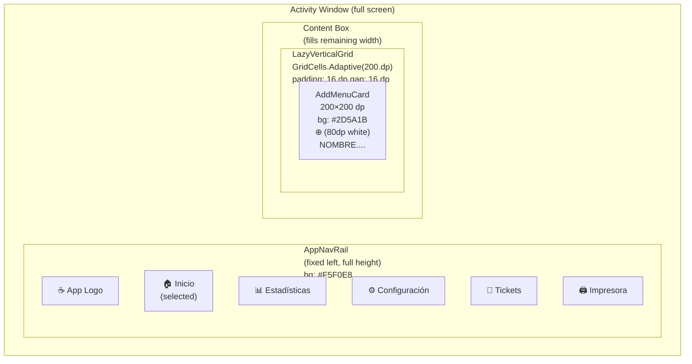
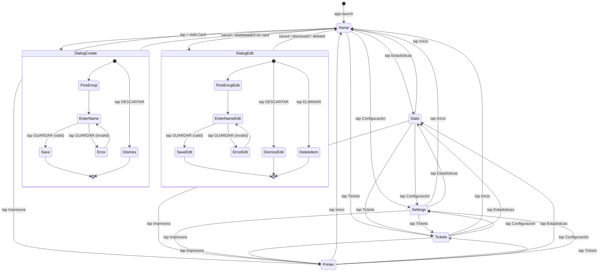

# Design — 01 Main Menu
## Feature: Base Screen Structure (Green Background · Global Palette · Nav Rail · "+" Card)

**Version:** 1.2  
**Status:** Updated  
**Last updated:** 2026-07-06  
**Changelog:** v1.1 — Added Impresora as 5th Nav Rail destination; updated all diagrams and component specs  
**Changelog:** v1.2 — Added delete button spec for edit modal; new color tokens ButtonDelete/ButtonDeleteText; updated dialog state diagram

---

## Overview

The Main Menu feature establishes the foundational screen structure for the PuntoDeVenta POS app. It defines a single-activity layout composed of a persistent `NavigationRail` on the left and a content area on the right, both sharing a global brand color palette sourced entirely from `Color.kt`. On launch the content area defaults to `HomeScreen`, which displays a `LazyVerticalGrid` of menu cards with an always-present "+" Add Card at the end. v1.2 extends the edit modal with a conditional delete button so operators can remove menu items in one tap.

---

## Architecture

### Screen Layout



### Component Hierarchy

```
MainActivity
└── PuntoDeVentaTheme
    └── Row (fillMaxSize, bg = BackgroundPrimary)
        ├── AppNavRail                          ← always rendered
        │   ├── NavigationRailItem (Inicio)     ← selected on launch
        │   ├── NavigationRailItem (Estadísticas)
        │   ├── NavigationRailItem (Configuración)
        │   ├── NavigationRailItem (Tickets)
        │   └── NavigationRailItem (Impresora)  ← new, always last
        └── when(currentDestination)
            ├── HomeScreen                      ← default
            ├── StatsScreen
            ├── SettingsScreen
            ├── TicketsScreen
            └── PrinterScreen                   ← new
```

```
HomeScreen
└── Box (fillMaxSize, bg = BackgroundPrimary)
    └── LazyVerticalGrid (GridCells.Adaptive(200.dp))
        ├── MenuItemCard × N   (when items exist)
        └── AddMenuCard        (always last)
```

### Global Color Palette Architecture

All color values live in **one file only**:

```
app/src/main/java/com/example/puntodeventa/ui/theme/Color.kt
```

No other file may contain a `Color(0x...)` literal. Every composable must reference a named token.

### State Flow



---

## Components and Interfaces

### AppNavRail

| Property | Value |
|---|---|
| File | `ui/navigation/AppNavRail.kt` |
| Composable | `AppNavRail(currentDestination, onDestinationSelected)` |
| Container color | `NavRailBackground` |
| Height | `fillMaxHeight()` |
| Width | Material3 default (~80 dp) |
| Item indicator color | `NavRailBackground` (suppressed — no pill indicator) |

**Items:**

| Order | Label | Icon (Material Icons) | Route |
|---|---|---|---|
| 1 | Inicio | `Icons.Default.Home` | `NavDestination.Home` |
| 2 | Estadísticas | `Icons.Default.ShowChart` | `NavDestination.Stats` |
| 3 | Configuración | `Icons.Default.Settings` | `NavDestination.Settings` |
| 4 | Tickets | `Icons.Default.ConfirmationNumber` | `NavDestination.Tickets` |
| 5 | Impresora | `Icons.Default.Print` | `NavDestination.Printer` |

**State:**
- Selected: icon tint = `NavRailIconSelected`, label weight = `Bold`
- Unselected: icon tint = `NavRailIconDefault`, label weight = `Normal`

---

### NavDestination

| Property | Value |
|---|---|
| File | `ui/navigation/NavDestination.kt` |
| Type | `sealed class` |
| Objects | `Home`, `Stats`, `Settings`, `Tickets`, `Printer` |
| State management | `remember { mutableStateOf(NavDestination.Home) }` in `MainActivity` |

No Jetpack Navigation component is used in this phase — screen switching is a simple `when` expression.

---

### AddMenuCard

| Property | Value |
|---|---|
| File | `ui/home/AddMenuCard.kt` |
| Size | `200.dp × 200.dp` |
| Shape | `RoundedCornerShape(12.dp)` |
| Background | `CardBackground` |
| Center icon | `Icons.Default.AddCircle`, `80.dp`, tint `CardIconTint` |
| Label | `"NOMBRE...."`, `FontWeight.Bold`, 14.sp, color `CardText` |
| Click | Invokes `onAddClick` lambda → ViewModel opens dialog |

---

### HomeScreen

| Property | Value |
|---|---|
| File | `ui/home/HomeScreen.kt` |
| Background | `BackgroundPrimary` (fills entire content area) |
| Grid | `LazyVerticalGrid(GridCells.Adaptive(200.dp))` |
| Padding | `16.dp` all sides |
| Item spacing | `16.dp` horizontal + vertical |
| Grid items | `menuItems` list + `AddMenuCard` always at end |

---

### AddMenuDialog — Delete button behavior *(new in v1.2)*

The dialog has two modes controlled by whether `editingItem` is `null`:

| Mode | Trigger | Delete button |
|---|---|---|
| Create | Tap "+" Add Card | **Hidden** — `if (editingItem != null)` guard, zero height |
| Edit | Tap pencil icon on existing card | **Visible** — full-width row above the GUARDAR/DESCARTAR row |

**Delete button spec:**

| Property | Value |
|---|---|
| Label | `"ELIMINAR"` with trash-can prefix icon |
| Icon | `Icons.Default.Delete` |
| Background | `ButtonDelete` (`#B71C1C` deep red) |
| Text color | `ButtonDeleteText` (`#FFFFFF`) |
| Font weight | `FontWeight.Bold` |
| Shape | `RoundedCornerShape(8.dp)` |
| Width | `fillMaxWidth()` — full dialog width |
| Position | Separate `Row` directly above the GUARDAR / DESCARTAR `Row` |
| Action | Calls `onDelete()` lambda → ViewModel `deleteMenu(id)` → modal closes |

**Dialog button layout in edit mode:**

```
┌──────────────────────────────────────┐
│  🗑  ELIMINAR                         │  ← ButtonDelete (full width, visible only in edit mode)
├──────────────────┬───────────────────┤
│  ✓ GUARDAR       │  DESCARTAR        │  ← always visible
└──────────────────┴───────────────────┘
```

**Dialog button layout in create mode:**

```
┌──────────────────┬───────────────────┐
│  ✓ GUARDAR       │  DESCARTAR        │  ← delete row absent
└──────────────────┴───────────────────┘
```

---

### PrinterScreen *(new in v1.1)*

| Property | Value |
|---|---|
| File | `ui/printer/PrinterScreen.kt` |
| Background | `BackgroundPrimary` (`fillMaxSize`) |
| Content | `Text("IMPRESORA")`, centered, `CardText`, `FontWeight.Bold`, 24.sp |
| Logic | None — placeholder only |

---

### MainActivity Shell

```
Row(fillMaxSize, bg = BackgroundPrimary)
├── AppNavRail(fixed left)
└── Box(fillMaxSize weight=1f)
    └── when(currentDestination) { ... }
```

`enableEdgeToEdge()` is called so the status and navigation bars are transparent, giving the green background full bleed.

---

### Dependencies Required

These entries must exist in `libs.versions.toml` and `app/build.gradle.kts`:

| Artifact | Reason |
|---|---|
| `androidx.compose.material3` | NavigationRail, MaterialTheme, Icons |
| `androidx.compose.material:material-icons-extended` | `ConfirmationNumber`, `ShowChart` icons |
| `androidx.lifecycle:lifecycle-viewmodel-compose` | `viewModel()` factory in composables |
| `androidx.lifecycle:lifecycle-runtime-compose` | `collectAsStateWithLifecycle()` |

---

## Data Models

### Color Token Definitions

```kotlin
// ── Backgrounds ───────────────────────────────────────────
val BackgroundPrimary   = Color(0xFF6BBF3E)  // Main screen green
val BackgroundSecondary = Color(0xFF5AAD30)  // Gradient variant (reserved)

// ── Navigation Rail ───────────────────────────────────────
val NavRailBackground   = Color(0xFFF5F0E8)  // Cream surface
val NavRailIconDefault  = Color(0xFF2D2D2D)  // Inactive icon/label
val NavRailIconSelected = Color(0xFF4A8C1C)  // Active icon/label (dark green)

// ── Cards ─────────────────────────────────────────────────
val CardBackground      = Color(0xFF2D5A1B)  // Dark green card surface
val CardText            = Color(0xFFFFFFFF)  // White label/placeholder
val CardIconTint        = Color(0xFFFFFFFF)  // White "+" icon

// ── Modal / Dialog ────────────────────────────────────────
val ModalSurface        = Color(0xFFFFFFFF)
val ModalTitleText      = Color(0xFF1A1A1A)
val ModalBodyText       = Color(0xFF333333)
val EmojiPickerBorder   = Color(0xFFE0E0E0)
val EmojiPickerSelected = Color(0xFF1565C0)
val SearchBarBorder     = Color(0xFF4A8C1C)

// ── Action Buttons ────────────────────────────────────────
val ButtonConfirm       = Color(0xFF4CAF50)
val ButtonConfirmText   = Color(0xFFFFFFFF)
val ButtonCancel        = Color(0xFFE53935)
val ButtonCancelText    = Color(0xFFFFFFFF)
val ButtonDelete        = Color(0xFFB71C1C)  // Deep red — edit-mode delete action  ← new in v1.2
val ButtonDeleteText    = Color(0xFFFFFFFF)

// ── Text Input ────────────────────────────────────────────
val InputBorder         = Color(0xFF4A8C1C)
val InputBackground     = Color(0xFFFFFFFF)
val InputText           = Color(0xFF1A1A1A)
val InputHint           = Color(0xFF9E9E9E)
```

### Theme Wiring (`Theme.kt`)

```kotlin
private val AppColorScheme = lightColorScheme(
    primary            = NavRailIconSelected,
    background         = BackgroundPrimary,
    surface            = ModalSurface,
    error              = ButtonCancel,
    ...
)

@Composable
fun PuntoDeVentaTheme(content: @Composable () -> Unit) {
    MaterialTheme(
        colorScheme = AppColorScheme,  // dynamicColor intentionally absent
        typography  = Typography,
        content     = content
    )
}
```

**Key rule:** `dynamicColor = false` is enforced by simply not passing it — the `AppColorScheme` constant is always applied.

### Retheme Procedure

To swap the entire color scheme (e.g., a "dark" or "blue" brand variant):

1. Open `Color.kt`
2. Update the hex values of the relevant tokens
3. Sync & build — zero other files need to change

### Navigation State Model

Current destination is held as `var currentDestination by remember { mutableStateOf(NavDestination.Home) }` in `MainActivity`. No Jetpack Navigation graph is used — switching destinations is a `when` expression that swaps composables.

---

## Correctness Properties

### Property 1: Single color source
Every color reference in the codebase resolves to a named token in `Color.kt`. No `Color(0x...)` literal exists outside that file.

**Validates: Requirements 2.1**

### Property 2: Nav Rail always visible
`AppNavRail` is always the first child of the root `Row`; no navigation action or state change hides or removes it.

**Validates: Requirements 3.1**

### Property 3: Exactly five destinations
The `NavDestination` sealed class contains exactly five objects; `AppNavRail` maps all of them in order; no destination is duplicated or omitted.

**Validates: Requirements 3.2**

### Property 4: Add Card always last
In any state where `HomeScreen` is active, the `AddMenuCard` is the final item emitted by the `LazyVerticalGrid`, regardless of how many `MenuItemCard`s precede it.

**Validates: Requirements 4.6**

### Property 5: Delete button conditionality
The delete button is rendered if and only if `editingItem != null`; in create mode it must occupy zero layout space.

**Validates: Requirements 6.1**

### Property 6: Dynamic color disabled
`PuntoDeVentaTheme` never passes a dynamic color scheme; the `AppColorScheme` constant is always used on all API levels.

**Validates: Requirements 2.3**

---

## Error Handling

- **Invalid navigation state** — If `currentDestination` somehow holds a value not matched by the `when` expression, the content area falls through to a no-op empty `Box`. No crash occurs; the Nav Rail remains functional so the user can tap any destination to recover.
- **Empty menu list** — `HomeScreen` handles an empty `uiState.menuItems` list by rendering only the `AddMenuCard`; no null-check or special empty-state composable is required beyond the standard grid logic.
- **Modal opened with null item in edit path** — The `onDelete` lambda is typed `(() -> Unit)?`; if it is `null`, the delete button is hidden. A null `onDelete` in edit mode is treated the same as create mode — no button is shown, no crash occurs.
- **Color token missing** — Kotlin's compile-time resolution means a missing token reference is a compile error, not a runtime crash. `AC-02.4` (build must compile clean) enforces this at CI time.

---

## Testing Strategy

Testing for this feature relies on the manual smoke-test checklist defined in T-10 rather than automated UI tests, given the visual and layout-focused nature of the requirements. Key verification points:

- **Color palette** — Build must pass `./gradlew compileDebugKotlin` with zero hardcoded color literals outside `Color.kt` (AC-02.4).
- **Nav Rail rendering** — Visually verify all five destinations are present, in correct order, with correct colors for selected/unselected states (AC-03.1–AC-03.12).
- **Add Card** — Confirm the card is 200×200 dp, dark green, white icon and label, and always last in the grid (AC-04.1–AC-04.7).
- **Delete flow** — Open edit modal: confirm delete button is visible with correct styling. Open create modal: confirm delete button is absent. Tap delete: confirm card is removed and modal closes (AC-06.1–AC-06.8).
- **Responsive layout** — Test on both tablet landscape and phone portrait to confirm no overlap or clipping (AC-05.1–AC-05.3).
- **Unit tests** — `./gradlew testDebugUnitTest` must pass (see T-10 checklist).

---

## Out of Scope (this design document)

- `AddMenuDialog` create flow details (→ design `02_add_menu_dialog`)
- `MenuItemCard` composable (→ design `02_add_menu_dialog`)
- `HomeViewModel` save/edit logic (→ design `02_add_menu_dialog`)
- Room / DataStore persistence
- Stats, Settings, Tickets, and Impresora screen content (all placeholders)
- Actual printer hardware integration, Bluetooth/WiFi printing (→ future feature `05_printer_integration`)
- Undo / redo for deleted items
- Confirmation dialog before deletion (single-tap immediate delete in this phase)
