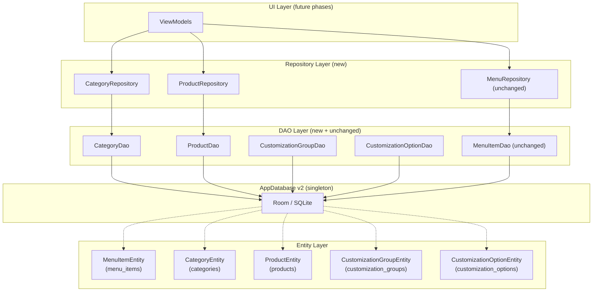

# Design — 03_products_database

## Feature: Relational Product Catalog — Data Layer (Phase 1)

**Version:** 1.0  
**Status:** Draft  
**Spec type:** Feature (Requirements-First)

---

## Overview

This phase introduces a four-table relational product catalog into the PuntoDeVenta Room
database. The scope is **data-layer only**: no UI is built. Four new entities
(`CategoryEntity`, `ProductEntity`, `CustomizationGroupEntity`,
`CustomizationOptionEntity`) extend the existing schema by hanging off `MenuItemEntity`
as the hierarchy root. `AppDatabase` is bumped to version 2.

Two new domain models (`Category`, `Product`) and two new repositories
(`CategoryRepository`, `ProductRepository`) are added, all following the same
Clean Architecture patterns already established by `MenuRepository`.

The existing `MenuItemEntity` / `MenuItemDao` / `MenuRepository` stack is **completely
unchanged**.

---

## Architecture

### Layer diagram



### Foreign key hierarchy

```
menu_items (MenuItemEntity)
  └── categories (CategoryEntity)          FK: associatedMenuId → menu_items.id  CASCADE
        └── products (ProductEntity)       FK: categoryId → categories.id        CASCADE
              └── customization_groups     FK: productId → products.id            CASCADE
                    └── customization_options  FK: groupId → customization_groups.id CASCADE
```

Deleting any ancestor automatically removes all descendants through SQLite's cascade
mechanism. Room enforces foreign keys at the SQLite level (requires
`setForeignKeyConstraintsEnabled(true)` — included in the `AppDatabase` builder).

### Data flow (read path — example for products)

```
SQLite products table
  └─► ProductDao.getProductsByCategory(id) : Flow<List<ProductEntity>>
        └─► ProductRepository.getProductsByCategory(id) : Flow<List<Product>>
              └─► ViewModel (future phase)
```

### Data flow (write path — example for products)

```
ViewModel (future phase)
  └─► ProductRepository.insert(product: Product)
        └─► ProductDao.insert(productEntity)   [suspend, Room IO dispatcher]
              └─► SQLite write → triggers Flow emission
```

---

## Components and Interfaces

### 1. `CategoryEntity` — `data/local/CategoryEntity.kt`

```kotlin
package com.example.puntodeventa.data.local

import androidx.room.Entity
import androidx.room.ForeignKey
import androidx.room.Index
import androidx.room.PrimaryKey

@Entity(
    tableName = "categories",
    foreignKeys = [
        ForeignKey(
            entity = MenuItemEntity::class,
            parentColumns = ["id"],
            childColumns = ["associatedMenuId"],
            onDelete = ForeignKey.CASCADE
        )
    ],
    indices = [Index("associatedMenuId")]
)
data class CategoryEntity(
    @PrimaryKey val id: String,
    val name: String,
    val associatedMenuId: String
)
```

**Schema:**

| Column             | Type | Constraints                            |
|--------------------|------|----------------------------------------|
| `id`               | TEXT | PRIMARY KEY                            |
| `name`             | TEXT | NOT NULL                               |
| `associatedMenuId` | TEXT | NOT NULL, FK → `menu_items.id` CASCADE |

The `@Index` on `associatedMenuId` is required by Room when a foreign key column is not
the primary key — it avoids a full table scan on the parent during cascade operations.

---

### 2. `ProductEntity` — `data/local/ProductEntity.kt`

```kotlin
package com.example.puntodeventa.data.local

import androidx.room.Entity
import androidx.room.ForeignKey
import androidx.room.Index
import androidx.room.PrimaryKey

@Entity(
    tableName = "products",
    foreignKeys = [
        ForeignKey(
            entity = CategoryEntity::class,
            parentColumns = ["id"],
            childColumns = ["categoryId"],
            onDelete = ForeignKey.CASCADE
        )
    ],
    indices = [Index("categoryId")]
)
data class ProductEntity(
    @PrimaryKey val id: String,           // UUID, max 36 chars
    val emoji: String,                    // max 8 chars
    val name: String,                     // max 120 chars
    val description: String,              // max 500 chars
    val basePrice: Double,                // ≥ 0.0
    val isActive: Boolean,
    val categoryId: String               // FK → categories.id
)
```

**Schema:**

| Column        | Type    | Constraints                          |
|---------------|---------|--------------------------------------|
| `id`          | TEXT    | PRIMARY KEY                          |
| `emoji`       | TEXT    | NOT NULL                             |
| `name`        | TEXT    | NOT NULL                             |
| `description` | TEXT    | NOT NULL                             |
| `basePrice`   | REAL    | NOT NULL, ≥ 0.0                      |
| `isActive`    | INTEGER | NOT NULL (Room maps Boolean → 0/1)   |
| `categoryId`  | TEXT    | NOT NULL, FK → `categories.id` CASCADE |

---

### 3. `SelectionType` — `data/local/SelectionType.kt`

```kotlin
package com.example.puntodeventa.data.local

/**
 * Enumeration of the allowed selection modes for a customization group.
 * Stored as its [value] string in the customization_groups table.
 */
enum class SelectionType(val value: String) {
    MULTIPLE_CHECKBOXES("multiple_checkboxes"),
    SINGLE_OPTION("single_option");

    companion object {
        private val byValue = entries.associateBy { it.value }

        /** Returns null if [raw] is not a recognized value. */
        fun fromValue(raw: String): SelectionType? = byValue[raw]
    }
}
```

The `selectionType` column in `CustomizationGroupEntity` stores the `value` string
directly. Validation in `CustomizationGroupDao.insert` uses `SelectionType.fromValue()`
to reject unknown strings before they reach Room.

---

### 4. `CustomizationGroupEntity` — `data/local/CustomizationGroupEntity.kt`

```kotlin
package com.example.puntodeventa.data.local

import androidx.room.Entity
import androidx.room.ForeignKey
import androidx.room.Index
import androidx.room.PrimaryKey

@Entity(
    tableName = "customization_groups",
    foreignKeys = [
        ForeignKey(
            entity = ProductEntity::class,
            parentColumns = ["id"],
            childColumns = ["productId"],
            onDelete = ForeignKey.CASCADE
        )
    ],
    indices = [Index("productId")]
)
data class CustomizationGroupEntity(
    @PrimaryKey val id: String,
    val productId: String,      // FK → products.id
    val groupName: String,
    val selectionType: String   // "multiple_checkboxes" | "single_option"
)
```

**Schema:**

| Column          | Type | Constraints                        |
|-----------------|------|------------------------------------|
| `id`            | TEXT | PRIMARY KEY                        |
| `productId`     | TEXT | NOT NULL, FK → `products.id` CASCADE |
| `groupName`     | TEXT | NOT NULL                           |
| `selectionType` | TEXT | NOT NULL, validated before insert  |

---

### 5. `CustomizationOptionEntity` — `data/local/CustomizationOptionEntity.kt`

```kotlin
package com.example.puntodeventa.data.local

import androidx.room.Entity
import androidx.room.ForeignKey
import androidx.room.Index
import androidx.room.PrimaryKey

@Entity(
    tableName = "customization_options",
    foreignKeys = [
        ForeignKey(
            entity = CustomizationGroupEntity::class,
            parentColumns = ["id"],
            childColumns = ["groupId"],
            onDelete = ForeignKey.CASCADE
        )
    ],
    indices = [Index("groupId")]
)
data class CustomizationOptionEntity(
    @PrimaryKey val id: String,
    val groupId: String,        // FK → customization_groups.id
    val optionName: String,     // max 120 chars
    val extraPrice: Double      // ≥ 0.0; 0.0 = no surcharge
)
```

**Schema:**

| Column       | Type | Constraints                                    |
|--------------|------|------------------------------------------------|
| `id`         | TEXT | PRIMARY KEY                                    |
| `groupId`    | TEXT | NOT NULL, FK → `customization_groups.id` CASCADE |
| `optionName` | TEXT | NOT NULL                                       |
| `extraPrice` | REAL | NOT NULL, ≥ 0.0; validated before insert       |

---

### 6. `CategoryDao` — `data/local/CategoryDao.kt`

```kotlin
package com.example.puntodeventa.data.local

import androidx.room.*
import kotlinx.coroutines.flow.Flow

@Dao
interface CategoryDao {

    @Insert(onConflict = OnConflictStrategy.REPLACE)
    suspend fun insert(category: CategoryEntity)

    @Query("SELECT * FROM categories WHERE associatedMenuId = :menuId")
    fun getCategoriesByMenu(menuId: String): Flow<List<CategoryEntity>>

    @Query("DELETE FROM categories WHERE id = :id")
    suspend fun deleteById(id: String)
}
```

- `getCategoriesByMenu` emits an empty list when no rows match — Room's default behaviour.
- `deleteById` with a non-existent `id` is a no-op; Room/SQLite performs 0 deletions without throwing.
- `insert` with `REPLACE` provides upsert semantics: same `id` replaces the existing row.

---

### 7. `ProductDao` — `data/local/ProductDao.kt`

```kotlin
package com.example.puntodeventa.data.local

import androidx.room.*
import kotlinx.coroutines.flow.Flow

@Dao
interface ProductDao {

    @Insert(onConflict = OnConflictStrategy.REPLACE)
    suspend fun insert(product: ProductEntity)

    @Query("SELECT * FROM products WHERE categoryId = :categoryId")
    fun getProductsByCategory(categoryId: String): Flow<List<ProductEntity>>

    @Query("SELECT * FROM products WHERE categoryId = :categoryId AND isActive = 1")
    fun getActiveProductsByCategory(categoryId: String): Flow<List<ProductEntity>>

    @Query("DELETE FROM products WHERE id = :id")
    suspend fun deleteById(id: String)
}
```

- `getProductsByCategory` and `getActiveProductsByCategory` emit empty lists when no rows match.
- `isActive` is stored as `INTEGER` (Room's Boolean mapping); `= 1` filters `true`.

---

### 8. `CustomizationGroupDao` — `data/local/CustomizationGroupDao.kt`

```kotlin
package com.example.puntodeventa.data.local

import androidx.room.*
import kotlinx.coroutines.flow.Flow

@Dao
interface CustomizationGroupDao {

    @Insert(onConflict = OnConflictStrategy.REPLACE)
    suspend fun insertInternal(group: CustomizationGroupEntity)

    @Query("SELECT * FROM customization_groups WHERE productId = :productId")
    fun getGroupsByProduct(productId: String): Flow<List<CustomizationGroupEntity>>

    @Query("DELETE FROM customization_groups WHERE id = :id")
    suspend fun deleteById(id: String)
}
```

The public `insert` function lives in the **concrete class** `CustomizationGroupDaoImpl`
(or as an extension on the `@Dao` interface using a default method) and performs
validation before delegating to `insertInternal`. Since Room does not support default
interface method injection, the validation wrapper is placed in the repository layer
(see §11 — Validation Logic).

**Design decision:** Keeping the validation in the repository (rather than a wrapper
class) follows the same layering used by `MenuRepository` and avoids creating an extra
abstraction class just for one guard.

---

### 9. `CustomizationOptionDao` — `data/local/CustomizationOptionDao.kt`

```kotlin
package com.example.puntodeventa.data.local

import androidx.room.*
import kotlinx.coroutines.flow.Flow

@Dao
interface CustomizationOptionDao {

    @Insert(onConflict = OnConflictStrategy.REPLACE)
    suspend fun insert(option: CustomizationOptionEntity)

    @Query("SELECT * FROM customization_options WHERE groupId = :groupId")
    fun getOptionsByGroup(groupId: String): Flow<List<CustomizationOptionEntity>>

    @Query("DELETE FROM customization_options WHERE id = :id")
    suspend fun deleteById(id: String)
}
```

Validation of `extraPrice ≥ 0.0` is performed in `ProductRepository` / a dedicated
service layer before calling `dao.insert` (see §11).

---

## Data Models

### Domain models

#### `Category` — `data/model/Category.kt`

```kotlin
package com.example.puntodeventa.data.model

data class Category(
    val id: String,
    val name: String,
    val associatedMenuId: String
)
```

#### `Product` — `data/model/Product.kt`

```kotlin
package com.example.puntodeventa.data.model

data class Product(
    val id: String,
    val emoji: String,
    val name: String,
    val description: String,
    val basePrice: Double,
    val isActive: Boolean,
    val categoryId: String
)
```

Domain models are simple data classes with no Room or Android imports — they are
usable in pure JVM unit tests without the Android instrumented runner.

**Note:** `CustomizationGroup` and `CustomizationOption` are intentionally **not**
introduced as domain models in this phase. They are accessed through their entities
directly by the DAOs. Domain-model wrappers for customizations will be added in a
future phase when UI consumption requires them.

### Mapping invariants

For any `Product p` with valid field values:
```
ProductEntity(p.id, p.emoji, p.name, p.description, p.basePrice, p.isActive, p.categoryId)
    .toDomain() == p
```

For any `Category c`:
```
CategoryEntity(c.id, c.name, c.associatedMenuId).toDomain() == c
```

Both mappings are lossless bijections — no fields are added, removed, or transformed.

---

## AppDatabase v2

### `AppDatabase` — `data/local/AppDatabase.kt` (updated)

```kotlin
package com.example.puntodeventa.data.local

import android.content.Context
import androidx.room.Database
import androidx.room.Room
import androidx.room.RoomDatabase

@Database(
    entities = [
        MenuItemEntity::class,              // version 1 — unchanged
        CategoryEntity::class,              // version 2 — new
        ProductEntity::class,               // version 2 — new
        CustomizationGroupEntity::class,    // version 2 — new
        CustomizationOptionEntity::class    // version 2 — new
    ],
    version = 2,
    exportSchema = false
)
abstract class AppDatabase : RoomDatabase() {

    // ── Version 1 accessors (unchanged) ──────────────────────────────────────
    abstract fun menuItemDao(): MenuItemDao

    // ── Version 2 accessors (new) ─────────────────────────────────────────────
    abstract fun categoryDao(): CategoryDao
    abstract fun productDao(): ProductDao
    abstract fun customizationGroupDao(): CustomizationGroupDao
    abstract fun customizationOptionDao(): CustomizationOptionDao

    companion object {
        @Volatile
        private var INSTANCE: AppDatabase? = null

        fun getInstance(context: Context): AppDatabase =
            INSTANCE ?: synchronized(this) {
                INSTANCE ?: Room.databaseBuilder(
                    context.applicationContext,
                    AppDatabase::class.java,
                    "punto_de_venta_db"
                )
                    .fallbackToDestructiveMigration()
                    .setForeignKeyConstraintsEnabled(true)   // ← required for CASCADE
                    .build()
                    .also { INSTANCE = it }
            }
    }
}
```

**Key change:** `setForeignKeyConstraintsEnabled(true)` is added to the builder chain.
SQLite does not enforce foreign keys by default; Room's helper must opt in explicitly.
Without this call, `onDelete = CASCADE` declarations in `@ForeignKey` annotations are
silently ignored at runtime.

**Version bump rationale:** The schema changes are not backwards-compatible (four new
tables, new FK relationships). `fallbackToDestructiveMigration()` is appropriate for
development — data loss is acceptable while the app is not yet in production. A proper
`addMigrations(MIGRATION_1_2)` strategy should replace this before any user-facing
release.

---

## Repository Layer

### 10. `CategoryRepository` — `data/repository/CategoryRepository.kt`

```kotlin
package com.example.puntodeventa.data.repository

import com.example.puntodeventa.data.local.CategoryDao
import com.example.puntodeventa.data.local.CategoryEntity
import com.example.puntodeventa.data.model.Category
import kotlinx.coroutines.flow.Flow
import kotlinx.coroutines.flow.map

class CategoryRepository(private val dao: CategoryDao) {

    fun getCategoriesByMenu(menuId: String): Flow<List<Category>> =
        dao.getCategoriesByMenu(menuId).map { entities ->
            entities.map { it.toDomain() }
        }

    suspend fun insert(category: Category) {
        dao.insert(category.toEntity())
    }

    suspend fun deleteById(id: String) {
        dao.deleteById(id)
    }

    // ── Mapping helpers ───────────────────────────────────────────────────────

    private fun CategoryEntity.toDomain(): Category =
        Category(id = id, name = name, associatedMenuId = associatedMenuId)

    private fun Category.toEntity(): CategoryEntity =
        CategoryEntity(id = id, name = name, associatedMenuId = associatedMenuId)
}
```

---

### 11. `ProductRepository` — `data/repository/ProductRepository.kt`

```kotlin
package com.example.puntodeventa.data.repository

import com.example.puntodeventa.data.local.CustomizationGroupDao
import com.example.puntodeventa.data.local.CustomizationGroupEntity
import com.example.puntodeventa.data.local.CustomizationOptionDao
import com.example.puntodeventa.data.local.CustomizationOptionEntity
import com.example.puntodeventa.data.local.ProductDao
import com.example.puntodeventa.data.local.ProductEntity
import com.example.puntodeventa.data.local.SelectionType
import com.example.puntodeventa.data.model.Product
import kotlinx.coroutines.flow.Flow
import kotlinx.coroutines.flow.map

class ProductRepository(
    private val productDao: ProductDao,
    private val groupDao: CustomizationGroupDao,
    private val optionDao: CustomizationOptionDao
) {

    fun getProductsByCategory(categoryId: String): Flow<List<Product>> =
        productDao.getProductsByCategory(categoryId).map { entities ->
            entities.map { it.toDomain() }
        }

    fun getActiveProductsByCategory(categoryId: String): Flow<List<Product>> =
        productDao.getActiveProductsByCategory(categoryId).map { entities ->
            entities.map { it.toDomain() }
        }

    suspend fun insert(product: Product) {
        productDao.insert(product.toEntity())
    }

    suspend fun deleteById(id: String) {
        productDao.deleteById(id)
    }

    // ── Validation-guarded group insert ──────────────────────────────────────

    suspend fun insertGroup(group: CustomizationGroupEntity) {
        val type = SelectionType.fromValue(group.selectionType)
            ?: throw IllegalArgumentException(
                "Invalid selectionType '${group.selectionType}'. " +
                "Must be one of: ${SelectionType.entries.map { it.value }}"
            )
        groupDao.insertInternal(group)
    }

    // ── Validation-guarded option insert ─────────────────────────────────────

    suspend fun insertOption(option: CustomizationOptionEntity) {
        require(option.extraPrice >= 0.0) {
            "extraPrice must be ≥ 0.0, but was ${option.extraPrice}"
        }
        optionDao.insert(option)
    }

    // ── Mapping helpers ───────────────────────────────────────────────────────

    private fun ProductEntity.toDomain(): Product =
        Product(
            id          = id,
            emoji       = emoji,
            name        = name,
            description = description,
            basePrice   = basePrice,
            isActive    = isActive,
            categoryId  = categoryId
        )

    private fun Product.toEntity(): ProductEntity =
        ProductEntity(
            id          = id,
            emoji       = emoji,
            name        = name,
            description = description,
            basePrice   = basePrice,
            isActive    = isActive,
            categoryId  = categoryId
        )
}
```

**Design decisions:**

- `ProductRepository` owns validation for `CustomizationGroupDao` and
  `CustomizationOptionDao` because Room does not allow non-`@Query`/`@Insert` logic
  inside `@Dao` interfaces. Placing guards here avoids extra wrapper classes while
  keeping the DAO interface clean and code-generated.
- `insertGroup` and `insertOption` are on `ProductRepository` since customization
  groups and options are always associated with a product. This keeps the repository
  cohesive with the product domain.
- FK constraint exceptions from `productDao.insert` (when `categoryId` is invalid) are
  **not caught** — they propagate to the caller as documented in Requirement 6.5.

---

## Validation Logic

### `CustomizationGroupDao.insert` — `selectionType` guard

```
insertGroup(group):
  1. Call SelectionType.fromValue(group.selectionType)
  2. IF result is null → throw IllegalArgumentException("Invalid selectionType …")
  3. ELSE → call groupDao.insertInternal(group)
```

Valid values: `"multiple_checkboxes"`, `"single_option"`.

Any other string — including empty string, `null` coerced to `"null"`, or typos — is
rejected **before** Room is invoked. The entity is never written to the database.

### `CustomizationOptionDao.insert` — `extraPrice` guard

```
insertOption(option):
  1. IF option.extraPrice < 0.0 → throw IllegalArgumentException("extraPrice must be ≥ 0.0 …")
  2. ELSE → call optionDao.insert(option)
```

A value of `0.0` is explicitly valid and encodes "no price surcharge". The check is
`< 0.0` (strictly negative), so `0.0`, `0.01`, and any positive double are accepted.

Both validations are pure precondition checks on the input data — they do not query the
database and run synchronously before any suspension point.

---

## Cascade Deletion Chain

```mermaid
sequenceDiagram
    participant C as Caller
    participant DB as SQLite / Room
    participant mi as menu_items
    participant cat as categories
    participant prod as products
    participant grp as customization_groups
    participant opt as customization_options

    C->>DB: DELETE FROM menu_items WHERE id = X
    DB->>mi: remove row X
    mi-->>cat: CASCADE DELETE WHERE associatedMenuId = X
    cat-->>prod: CASCADE DELETE WHERE categoryId IN (deleted cats)
    prod-->>grp: CASCADE DELETE WHERE productId IN (deleted prods)
    grp-->>opt: CASCADE DELETE WHERE groupId IN (deleted groups)
    DB-->>C: success (or rolled-back exception)
```

All five cascade steps execute inside a single SQLite transaction. If any step fails
(e.g., an unexpected constraint), the entire transaction is rolled back and the
exception propagates to the caller — no partial deletions occur.

The same chain applies when deletion starts at an intermediate level:

| Delete target       | Cascades through                                    |
|---------------------|-----------------------------------------------------|
| `MenuItemEntity`    | categories → products → groups → options            |
| `CategoryEntity`    | products → groups → options                         |
| `ProductEntity`     | groups → options                                    |
| `CustomizationGroupEntity` | options                                    |
| `CustomizationOptionEntity` | (leaf — no children)                      |

**Prerequisite:** `setForeignKeyConstraintsEnabled(true)` must be set on the
`RoomDatabase` builder (included in the `AppDatabase` design above). Without this,
SQLite's pragma `foreign_keys = ON` is never issued and cascades are silently skipped.

---

## Correctness Properties

*A property is a characteristic or behavior that should hold true across all valid
executions of a system — essentially, a formal statement about what the system should
do. Properties serve as the bridge between human-readable specifications and
machine-verifiable correctness guarantees.*

---

### Property 1: Product mapping round-trip

*For any* `Product` domain object `p` where all string fields are non-null and
non-empty, `basePrice ≥ 0.0`, and `id` is a non-empty string, mapping `p` to
`ProductEntity` via `toEntity()` and back to `Product` via `toDomain()` SHALL yield an
object whose `id`, `emoji`, `name`, `description`, `basePrice`, `isActive`, and
`categoryId` are all structurally equal to those of `p`.

**Validates: Requirements 6.6, 9.1**

---

### Property 2: Category mapping round-trip

*For any* `Category` domain object `c` where `id`, `name`, and `associatedMenuId` are
all non-null and non-empty strings, mapping `c` to `CategoryEntity` via `toEntity()`
and back to `Category` via `toDomain()` SHALL yield an object whose `id`, `name`, and
`associatedMenuId` are all structurally equal to those of `c`.

**Validates: Requirements 7.4, 9.2**

---

### Property 3: Count invariant — `getProductsByCategory`

*For any* N ≥ 0 distinct `ProductEntity` rows inserted into the `products` table under
the same `categoryId`, `ProductDao.getProductsByCategory(categoryId)` SHALL emit a list
of exactly N items. When N = 0, the emitted list SHALL be empty.

**Validates: Requirements 2.5, 2.6, 9.3**

---

### Property 4: Count invariant — `getCategoriesByMenu`

*For any* N ≥ 0 distinct `CategoryEntity` rows inserted into the `categories` table
under the same `associatedMenuId`, `CategoryDao.getCategoriesByMenu(menuId)` SHALL emit
a list of exactly N items. When N = 0, the emitted list SHALL be empty.

**Validates: Requirements 1.5, 1.6, 9.4**

---

### Property 5: Count invariant — `getOptionsByGroup`

*For any* N ≥ 0 distinct `CustomizationOptionEntity` rows inserted into the
`customization_options` table under the same `groupId`,
`CustomizationOptionDao.getOptionsByGroup(groupId)` SHALL emit a list of exactly N
items. When N = 0, the emitted list SHALL be empty.

**Validates: Requirements 4.6, 9.5**

---

### Property 6: DAO insert/retrieve field preservation — `ProductDao`

*For any* `ProductEntity` inserted via `ProductDao.insert`, querying
`getProductsByCategory` with the matching `categoryId` SHALL return a list containing
exactly one entry whose `id`, `emoji`, `name`, `description`, `basePrice`, `isActive`,
and `categoryId` are all structurally equal to those of the inserted entity.

**Validates: Requirements 2.1, 9.6**

---

### Property 7: Idempotent upsert via `REPLACE` strategy

*For any* entity (CategoryEntity, ProductEntity, CustomizationGroupEntity, or
CustomizationOptionEntity with valid field values) inserted twice via its respective
DAO with the same `id` but different field values, querying that entity's table after
the second insert SHALL return exactly one row for that `id`, and all non-`id` fields
SHALL match those of the second insert.

**Validates: Requirements 1.3, 2.3, 3.4, 4.4, 9.7**

---

### Property 8: Invalid `selectionType` is rejected

*For any* string `s` that is not `"multiple_checkboxes"` and not `"single_option"`,
calling `ProductRepository.insertGroup` with a `CustomizationGroupEntity` whose
`selectionType` equals `s` SHALL throw an `IllegalArgumentException` and SHALL NOT
persist any row to the `customization_groups` table.

**Validates: Requirements 3.3, 9.8**

---

### Property 9: Negative `extraPrice` is rejected

*For any* negative `Double` value `e` (where `e < 0.0`), calling
`ProductRepository.insertOption` with a `CustomizationOptionEntity` whose `extraPrice`
equals `e` SHALL throw an `IllegalArgumentException` and SHALL NOT persist any row to
the `customization_options` table.

**Validates: Requirements 4.3**

---

### Property 10: Query filter isolation

*For any* set of rows inserted under two or more distinct parent IDs (e.g., two
different `categoryId` values in `products`), querying by one specific parent ID SHALL
return only rows belonging to that parent — no rows from other parent IDs SHALL appear
in the result. This property applies to:
- `CategoryDao.getCategoriesByMenu` (isolated by `associatedMenuId`)
- `ProductDao.getProductsByCategory` (isolated by `categoryId`)
- `CustomizationGroupDao.getGroupsByProduct` (isolated by `productId`)
- `CustomizationOptionDao.getOptionsByGroup` (isolated by `groupId`)

**Validates: Requirements 1.6, 2.6, 3.6, 4.6**

---

### Property 11: Active product filter excludes inactive rows

*For any* set of `ProductEntity` rows inserted under the same `categoryId` with
randomly assigned `isActive` values, `ProductDao.getActiveProductsByCategory(categoryId)`
SHALL return only rows where `isActive = true`. No row with `isActive = false` SHALL
appear in the result, regardless of how many inactive rows exist in the table.

**Validates: Requirements 2.7, 6.2**

---

## Error Handling

| Scenario | Handling |
|----------|----------|
| `insert` with duplicate `id` (any DAO) | `OnConflictStrategy.REPLACE` — silent upsert, existing row is overwritten, no exception |
| `deleteById` with non-existent `id` (any DAO) | Room/SQLite no-op — 0 rows affected, no exception |
| `insertGroup` with invalid `selectionType` | `ProductRepository.insertGroup` throws `IllegalArgumentException` before Room is called; row is never written |
| `insertOption` with `extraPrice < 0.0` | `ProductRepository.insertOption` throws `IllegalArgumentException` before Room is called; row is never written |
| `insert` with FK referencing non-existent parent | SQLite throws `SQLiteConstraintException` (FK violation); Room propagates it to the caller; row is not written |
| Cascade failure mid-chain | SQLite rolls back the entire transaction; all rows remain in their original state; exception propagates to caller |
| `AppDatabase` schema version mismatch (v1→v2) | `fallbackToDestructiveMigration()` drops and recreates all tables; data loss is accepted during development |
| `AppDatabase.getInstance()` concurrent calls | `@Volatile` + `synchronized` double-checked locking guarantees one instance; no race condition |
| Room operations on main thread | Room enforces off-thread execution; all DAO calls are `suspend` functions dispatched to Room's IO executor via coroutine |
| `setForeignKeyConstraintsEnabled` missing | Without this call, `CASCADE` annotations are silently ignored; must be present in the builder chain |

---

## Testing Strategy

### Approach

This feature uses a **three-tier testing approach**:

1. **Unit tests** (pure JVM, `src/test`) — test repository mapping helpers and
   validation logic in isolation using fake/mock DAOs. No Android framework needed.
2. **Property-based tests** (pure JVM, `src/test`) — use
   [Kotest Property Testing](https://kotest.io/docs/proptest/property-based-testing.html)
   (`io.kotest:kotest-property`) with **minimum 100 iterations** per property to verify
   universally quantified correctness properties. PBT is appropriate here because the
   core logic is pure functions (entity↔domain mapping, validation guards) with large
   input spaces.
3. **Instrumented tests** (`src/androidTest`) — use Room's in-memory builder
   (`Room.inMemoryDatabaseBuilder`) to test DAO queries, cascade deletions, and
   FK constraint enforcement against a real (in-process) SQLite instance.

### Test structure

```
app/src/test/java/com/example/puntodeventa/
├── data/
│   ├── local/
│   │   └── SelectionTypeTest.kt          ← fromValue() round-trip, null for unknown
│   └── repository/
│       ├── CategoryRepositoryTest.kt     ← Properties 2, 10 (mapping + filter)
│       └── ProductRepositoryTest.kt      ← Properties 1, 8, 9, 11 (mapping + validation)

app/src/androidTest/java/com/example/puntodeventa/
└── data/local/
    ├── CategoryDaoTest.kt                ← Properties 3⁻¹, 4, 7 (counts, upsert, filter)
    ├── ProductDaoTest.kt                 ← Properties 3, 6, 7, 11 (counts, field preservation, active filter)
    ├── CustomizationGroupDaoTest.kt      ← Properties 7, 10 (upsert, filter)
    ├── CustomizationOptionDaoTest.kt     ← Properties 5, 10 (counts, filter)
    └── CascadeDeletionTest.kt            ← Full hierarchy cascade (Req 8)
```

### Property-based test configuration

Tag format for traceability:
```kotlin
// Feature: 03_products_database, Property N: <property text>
```

Each property test runs a minimum of **100 iterations** (`checkAll(100, ...)`).

#### Example — Property 1 (Product round-trip)

```kotlin
// Feature: 03_products_database, Property 1: Product mapping round-trip
@Test
fun `product entity to domain round-trip preserves all fields`() = runTest {
    checkAll(
        100,
        Arb.string(1..36), Arb.string(1..8), Arb.string(1..120),
        Arb.string(1..500), Arb.double(0.0..9999.99), Arb.boolean(), Arb.string(1..36)
    ) { id, emoji, name, description, basePrice, isActive, categoryId ->
        val product = Product(id, emoji, name, description, basePrice, isActive, categoryId)
        val entity  = product.toEntity()
        val result  = entity.toDomain()
        result shouldBe product
    }
}
```

#### Example — Property 8 (invalid selectionType)

```kotlin
// Feature: 03_products_database, Property 8: Invalid selectionType is rejected
@Test
fun `insertGroup rejects any selectionType outside the two valid values`() = runTest {
    val validValues = setOf("multiple_checkboxes", "single_option")
    checkAll(100, Arb.string()) { raw ->
        assume(raw !in validValues)
        val group = CustomizationGroupEntity(
            id = "g1", productId = "p1", groupName = "Test", selectionType = raw
        )
        shouldThrow<IllegalArgumentException> {
            productRepository.insertGroup(group)
        }
    }
}
```

#### Example — Property 9 (negative extraPrice)

```kotlin
// Feature: 03_products_database, Property 9: Negative extraPrice is rejected
@Test
fun `insertOption rejects negative extraPrice`() = runTest {
    checkAll(100, Arb.double(Double.MIN_VALUE..-0.001)) { negPrice ->
        val option = CustomizationOptionEntity(
            id = "o1", groupId = "g1", optionName = "Test", extraPrice = negPrice
        )
        shouldThrow<IllegalArgumentException> {
            productRepository.insertOption(option)
        }
    }
}
```

### Instrumented test — cascade deletion

```kotlin
@Test
fun `deleting MenuItemEntity cascades through full hierarchy`() = runTest {
    // Arrange — build full hierarchy
    menuItemDao.insert(MenuItemEntity("m1", "🍔", "Burgers"))
    categoryDao.insert(CategoryEntity("c1", "Clásicas", "m1"))
    productDao.insert(ProductEntity("p1", "🍔", "Burger", "", 50.0, true, "c1"))
    groupDao.insertInternal(CustomizationGroupEntity("g1", "p1", "Extras", "single_option"))
    optionDao.insert(CustomizationOptionEntity("o1", "g1", "Sin cebolla", 0.0))

    // Act
    menuItemDao.deleteById("m1")

    // Assert — all descendants removed
    categoryDao.getCategoriesByMenu("m1").first() shouldBe emptyList()
    productDao.getProductsByCategory("c1").first() shouldBe emptyList()
    groupDao.getGroupsByProduct("p1").first() shouldBe emptyList()
    optionDao.getOptionsByGroup("g1").first() shouldBe emptyList()
}
```

### What is NOT property-tested

| Scenario | Reason | Alternative |
|----------|--------|-------------|
| `AppDatabase` version = 2 / entity array | Compile-time / Room KSP correctness | Successful build + `exportSchema = true` diff |
| `fallbackToDestructiveMigration` config | One-time builder call; binary present/absent | Manual verification on version bump |
| FK cascade behavior (Req 8) | Infrastructure — SQLite either cascades or not; 100 runs add no value | Instrumented integration tests (1 example per cascade level) |
| `setForeignKeyConstraintsEnabled` presence | Configuration, not logic | Single smoke test / code review |
| `@Index` on FK columns | Room compile-time annotation | Build succeeds without warning |

---

## File Structure Overview

Files that are **new** in this phase are marked `[NEW]`. Files that are **modified** are
marked `[MOD]`. Everything else is unchanged.

```
app/src/main/java/com/example/puntodeventa/
├── data/
│   ├── local/
│   │   ├── AppDatabase.kt                     [MOD] version 1→2, +4 entities, +4 DAO accessors,
│   │   │                                            +setForeignKeyConstraintsEnabled(true)
│   │   ├── MenuItemEntity.kt                  (unchanged)
│   │   ├── MenuItemDao.kt                     (unchanged)
│   │   ├── SelectionType.kt                   [NEW] enum with MULTIPLE_CHECKBOXES / SINGLE_OPTION
│   │   ├── CategoryEntity.kt                  [NEW] @Entity(categories), FK → menu_items
│   │   ├── CategoryDao.kt                     [NEW] insert / getCategoriesByMenu / deleteById
│   │   ├── ProductEntity.kt                   [NEW] @Entity(products), FK → categories
│   │   ├── ProductDao.kt                      [NEW] insert / getProductsByCategory /
│   │   │                                            getActiveProductsByCategory / deleteById
│   │   ├── CustomizationGroupEntity.kt        [NEW] @Entity(customization_groups), FK → products
│   │   ├── CustomizationGroupDao.kt           [NEW] insertInternal / getGroupsByProduct / deleteById
│   │   ├── CustomizationOptionEntity.kt       [NEW] @Entity(customization_options), FK → groups
│   │   └── CustomizationOptionDao.kt          [NEW] insert / getOptionsByGroup / deleteById
│   ├── model/
│   │   ├── MenuItem.kt                        (unchanged)
│   │   ├── Category.kt                        [NEW] data class Category(id, name, associatedMenuId)
│   │   └── Product.kt                         [NEW] data class Product(id, emoji, name, description,
│   │                                                                   basePrice, isActive, categoryId)
│   └── repository/
│       ├── MenuRepository.kt                  (unchanged)
│       ├── CategoryRepository.kt              [NEW] wraps CategoryDao, owns mapping helpers
│       └── ProductRepository.kt              [NEW] wraps ProductDao + GroupDao + OptionDao,
│                                                    owns mapping + validation guards

app/src/test/java/com/example/puntodeventa/
└── data/
    ├── local/
    │   └── SelectionTypeTest.kt               [NEW] unit + property tests for fromValue()
    └── repository/
        ├── CategoryRepositoryTest.kt           [NEW] Properties 2, 10
        └── ProductRepositoryTest.kt            [NEW] Properties 1, 8, 9, 11

app/src/androidTest/java/com/example/puntodeventa/
└── data/local/
    ├── CategoryDaoTest.kt                     [NEW] Properties 4, 7, filter isolation
    ├── ProductDaoTest.kt                      [NEW] Properties 3, 6, 7, 11
    ├── CustomizationGroupDaoTest.kt           [NEW] Properties 7, 10
    ├── CustomizationOptionDaoTest.kt          [NEW] Properties 5, 10
    └── CascadeDeletionTest.kt                 [NEW] Requirement 8 cascade chain tests
```

### Gradle additions (for Kotest property testing)

In `gradle/libs.versions.toml`:
```toml
[versions]
kotest = "5.9.1"

[libraries]
kotest-property    = { group = "io.kotest", name = "kotest-property",    version.ref = "kotest" }
kotest-runner-junit5 = { group = "io.kotest", name = "kotest-runner-junit5", version.ref = "kotest" }
```

In `app/build.gradle.kts`:
```kotlin
dependencies {
    // Kotest property-based testing (JVM unit tests only)
    testImplementation(libs.kotest.property)
    testImplementation(libs.kotest.runner.junit5)
}

tasks.withType<Test> {
    useJUnitPlatform()  // required for Kotest JUnit5 runner
}
```

