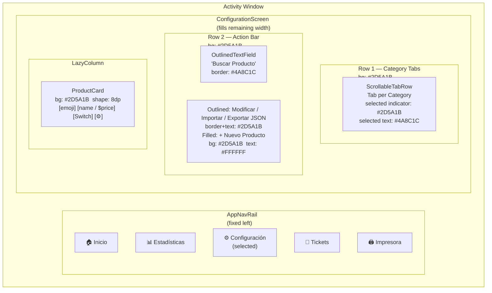
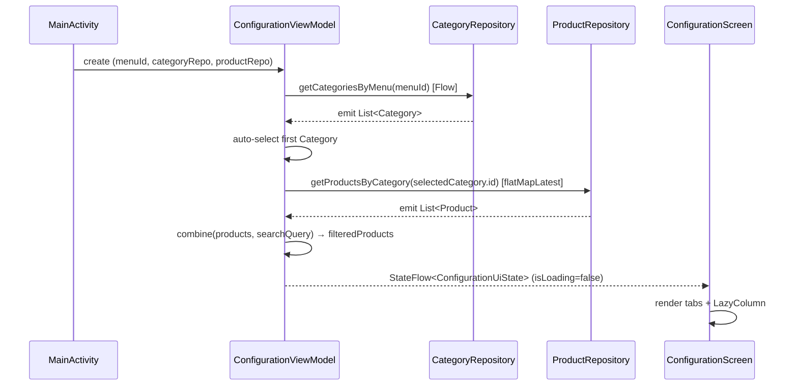
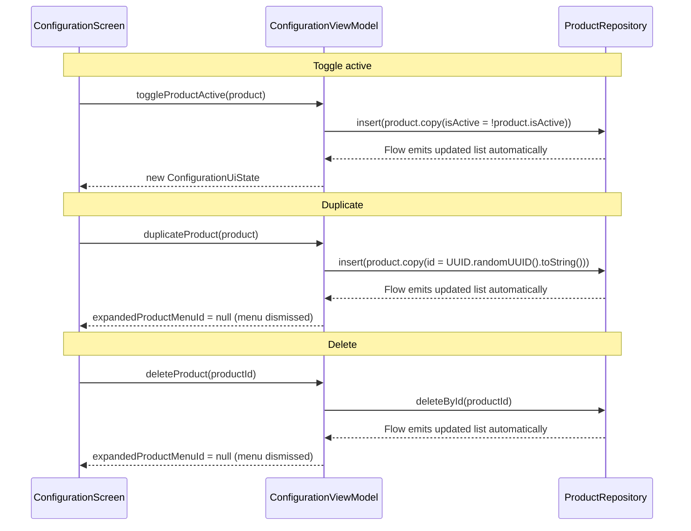

# Design — 04 Configuration Screen UI
## Feature: Product Catalogue Configuration (Category Tabs · Product List · Toggle · Actions)

**Version:** 1.0
**Status:** Draft
**Phase:** Phase 2 — UI Layer (Phase 1 data layer is the foundation)

---

## Overview

The Configuration Screen UI (Phase 2) builds the `ConfigurationScreen` composable that replaces
the `SettingsScreen` placeholder when the user taps **Configuración** in the existing
`AppNavRail`. It sits directly on top of the Phase 1 data layer — `CategoryRepository` and
`ProductRepository` — and makes no changes to any Phase 1 file.

The screen is split into a two-row top bar and a scrollable product list. The top bar's first row
holds a `ScrollableTabRow` / `TabRow` with one tab per category; its second row holds a search
field and the four action buttons ("+ Nuevo Producto", "Modificar JSON", "Importar JSON",
"Exportar JSON"). Below the top bar a `LazyColumn` shows one `ProductCard` per product in the
selected category. Each `ProductCard` carries an MD3 `Switch` for instant active/inactive
toggling and a settings icon that opens a `DropdownMenu` with "Editar", "Duplicar", and
"Eliminar". All color references are named tokens from `Color.kt`; no new tokens are needed.

`ConfigurationViewModel` drives the screen with a single `StateFlow<ConfigurationUiState>`.
Category switching is handled via a `flatMapLatest` chain; search filtering is handled via a
`combine` over the raw product list and a search-query `StateFlow`. All write operations
(toggle, duplicate, delete) are coroutine-launched from the ViewModel so the UI remains
stateless and testable.


---

## Architecture

### Component Hierarchy

```
MainActivity
└── PuntoDeVentaTheme
    └── Row (fillMaxSize, bg = BackgroundPrimary)
        ├── AppNavRail                          ← unchanged; always rendered
        └── when(currentDestination)
            ├── HomeScreen
            ├── ConfigurationScreen             ← NEW (replaces SettingsScreen)
            │   ├── Column (fillMaxSize, bg = BackgroundPrimary)
            │   │   ├── TopBarRow               ← Row 1: category tabs
            │   │   │   └── ScrollableTabRow / TabRow
            │   │   │       └── Tab × N  (one per Category)
            │   │   ├── ActionBarRow            ← Row 2: search + buttons
            │   │   │   ├── OutlinedTextField ("Buscar Producto")
            │   │   │   ├── OutlinedButton ("Modificar JSON")
            │   │   │   ├── OutlinedButton ("Importar JSON")
            │   │   │   ├── OutlinedButton ("Exportar JSON")
            │   │   │   └── FilledTonalButton ("+ Nuevo Producto")
            │   │   └── LazyColumn
            │   │       └── ProductCard × N
            │   │           ├── Text (emoji)
            │   │           ├── Column
            │   │           │   ├── Text (name)
            │   │           │   └── Text (price)
            │   │           ├── Switch
            │   │           └── IconButton (settings icon)
            │   │               └── ProductActionMenu (DropdownMenu)
            │   │                   ├── DropdownMenuItem ("Editar")
            │   │                   ├── DropdownMenuItem ("Duplicar")
            │   │                   └── DropdownMenuItem ("Eliminar")
            │   └── ConfigurationViewModel
            ├── StatsScreen
            ├── TicketsScreen
            └── PrinterScreen
```


### Screen Layout Diagram




### Data Flow — Read Path



### Data Flow — Write Paths




---

## Components and Interfaces

### ConfigurationUiState

**File:** `ui/configuration/ConfigurationViewModel.kt` (top-level data class in same file)

```kotlin
data class ConfigurationUiState(
    /** All categories for the active menu; drives the TabRow. */
    val categories: List<Category> = emptyList(),

    /** The currently selected category; null when the list is empty. */
    val selectedCategory: Category? = null,

    /**
     * Raw product list for the selected category as emitted by the repository,
     * before search filtering. Retained so category switches can re-apply the
     * current query without a second repository call.
     */
    val products: List<Product> = emptyList(),

    /**
     * Products to display — equals [products] filtered by [searchQuery]
     * (case-insensitive substring match on Product.name).
     */
    val filteredProducts: List<Product> = emptyList(),

    /** Current value of the "Buscar Producto" field; empty string = no filter. */
    val searchQuery: String = "",

    /**
     * ID of the product whose DropdownMenu is currently expanded;
     * null when no menu is open. Ensures at most one menu is open at a time.
     */
    val expandedProductMenuId: String? = null,

    /** True while the first category or product emission has not yet arrived. */
    val isLoading: Boolean = true,

    /** Non-null string describes the latest error; null = no error. */
    val error: String? = null
)
```


---

### ConfigurationViewModel

**File:** `ui/configuration/ConfigurationViewModel.kt`

```kotlin
class ConfigurationViewModel(
    private val categoryRepository: CategoryRepository,
    private val productRepository: ProductRepository,
    private val menuId: String
) : ViewModel() {

    // ── Internal mutable state ────────────────────────────────────────────────

    private val _selectedCategory  = MutableStateFlow<Category?>(null)
    private val _searchQuery       = MutableStateFlow("")
    private val _expandedMenuId    = MutableStateFlow<String?>(null)
    private val _error             = MutableStateFlow<String?>(null)

    // ── Exposed StateFlow ─────────────────────────────────────────────────────

    val uiState: StateFlow<ConfigurationUiState> = /* see pipeline below */

    // ── Reactive pipeline ─────────────────────────────────────────────────────

    /*
     * Step 1 — Collect categories; auto-select first on first emission
     *          and whenever the current selection disappears.
     *
     * Step 2 — flatMapLatest: whenever selectedCategory changes, cancel the
     *          previous product Flow and subscribe to the new category's Flow.
     *          If selectedCategory is null, emit emptyList().
     *
     * Step 3 — combine(products, searchQuery): produce filteredProducts.
     *          filter { it.name.contains(query, ignoreCase = true) }
     *
     * Step 4 — combine all four streams (categories, selectedCategory,
     *          filteredProducts + raw products, searchQuery, expandedMenuId,
     *          error) into ConfigurationUiState.
     *
     * Step 5 — stateIn(
     *              scope   = viewModelScope,
     *              started = SharingStarted.WhileSubscribed(5_000),
     *              initialValue = ConfigurationUiState(isLoading = true)
     *          )
     */

    // ── Public functions ──────────────────────────────────────────────────────

    /** Selects a category; clears the search query (AC-04.4). */
    fun selectCategory(category: Category)

    /**
     * Updates the search query (AC-04.2).
     * Enforces max 100 characters; ignores longer input.
     */
    fun updateSearchQuery(query: String)

    /**
     * Persists the toggled isActive value (AC-07.4).
     * Inserts product.copy(isActive = !product.isActive) via repository.
     */
    fun toggleProductActive(product: Product)

    /**
     * Duplicates product with a new UUID id (AC-08.5).
     * On exception, sets error state and dismisses the menu (AC-08.6).
     */
    fun duplicateProduct(product: Product)

    /**
     * Deletes the product by id (AC-08.7).
     * Dismisses the DropdownMenu before the coroutine starts.
     * On exception, sets error state; product remains visible (AC-08.8).
     */
    fun deleteProduct(productId: String)

    /** Opens or closes the DropdownMenu for a given product (AC-08.9). */
    fun setExpandedProductMenu(productId: String?)

    /** Clears the error state after the UI has consumed it. */
    fun clearError()

    // ── Inner Factory ─────────────────────────────────────────────────────────

    class Factory(
        private val categoryRepository: CategoryRepository,
        private val productRepository: ProductRepository,
        private val menuId: String
    ) : ViewModelProvider.Factory {
        @Suppress("UNCHECKED_CAST")
        override fun <T : ViewModel> create(modelClass: Class<T>): T =
            ConfigurationViewModel(categoryRepository, productRepository, menuId) as T
    }
}
```

**Pipeline detail — flatMapLatest for category switching (AC-09.2):**

```kotlin
private val rawProducts: Flow<List<Product>> = _selectedCategory
    .flatMapLatest { category ->
        if (category == null) flowOf(emptyList())
        else productRepository.getProductsByCategory(category.id)
    }
```

**Pipeline detail — combine for search filtering (AC-04.2, AC-04.3):**

```kotlin
private val filteredProducts: Flow<List<Product>> =
    combine(rawProducts, _searchQuery) { products, query ->
        if (query.isBlank()) products
        else products.filter { it.name.contains(query.trim(), ignoreCase = true) }
    }
```

**Pipeline detail — auto-select first category (AC-02.5, AC-02.8):**

```kotlin
// Observe category list; side-effect: update _selectedCategory when needed.
// Runs in viewModelScope.launch so it doesn't block the pipeline.
categoryRepository.getCategoriesByMenu(menuId)
    .onEach { cats ->
        val current = _selectedCategory.value
        if (current == null || cats.none { it.id == current.id }) {
            _selectedCategory.value = cats.firstOrNull()
        }
    }
    .launchIn(viewModelScope)
```


---

### ConfigurationScreen

**File:** `ui/configuration/ConfigurationScreen.kt`

```kotlin
@Composable
fun ConfigurationScreen(viewModel: ConfigurationViewModel)
```

The screen collects `uiState` using `collectAsStateWithLifecycle()` and is structured as a
`Column(modifier = Modifier.fillMaxSize())`.

**Layout sections:**

| Section | Composable | Notes |
|---|---|---|
| Row 1 — Category tabs | `CategoryTabsRow(categories, selectedCategory, onSelect)` | `ScrollableTabRow` when category count > 4, otherwise `TabRow`; bg = `CardBackground`; selected indicator = `CardBackground`; selected text = `NavRailIconSelected` |
| Row 2 — Search + buttons | `ActionBarRow(searchQuery, onQueryChange, onNuevoProducto, onModificarJson, onImportarJson, onExportarJson)` | `OutlinedTextField` + 3 outlined + 1 filled button; bg strip = `CardBackground` |
| Product list area | `ProductListContent(state, onToggle, onMenuOpen, onEditar, onDuplicar, onEliminar)` | Delegates to `LoadingContent`, `ErrorContent`, `EmptyCategories`, `EmptyProducts`, `NoSearchResults`, or `LazyColumn` of `ProductCard` |

**State-driven rendering in the product list area:**

```pascal
IF uiState.isLoading THEN
    CircularProgressIndicator centered in Box(fillMaxSize)

ELSE IF uiState.error != null THEN
    Text(uiState.error) centered in Box(fillMaxSize)

ELSE IF uiState.categories.isEmpty() THEN
    Text("No hay categorías disponibles") centered

ELSE IF uiState.filteredProducts.isEmpty() AND uiState.searchQuery.isNotBlank() THEN
    Text("No se encontraron productos") centered

ELSE IF uiState.filteredProducts.isEmpty() THEN
    Text("No hay productos en esta categoría") centered

ELSE
    LazyColumn {
        items(uiState.filteredProducts, key = { it.id }) { product ->
            ProductCard(product, expandedProductMenuId, ...)
        }
    }
END IF
```


---

### CategoryTabsRow

This is a private composable inside `ConfigurationScreen.kt`.

```kotlin
@Composable
private fun CategoryTabsRow(
    categories: List<Category>,
    selectedCategory: Category?,
    onCategorySelected: (Category) -> Unit,
    modifier: Modifier = Modifier
)
```

**Spec:**

- Container background: `CardBackground` (`#2D5A1B`), `fillMaxWidth()`
- When `categories.size > 4`: use `ScrollableTabRow`; otherwise `TabRow`
- `selectedTabIndex`: index of `selectedCategory` in list, or 0 when null
- `indicator`: `TabRowDefaults.Indicator` with color `CardBackground` (no pill — indicator is
  suppressed by matching the container color; selected state is communicated via text style only)
- `contentColor`: `CardText` for unselected; `NavRailIconSelected` for selected
- Each `Tab`: `text = { Text(category.name) }`; selected tab text uses `NavRailIconSelected`,
  bold weight; unselected tabs use `CardText`, normal weight

---

### ActionBarRow

Private composable inside `ConfigurationScreen.kt`.

```kotlin
@Composable
private fun ActionBarRow(
    searchQuery: String,
    onQueryChange: (String) -> Unit,
    onNuevoProductoClick: () -> Unit,
    onModificarJsonClick: () -> Unit,
    onImportarJsonClick: () -> Unit,
    onExportarJsonClick: () -> Unit,
    modifier: Modifier = Modifier
)
```

**Spec:**

- Container: `Row(fillMaxWidth, bg = CardBackground, padding = 8.dp, verticalAlignment = Center)`
- **Search field** (`weight = 1f`):
  - `OutlinedTextField`
  - `label = { Text("Buscar Producto") }`
  - `value = searchQuery`, `onValueChange` clips to 100 chars then delegates
  - `colors`: `OutlinedTextFieldDefaults.colors(focusedBorderColor = InputBorder,
    unfocusedBorderColor = InputBorder, cursorColor = InputText,
    focusedLabelColor = InputBorder, unfocusedLabelColor = InputHint,
    focusedTextColor = InputText, unfocusedTextColor = InputText,
    containerColor = InputBackground)`
  - `singleLine = true`
- **JSON buttons** (3×, leading order: Modificar → Importar → Exportar):
  - `OutlinedButton` with `border = BorderStroke(1.dp, CardBackground)` — NOTE: actual border
    color must contrast against `CardBackground` container; use `NavRailIconSelected` border
    and `NavRailIconSelected` text color so buttons are visible on the dark strip
  - Text: button label, `CardText` (white), 12.sp
- **"+ Nuevo Producto"** (trailing):
  - `Button` (filled) with `colors = ButtonDefaults.buttonColors(containerColor = NavRailIconSelected, contentColor = CardText)`
  - Text: `"+ Nuevo Producto"`, 12.sp, bold

> **Color reasoning:** The action bar sits on `CardBackground` (#2D5A1B dark green). Outlined
> buttons need a visible border; `NavRailIconSelected` (#4A8C1C) provides sufficient contrast
> while staying within existing tokens. The filled "Nuevo Producto" button uses
> `NavRailIconSelected` background with `CardText` (white) label for a lighter green accent
> that distinguishes it from the strip.


---

### ProductCard

**File:** `ui/configuration/ProductCard.kt`

```kotlin
@Composable
fun ProductCard(
    product: Product,
    isMenuExpanded: Boolean,
    onToggleActive: (Product) -> Unit,
    onMenuOpen: () -> Unit,
    onMenuDismiss: () -> Unit,
    onEditar: (String) -> Unit,
    onDuplicar: (Product) -> Unit,
    onEliminar: (String) -> Unit,
    modifier: Modifier = Modifier
)
```

**Layout spec — single horizontal `Row`:**

```
Card(
    shape = RoundedCornerShape(8.dp),
    colors = CardDefaults.cardColors(containerColor = CardBackground),
    modifier = Modifier
        .fillMaxWidth()
        .padding(bottom = 8.dp)
) {
    Row(
        modifier = Modifier
            .fillMaxWidth()
            .padding(horizontal = 16.dp, vertical = 12.dp),
        verticalAlignment = Alignment.CenterVertically
    ) {
        // 1. Emoji
        Text(
            text = product.emoji,
            fontSize = 32.sp,
            modifier = Modifier.padding(end = 12.dp)
        )

        // 2. Name + price column (weight = 1f so it fills available space)
        Column(modifier = Modifier.weight(1f)) {
            Text(
                text = product.name,
                color = CardText,
                fontWeight = FontWeight.Bold,
                fontSize = 16.sp
            )
            Text(
                text = formatPrice(product.basePrice),   // "$12.50" — see below
                color = CardText,
                fontSize = 14.sp
            )
        }

        // 3. Switch (above in z-order, but in same Row — placed before icon)
        Switch(
            checked = product.isActive,
            onCheckedChange = { onToggleActive(product) },
            colors = SwitchDefaults.colors(
                checkedThumbColor   = CardText,           // #FFFFFF
                checkedTrackColor   = ButtonConfirm,      // #4CAF50
                uncheckedThumbColor = CardText,           // #FFFFFF
                uncheckedTrackColor = ButtonCancel        // #E53935
            )
        )

        // 4. Settings icon button
        Box {
            IconButton(onClick = onMenuOpen) {
                Icon(
                    imageVector = Icons.Default.Settings,
                    contentDescription = "Opciones de ${product.name}",
                    tint = CardText
                )
            }
            ProductActionMenu(
                expanded    = isMenuExpanded,
                onDismiss   = onMenuDismiss,
                onEditar    = { onEditar(product.id) },
                onDuplicar  = { onDuplicar(product) },
                onEliminar  = { onEliminar(product.id) }
            )
        }
    }
}
```

**Price formatting helper (inside `ProductCard.kt`):**

```kotlin
private fun formatPrice(price: Double): String =
    "$" + "%.2f".format(price)   // half-up rounding via String.format
```

Examples: `12.5 → "$12.50"`, `0.0 → "$0.00"`, `9.999 → "$10.00"`.


---

### ProductActionMenu

Private composable inside `ProductCard.kt`.

```kotlin
@Composable
private fun ProductActionMenu(
    expanded: Boolean,
    onDismiss: () -> Unit,
    onEditar: () -> Unit,
    onDuplicar: () -> Unit,
    onEliminar: () -> Unit
)
```

**Spec:**

```kotlin
DropdownMenu(
    expanded         = expanded,
    onDismissRequest = onDismiss
) {
    DropdownMenuItem(
        text    = { Text("Editar") },
        onClick = { onEditar(); onDismiss() }
    )
    DropdownMenuItem(
        text    = { Text("Duplicar") },
        onClick = { onDuplicar(); onDismiss() }
    )
    DropdownMenuItem(
        text    = { Text("Eliminar") },
        onClick = { onEliminar(); onDismiss() }
    )
}
```

- `DropdownMenu` uses the ambient `MaterialTheme.colorScheme.surface` for its background
  (no explicit color override needed — MD3 default satisfies AC-10.3).
- "Eliminar" text may optionally be colored `ButtonDelete` to signal a destructive action;
  all other items use `MaterialTheme.colorScheme.onSurface`.
- Item order is fixed: Editar → Duplicar → Eliminar (AC-08.2).
- `onDismissRequest` covers both outside-tap and Back-press dismissal (AC-08.3).
- The `onEditar` action logs `"Editar: <productId>"` inside `ConfigurationScreen`'s lambda
  before calling the ViewModel (not inside `ProductActionMenu` itself, keeping the composable
  pure).

**Single-menu-at-a-time invariant (AC-08.9):**

`ConfigurationUiState.expandedProductMenuId` holds at most one product ID. Opening a new
menu calls `viewModel.setExpandedProductMenu(newId)`, which overwrites the previous ID,
automatically closing the other card's menu because its `isMenuExpanded` binding becomes
`false`.


---

### MainActivity Wiring

**Approach: hoist selected menu ID into MainActivity via HomeViewModel observation.**

`HomeViewModel.uiState` is already collected in `HomeScreen`. To supply `menuId` to
`ConfigurationViewModel`, MainActivity constructs `HomeViewModel` once and observes its
`uiState` at the Activity level. The selected menu ID is derived from the first item in
`homeUiState.menuItems` (the "active" menu for this phase — full menu-selection UX is out of
scope). If `menuItems` is empty, `menuId` falls back to `""`.

**Changes to `MainActivity`:**

```kotlin
// ── Build data layer (outside setContent — unchanged) ────────────────────
val db              = AppDatabase.getInstance(this)
val menuRepository  = MenuRepository(db.menuItemDao())
val categoryRepo    = CategoryRepository(db.categoryDao())
val productRepo     = ProductRepository(
    productDao = db.productDao(),
    groupDao   = db.customizationGroupDao(),
    optionDao  = db.customizationOptionDao()
)

setContent {
    PuntoDeVentaTheme {
        // Hoist HomeViewModel to MainActivity scope so menuId is available here
        val homeViewModel: HomeViewModel = viewModel(
            factory = HomeViewModel.Factory(menuRepository)
        )
        val homeUiState by homeViewModel.uiState.collectAsStateWithLifecycle()

        // Derive the active menuId from the first menu item (Phase 2 stub)
        val activeMenuId = homeUiState.menuItems.firstOrNull()?.id ?: ""

        var currentDestination: NavDestination by remember {
            mutableStateOf(NavDestination.Home)
        }

        Row(modifier = Modifier.fillMaxSize().background(BackgroundPrimary)) {
            AppNavRail(
                currentDestination    = currentDestination,
                onDestinationSelected = { currentDestination = it }
            )

            when (currentDestination) {
                NavDestination.Home -> HomeScreen(viewModel = homeViewModel)
                NavDestination.Settings -> ConfigurationScreen(
                    viewModel = viewModel(
                        factory = ConfigurationViewModel.Factory(
                            categoryRepository = categoryRepo,
                            productRepository  = productRepo,
                            menuId             = activeMenuId
                        )
                    )
                )
                NavDestination.Stats   -> StatsScreen()
                NavDestination.Tickets -> TicketsScreen()
                NavDestination.Printer -> PrinterScreen()
            }
        }
    }
}
```

**Why this approach:**
- No new state hoisting beyond what is already needed for `HomeScreen`
- `HomeViewModel` is re-used, not duplicated; `viewModel()` returns the same instance
- `activeMenuId` is a derived value that recomposes naturally as `homeUiState` updates
- The `ConfigurationViewModel.Factory` gets the correct `menuId` on each recomposition;
  because `viewModel()` caches by key and the factory key includes `menuId` implicitly via
  the factory's `equals`, a new `ConfigurationViewModel` is created if the active menu changes
  (acceptable for Phase 2)
- `SettingsScreen.kt` remains in place; `NavDestination.Settings` now routes to
  `ConfigurationScreen` instead of `SettingsScreen` — `SettingsScreen.kt` can be deleted as
  part of the implementation task


---

## Key Design Decisions

### 1. flatMapLatest for category switching
When the user selects a different category, any in-flight collection of the previous category's
product Flow must be cancelled immediately. `flatMapLatest` provides this cancellation
semantically — it is simpler and safer than manually managing `Job` references or collecting
multiple Flows with `switch`-style logic.

### 2. Single `expandedProductMenuId: String?` for mutual exclusion
Storing the ID of the open menu (rather than a Boolean per card) makes the single-menu-at-a-time
invariant structurally impossible to violate from the UI. There is no flag to get out of sync.

### 3. Search filtering in the ViewModel, not the repository
`getProductsByCategory` returns all products. Filtering by search query is applied in the
ViewModel with a `combine`, keeping the repository API simple and reusable. The 100-character
input cap is also enforced in the ViewModel (`updateSearchQuery`) rather than in the composable.

### 4. Toggle implemented as `repository.insert` with REPLACE conflict strategy
The `ProductDao` uses `OnConflictStrategy.REPLACE`, so calling `insert` with the same `id` but
a flipped `isActive` is an atomic upsert. No `UPDATE` query is needed; the approach is
consistent with the existing Phase 1 DAO design.

### 5. `menuId` sourced from HomeViewModel at MainActivity level
Rather than duplicating menu-selection state, the Configuration phase reads the first menu item
from the already-live `HomeViewModel`. This is a deliberate Phase 2 stub; a full
menu-switcher UX in ConfigurationScreen is out of scope.

### 6. `ScrollableTabRow` vs `TabRow` threshold at 4 categories
`TabRow` distributes tabs evenly across the full width. With ≤ 4 categories this is readable;
with 5+ the tabs become too narrow. The threshold of 4 is a pragmatic choice; the switch is
handled by a single `if` in `CategoryTabsRow`.

### 7. `stateIn` with `WhileSubscribed(5_000)`
Five seconds of upstream survival after the last subscriber handles configuration changes
(rotation) without re-fetching from the database. This matches the convention already used in
`HomeViewModel`.


---

## Data Models

### ConfigurationUiState — Full Definition

```kotlin
data class ConfigurationUiState(
    val categories:           List<Category> = emptyList(),
    val selectedCategory:     Category?      = null,
    val products:             List<Product>  = emptyList(),
    val filteredProducts:     List<Product>  = emptyList(),
    val searchQuery:          String         = "",
    val expandedProductMenuId: String?       = null,
    val isLoading:            Boolean        = true,
    val error:                String?        = null
)
```

**Field invariants:**

| Field | Invariant |
|---|---|
| `selectedCategory` | If non-null, its `id` must appear in `categories` |
| `filteredProducts` | Must be a subset of `products`; equals `products` when `searchQuery` is blank |
| `expandedProductMenuId` | If non-null, the ID must exist in `filteredProducts` |
| `isLoading` | True only before the first category emission; false thereafter |
| `error` | Non-null only when a repository operation threw; always null when `isLoading = true` |

### Color Token Usage Summary

| UI Element | Color Token | Hex |
|---|---|---|
| Screen background (strips behind tabs & buttons) | `CardBackground` | `#2D5A1B` |
| Screen content area background | `BackgroundPrimary` | `#6BBF3E` |
| Selected tab text | `NavRailIconSelected` | `#4A8C1C` |
| Unselected tab text | `CardText` | `#FFFFFF` |
| "Nuevo Producto" button background | `NavRailIconSelected` | `#4A8C1C` |
| "Nuevo Producto" button text | `CardText` | `#FFFFFF` |
| JSON outlined button border + text | `NavRailIconSelected` | `#4A8C1C` |
| Search field border | `InputBorder` | `#4A8C1C` |
| Search field background | `InputBackground` | `#FFFFFF` |
| Search field text | `InputText` | `#1A1A1A` |
| Search field hint | `InputHint` | `#9E9E9E` |
| ProductCard surface | `CardBackground` | `#2D5A1B` |
| ProductCard text + icon tint | `CardText` | `#FFFFFF` |
| Switch thumb (checked + unchecked) | `CardText` | `#FFFFFF` |
| Switch track (checked / active) | `ButtonConfirm` | `#4CAF50` |
| Switch track (unchecked / inactive) | `ButtonCancel` | `#E53935` |


---

## Correctness Properties

### Property 1: NavRail always visible
`AppNavRail` is always the first child of the root `Row`; no state change inside
`ConfigurationScreen`, `ConfigurationViewModel`, or any of its write operations removes or hides
it.

**Validates: Requirements 1.2, 1.5**

---

### Property 2: Loading indicator precedes first emission
`ConfigurationUiState.isLoading` starts as `true`; it is set to `false` only after the first
non-error emission from the category Flow. The product list and tab row are only rendered when
`isLoading = false`.

**Validates: Requirements 1.3**

---

### Property 3: Category tab set is a bijection with repository output
For any list of categories `[c₁, c₂, …, cₙ]` emitted by
`CategoryRepository.getCategoriesByMenu(menuId)`, the `TabRow` renders exactly `n` tabs and
maps tab index `i` to `cᵢ`. No category is duplicated; no tab lacks a corresponding category.

**Validates: Requirements 2.1, 2.7**

---

### Property 4: Auto-selection invariant
After every emission from `CategoryRepository.getCategoriesByMenu`:

- If `selectedCategory` is null (or its ID no longer exists in the new list) AND the list is
  non-empty → `selectedCategory` becomes `list.first()`.
- If the list is empty → `selectedCategory` becomes null.
- If `selectedCategory.id` still exists in the new list → `selectedCategory` is unchanged.

**Validates: Requirements 2.5, 2.8**

---

### Property 5: Search filter correctness
For any search query `q` (after trim, ≤ 100 chars) and any product `p` in the raw product list:

```
p ∈ filteredProducts  ⟺  q.isBlank()  ∨  p.name.contains(q, ignoreCase = true)
```

When `q` is blank, `filteredProducts == products` (no elements removed, no elements added).

**Validates: Requirements 4.2, 4.3**

---

### Property 6: Category switch resets search
For any category selection event, `searchQuery` is set to `""` and
`filteredProducts == products` immediately after the new category's first Flow emission.

**Validates: Requirements 4.4**

---

### Property 7: Toggle is an idempotent flip
After `toggleProductActive(p)` completes and the repository re-emits:

- The product with `id == p.id` in the new list has `isActive == !p.isActive`.
- All other products in the list are unchanged.
- Two consecutive toggle calls on the same product restore the original `isActive` value.

**Validates: Requirements 7.4, 7.5**

---

### Property 8: Duplicate creates a new product without modifying the original
After `duplicateProduct(p)` completes and the repository re-emits:

- A product with a newly generated UUID (≠ `p.id`) exists in the list.
- The duplicate's `emoji`, `name`, `description`, `basePrice`, `isActive`, and `categoryId`
  fields equal those of `p`.
- The original product `p` (identified by `p.id`) is still present with all fields unchanged.

**Validates: Requirements 8.5**

---

### Property 9: Delete removes exactly one product
After `deleteProduct(id)` completes and the repository re-emits:

- No product with the deleted `id` exists in the new list.
- All other products with `id ≠ deleted id` are present and unchanged.
- The list size decreases by exactly 1.

**Validates: Requirements 8.7**

---

### Property 10: At most one DropdownMenu expanded at a time
`ConfigurationUiState.expandedProductMenuId` is a single nullable String. Any call to
`setExpandedProductMenu(newId)` atomically replaces the previous value. At any observable
moment, at most one product card has `isMenuExpanded = true`.

**Validates: Requirements 8.9**

---

### Property 11: Price formatting — half-up rounding, two decimal places
For any `basePrice: Double ≥ 0`, `formatPrice(basePrice)` returns a String that:
- Starts with `"$"`
- Followed by the decimal representation rounded to exactly 2 places using half-up rounding
- e.g., `formatPrice(12.5) == "$12.50"`, `formatPrice(9.999) == "$10.00"`

**Validates: Requirements 6.3**

---

### Property 12: No inline color literals outside Color.kt
No Kotlin source file under `ui/configuration/` contains a `Color(0x…)`, `Color(r, g, b)`, or
`Color(argb)` constructor call. All color values are resolved through named tokens imported from
`com.example.puntodeventa.ui.theme.*` or through `MaterialTheme.colorScheme.*`.

**Validates: Requirements 10.1**


---

## Error Handling

| Scenario | Trigger | ViewModel Behaviour | UI Behaviour |
|---|---|---|---|
| Category collection error | `CategoryRepository` Flow throws | Catch in `catch {}` operator; set `error = exception.message`; keep `isLoading = false` | Hide tab row and product list; show `error` message text in content area; NavRail remains visible (AC-01.5) |
| Product collection error | `ProductRepository` Flow throws | Same as above | Same as above |
| Duplicate insert fails | `ProductRepository.insert` throws in `duplicateProduct` | Set `error = exception.message`; set `expandedProductMenuId = null`; original product unchanged | DropdownMenu dismisses; error message displayed (AC-08.6) |
| Delete fails | `ProductRepository.deleteById` throws in `deleteProduct` | Set `error = exception.message`; set `expandedProductMenuId = null` | DropdownMenu dismisses; product card remains visible (AC-08.8) |
| Toggle insert fails | `ProductRepository.insert` throws in `toggleProductActive` | Set `error = exception.message` | Product list reflects the unchanged state from the last successful repository emission |
| Empty categories | `getCategoriesByMenu` emits empty list | `selectedCategory = null`; `products = emptyList()` | Tab row renders 0 tabs; informational message "No hay categorías disponibles" shown (AC-02.2) |
| Empty products, no search | Repository emits empty list for selected category | `filteredProducts = emptyList()` | Message "No hay productos en esta categoría" (AC-05.2) |
| Search yields no results | `filteredProducts` is empty but `products` is non-empty | `filteredProducts = emptyList()` | Message "No se encontraron productos" (AC-04.5) |
| `menuId` is empty string | Passed from MainActivity when no menu exists | `getCategoriesByMenu("")` emits empty list | Same as empty categories case above |
| Error state after recovery | User taps away or category updates | `clearError()` called after UI consumes error snackbar/toast | Error message disappears; normal rendering resumes |


---

## Testing Strategy

### Unit Tests (JVM — `src/test/`)

All unit tests use **fake in-memory implementations** of `CategoryRepository` and
`ProductRepository` so no Room database is required on the JVM.

**FakeCategoryRepository:**

```kotlin
class FakeCategoryRepository : CategoryRepository(/* unused DAO stub */) {
    private val _categories = MutableStateFlow<List<Category>>(emptyList())

    override fun getCategoriesByMenu(menuId: String): Flow<List<Category>> = _categories

    fun emit(categories: List<Category>) { _categories.value = categories }

    // Unsupported for unit tests:
    override suspend fun insert(category: Category) = Unit
    override suspend fun deleteById(id: String) = Unit
}
```

**FakeProductRepository:**

```kotlin
class FakeProductRepository : ProductRepository(/* unused DAO stub */) {
    private val _products = MutableStateFlow<Map<String, List<Product>>>(emptyMap())

    override fun getProductsByCategory(categoryId: String): Flow<List<Product>> =
        _products.map { it[categoryId] ?: emptyList() }

    override suspend fun insert(product: Product) {
        // upsert into in-memory map by categoryId
    }

    override suspend fun deleteById(id: String) {
        // remove from in-memory map
    }

    fun emit(categoryId: String, products: List<Product>) { /* update _products */ }
    fun setShouldThrow(shouldThrow: Boolean) { /* flag checked in insert/deleteById */ }
}
```

**Key unit test cases for `ConfigurationViewModel`:**

| Test | Given | When | Then |
|---|---|---|---|
| `autoSelectsFirstCategory` | 3 categories emitted | VM initialises | `selectedCategory == categories[0]` |
| `autoSelectFallsBackOnDeletion` | 2 categories, second selected; first removed | Repo emits list without second | `selectedCategory == categories[0]` |
| `autoSelectNullOnEmpty` | 1 category selected | Repo emits empty list | `selectedCategory == null` |
| `switchCategoryResetsSearch` | 2 categories, non-empty search | `selectCategory(categories[1])` | `searchQuery == ""` |
| `filterByNameCaseInsensitive` | 3 products: "Pizza", "pasta", "Paella" | `updateSearchQuery("pa")` | `filteredProducts == ["pasta", "Paella"]` |
| `emptyQueryShowsAll` | 3 products, query = "pizza" | `updateSearchQuery("")` | `filteredProducts == all 3` |
| `searchQueryClampedAt100Chars` | | `updateSearchQuery(101-char string)` | `searchQuery.length == 100` |
| `toggleFlipsIsActive` | product with `isActive = true` | `toggleProductActive(product)` | repo receives `product.copy(isActive = false)` |
| `duplicateCreatesNewUUID` | product `p` | `duplicateProduct(p)` | repo.insert called with `id != p.id`, all other fields equal |
| `duplicateErrorSetsErrorState` | FakeProductRepo set to throw | `duplicateProduct(p)` | `uiState.error != null`; `expandedProductMenuId == null` |
| `deleteRemovesById` | product `p` in list | `deleteProduct(p.id)` | repo.deleteById called with `p.id`; `expandedProductMenuId == null` |
| `deleteErrorSetsErrorState` | FakeProductRepo set to throw | `deleteProduct(id)` | `uiState.error != null`; product still in list |
| `onlyOneMenuExpandedAtATime` | menu open for product A | `setExpandedProductMenu(productB.id)` | `expandedProductMenuId == productB.id` |
| `loadingTrueUntilFirstEmission` | VM just created | Before first Flow emission | `uiState.isLoading == true` |
| `loadingFalseAfterFirstEmission` | VM created | After first category emission | `uiState.isLoading == false` |

Tests use `kotlinx-coroutines-test` with `runTest` and `TestScope`; `Turbine` (or
`toList` with cancellation) is used to collect StateFlow emissions.


---

### Property-Based Tests (JVM — `src/test/`, Kotest `PropSpec`)

**Library:** [Kotest](https://kotest.io/) `kotest-property` (`Arb` generators + `forAll`)  
**Minimum iterations per property:** 100

**Arb generators needed:**

```kotlin
val arbProductName  = Arb.string(minSize = 1, maxSize = 200)
val arbPrice        = Arb.double(min = 0.0, max = 99_999.99)
val arbProduct      = arbitrary {
    Product(
        id          = UUID.randomUUID().toString(),
        emoji       = "🍕",
        name        = arbProductName.bind(),
        description = Arb.string(0, 500).bind(),
        basePrice   = arbPrice.bind(),
        isActive    = Arb.boolean().bind(),
        categoryId  = Arb.uuid().bind().toString()
    )
}
val arbProductList  = Arb.list(arbProduct, range = 0..50)
val arbSearchQuery  = Arb.string(minSize = 0, maxSize = 120)
```

**PBT-01: Filter subset property**

```kotlin
forAll(arbProductList, arbSearchQuery) { products, query ->
    val trimmed = query.trim().take(100)
    val filtered = products.filter { it.name.contains(trimmed, ignoreCase = true) }
    val underTest = ConfigurationViewModel.applyFilter(products, query)
    underTest == filtered
}
```

**Validates: Requirements 4.2**

---

**PBT-02: Filter idempotency**

```kotlin
forAll(arbProductList, arbSearchQuery) { products, query ->
    val once  = ConfigurationViewModel.applyFilter(products, query)
    val twice = ConfigurationViewModel.applyFilter(once, query)
    once == twice
}
```

*Validates:* Property 5 consistency

---

**PBT-03: Empty query returns full list**

```kotlin
forAll(arbProductList) { products ->
    ConfigurationViewModel.applyFilter(products, "") == products
}
```

*Validates:* AC-04.3

---

**PBT-04: Price format always starts with "$" and has exactly two decimal places**

```kotlin
forAll(Arb.double(min = 0.0, max = 1_000_000.0)) { price ->
    val formatted = formatPrice(price)
    formatted.startsWith("$") &&
    formatted.substringAfter(".").length == 2
}
```

*Validates:* Property 11 (AC-06.3)

---

**PBT-05: Toggle flip is its own inverse**

```kotlin
forAll(arbProduct) { product ->
    val toggled = product.copy(isActive = !product.isActive)
    val restored = toggled.copy(isActive = !toggled.isActive)
    restored.isActive == product.isActive
}
```

*Validates:* Property 7 (AC-07.4)

---

**PBT-06: Duplicate preserves all non-id fields**

```kotlin
forAll(arbProduct) { product ->
    val duplicate = product.copy(id = UUID.randomUUID().toString())
    duplicate.emoji       == product.emoji       &&
    duplicate.name        == product.name        &&
    duplicate.description == product.description &&
    duplicate.basePrice   == product.basePrice   &&
    duplicate.isActive    == product.isActive    &&
    duplicate.categoryId  == product.categoryId  &&
    duplicate.id          != product.id
}
```

*Validates:* Property 8 (AC-08.5)

---

**PBT-07: Search query clamped at 100 characters**

```kotlin
forAll(Arb.string(minSize = 0, maxSize = 200)) { query ->
    val result = ConfigurationViewModel.clampQuery(query)
    result.length <= 100
}
```

*Validates:* AC-04.2 (max 100 chars)

---

**PBT-08: filteredProducts is always a subset of products**

```kotlin
forAll(arbProductList, arbSearchQuery) { products, query ->
    val filtered = ConfigurationViewModel.applyFilter(products, query)
    filtered.all { it in products }
}
```

*Validates:* ConfigurationUiState field invariant — `filteredProducts ⊆ products`

---

> **Note on `applyFilter` and `clampQuery` visibility:**  
> These are pure, side-effect-free functions extracted as `internal` (package-visible) top-level
> functions in `ConfigurationViewModel.kt` so that unit and property tests on the JVM can call
> them directly without instantiating the full ViewModel.


---

### Instrumented Tests (Android — `src/androidTest/`)

These tests run on a device/emulator and verify the Compose UI layer end-to-end.

| Test | Approach |
|---|---|
| `configurationScreen_showsLoadingIndicator` | Launch `ConfigurationScreen` with a suspending fake repo; assert `CircularProgressIndicator` is displayed before first emission |
| `configurationScreen_showsCategoryTabs` | Fake repo emits 3 categories; assert 3 tabs visible by label text |
| `configurationScreen_switchCategoryUpdatesProductList` | Emit 2 categories with different products; tap second tab; assert product names from second category are visible |
| `configurationScreen_searchFiltersProducts` | Emit products "Pizza", "Pasta", "Tacos"; type "pa" in search field; assert only "Pasta" is visible |
| `configurationScreen_emptySearchShowsAll` | After typing then clearing search; assert all 3 products visible |
| `productCard_switchToggleCallsViewModel` | Assert `Switch` state matches `product.isActive`; click Switch; assert ViewModel's `toggleProductActive` is invoked |
| `productCard_settingsIconOpensMenu` | Click settings icon; assert DropdownMenu with "Editar", "Duplicar", "Eliminar" is visible |
| `productCard_duplicateFromMenu` | Click settings → "Duplicar"; assert second card with same name appears in the list |
| `productCard_deleteFromMenu` | Click settings → "Eliminar"; assert card disappears from list |
| `configurationScreen_emptyCategory_showsMessage` | Fake repo emits selected category with no products; assert "No hay productos en esta categoría" |
| `configurationScreen_noSearchResults_showsMessage` | Emit 1 product; type unmatched query; assert "No se encontraron productos" |
| `configurationScreen_errorState_showsErrorHidesContent` | Fake repo throws; assert error message displayed, no tabs or list visible |
| `configurationScreen_onlyOneDropdownOpenAtATime` | Open menu on card A; click settings on card B; assert card A's menu is closed |


---

## Dependencies

No new dependencies are required beyond what is already present in the project for the existing
screens. The following existing entries in `libs.versions.toml` / `app/build.gradle.kts` cover
all primitives used in this feature:

| Artifact | Already present | Used for |
|---|---|---|
| `androidx.compose.material3` | ✅ | `Card`, `Switch`, `DropdownMenu`, `OutlinedTextField`, `Button`, `TabRow`, `ScrollableTabRow` |
| `androidx.compose.material:material-icons-extended` | ✅ | `Icons.Default.Settings` |
| `androidx.lifecycle:lifecycle-viewmodel-compose` | ✅ | `viewModel()` factory in `MainActivity` |
| `androidx.lifecycle:lifecycle-runtime-compose` | ✅ | `collectAsStateWithLifecycle()` |
| `org.jetbrains.kotlinx:kotlinx-coroutines-test` | ✅ | Unit tests with `runTest`, `TestScope` |

**New test-only dependency (to be added):**

| Artifact | Scope | Used for |
|---|---|---|
| `io.kotest:kotest-property-jvm` | `testImplementation` | Property-based tests (`Arb`, `forAll`, `PropSpec`) |
| `io.kotest:kotest-runner-junit5-jvm` | `testImplementation` | JUnit5 runner for Kotest |

---

## Out of Scope

- **"Nuevo Producto" modal** — tapping the button logs `"Nuevo Producto clicked"` only; the
  create-product dialog is Phase 3.
- **JSON Modificar / Importar / Exportar logic** — buttons log their label text only; actual
  JSON parsing and I/O is a separate feature.
- **Edit product modal** — "Editar" logs `"Editar: <productId>"` only; the edit form is Phase 3.
- **Category creation or deletion** — categories are read-only in this phase.
- **Confirmation dialogs** — "Eliminar" is immediate; no confirmation prompt.
- **Undo / redo** for delete or toggle operations.
- **Menu selection UI in ConfigurationScreen** — `menuId` is derived from the first menu item
  in `HomeViewModel`; a dedicated menu-picker for the configuration screen is a future feature.
- **Printer, Tickets, Estadísticas** screen content — those placeholders remain unchanged.
- **Offline sync or network operations** of any kind.
- **`SettingsScreen.kt` deletion** — the file may be deleted as a housekeeping task during
  implementation but is not a correctness requirement for this design.
