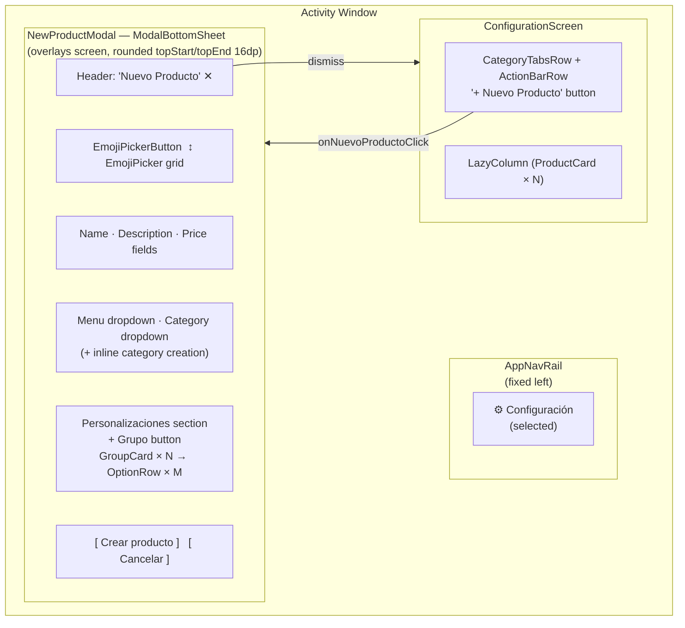
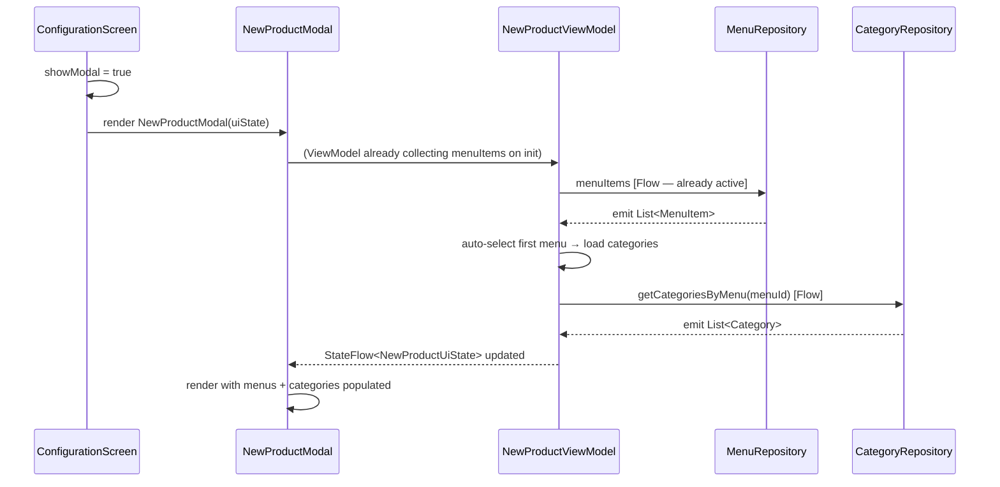
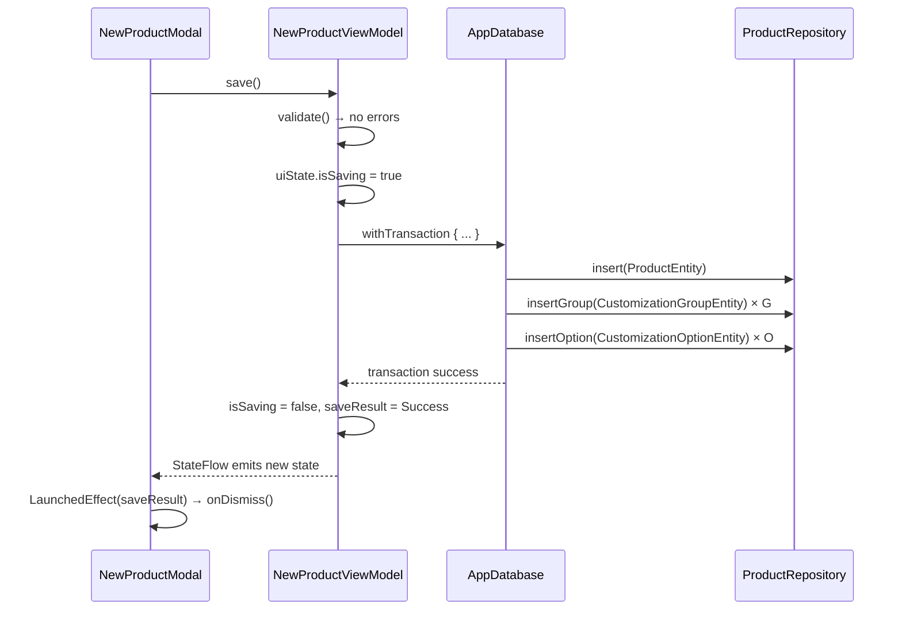
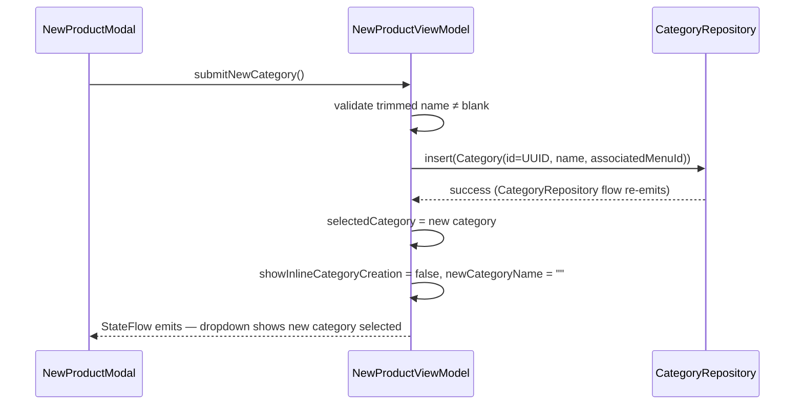

# Design — 05 New Product Modal

## Feature: New Product Modal (ModalBottomSheet · Emoji · Groups/Options · Atomic Save)

**Version:** 1.0
**Status:** Draft
**Phase:** Phase 3 — New-product authoring UI (phases 1–2 data layer and ConfigurationScreen are the foundation)

---

## Overview

The New Product Modal is a `ModalBottomSheet` that opens when the user taps "+ Nuevo Producto"
in `ConfigurationScreen`. It lets a cashier or manager author a complete product record
— emoji, name, description, price, menu, category, and an unlimited set of customization
groups/options — and persist the full tree to Room in a single atomic transaction.

All transient form state lives in `NewProductViewModel`, exposed as a single
`StateFlow<NewProductUiState>`. The modal itself is a stateless composable: it reads
`uiState` and routes user events to the ViewModel. No data layer files are modified;
the feature calls existing `ProductRepository`, `CategoryRepository`, `MenuRepository`,
and `AppDatabase.withTransaction`.

The modal dismisses automatically when `saveResult == SaveResult.Success` and resets
all draft state to the Initial Empty State on dismiss (both successful and cancelled).

---

## Architecture

### Component Hierarchy

```
ConfigurationScreen
├── ActionBarRow
│   └── Button("+ Nuevo Producto")  ──onNuevoProductoClick──►  showModal = true
│
└── if (showModal)
    └── NewProductModal(viewModel, onDismiss)          ← NEW composable
        └── ModalBottomSheet
            └── Column (verticalScroll)
                ├── HeaderRow
                │   ├── Text("Nuevo Producto")
                │   └── IconButton("X")  ──dismiss──► viewModel.dismiss()
                │
                ├── EmojiPickerButton (shows current emoji)
                │   └── if (emojiPickerExpanded)
                │       └── EmojiPicker(5-column grid, ≥40 emojis)
                │
                ├── OutlinedTextField("Nombre", max 120)
                ├── OutlinedTextField("Descripción", max 500)
                ├── OutlinedTextField("Precio", KeyboardType.Decimal)
                │
                ├── ExposedDropdownMenuBox("Menú")
                │
                ├── ExposedDropdownMenuBox("Categoría")
                │   └── if (showInlineCategoryCreation)
                │       ├── OutlinedTextField("Nombre de la nueva categoría", max 80)
                │       ├── Button("Guardar categoría")
                │       └── TextButton("Cancelar")
                │
                ├── SectionHeader("Personalizaciones")
                ├── OutlinedButton("+ Grupo")
                │
                ├── LazyColumn (or Column) of GroupCard × N
                │   └── GroupCard(groupDraft, groupIndex)
                │       ├── OutlinedTextField("Nombre del grupo", max 120)
                │       ├── SelectionTypeDropdown("Comportamiento")
                │       ├── IconButton(trash)
                │       ├── OptionRow × M  (one per OptionDraft)
                │       │   ├── OutlinedTextField("Nombre de la opción", max 120)
                │       │   ├── OutlinedTextField("Precio extra ($)", Decimal)
                │       │   └── IconButton("X")
                │       └── TextButton("+ Agregar opción")
                │
                └── BottomActionRow
                    ├── Button("Crear producto") [shows CircularProgressIndicator when saving]
                    └── OutlinedButton("Cancelar")
```

### Screen Layout Diagram



### Wiring into ConfigurationScreen

`ConfigurationScreen` gains one additional boolean state value `showNewProductModal` (hoisted
in the composable itself, not in `ConfigurationViewModel`). The "+ Nuevo Producto" lambda
sets it to `true`; the `NewProductModal`'s `onDismiss` callback sets it back to `false`.
`NewProductViewModel` is instantiated at this call site with its `Factory`.

```kotlin
@Composable
fun ConfigurationScreen(
    viewModel: ConfigurationViewModel,
    newProductViewModel: NewProductViewModel   // ← injected alongside ConfigurationViewModel
) {
    val uiState by viewModel.uiState.collectAsStateWithLifecycle()
    val npState by newProductViewModel.uiState.collectAsStateWithLifecycle()

    var showModal by remember { mutableStateOf(false) }

    // ... existing layout unchanged ...

    ActionBarRow(
        onNuevoProductoClick = { showModal = true },
        // ... other lambdas unchanged ...
    )

    if (showModal) {
        NewProductModal(
            uiState   = npState,
            viewModel = newProductViewModel,
            onDismiss = {
                newProductViewModel.dismiss()
                showModal = false
            }
        )
    }
}
```

`NewProductViewModel.Factory` is constructed in `MainActivity` alongside
`ConfigurationViewModel.Factory`, receiving `productRepository`, `categoryRepository`,
`menuRepository`, and `database`.

### Data Flow — Open Modal



### Data Flow — Save



### Data Flow — Inline Category Creation



---

## Components and Interfaces

### SaveResult

**File:** `ui/newproduct/NewProductViewModel.kt` (top-level sealed interface in the same file)

```kotlin
sealed interface SaveResult {
    data object Success : SaveResult
    data class Failure(val message: String) : SaveResult
}
```

---

### OptionDraft

**File:** `ui/newproduct/NewProductViewModel.kt` (nested data class)

```kotlin
data class OptionDraft(
    val draftId: String = UUID.randomUUID().toString(),  // immutable; used as Compose key
    val optionName: String = "",
    val extraPriceText: String = "",                     // raw text from the Decimal field
    val optionNameError: String? = null,
    val optionPriceError: String? = null
) {
    /** Parsed price; 0.0 when field is blank or unparseable. */
    val extraPrice: Double get() = extraPriceText.toDoubleOrNull() ?: 0.0
}
```

**Field invariants:**

| Field | Invariant |
|---|---|
| `draftId` | UUID string; assigned once at construction, never mutated |
| `extraPriceText` | Contains only digits and at most one `.`, at most two decimal places |
| `extraPrice` | ≥ 0.0 after successful validation |

---

### GroupDraft

**File:** `ui/newproduct/NewProductViewModel.kt` (nested data class)

```kotlin
data class GroupDraft(
    val draftId: String = UUID.randomUUID().toString(),  // immutable; used as Compose key
    val groupName: String = "",
    val selectionType: SelectionType = SelectionType.MULTIPLE_CHECKBOXES,
    val options: List<OptionDraft> = listOf(OptionDraft()),
    val groupNameError: String? = null
)
```

**Field invariants:**

| Field | Invariant |
|---|---|
| `draftId` | UUID string; assigned once at construction, never mutated |
| `options` | Always `List` (never `MutableList`); never null; min size 1 after creation |
| `selectionType` | Always one of `MULTIPLE_CHECKBOXES` or `SINGLE_OPTION` |

---

### NewProductUiState

**File:** `ui/newproduct/NewProductViewModel.kt` (top-level data class)

```kotlin
data class NewProductUiState(
    // ── Basic product fields ──────────────────────────────────────────────────
    val emoji: String = "🛒",
    val name: String = "",
    val description: String = "",
    val priceText: String = "",                  // raw Decimal field text

    // ── Emoji picker ──────────────────────────────────────────────────────────
    val emojiPickerExpanded: Boolean = false,

    // ── Menu + Category dropdowns ─────────────────────────────────────────────
    val menus: List<MenuItem> = emptyList(),
    val selectedMenu: MenuItem? = null,
    val categories: List<Category> = emptyList(),
    val selectedCategory: Category? = null,

    // ── Inline category creation ──────────────────────────────────────────────
    val showInlineCategoryCreation: Boolean = false,
    val newCategoryName: String = "",
    val newCategoryNameError: String? = null,

    // ── Customization groups ──────────────────────────────────────────────────
    val groups: List<GroupDraft> = emptyList(),

    // ── Validation errors ─────────────────────────────────────────────────────
    val nameError: String? = null,
    val categoryError: String? = null,

    // ── Save lifecycle ────────────────────────────────────────────────────────
    val isSaving: Boolean = false,
    val saveResult: SaveResult? = null,
    val error: String? = null
)
```

**Initial Empty State** (what `dismiss()` and `reset()` restore):

All fields match the default values above: `emoji = "🛒"`, `name = ""`, `description = ""`,
`priceText = ""`, `emojiPickerExpanded = false`, `menus` retains current live list,
`selectedMenu` is auto-selected first item, `categories` reloads for that menu,
`selectedCategory = null`, `showInlineCategoryCreation = false`, `newCategoryName = ""`,
`groups = emptyList()`, all error fields `null`, `isSaving = false`, `saveResult = null`,
`error = null`.

> Note: `menus` is NOT cleared on reset — the `MenuRepository.menuItems` Flow continues
> to drive it. Only the form-entry fields and transient draft state are reset.

**Field invariants:**

| Field | Invariant |
|---|---|
| `emoji` | Always non-empty; never set to `""` |
| `priceText` | Digits and at most one `.`, at most two decimal places |
| `selectedMenu` | If non-null, its `id` appears in `menus` |
| `selectedCategory` | If non-null, its `id` appears in `categories` |
| `groups` | `List<GroupDraft>` — never `MutableList`; new object on every mutation |
| `isSaving` | When `true`, `saveResult` is `null` and no mutation functions are invoked |

---

### NewProductViewModel

**File:** `ui/newproduct/NewProductViewModel.kt`

```kotlin
class NewProductViewModel(
    private val productRepository: ProductRepository,
    private val categoryRepository: CategoryRepository,
    private val menuRepository: MenuRepository,
    private val database: AppDatabase
) : ViewModel() {

    // ── Internal mutable state ────────────────────────────────────────────────
    private val _uiState = MutableStateFlow(NewProductUiState())

    // ── Exposed StateFlow ─────────────────────────────────────────────────────
    val uiState: StateFlow<NewProductUiState> = _uiState.asStateFlow()

    init {
        // Collect MenuRepository.menuItems; auto-select first on first emission
        menuRepository.menuItems
            .onEach { items ->
                _uiState.update { s ->
                    val current = s.selectedMenu
                    val newSelection = when {
                        current != null && items.any { it.id == current.id } -> current
                        else -> items.firstOrNull()
                    }
                    s.copy(menus = items, selectedMenu = newSelection)
                }
                // Load categories whenever the selected menu changes
                val menuId = _uiState.value.selectedMenu?.id
                if (menuId != null) loadCategories(menuId)
            }
            .launchIn(viewModelScope)
    }

    private fun loadCategories(menuId: String) {
        categoryRepository.getCategoriesByMenu(menuId)
            .onEach { cats -> _uiState.update { it.copy(categories = cats) } }
            .launchIn(viewModelScope)
    }

    // ── Emoji ─────────────────────────────────────────────────────────────────

    /** Sets the selected emoji; ignores empty strings (Req 2.6). */
    fun updateEmoji(newEmoji: String) {
        if (newEmoji.isBlank()) return
        _uiState.update { it.copy(emoji = newEmoji, emojiPickerExpanded = false) }
    }

    /** Toggles the emoji picker open/closed (Req 2.2, 2.3). */
    fun toggleEmojiPicker() {
        _uiState.update { it.copy(emojiPickerExpanded = !it.emojiPickerExpanded) }
    }

    // ── Basic fields ──────────────────────────────────────────────────────────

    /** Updates product name; clears nameError immediately when name becomes non-empty (Req 3.6). */
    fun updateName(newName: String) {
        if (newName.length > 120) return
        _uiState.update { s ->
            s.copy(
                name = newName,
                nameError = if (newName.isNotEmpty()) null else s.nameError
            )
        }
    }

    /** Updates description; silently discards input beyond 500 chars (Req 3.2). */
    fun updateDescription(newDescription: String) {
        if (newDescription.length > 500) return
        _uiState.update { it.copy(description = newDescription) }
    }

    /**
     * Updates the raw price text.
     * Allows only digits, one decimal separator, and at most two decimal places (Req 3.3).
     * Silently ignores invalid characters.
     */
    fun updatePriceText(newText: String) {
        val sanitized = sanitizePriceInput(newText)
        _uiState.update { it.copy(priceText = sanitized) }
    }

    // ── Menu dropdown ─────────────────────────────────────────────────────────

    /** Selects a menu; reloads categories for the new menu (Req 4.5). */
    fun selectMenu(menu: MenuItem) {
        _uiState.update { it.copy(
            selectedMenu     = menu,
            categories       = emptyList(),
            selectedCategory = null
        ) }
        loadCategories(menu.id)
    }

    // ── Category dropdown ─────────────────────────────────────────────────────

    /** Selects an existing category (Req 5.1). */
    fun selectCategory(category: Category) {
        _uiState.update { it.copy(selectedCategory = category, categoryError = null) }
    }

    /** Shows the inline category creation UI (Req 5.3). */
    fun startInlineCategoryCreation() {
        _uiState.update { it.copy(showInlineCategoryCreation = true) }
    }

    /** Updates the inline draft category name; clears error on first character (Req 5.7). */
    fun updateInlineCategoryName(newName: String) {
        if (newName.length > 80) return
        _uiState.update { s ->
            s.copy(
                newCategoryName      = newName,
                newCategoryNameError = if (newName.isNotEmpty()) null else s.newCategoryNameError
            )
        }
    }

    /** Saves the inline draft category to the repository (Req 5.4). */
    fun submitNewCategory() {
        val state = _uiState.value
        val trimmedName = state.newCategoryName.trim()
        if (trimmedName.isBlank()) {
            _uiState.update { it.copy(newCategoryNameError = "El nombre no puede estar vacío") }
            return
        }
        val menuId = state.selectedMenu?.id ?: return
        viewModelScope.launch {
            runCatching {
                val newCategory = Category(
                    id               = UUID.randomUUID().toString(),
                    name             = trimmedName,
                    associatedMenuId = menuId
                )
                categoryRepository.insert(newCategory)
                _uiState.update { s -> s.copy(
                    selectedCategory         = newCategory,
                    showInlineCategoryCreation = false,
                    newCategoryName          = "",
                    newCategoryNameError     = null
                ) }
            }.onFailure { e ->
                _uiState.update { it.copy(error = "Error al guardar categoría: ${e.message}") }
            }
        }
    }

    /** Cancels inline category creation without modifying selectedCategory (Req 5.8). */
    fun cancelNewCategory() {
        _uiState.update { it.copy(
            showInlineCategoryCreation = false,
            newCategoryName            = "",
            newCategoryNameError       = null
        ) }
    }

    // ── Group management ──────────────────────────────────────────────────────

    /** Appends a new GroupDraft with default values (Req 6.2). */
    fun addGroup() {
        _uiState.update { it.copy(groups = it.groups + GroupDraft()) }
    }

    /** Removes the GroupDraft at [index]; no-op if out of bounds (Req 10.8). */
    fun removeGroup(index: Int) {
        val groups = _uiState.value.groups
        if (index !in groups.indices) return
        _uiState.update { it.copy(groups = groups.toMutableList().also { l -> l.removeAt(index) }) }
    }

    /** Updates groupName of the GroupDraft at [index]; clears error on non-blank input (Req 6.4, 6.7). */
    fun updateGroupName(index: Int, newName: String) {
        if (newName.length > 120) return
        _uiState.update { s ->
            val updated = s.groups.mapIndexed { i, g ->
                if (i == index) g.copy(
                    groupName      = newName,
                    groupNameError = if (newName.trim().isNotEmpty()) null else g.groupNameError
                ) else g
            }
            s.copy(groups = updated)
        }
    }

    /** Updates selectionType of the GroupDraft at [index] only (Req 7.3). */
    fun updateGroupSelectionType(index: Int, type: SelectionType) {
        _uiState.update { s ->
            val updated = s.groups.mapIndexed { i, g ->
                if (i == index) g.copy(selectionType = type) else g
            }
            s.copy(groups = updated)
        }
    }

    // ── Option management ─────────────────────────────────────────────────────

    /** Appends a new OptionDraft to the group at [groupIndex] only (Req 8.2). */
    fun addOption(groupIndex: Int) {
        _uiState.update { s ->
            val updated = s.groups.mapIndexed { i, g ->
                if (i == groupIndex) g.copy(options = g.options + OptionDraft()) else g
            }
            s.copy(groups = updated)
        }
    }

    /** Removes the OptionDraft at [optionIndex] within [groupIndex]; no-op if out of bounds (Req 10.8). */
    fun removeOption(groupIndex: Int, optionIndex: Int) {
        _uiState.update { s ->
            val group = s.groups.getOrNull(groupIndex) ?: return@update s
            if (optionIndex !in group.options.indices) return@update s
            val updatedOptions = group.options.toMutableList().also { it.removeAt(optionIndex) }
            val updated = s.groups.mapIndexed { i, g ->
                if (i == groupIndex) g.copy(options = updatedOptions) else g
            }
            s.copy(groups = updated)
        }
    }

    /** Updates optionName; clears optionNameError on non-blank input (Req 8.7). */
    fun updateOptionName(groupIndex: Int, optionIndex: Int, newName: String) {
        if (newName.length > 120) return
        _uiState.update { s ->
            val updated = s.groups.mapIndexed { gi, g ->
                if (gi != groupIndex) return@mapIndexed g
                val updatedOpts = g.options.mapIndexed { oi, o ->
                    if (oi == optionIndex) o.copy(
                        optionName      = newName,
                        optionNameError = if (newName.trim().isNotEmpty()) null else o.optionNameError
                    ) else o
                }
                g.copy(options = updatedOpts)
            }
            s.copy(groups = updated)
        }
    }

    /** Updates extraPriceText; clears optionPriceError when value is non-negative (Req 8.8). */
    fun updateOptionExtraPrice(groupIndex: Int, optionIndex: Int, newText: String) {
        val sanitized = sanitizePriceInput(newText)
        _uiState.update { s ->
            val updated = s.groups.mapIndexed { gi, g ->
                if (gi != groupIndex) return@mapIndexed g
                val updatedOpts = g.options.mapIndexed { oi, o ->
                    if (oi == optionIndex) {
                        val parsed = sanitized.toDoubleOrNull() ?: 0.0
                        o.copy(
                            extraPriceText  = sanitized,
                            optionPriceError = if (parsed >= 0.0) null else o.optionPriceError
                        )
                    } else o
                }
                g.copy(options = updatedOpts)
            }
            s.copy(groups = updated)
        }
    }

    // ── Save & dismiss ────────────────────────────────────────────────────────

    /**
     * Validates the full form and, if valid, persists the complete product tree
     * inside a single Room transaction (Req 9).
     */
    fun save() {
        val s = _uiState.value
        if (s.isSaving) return

        // Field-level validation
        val nameError     = if (s.name.isBlank()) "El nombre es obligatorio" else null
        val categoryError = if (s.selectedCategory == null) "Selecciona una categoría" else null
        val groupErrors   = s.groups.map { g ->
            if (g.groupName.trim().isBlank()) "El nombre del grupo es obligatorio" else null
        }
        val groupsWithErrors = s.groups.mapIndexed { i, g ->
            g.copy(groupNameError = groupErrors[i])
        }
        // Option-level validation
        val groupsWithOptionErrors = groupsWithErrors.map { g ->
            val updatedOpts = g.options.map { o ->
                val nameErr  = if (o.optionName.trim().isBlank()) "El nombre de la opción es obligatorio" else null
                val priceErr = if (o.extraPrice < 0.0) "El precio debe ser ≥ 0" else null
                o.copy(optionNameError = nameErr, optionPriceError = priceErr)
            }
            g.copy(options = updatedOpts)
        }
        val hasErrors = nameError != null || categoryError != null ||
            groupErrors.any { it != null } ||
            groupsWithOptionErrors.any { g -> g.options.any { it.optionNameError != null || it.optionPriceError != null } }

        if (hasErrors) {
            _uiState.update { it.copy(
                nameError     = nameError,
                categoryError = categoryError,
                groups        = groupsWithOptionErrors
            ) }
            return
        }

        _uiState.update { it.copy(isSaving = true) }

        viewModelScope.launch {
            runCatching {
                database.withTransaction {
                    val productId = UUID.randomUUID().toString()
                    val basePrice = s.priceText.toDoubleOrNull() ?: 0.0

                    productRepository.insert(
                        Product(
                            id          = productId,
                            emoji       = s.emoji,
                            name        = s.name.trim(),
                            description = s.description.trim(),
                            basePrice   = basePrice,
                            isActive    = true,
                            categoryId  = s.selectedCategory!!.id
                        )
                    )
                    s.groups.forEach { group ->
                        val groupId = UUID.randomUUID().toString()
                        productRepository.insertGroup(
                            CustomizationGroupEntity(
                                id            = groupId,
                                productId     = productId,
                                groupName     = group.groupName.trim(),
                                selectionType = group.selectionType.value
                            )
                        )
                        group.options.forEach { option ->
                            productRepository.insertOption(
                                CustomizationOptionEntity(
                                    id         = UUID.randomUUID().toString(),
                                    groupId    = groupId,
                                    optionName = option.optionName.trim(),
                                    extraPrice = option.extraPrice
                                )
                            )
                        }
                    }
                }
                _uiState.update { it.copy(isSaving = false, saveResult = SaveResult.Success) }
            }.onFailure { e ->
                _uiState.update { it.copy(
                    isSaving = false,
                    error    = "Error al guardar: ${e.message}"
                ) }
            }
        }
    }

    /**
     * Resets all form state to the Initial Empty State.
     * Called on successful save dismissal and on "Cancelar" (Req 1.3, 9.8).
     */
    fun dismiss() {
        _uiState.update { current ->
            NewProductUiState(
                menus        = current.menus,
                selectedMenu = current.selectedMenu,
                categories   = current.categories
            )
        }
    }

    // ── Private helpers ───────────────────────────────────────────────────────

    /**
     * Sanitizes a string for the Decimal price field:
     * – Keeps only digits and the first `.`
     * – Truncates to at most two decimal places
     */
    private fun sanitizePriceInput(input: String): String {
        val clean = input.filter { it.isDigit() || it == '.' }
        val dotIndex = clean.indexOf('.')
        return if (dotIndex == -1) clean
        else {
            val decimals = clean.substring(dotIndex + 1).take(2)
            clean.substring(0, dotIndex + 1) + decimals
        }
    }

    // ── Factory ───────────────────────────────────────────────────────────────

    class Factory(
        private val productRepository: ProductRepository,
        private val categoryRepository: CategoryRepository,
        private val menuRepository: MenuRepository,
        private val database: AppDatabase
    ) : ViewModelProvider.Factory {
        @Suppress("UNCHECKED_CAST")
        override fun <T : ViewModel> create(modelClass: Class<T>): T =
            NewProductViewModel(
                productRepository, categoryRepository, menuRepository, database
            ) as T
    }
}
```

---

### NewProductModal

**File:** `ui/newproduct/NewProductModal.kt`

```kotlin
@OptIn(ExperimentalMaterial3Api::class)
@Composable
fun NewProductModal(
    uiState: NewProductUiState,
    viewModel: NewProductViewModel,
    onDismiss: () -> Unit
) {
    // Auto-dismiss when save succeeds
    LaunchedEffect(uiState.saveResult) {
        if (uiState.saveResult is SaveResult.Success) onDismiss()
    }

    val sheetState = rememberModalBottomSheetState(
        skipPartiallyExpanded = true,
        confirmValueChange = { newVal ->
            // Suppress swipe-dismiss while saving (Req 1.4)
            if (uiState.isSaving) newVal != SheetValue.Hidden else true
        }
    )

    ModalBottomSheet(
        onDismissRequest = {
            if (!uiState.isSaving) onDismiss()
        },
        sheetState = sheetState,
        shape = RoundedCornerShape(
            topStart = 16.dp, topEnd = 16.dp,
            bottomStart = 0.dp, bottomEnd = 0.dp
        ),
        containerColor = InputBackground,
        dragHandle = null                  // custom header replaces default handle
    ) {
        Column(
            modifier = Modifier
                .fillMaxWidth()
                .verticalScroll(rememberScrollState())
                .padding(horizontal = 16.dp, vertical = 12.dp)
        ) {
            // ── Header ──────────────────────────────────────────────────────
            Row(
                modifier = Modifier.fillMaxWidth(),
                horizontalArrangement = Arrangement.SpaceBetween,
                verticalAlignment = Alignment.CenterVertically
            ) {
                Text("Nuevo Producto", fontWeight = FontWeight.Bold, fontSize = 20.sp)
                IconButton(
                    onClick  = { if (!uiState.isSaving) onDismiss() },
                    enabled  = !uiState.isSaving
                ) {
                    Icon(Icons.Default.Close, contentDescription = "Cerrar")
                }
            }

            Spacer(Modifier.height(12.dp))

            // ── Emoji picker ─────────────────────────────────────────────────
            EmojiPickerButton(
                selectedEmoji    = uiState.emoji,
                expanded         = uiState.emojiPickerExpanded,
                onToggle         = { viewModel.toggleEmojiPicker() },
                onEmojiSelected  = { viewModel.updateEmoji(it) }
            )

            Spacer(Modifier.height(12.dp))

            // ── Name ─────────────────────────────────────────────────────────
            OutlinedTextField(
                value           = uiState.name,
                onValueChange   = { viewModel.updateName(it) },
                label           = { Text("Nombre") },
                isError         = uiState.nameError != null,
                supportingText  = uiState.nameError?.let { { Text(it) } },
                singleLine      = true,
                colors          = modalFieldColors(),
                modifier        = Modifier.fillMaxWidth()
            )

            Spacer(Modifier.height(8.dp))

            // ── Description ───────────────────────────────────────────────────
            OutlinedTextField(
                value         = uiState.description,
                onValueChange = { viewModel.updateDescription(it) },
                label         = { Text("Descripción") },
                minLines      = 2,
                colors        = modalFieldColors(),
                modifier      = Modifier.fillMaxWidth()
            )

            Spacer(Modifier.height(8.dp))

            // ── Price ────────────────────────────────────────────────────────
            OutlinedTextField(
                value         = uiState.priceText,
                onValueChange = { viewModel.updatePriceText(it) },
                label         = { Text("Precio") },
                keyboardOptions = KeyboardOptions(keyboardType = KeyboardType.Decimal),
                singleLine    = true,
                colors        = modalFieldColors(),
                modifier      = Modifier.fillMaxWidth()
            )

            Spacer(Modifier.height(12.dp))

            // ── Menu dropdown ──────────────────────────────────────────────
            MenuDropdown(
                menus          = uiState.menus,
                selectedMenu   = uiState.selectedMenu,
                onMenuSelected = { viewModel.selectMenu(it) }
            )

            Spacer(Modifier.height(8.dp))

            // ── Category dropdown ──────────────────────────────────────────
            CategoryDropdown(
                categories             = uiState.categories,
                selectedCategory       = uiState.selectedCategory,
                menuSelected           = uiState.selectedMenu != null,
                categoryError          = uiState.categoryError,
                showInlineCreation     = uiState.showInlineCategoryCreation,
                newCategoryName        = uiState.newCategoryName,
                newCategoryNameError   = uiState.newCategoryNameError,
                onCategorySelected     = { viewModel.selectCategory(it) },
                onStartInlineCreation  = { viewModel.startInlineCategoryCreation() },
                onInlineNameChange     = { viewModel.updateInlineCategoryName(it) },
                onSaveInlineCategory   = { viewModel.submitNewCategory() },
                onCancelInlineCategory = { viewModel.cancelNewCategory() }
            )

            Spacer(Modifier.height(16.dp))

            // ── Customizations section ─────────────────────────────────────
            Text(
                text       = "Personalizaciones",
                fontWeight = FontWeight.Bold,
                fontSize   = 16.sp
            )
            Spacer(Modifier.height(8.dp))

            uiState.groups.forEachIndexed { index, group ->
                GroupCard(
                    group          = group,
                    groupIndex     = index,
                    onGroupNameChange    = { viewModel.updateGroupName(index, it) },
                    onSelectionTypeChange = { viewModel.updateGroupSelectionType(index, it) },
                    onRemoveGroup   = { viewModel.removeGroup(index) },
                    onAddOption     = { viewModel.addOption(index) },
                    onRemoveOption  = { optIdx -> viewModel.removeOption(index, optIdx) },
                    onOptionNameChange  = { optIdx, name -> viewModel.updateOptionName(index, optIdx, name) },
                    onOptionPriceChange = { optIdx, price -> viewModel.updateOptionExtraPrice(index, optIdx, price) }
                )
                Spacer(Modifier.height(8.dp))
            }

            OutlinedButton(
                onClick = { viewModel.addGroup() },
                border  = BorderStroke(1.dp, InputBorder),
                modifier = Modifier.fillMaxWidth()
            ) {
                Text("+ Grupo", color = InputBorder)
            }

            Spacer(Modifier.height(16.dp))

            // ── Global error ──────────────────────────────────────────────
            if (uiState.error != null) {
                Text(uiState.error, color = ButtonCancel, fontSize = 13.sp)
                Spacer(Modifier.height(8.dp))
            }

            // ── Bottom action row ─────────────────────────────────────────
            Row(
                modifier = Modifier.fillMaxWidth(),
                horizontalArrangement = Arrangement.spacedBy(12.dp)
            ) {
                OutlinedButton(
                    onClick  = { onDismiss() },
                    enabled  = !uiState.isSaving,
                    modifier = Modifier.weight(1f)
                ) { Text("Cancelar") }

                Button(
                    onClick  = { viewModel.save() },
                    enabled  = !uiState.isSaving,
                    colors   = ButtonDefaults.buttonColors(containerColor = ButtonConfirm),
                    modifier = Modifier.weight(1f)
                ) {
                    if (uiState.isSaving) {
                        CircularProgressIndicator(
                            modifier = Modifier.size(18.dp),
                            strokeWidth = 2.dp,
                            color = Color.White
                        )
                    } else {
                        Text("Crear producto")
                    }
                }
            }
        }
    }
}
```

**`modalFieldColors()` helper** (private function in the same file):

```kotlin
@Composable
private fun modalFieldColors() = OutlinedTextFieldDefaults.colors(
    focusedBorderColor   = InputBorder,
    unfocusedBorderColor = InputBorder,
    cursorColor          = InputText,
    focusedLabelColor    = InputBorder,
    unfocusedLabelColor  = InputHint,
    focusedTextColor     = InputText,
    unfocusedTextColor   = InputText,
    focusedContainerColor   = InputBackground,
    unfocusedContainerColor = InputBackground,
    errorBorderColor     = ButtonCancel,
    errorLabelColor      = ButtonCancel
)
```

---

### EmojiPicker

**File:** `ui/newproduct/EmojiPicker.kt`

The emoji picker is an inline composable that renders a 5-column `LazyVerticalGrid` of emoji
buttons. It is shown/hidden by `AnimatedVisibility` driven by `NewProductUiState.emojiPickerExpanded`.

```kotlin
private val EMOJI_LIST = listOf(
    "🍕","🍔","🌮","🌯","🍜","🍝","🍣","🍱","🍛","🍲",
    "🥗","🥙","🥪","🍗","🍖","🥩","🍳","🥚","🧀","🥓",
    "🌭","🥨","🥐","🍞","🧁","🍰","🎂","🍩","🍪","🍦",
    "🍫","🍬","🍭","🍮","☕","🍵","🧃","🥤","🍹","🍺",
    "🛒","🥡","🫕","🥘","🫔","🫓","🥞","🧇","🥧","🫙"
)  // 50 emojis — satisfies Req 2.2 (≥ 40)

@Composable
fun EmojiPickerButton(
    selectedEmoji:   String,
    expanded:        Boolean,
    onToggle:        () -> Unit,
    onEmojiSelected: (String) -> Unit,
    modifier:        Modifier = Modifier
) {
    Column(modifier = modifier) {
        // ── Trigger button ──────────────────────────────────────────────────
        OutlinedButton(
            onClick = onToggle,
            shape   = RoundedCornerShape(8.dp),
            border  = BorderStroke(1.dp, InputBorder)
        ) {
            Text(selectedEmoji, fontSize = 28.sp)
            Spacer(Modifier.width(8.dp))
            Icon(
                imageVector = if (expanded) Icons.Default.KeyboardArrowUp
                              else Icons.Default.KeyboardArrowDown,
                contentDescription = if (expanded) "Cerrar selector de emoji"
                                     else "Abrir selector de emoji",
                tint = InputBorder
            )
        }

        // ── Inline grid ─────────────────────────────────────────────────────
        AnimatedVisibility(visible = expanded) {
            LazyVerticalGrid(
                columns          = GridCells.Fixed(5),
                modifier         = Modifier
                    .fillMaxWidth()
                    .heightIn(max = 200.dp),
                contentPadding   = PaddingValues(4.dp),
                verticalArrangement   = Arrangement.spacedBy(4.dp),
                horizontalArrangement = Arrangement.spacedBy(4.dp)
            ) {
                items(EMOJI_LIST) { emoji ->
                    TextButton(
                        onClick  = { onEmojiSelected(emoji) },
                        modifier = Modifier.aspectRatio(1f)
                    ) {
                        Text(emoji, fontSize = 22.sp, textAlign = TextAlign.Center)
                    }
                }
            }
        }
    }
}
```

---

### GroupCard

**File:** `ui/newproduct/GroupCard.kt`

```kotlin
@Composable
fun GroupCard(
    group:                GroupDraft,
    groupIndex:           Int,
    onGroupNameChange:    (String) -> Unit,
    onSelectionTypeChange:(SelectionType) -> Unit,
    onRemoveGroup:        () -> Unit,
    onAddOption:          () -> Unit,
    onRemoveOption:       (Int) -> Unit,
    onOptionNameChange:   (Int, String) -> Unit,
    onOptionPriceChange:  (Int, String) -> Unit,
    modifier:             Modifier = Modifier
) {
    Card(
        shape  = RoundedCornerShape(8.dp),
        colors = CardDefaults.cardColors(containerColor = CardBackground),
        modifier = modifier.fillMaxWidth()
    ) {
        Column(modifier = Modifier.padding(12.dp)) {

            // ── Header row: group name + trash ────────────────────────────
            Row(
                modifier = Modifier.fillMaxWidth(),
                verticalAlignment = Alignment.CenterVertically
            ) {
                OutlinedTextField(
                    value           = group.groupName,
                    onValueChange   = onGroupNameChange,
                    label           = { Text("Nombre del grupo", color = CardText) },
                    isError         = group.groupNameError != null,
                    supportingText  = group.groupNameError?.let { { Text(it, color = ButtonCancel) } },
                    singleLine      = true,
                    colors          = groupFieldColors(),
                    modifier        = Modifier.weight(1f)
                )
                IconButton(onClick = onRemoveGroup) {
                    Icon(Icons.Default.Delete, contentDescription = "Eliminar grupo", tint = ButtonDelete)
                }
            }

            Spacer(Modifier.height(8.dp))

            // ── Selection type dropdown ────────────────────────────────────
            SelectionTypeDropdown(
                selected  = group.selectionType,
                onSelected = onSelectionTypeChange
            )

            Spacer(Modifier.height(8.dp))

            // ── Option rows ───────────────────────────────────────────────
            group.options.forEachIndexed { optIndex, option ->
                key(option.draftId) {
                    OptionRow(
                        option         = option,
                        onNameChange   = { onOptionNameChange(optIndex, it) },
                        onPriceChange  = { onOptionPriceChange(optIndex, it) },
                        onRemove       = { onRemoveOption(optIndex) }
                    )
                    Spacer(Modifier.height(4.dp))
                }
            }

            // ── Add option button ──────────────────────────────────────────
            TextButton(
                onClick  = onAddOption,
                modifier = Modifier.align(Alignment.End)
            ) {
                Icon(Icons.Default.Add, contentDescription = null, tint = CardText)
                Spacer(Modifier.width(4.dp))
                Text("+ Agregar opción", color = CardText, fontSize = 13.sp)
            }
        }
    }
}
```

**`groupFieldColors()` helper** — same token set as `modalFieldColors()` but with
`CardText` label colors and `CardBackground` container:

```kotlin
@Composable
private fun groupFieldColors() = OutlinedTextFieldDefaults.colors(
    focusedBorderColor      = CardText,
    unfocusedBorderColor    = CardText,
    cursorColor             = CardText,
    focusedLabelColor       = CardText,
    unfocusedLabelColor     = CardText,
    focusedTextColor        = CardText,
    unfocusedTextColor      = CardText,
    focusedContainerColor   = CardBackground,
    unfocusedContainerColor = CardBackground,
    errorBorderColor        = ButtonCancel,
    errorLabelColor         = ButtonCancel
)
```

---

### OptionRow

**File:** `ui/newproduct/GroupCard.kt` (private composable in same file)

```kotlin
@Composable
private fun OptionRow(
    option:        OptionDraft,
    onNameChange:  (String) -> Unit,
    onPriceChange: (String) -> Unit,
    onRemove:      () -> Unit,
    modifier:      Modifier = Modifier
) {
    Row(
        modifier          = modifier.fillMaxWidth(),
        verticalAlignment = Alignment.CenterVertically,
        horizontalArrangement = Arrangement.spacedBy(8.dp)
    ) {
        // Option name (weight = 1f)
        OutlinedTextField(
            value           = option.optionName,
            onValueChange   = onNameChange,
            label           = { Text("Nombre de la opción", color = CardText) },
            isError         = option.optionNameError != null,
            supportingText  = option.optionNameError?.let { { Text(it, color = ButtonCancel) } },
            singleLine      = true,
            colors          = groupFieldColors(),
            modifier        = Modifier.weight(1f)
        )

        // Extra price (fixed width — keeps the field compact)
        OutlinedTextField(
            value           = option.extraPriceText,
            onValueChange   = onPriceChange,
            label           = { Text("Precio extra ($)", color = CardText) },
            isError         = option.optionPriceError != null,
            keyboardOptions = KeyboardOptions(keyboardType = KeyboardType.Decimal),
            singleLine      = true,
            colors          = groupFieldColors(),
            modifier        = Modifier.width(120.dp)
        )

        // Remove button
        IconButton(onClick = onRemove) {
            Icon(Icons.Default.Close, contentDescription = "Eliminar opción", tint = ButtonDelete)
        }
    }
}
```

---

### SelectionTypeDropdown

**File:** `ui/newproduct/SelectionTypeDropdown.kt`

```kotlin
@OptIn(ExperimentalMaterial3Api::class)
@Composable
fun SelectionTypeDropdown(
    selected:   SelectionType,
    onSelected: (SelectionType) -> Unit,
    modifier:   Modifier = Modifier
) {
    var expanded by remember { mutableStateOf(false) }

    val labels = mapOf(
        SelectionType.MULTIPLE_CHECKBOXES to "Casillas (múltiple)",
        SelectionType.SINGLE_OPTION        to "Opción única"
    )

    ExposedDropdownMenuBox(
        expanded         = expanded,
        onExpandedChange = { expanded = !expanded },
        modifier         = modifier.fillMaxWidth()
    ) {
        OutlinedTextField(
            value         = labels[selected] ?: "",
            onValueChange = {},
            readOnly      = true,
            label         = { Text("Comportamiento", color = CardText) },
            trailingIcon  = { ExposedDropdownMenuDefaults.TrailingIcon(expanded = expanded) },
            colors        = groupFieldColors(),
            modifier      = Modifier
                .fillMaxWidth()
                .menuAnchor()
        )

        ExposedDropdownMenu(
            expanded         = expanded,
            onDismissRequest = { expanded = false }
        ) {
            SelectionType.entries.forEach { type ->
                DropdownMenuItem(
                    text    = { Text(labels[type] ?: type.value) },
                    onClick = {
                        onSelected(type)
                        expanded = false
                    }
                )
            }
        }
    }
}
```

---

### Color Token Usage Summary

| UI Element | Color Token | Hex |
|---|---|---|
| Modal container background | `InputBackground` | `#FFFFFF` |
| Basic field border (focused + unfocused) | `InputBorder` | `#4A8C1C` |
| Basic field text | `InputText` | `#1A1A1A` |
| Basic field hint/label | `InputHint` | `#9E9E9E` |
| GroupCard / SelectionTypeDropdown background | `CardBackground` | `#2D5A1B` |
| GroupCard field text + labels | `CardText` | `#FFFFFF` |
| "+ Agregar opción" text + icons inside card | `CardText` | `#FFFFFF` |
| "Crear producto" button | `ButtonConfirm` | `#4CAF50` |
| Error messages + error borders | `ButtonCancel` | `#E53935` |
| Trash / remove icons | `ButtonDelete` | red |
| "+ Grupo" button border + text | `InputBorder` | `#4A8C1C` |
| EmojiPickerButton border + chevron icon | `InputBorder` | `#4A8C1C` |
| "+ Nueva categoría..." dropdown entry | `ButtonConfirm` | `#4CAF50` |

---

## Data Models

### NewProductUiState — Full Field Table

| Field | Type | Default | Invariant |
|---|---|---|---|
| `emoji` | `String` | `"🛒"` | Always non-empty |
| `name` | `String` | `""` | Max 120 chars |
| `description` | `String` | `""` | Max 500 chars |
| `priceText` | `String` | `""` | Digits + one `.` + ≤2 decimal places |
| `emojiPickerExpanded` | `Boolean` | `false` | |
| `menus` | `List<MenuItem>` | `emptyList()` | Driven by `MenuRepository` |
| `selectedMenu` | `MenuItem?` | `null` | If non-null: id ∈ `menus` |
| `categories` | `List<Category>` | `emptyList()` | Driven by `CategoryRepository` |
| `selectedCategory` | `Category?` | `null` | If non-null: id ∈ `categories` |
| `showInlineCategoryCreation` | `Boolean` | `false` | |
| `newCategoryName` | `String` | `""` | Max 80 chars |
| `newCategoryNameError` | `String?` | `null` | |
| `groups` | `List<GroupDraft>` | `emptyList()` | Immutable list; new instance on mutation |
| `nameError` | `String?` | `null` | |
| `categoryError` | `String?` | `null` | |
| `isSaving` | `Boolean` | `false` | When `true`, no mutations fired |
| `saveResult` | `SaveResult?` | `null` | `null` while `isSaving = true` |
| `error` | `String?` | `null` | |

### GroupDraft — Full Field Table

| Field | Type | Default | Invariant |
|---|---|---|---|
| `draftId` | `String` | `UUID.randomUUID().toString()` | Immutable once assigned |
| `groupName` | `String` | `""` | Max 120 chars |
| `selectionType` | `SelectionType` | `MULTIPLE_CHECKBOXES` | |
| `options` | `List<OptionDraft>` | `listOf(OptionDraft())` | Immutable list; ≥1 at creation |
| `groupNameError` | `String?` | `null` | |

### OptionDraft — Full Field Table

| Field | Type | Default | Invariant |
|---|---|---|---|
| `draftId` | `String` | `UUID.randomUUID().toString()` | Immutable once assigned |
| `optionName` | `String` | `""` | Max 120 chars |
| `extraPriceText` | `String` | `""` | Digits + one `.` + ≤2 decimal places |
| `extraPrice` | `Double` (computed) | `0.0` | ≥ 0.0 after validation |
| `optionNameError` | `String?` | `null` | |
| `optionPriceError` | `String?` | `null` | |

### Entity–Draft Mapping at Save Time

| Draft field | → | Entity field | Notes |
|---|---|---|---|
| `uiState.emoji` | → | `ProductEntity.emoji` | |
| `uiState.name.trim()` | → | `ProductEntity.name` | Trimmed |
| `uiState.description.trim()` | → | `ProductEntity.description` | Trimmed |
| `priceText.toDoubleOrNull() ?: 0.0` | → | `ProductEntity.basePrice` | |
| `true` | → | `ProductEntity.isActive` | Always active on creation |
| `selectedCategory.id` | → | `ProductEntity.categoryId` | |
| `group.groupName.trim()` | → | `CustomizationGroupEntity.groupName` | |
| `group.selectionType.value` | → | `CustomizationGroupEntity.selectionType` | String value |
| `option.optionName.trim()` | → | `CustomizationOptionEntity.optionName` | |
| `option.extraPrice` | → | `CustomizationOptionEntity.extraPrice` | Parsed Double |

---

## Key Design Decisions

### 1. Single `StateFlow<NewProductUiState>` backed by `MutableStateFlow.update`

All ViewModel mutations use `_uiState.update { ... }` with immutable `data class` copies.
This makes every state transition atomic from the perspective of the `StateFlow` collector
and ensures Compose receives a new object reference on every change (triggering recomposition
only in affected subtrees).

### 2. Nested list immutability via `mapIndexed` + `copy`

Rather than `MutableList`, every group/option mutation produces a new `List` via
`mapIndexed` + `data class copy`. This is the pattern that satisfies Requirements 10.4,
10.5, and 10.6: unmodified siblings retain `===` identity, which Compose uses as a signal
to skip recomposition of their subtrees.

### 3. `GroupDraft.draftId` and `OptionDraft.draftId` as stable Compose keys

UUIDs are generated once at construction and never mutated. Using them as `key(group.draftId)`
in the `forEachIndexed` loop (and as `key(option.draftId)` inside each group) preserves
Compose's internal state (focus, keyboard state, animation) across list mutations like
reordering or mid-list deletion.

### 4. `AppDatabase.withTransaction` for atomic save

The three-table write (ProductEntity → CustomizationGroupEntity → CustomizationOptionEntity)
must either all succeed or all be rolled back. Room's `withTransaction` extension on
`AppDatabase` provides this guarantee. No manual `beginTransaction`/`endTransaction` calls
are needed; any exception inside the lambda causes an automatic rollback.

### 5. `sanitizePriceInput` centralized in the ViewModel

Decimal field sanitization lives in the ViewModel rather than in the composable. This means
the sanitization rule is testable in pure Kotlin unit tests without Compose and is applied
consistently for both the base price and each option's extra price.

### 6. Category `Flow` re-collected on menu change

When the user switches menus, `loadCategories(menuId)` launches a new `onEach` collector in
`viewModelScope`. The previous collector is effectively superseded because both write to the
same `_uiState.categories` field. A stricter implementation would use `flatMapLatest` on a
`selectedMenuId` flow; this simpler approach is acceptable for Phase 3 because menu-switching
mid-form is uncommon and any stale emission from the previous menu's flow will be immediately
overwritten by the new menu's first emission.

### 7. `showModal` state hoisted in `ConfigurationScreen`, not in `ConfigurationViewModel`

The visibility of the modal is transient UI state with no persistence requirement. Hoisting it
as a local `remember { mutableStateOf(false) }` in the composable avoids adding unrelated
state to `ConfigurationViewModel` and keeps the two ViewModels' concerns cleanly separated.

### 8. `NewProductViewModel.dismiss()` preserves `menus` and `categories`

On reset, the menu list and category list stay populated rather than being cleared. This
avoids a visible "flash" of empty dropdowns when the user reopens the modal immediately after
a save or cancellation, since the `MenuRepository` Flow is still alive and would re-emit
almost instantly anyway.

---

## Correctness Properties

*A property is a characteristic or behavior that should hold true across all valid executions
of a system — essentially, a formal statement about what the system should do. Properties
serve as the bridge between human-readable specifications and machine-verifiable correctness
guarantees.*

---

### Property 1: addGroup size invariant

*For any* non-negative integer N, calling `addGroup()` exactly N times on a
`NewProductViewModel` starting from a state where `groups = emptyList()` SHALL produce a
`NewProductUiState.groups` list of exactly N elements.

**Validates: Requirements 11.1**

---

### Property 2: addGroup / removeGroup inverse

*For any* N ≥ 1, adding N groups and then calling `removeGroup(index)` for each valid
index in descending order (N−1 down to 0) SHALL leave `NewProductUiState.groups` empty.

**Validates: Requirements 11.2**

---

### Property 3: GroupDraft draftId global uniqueness

*For any* sequence of `addGroup()` calls, all `draftId` values in the resulting
`NewProductUiState.groups` list SHALL be pairwise distinct (no two groups share a
`draftId`).

**Validates: Requirements 11.3, 10.1**

---

### Property 4: addOption size invariant

*For any* non-negative integer M, calling `addOption(groupIndex)` exactly M times on a
single group that was just created (initial `options.size == 1`) SHALL produce a
`GroupDraft.options` list of exactly M + 1 elements.

**Validates: Requirements 11.4**

---

### Property 5: updateGroupName preserves all draftIds

*For any* list of groups of size ≥ 1, valid group index, and arbitrary new name string,
calling `updateGroupName(index, newName)` SHALL leave every `GroupDraft.draftId` in the
list unchanged — both the target group's `draftId` and all sibling groups' `draftId`s.

**Validates: Requirements 11.5, 10.4**

---

### Property 6: updateOptionName preserves all option draftIds within the group

*For any* group containing ≥ 2 options, valid option index, and arbitrary new name
string, calling `updateOptionName(groupIndex, optionIndex, newName)` SHALL leave every
`OptionDraft.draftId` in that group's `options` list unchanged — both the target option's
`draftId` and all sibling options' `draftId`s.

**Validates: Requirements 11.6, 10.5**

---

### Property 7: OptionDraft draftId uniqueness within a group

*For any* sequence of `addOption(groupIndex)` calls on a single group, all `draftId`
values in the resulting `GroupDraft.options` list SHALL be pairwise distinct (no two
options within the same group share a `draftId`).

**Validates: Requirements 11.7, 10.3**

---

## Error Handling

| Scenario | Handling |
|---|---|
| `name` is blank at submit | `nameError` set; save not started; error cleared on first non-blank keypress |
| `selectedCategory` is null at submit | `categoryError` set; save not started |
| `groupName` is blank at submit | `groupNameError` set on every offending group simultaneously; save not started |
| `optionName` is blank at submit | `optionNameError` set on every offending option simultaneously; save not started |
| `extraPrice < 0.0` at submit | `optionPriceError` set on every offending option simultaneously; save not started |
| `CategoryRepository.insert` throws | `error` set with descriptive message; inline creation UI stays visible |
| `AppDatabase.withTransaction` throws | Room auto-rollback; `isSaving = false`; `error` set with message; modal stays open |
| `removeGroup` / `removeOption` with out-of-bounds index | No-op; state unchanged; no exception thrown (Req 10.8) |
| `updateEmoji` called with blank string | Ignored; current emoji retained (Req 2.6) |
| User swipes sheet down while `isSaving = true` | `confirmValueChange` returns `false`; sheet stays anchored (Req 1.4) |
| `MenuRepository.menuItems` emits empty list | Dropdowns disabled (`enabled = false`); placeholder text shown (Req 4.6) |
| Price field receives non-numeric characters | `sanitizePriceInput` strips them silently (Req 3.3) |

---

## Testing Strategy

### Approach

This feature uses a **dual testing approach**:

- **Unit tests** — pure Kotlin / JVM, no Android framework: test `NewProductViewModel`
  state machine logic using a `TestScope` and fake repositories.
- **Property-based tests** — use [Kotest Property Testing](https://kotest.io/docs/proptest/property-based-testing.html)
  with a minimum of **100 iterations** per property. Tests run on the JVM without
  instrumentation, driving the ViewModel directly.
- **Instrumented integration tests** (androidTest) — use Room in-memory database to
  verify the `withTransaction` save path end-to-end.

PBT is appropriate here because the core feature (nested group/option list management)
involves pure ViewModel logic with rich input variation — list sizes, indices, and string
values all vary meaningfully and 100 iterations surface ordering and boundary bugs that
example tests miss.

### Test file structure

```
app/src/test/java/com/example/puntodeventa/
└── ui/newproduct/
    ├── NewProductViewModelGroupTest.kt    ← Properties 1, 2, 3 (group list)
    ├── NewProductViewModelOptionTest.kt   ← Properties 4, 7 (option list)
    ├── NewProductViewModelIdTest.kt       ← Properties 5, 6 (draftId stability)
    ├── NewProductViewModelSaveTest.kt     ← Validation, save flow, dismiss reset
    └── NewProductViewModelCategoryTest.kt ← Inline category creation, menu switching

app/src/androidTest/java/com/example/puntodeventa/
└── ui/newproduct/
    └── NewProductSaveTransactionTest.kt  ← End-to-end save with in-memory Room DB
```

### Property-based test configuration

Each PBT uses **Kotest** (`io.kotest:kotest-property`) with `checkAll(100, ...)`.

Tag format for traceability:
```
// Feature: 05_new_product_modal, Property N: <property text>
```

#### Example — Property 1 (addGroup size invariant)

```kotlin
// Feature: 05_new_product_modal, Property 1: addGroup size invariant
@Test
fun `addGroup N times produces groups list of size N`() = runTest {
    checkAll(100, Arb.int(0..50)) { n ->
        val vm = NewProductViewModel(fakeProductRepo, fakeCategoryRepo, fakeMenuRepo, fakeDb)

        repeat(n) { vm.addGroup() }

        vm.uiState.value.groups.size shouldBe n
    }
}
```

#### Example — Property 3 (GroupDraft draftId global uniqueness)

```kotlin
// Feature: 05_new_product_modal, Property 3: GroupDraft draftId global uniqueness
@Test
fun `all group draftIds are unique after N addGroup calls`() = runTest {
    checkAll(100, Arb.int(1..30)) { n ->
        val vm = NewProductViewModel(fakeProductRepo, fakeCategoryRepo, fakeMenuRepo, fakeDb)
        repeat(n) { vm.addGroup() }

        val ids = vm.uiState.value.groups.map { it.draftId }
        ids.toSet().size shouldBe ids.size
    }
}
```

#### Example — Property 5 (updateGroupName preserves all draftIds)

```kotlin
// Feature: 05_new_product_modal, Property 5: updateGroupName preserves all draftIds
@Test
fun `updateGroupName does not change any draftId`() = runTest {
    checkAll(
        100,
        Arb.int(1..10),   // group count
        Arb.string()       // new name
    ) { count, newName ->
        val vm = NewProductViewModel(fakeProductRepo, fakeCategoryRepo, fakeMenuRepo, fakeDb)
        repeat(count) { vm.addGroup() }

        val idsBefore = vm.uiState.value.groups.map { it.draftId }
        val targetIndex = (0 until count).random()

        vm.updateGroupName(targetIndex, newName)

        val idsAfter = vm.uiState.value.groups.map { it.draftId }
        idsAfter shouldBe idsBefore
    }
}
```

### Unit tests (example-based)

| Test class | Cases |
|---|---|
| `NewProductViewModelSaveTest` | blank name → nameError; null category → categoryError; blank group name → groupNameError; save success → isSaving transitions; save failure → error set, modal stays; Cancelar → state reset |
| `NewProductViewModelCategoryTest` | submitNewCategory blank → newCategoryNameError; success → selectedCategory updated, inline UI hidden; failure → error set, inline UI stays; cancelNewCategory → clears inline fields only |
| `NewProductViewModelGroupTest` | removeGroup out-of-bounds → no-op; updateGroupSelectionType → only target group changed |
| `NewProductViewModelOptionTest` | removeOption out-of-bounds → no-op; updateOptionExtraPrice → only target option changed |
| `NewProductSaveTransactionTest` | full save inserts product + groups + options; failed insert rolls back all rows |

### What is NOT property-tested

- **UI rendering** (composables) — verified by example-based Compose UI tests.
- **`EmojiPicker` grid content** — verified by a single example asserting at least 40 items.
- **`sanitizePriceInput`** — covered by example-based unit tests with representative edge cases.
- **Room transaction semantics** — verified by the instrumented integration test, not PBT
  (external service behavior; 100 iterations against a real DB adds cost but not signal).
- **`SelectionTypeDropdown` rendering** — verified by an example-based Compose UI test.
