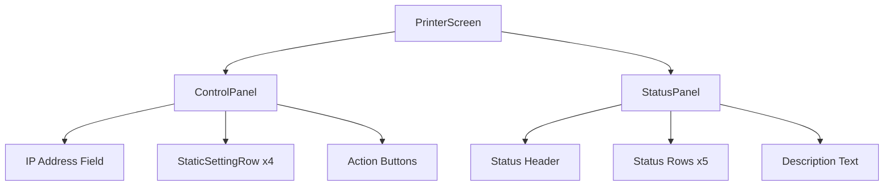
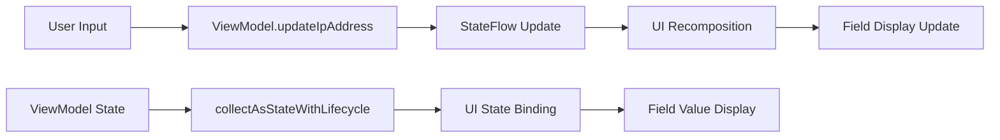
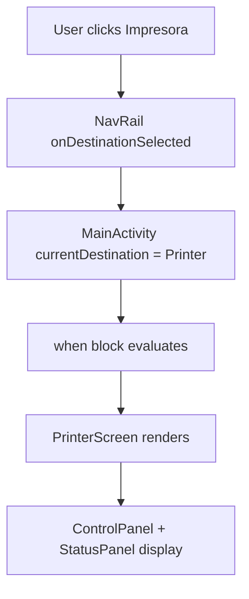

# Design Document: Printer Configuration UI

## Overview

The Printer Configuration UI feature adds a dedicated screen for configuring POS-8360 thermal printer settings within the existing PuntoDeVenta Android application. This feature integrates seamlessly with the existing navigation structure, providing users with an intuitive interface to enter printer IP addresses, view static printer specifications, and test connectivity.

The design follows Android Compose best practices with a clear separation between presentation logic (Composables) and state management (ViewModel). The implementation focuses on UI composition and navigation integration, with placeholder methods for future network communication functionality.

### Key Design Goals

- **Seamless Navigation Integration**: Leverage existing NavRail without modifications
- **Intuitive Two-Column Layout**: Clear separation between editable controls and read-only status
- **State Management**: Reactive UI updates through ViewModel and StateFlow pattern
- **Visual Consistency**: Strict adherence to established color palette and design language
- **Composable Architecture**: Modular, reusable, and testable UI components

## Architecture

### High-Level Component Structure

The printer configuration feature follows a unidirectional data flow architecture:

```
MainActivity → NavRail → PrinterScreen → PrinterConfigViewModel
                ↓              ↓               ↓
        Navigation Route → UI Components → StateFlow<PrinterConfigUiState>
```

### Navigation Flow

1. **User Action**: User clicks "Impresora" icon in NavRail
2. **Route Navigation**: MainActivity switches `currentDestination` to `NavDestination.Printer` 
3. **Screen Rendering**: `PrinterScreen` composable renders in main content area
4. **State Binding**: UI components bind to ViewModel state through `collectAsStateWithLifecycle()`

### State Management Pattern

The feature implements the recommended Android ViewModel pattern with StateFlow for reactive state management:

- **PrinterConfigViewModel**: Holds UI state and business logic methods
- **PrinterConfigUiState**: Immutable data class representing current UI state
- **StateFlow**: Provides lifecycle-aware reactive state updates to UI components

## Components and Interfaces

### Core Components

#### 1. PrinterScreen (Main Entry Point)
```kotlin
@Composable
fun PrinterScreen(
    viewModel: PrinterConfigViewModel = viewModel()
)
```

**Responsibilities:**
- Entry point for printer configuration feature
- State collection from ViewModel via `collectAsStateWithLifecycle()`
- Orchestrates ControlPanel and StatusPanel layout
- Implements two-column Row layout with equal weighting

#### 2. ControlPanel (Left Column)
```kotlin
@Composable
fun ControlPanel(
    ipAddress: String,
    onIpAddressChange: (String) -> Unit,
    onTestClick: () -> Unit,
    onSaveClick: () -> Unit,
    modifier: Modifier = Modifier
)
```

**Responsibilities:**
- Renders dark green control panel with CardBackground color
- Displays printer model header (title/subtitle)
- Provides IP address input field with validation
- Shows static printer settings in read-only format
- Provides action buttons for test and save operations

**Visual Structure:**
- Header: "IMPRESORA" title and "POS-8360 LAN" subtitle
- IP Input: OutlinedTextField with "IP local" label
- Static Rows: Puerto (9100), Papel (80mm), Corte (Automatico), Modo (ESC/POS)
- Actions: Horizontally arranged "Probar impresora" and "Guardar" buttons

#### 3. StatusPanel (Right Column)
```kotlin
@Composable 
fun StatusPanel(
    modifier: Modifier = Modifier
)
```

**Responsibilities:**
- Renders light gray status panel with static printer information
- Displays connection status header
- Shows printer specifications in tabular format
- Provides descriptive text about test functionality

**Content Structure:**
- Header: "Estado de conexion" title
- Specifications: Model, Paper, Connection, Port, Cutter details
- Description: Test functionality explanation text

#### 4. StaticSettingRow (Reusable Component)
```kotlin
@Composable
fun StaticSettingRow(
    label: String,
    value: String,
    modifier: Modifier = Modifier
)
```

**Responsibilities:**
- Reusable component for displaying label-value pairs
- Provides consistent styling for static settings display
- Uses BackgroundSecondary color with white text styling

### ViewModel Architecture

#### PrinterConfigViewModel
```kotlin
class PrinterConfigViewModel : ViewModel() {
    private val _uiState = MutableStateFlow(PrinterConfigUiState())
    val uiState: StateFlow<PrinterConfigUiState> = _uiState.asStateFlow()
    
    fun updateIpAddress(newIpAddress: String) { /* ... */ }
    fun testPrinter() { /* Placeholder for future implementation */ }
    fun saveIpAddress() { /* Placeholder for future implementation */ }
}
```

#### PrinterConfigUiState
```kotlin
data class PrinterConfigUiState(
    val ipAddress: String = "",
    val isLoading: Boolean = false,
    val errorMessage: String? = null
)
```

**State Properties:**
- `ipAddress`: Current IP address input value
- `isLoading`: Loading state for future network operations
- `errorMessage`: Error state for validation and network failures

### Interface Contracts

#### IP Address Validation
```kotlin
interface IpAddressValidator {
    fun isValid(ipAddress: String): Boolean
    fun formatError(ipAddress: String): String?
}
```

#### Printer Communication (Future Extension)
```kotlin
interface PrinterService {
    suspend fun testConnection(ipAddress: String): Result<Boolean>
    suspend fun saveConfiguration(ipAddress: String): Result<Unit>
}
```

## Data Models

### PrinterConfigUiState
```kotlin
data class PrinterConfigUiState(
    val ipAddress: String = "",
    val isLoading: Boolean = false,
    val errorMessage: String? = null,
    val connectionStatus: ConnectionStatus = ConnectionStatus.Disconnected,
    val lastTestResult: TestResult? = null
)
```

### Supporting Data Classes

#### ConnectionStatus
```kotlin
enum class ConnectionStatus {
    Connected,
    Disconnected,
    Testing,
    Error
}
```

#### TestResult
```kotlin
data class TestResult(
    val success: Boolean,
    val timestamp: Long,
    val message: String
)
```

### Static Configuration Data

The design includes hardcoded printer specifications that will be displayed in the status panel:

```kotlin
object PrinterSpecs {
    const val MODEL = "POS-8360 Termica"
    const val PAPER_SIZE = "80mm"
    const val CONNECTION_TYPE = "LAN / Socket TCP"
    const val PORT = "9100"
    const val CUTTER = "Activo al finalizar ticket"
    const val PROTOCOL = "ESC/POS"
}
```

## Correctness Properties

*A property is a characteristic or behavior that should hold true across all valid executions of a system-essentially, a formal statement about what the system should do. Properties serve as the bridge between human-readable specifications and machine-verifiable correctness guarantees.*

Based on the prework analysis, the following universal properties must hold for the printer configuration feature:

### Property 1: Bidirectional State Binding

*For any* string value, when the IP address field receives user input OR when the ViewModel state changes, the UI field display and ViewModel state must remain synchronized.

**Validates: Requirements 4.3, 4.4**

### Property 2: Input Character Filtering 

*For any* character input to the IP address field, only numeric characters (0-9) and periods (.) shall be accepted, with all other characters filtered out.

**Validates: Requirements 4.6**

### Property 3: IP Format Validation Error Display

*For any* malformed IP address string, the IP address field shall display an error state with red border color when invalid formats are entered.

**Validates: Requirements 4.7**

### Property 4: StaticDisplayRow Universal Styling

*For any* StaticDisplayRow component instance, the component shall use BackgroundSecondary background color, horizontal label-value arrangement, and consistent white text styling (bold labels at 16.sp, normal values at 16.sp).

**Validates: Requirements 5.2, 5.3, 5.4, 5.5**

### Property 5: Status Row Universal Styling  

*For any* status information row in the StatusPanel, the label text shall use ModalBodyText color with bold font weight and the value text shall use ModalBodyText color with normal font weight.

**Validates: Requirements 8.6, 8.7**

### Property 6: Text Wrapping Responsiveness

*For any* screen size or text length variation, the description text in the StatusPanel shall wrap to multiple lines appropriately without overflow.

**Validates: Requirements 9.4**

### Property 7: ViewModel State Update Consistency

*For any* string input to the updateIpAddress method, the PrinterConfigViewModel shall update the ipAddress property in uiState to exactly match the input parameter.

**Validates: Requirements 10.5**

### Property 8: Color Palette Compliance

*For any* color reference used in the Printer_Config_Screen components, the color shall be defined in Color.kt rather than hardcoded inline.

**Validates: Requirements 11.4**

<function_calls>
<invoke name="prework">
<parameter name="featureName">printer-config-ui
## Error Handling

### Input Validation Errors

**IP Address Format Validation:**
- **Invalid Characters**: Filter out non-numeric and non-period characters in real-time
- **Invalid IP Format**: Display error state with red border for malformed IP addresses
- **Empty Input**: Allow empty state without error (optional field)

**Error State Management:**
```kotlin
data class PrinterConfigUiState(
    val ipAddress: String = "",
    val ipAddressError: String? = null,
    val isLoading: Boolean = false
)
```

### Visual Error Feedback

**IP Address Field Error State:**
- **Normal State**: InputBorder color outline
- **Error State**: Color.Red outline with error message
- **Error Message**: Display below field using small text size

### Future Error Handling (Network Operations)

**Connection Errors:**
- Network timeout handling
- Invalid IP address network errors  
- Printer not found errors
- Connection refused errors

**Error Recovery:**
- Retry mechanisms for network operations
- User-friendly error messages
- Graceful fallback to offline mode

### Error Logging

All errors should be logged for debugging purposes:
```kotlin
private fun logError(operation: String, error: Throwable) {
    Log.e("PrinterConfig", "Error during $operation", error)
}
```

## Testing Strategy

The printer configuration feature requires a comprehensive testing approach combining unit tests for specific scenarios and property-based tests for universal behaviors.

### Property-Based Testing Requirements

**Library Selection:** Kotest Property Testing for Kotlin/Android
**Minimum Iterations:** 100 iterations per property test
**Test Tagging:** Each property test tagged with format: **Feature: printer-config-ui, Property {number}: {property_text}**

### Property Tests

#### Property 1: Bidirectional State Binding
```kotlin
@Test
fun `Feature: printer-config-ui, Property 1: Bidirectional State Binding` = runTest {
    checkAll(Arb.string()) { ipAddress ->
        // Test ViewModel → UI direction  
        viewModel.updateIpAddress(ipAddress)
        viewModel.uiState.value.ipAddress shouldBe ipAddress
        
        // Test UI → ViewModel direction
        composeTestRule.onNodeWithTag("ip_address_field")
            .performTextInput(ipAddress)
        viewModel.uiState.value.ipAddress shouldBe ipAddress
    }
}
```

#### Property 2: Input Character Filtering
```kotlin
@Test  
fun `Feature: printer-config-ui, Property 2: Input Character Filtering` = runTest {
    checkAll(Arb.char()) { char ->
        val isValidChar = char.isDigit() || char == '.'
        composeTestRule.onNodeWithTag("ip_address_field")
            .performTextInput(char.toString())
        
        val fieldText = composeTestRule.onNodeWithTag("ip_address_field")
            .fetchSemanticsNode().config[SemanticsProperties.EditableText]
            
        if (isValidChar) {
            fieldText shouldContain char.toString()
        } else {
            fieldText shouldNotContain char.toString()
        }
    }
}
```

#### Property 3: IP Format Validation Error Display  
```kotlin
@Test
fun `Feature: printer-config-ui, Property 3: IP Format Validation Error Display` = runTest {
    checkAll(Arb.string().filter { !isValidIpFormat(it) }) { invalidIp ->
        composeTestRule.onNodeWithTag("ip_address_field")
            .performTextInput(invalidIp)
            
        composeTestRule.onNodeWithTag("ip_address_field")
            .assertBorderColor(Color.Red)
    }
}
```

#### Property 4: StaticDisplayRow Universal Styling
```kotlin
@Test
fun `Feature: printer-config-ui, Property 4: StaticDisplayRow Universal Styling` = runTest {
    checkAll(Arb.string(), Arb.string()) { label, value ->
        composeTestRule.setContent {
            StaticSettingRow(label = label, value = value)
        }
        
        composeTestRule.onNodeWithTag("static_row")
            .assertBackgroundColor(BackgroundSecondary)
        composeTestRule.onNodeWithText(label)
            .assertTextColor(Color.White)
            .assertFontWeight(FontWeight.Bold)
        composeTestRule.onNodeWithText(value)
            .assertTextColor(Color.White)  
            .assertFontWeight(FontWeight.Normal)
    }
}
```

#### Property 5: Status Row Universal Styling
```kotlin
@Test
fun `Feature: printer-config-ui, Property 5: Status Row Universal Styling` = runTest {
    checkAll(Arb.string(), Arb.string()) { label, value ->
        composeTestRule.setContent {
            StatusInfoRow(label = label, value = value)
        }
        
        composeTestRule.onNodeWithText(label)
            .assertTextColor(ModalBodyText)
            .assertFontWeight(FontWeight.Bold)
        composeTestRule.onNodeWithText(value)
            .assertTextColor(ModalBodyText)
            .assertFontWeight(FontWeight.Normal)
    }
}
```

#### Property 6: Text Wrapping Responsiveness
```kotlin
@Test
fun `Feature: printer-config-ui, Property 6: Text Wrapping Responsiveness` = runTest {
    checkAll(Arb.int(200..800), Arb.string(50..200)) { width, text ->
        composeTestRule.setContent {
            Box(modifier = Modifier.width(width.dp)) {
                StatusPanel()
            }
        }
        
        // Verify text doesn't overflow container
        val textNode = composeTestRule.onNodeWithText(text)
        val textBounds = textNode.getBoundsInRoot()
        val containerBounds = composeTestRule.onRoot().getBoundsInRoot()
        
        textBounds.right shouldBeLessOrEqualTo containerBounds.right
    }
}
```

#### Property 7: ViewModel State Update Consistency
```kotlin
@Test
fun `Feature: printer-config-ui, Property 7: ViewModel State Update Consistency` = runTest {
    checkAll(Arb.string()) { ipAddress ->
        viewModel.updateIpAddress(ipAddress)
        viewModel.uiState.value.ipAddress shouldBe ipAddress
    }
}
```

#### Property 8: Color Palette Compliance
```kotlin
@Test  
fun `Feature: printer-config-ui, Property 8: Color Palette Compliance` = runTest {
    checkAll(/* Generate different component instances */) { component ->
        val colorReferences = extractColorReferences(component)
        colorReferences.forEach { colorRef ->
            colorRef shouldBeDefinedIn ColorKt
        }
    }
}
```

### Unit Testing Strategy

**Specific Scenarios:** Use unit tests for concrete examples, edge cases, and specific UI interactions:

- Navigation click behavior (Requirements 1.1-1.6)  
- Layout structure verification (Requirements 2.1-2.5)
- Text content and styling (Requirements 3.1-3.6, 7.1-7.3, 8.1-8.5, 9.1-9.3)
- Button behavior and styling (Requirements 6.1-6.7)
- Component structure (Requirements 12.1-12.7)
- Color usage (Requirements 11.1-11.3, 11.5)
- ViewModel structure (Requirements 10.1-10.4, 10.6-10.7)

**Example Unit Test:**
```kotlin
@Test
fun `navigation to printer route displays PrinterScreen`() {
    var currentDestination by mutableStateOf(NavDestination.Home)
    
    composeTestRule.setContent {
        when (currentDestination) {
            NavDestination.Printer -> PrinterScreen()
            else -> Text("Other Screen")
        }
    }
    
    currentDestination = NavDestination.Printer
    
    composeTestRule.onNodeWithTag("printer_screen")
        .assertExists()
}
```

### Integration Testing

**Navigation Integration:**
- Test complete navigation flow from NavRail click to screen display
- Verify NavRail state changes correctly based on current destination

**ViewModel Integration:**  
- Test ViewModel with UI components in realistic scenarios
- Verify state changes propagate correctly through the UI

### Test Configuration

**Test Dependencies:**
```kotlin
dependencies {
    testImplementation 'io.kotest:kotest-property:5.5.4'
    testImplementation 'io.kotest:kotest-runner-junit5:5.5.4'
    androidTestImplementation 'androidx.compose.ui:ui-test-junit4:1.4.3'
}
```

**Property Test Configuration:**
- Minimum 100 iterations per property test
- Timeout: 30 seconds per property test
- Reproducible with fixed seeds for debugging

### Test Coverage Goals

- **Unit Tests**: 90%+ coverage for ViewModels and business logic
- **Property Tests**: 100% coverage for universal properties identified in design  
- **Integration Tests**: Cover critical navigation and state management paths
- **UI Tests**: Cover major user interaction scenarios

This comprehensive testing strategy ensures the printer configuration feature meets all requirements while maintaining reliability across edge cases and various input scenarios.

## Implementation Notes

### Color Palette Extension

The existing `Color.kt` file must be extended with the StatusPanelBackground color:

```kotlin
// Add to Color.kt
val StatusPanelBackground = Color(0xFFE0E0E0)   // Light gray status panel surface
```

### Mermaid Diagrams

#### Component Hierarchy


#### State Flow Diagram


#### Navigation Flow  


### Development Considerations

**Performance Optimizations:**
- Use `remember` for expensive computations in Composables
- Implement `derivedStateOf` for computed state values
- Consider `LazyColumn` if static rows become dynamic in future

**Accessibility:**
- Add `contentDescription` to all interactive elements
- Ensure sufficient color contrast ratios
- Implement semantic properties for screen readers
- Test with TalkBack enabled

**Localization Readiness:**
- Extract all strings to `strings.xml` resources
- Use `stringResource()` instead of hardcoded strings
- Consider RTL layout support for text direction

**Future Extension Points:**
- Placeholder methods in ViewModel ready for network implementation
- Extensible UI state data class for additional printer properties  
- Modular component structure allows easy feature additions
- Error handling framework ready for network error scenarios

This design provides a solid foundation for implementing the printer configuration UI feature while maintaining consistency with existing app architecture and preparing for future network functionality additions.