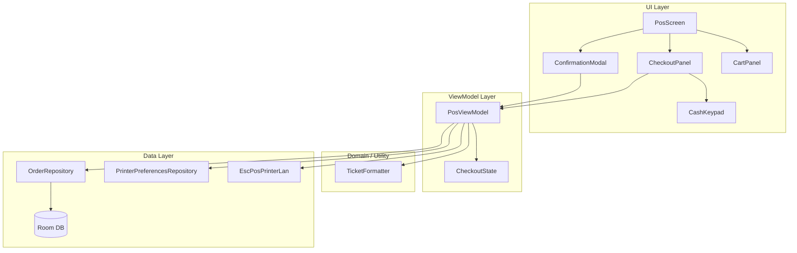
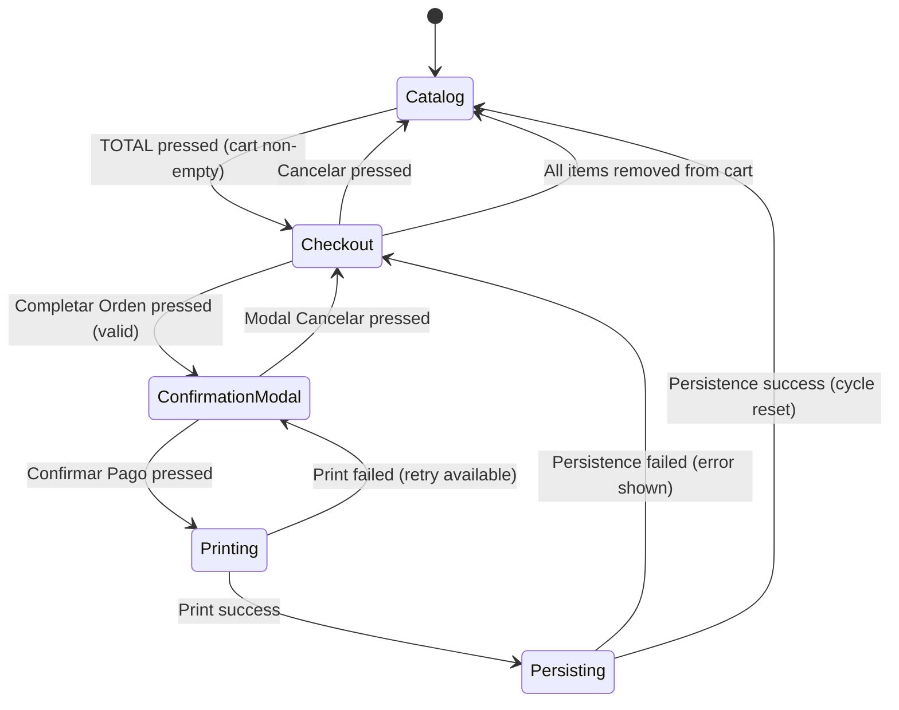

# Design Document: Checkout and Print

## Overview

This design extends the existing POS screen with a complete checkout flow. When the cashier presses the TOTAL button, the left panel (70% width) transitions from the catalog to a Checkout Panel. The checkout panel collects customer name, payment status, and cash received via denomination buttons. After validation, a confirmation modal shows the order summary. On confirmation, formatted client and internal tickets are generated, printed via thermal LAN printer (ESC/POS), the order is persisted to Room with ticket text, and the POS cycle resets for the next customer.

The design builds on the existing `PosViewModel`, `PosScreen`, `CartPanel`, `OrderRepository`, and `PrinterPreferencesRepository` components. Key additions include a `TicketFormatter` utility (pure function, no side effects), a `CheckoutState` data class, checkout-related UI composables, and printer execution logic within the ViewModel.

## Architecture



### State Machine: POS Left Panel



## Components and Interfaces

### 1. CheckoutState (Data Class)

Holds all mutable checkout data within `PosViewModel`:

```kotlin
data class CheckoutState(
    val customerName: String = "",
    val paymentStatus: PaymentStatus = PaymentStatus.PAGADO,
    val denominationCounts: Map<Int, Int> = emptyMap(), // denomination value → count
    val cashReceived: Double = 0.0,
    val printAttempts: Int = 0,
    val isPrinting: Boolean = false
)

enum class PaymentStatus(val displayText: String) {
    PAGADO("Pagado"),
    NO_PAGO("No pagó"),
    PAGA_DESPUES("Paga después")
}
```

### 2. PosUiState Extension

Add to existing `PosUiState`:

```kotlin
data class PosUiState(
    // ... existing fields ...
    val isCheckoutVisible: Boolean = false,
    val checkoutState: CheckoutState = CheckoutState(),
    val isConfirmationModalVisible: Boolean = false,
    val confirmButtonText: String = "Confirmar Pago"
)
```

### 3. PosViewModel (Extended Methods)

New public functions added to the existing `PosViewModel`:

```kotlin
// Checkout transition
fun showCheckout()           // show checkout panel, hide catalog
fun hideCheckout()           // return to catalog

// Customer name
fun updateCustomerName(name: String)  // max 40 chars, stores trimmed

// Payment status
fun selectPaymentStatus(status: PaymentStatus)

// Cash keypad
fun addDenomination(value: Int)    // add to cash received if under max
fun clearDenominations()           // reset to 0

// Order completion
fun isCompletarOrdenEnabled(): Boolean  // validation logic
fun showConfirmationModal()             // triggered by Completar Orden
fun dismissConfirmationModal()          // modal cancel
fun confirmPayment()                    // print → persist → reset

// Internal
private fun generateTickets(orderId: String, timestamp: Long): Pair<String, String>
private fun printTickets(clientTicket: String, internalTicket: String)
private fun persistOrderWithTickets(...)
private fun resetPosState()
```

### 4. TicketFormatter (Pure Utility Object)

```kotlin
object TicketFormatter {
    fun formatClientTicket(
        ticketId: String,
        dateTime: String,       // pre-formatted "dd/MM/yyyy HH:mm:ss"
        customerName: String,
        paymentStatus: String,
        items: List<TicketLineItem>,
        totalAmount: Double
    ): String

    fun formatInternalTicket(
        ticketId: String,
        dateTime: String,
        customerName: String,
        paymentStatus: String,
        items: List<TicketLineItem>
    ): String

    fun formatCurrency(amount: Double): String  // "$X.XX" with HALF_UP
    fun calculateSubtotal(total: Double): Double
    fun calculateIva(total: Double): Double
}

data class TicketLineItem(
    val quantity: Int,
    val productName: String,
    val lineTotal: Double   // only used for client ticket
)
```

### 5. CheckoutPanel (Composable)

```kotlin
@Composable
fun CheckoutPanel(
    checkoutState: CheckoutState,
    cartTotal: Double,
    isCompletarEnabled: Boolean,
    onCustomerNameChange: (String) -> Unit,
    onPaymentStatusSelected: (PaymentStatus) -> Unit,
    onDenominationPressed: (Int) -> Unit,
    onClearDenominations: () -> Unit,
    onCompletarOrden: () -> Unit,
    onCancelar: () -> Unit,
    modifier: Modifier = Modifier
)
```

### 6. CashKeypad (Composable)

```kotlin
@Composable
fun CashKeypad(
    denominationCounts: Map<Int, Int>,
    cashReceived: Double,
    onDenominationPressed: (Int) -> Unit,
    onClear: () -> Unit,
    modifier: Modifier = Modifier
)
```

### 7. ConfirmationModal (Composable)

```kotlin
@Composable
fun ConfirmationModal(
    total: Double,
    paymentStatus: PaymentStatus,
    cashReceived: Double,
    change: Double,
    buttonText: String,
    isButtonEnabled: Boolean,
    onConfirm: () -> Unit,
    onDismiss: () -> Unit
)
```

### 8. OrderEntity Extension

Add two nullable fields:

```kotlin
@Entity(tableName = "orders")
data class OrderEntity(
    @PrimaryKey val id: String,
    val timestamp: Long,
    val totalAmount: Double,
    val status: String,
    val customerName: String? = null,          // NEW — max 120 chars
    val clientTicketText: String? = null,      // NEW — max 10,000 chars
    val internalTicketText: String? = null     // NEW — max 10,000 chars
)
```

### 9. OrderDao Extension

```kotlin
@Dao
interface OrderDao {
    @Insert
    suspend fun insertOrder(order: OrderEntity)

    @Insert
    suspend fun insertOrderItems(items: List<OrderItemEntity>)

    @Insert
    suspend fun insertOrderItemCustomizations(customizations: List<OrderItemCustomizationEntity>)

    @Query("SELECT * FROM orders WHERE id = :orderId")
    suspend fun getOrderById(orderId: String): OrderEntity?
}
```

## Data Models

### CheckoutState Flow

```
User Input → PosViewModel (updates CheckoutState) → PosUiState → Composable recomposition
```

### Denomination Buttons

| Button | Value |
|--------|-------|
| $1000  | 1000  |
| $500   | 500   |
| $200   | 200   |
| $100   | 100   |
| $50    | 50    |
| $20    | 20    |
| $10    | 10    |
| $5     | 5     |
| $2     | 2     |
| $1     | 1     |

Cash received = Σ (denomination_value × count). Max: $999,999.99.

### Ticket Layout (48-char width)

**Client Ticket Structure:**
```
------------------------------------------------
              LOS TACOS
Ticket: {id}
Fecha: dd/MM/yyyy HH:mm:ss
Nombre: {customerName}
Estado: {paymentStatus}
------------------------------------------------
CANT DESCRIPCION                    IMPORTE
{qty} {name padded to 30}     {$amount right-10}
...
------------------------------------------------
                              SUBTOTAL: $XXXX.XX
                              IVA 16%:  $XXXX.XX
                              TOTAL:    $XXXX.XX
------------------------------------------------
          Gracias por su compra
           Conserve su ticket
------------------------------------------------
```

**Internal Ticket Structure:**
```
------------------------------------------------
              LOS TACOS
Ticket: {id}
Fecha: dd/MM/yyyy HH:mm:ss
Nombre: {customerName}
Estado: {paymentStatus}
------------------------------------------------
CANT DESCRIPCION
{qty} {name}
...
------------------------------------------------
Total: {count} Artículos
------------------------------------------------
          Gracias por su compra
           Conserve su ticket
------------------------------------------------
```

### Database Migration

The `AppDatabase` version will increment from 3 to 4. The migration adds three nullable columns to the `orders` table:

```sql
ALTER TABLE orders ADD COLUMN customerName TEXT DEFAULT NULL;
ALTER TABLE orders ADD COLUMN clientTicketText TEXT DEFAULT NULL;
ALTER TABLE orders ADD COLUMN internalTicketText TEXT DEFAULT NULL;
```

Since the project uses `fallbackToDestructiveMigration`, no manual migration code is required during development. For production release, a proper `Migration(3, 4)` should be provided.


## Correctness Properties

*A property is a characteristic or behavior that should hold true across all valid executions of a system — essentially, a formal statement about what the system should do. Properties serve as the bridge between human-readable specifications and machine-verifiable correctness guarantees.*

### Property 1: Ticket Text Persistence Round-Trip

*For any* valid OrderEntity with arbitrary clientTicketText (null or string up to 10,000 chars) and internalTicketText (null or string up to 10,000 chars), persisting the order via OrderRepository and then querying it by ID via OrderDao SHALL return the exact same clientTicketText and internalTicketText values.

**Validates: Requirements 1.3, 1.5, 12.1, 12.3**

### Property 2: Customer Name Normalization

*For any* input string, calling `updateCustomerName(input)` SHALL store a value that equals `input.trim().take(40)` — that is, the input is trimmed of leading/trailing whitespace and truncated to a maximum of 40 characters.

**Validates: Requirements 3.3, 3.4, 3.5**

### Property 3: Cash Received is Sum of Denominations

*For any* sequence of valid denomination presses (values from {1, 2, 5, 10, 20, 50, 100, 200, 500, 1000}), the resulting `cashReceived` SHALL equal the sum of all denomination values pressed (each value multiplied by its press count), provided the sum does not exceed $999,999.99.

**Validates: Requirements 5.2, 5.6**

### Property 4: Clear Denominations Resets to Zero

*For any* checkout state with arbitrary denomination counts and cash received, calling `clearDenominations()` SHALL result in all denomination counts being zero and cashReceived being 0.0.

**Validates: Requirements 5.5**

### Property 5: Cash Received Maximum Cap Invariant

*For any* sequence of denomination presses, the `cashReceived` value SHALL never exceed $999,999.99. If a denomination press would cause the cumulative amount to exceed this maximum, the press is ignored and the state remains unchanged.

**Validates: Requirements 5.7**

### Property 6: Completar Orden Validation Logic

*For any* combination of customerName (string), paymentStatus (PaymentStatus enum), cashReceived (double ≥ 0), and cartTotal (double > 0), the "Completar Orden" button enabled state SHALL be:
- `false` when `customerName.trim().isEmpty()`
- `false` when paymentStatus is PAGADO and cashReceived < cartTotal
- `true` when `customerName.trim().isNotEmpty()` AND (paymentStatus is not PAGADO OR cashReceived ≥ cartTotal)

**Validates: Requirements 6.1, 6.2, 6.3, 6.4**

### Property 7: Ticket Header Contains Identifying Information

*For any* valid ticket ID (non-empty string), date-time string, customer name, and payment status, both the generated Client_Ticket and Internal_Ticket SHALL contain the text "LOS TACOS", the ticket ID, the date-time, "Nombre: {customerName}", and the payment status text.

**Validates: Requirements 8.2, 8.3, 9.2, 9.3**

### Property 8: Client Ticket Item Table Formatting

*For any* list of TicketLineItems, the Client_Ticket SHALL contain each item formatted with CANT (left-aligned, 5 chars), DESCRIPCION (left-aligned, truncated to 30 chars if longer), and IMPORTE (right-aligned within 10 characters, formatted as "$X.XX").

**Validates: Requirements 8.4, 10.3**

### Property 9: SUBTOTAL + IVA = TOTAL Invariant

*For any* total amount (double ≥ 0), `calculateSubtotal(total) + calculateIva(total)` SHALL equal `total` exactly (as displayed with 2 decimal places). If rounding causes a one-cent discrepancy, SUBTOTAL is adjusted so the sum equals TOTAL.

**Validates: Requirements 8.5, 10.4, 10.5, 10.6**

### Property 10: Ticket Separator Lines Are 48 Dashes

*For any* generated Client_Ticket or Internal_Ticket, every line composed entirely of dashes SHALL be exactly 48 characters long.

**Validates: Requirements 8.7, 9.7**

### Property 11: Internal Ticket Excludes Prices

*For any* list of TicketLineItems with non-zero lineTotal values, the Internal_Ticket SHALL NOT contain any dollar-formatted price strings (matching "$X.XX" pattern) in the items section, while still including every item's quantity and product name.

**Validates: Requirements 9.4**

### Property 12: Internal Ticket Article Count

*For any* list of TicketLineItems, the Internal_Ticket SHALL contain a line "Total: {N} Artículos" where N equals the sum of all item quantities.

**Validates: Requirements 9.5**

### Property 13: TicketFormatter Determinism

*For any* set of valid inputs (ticketId, dateTime, customerName, paymentStatus, items, totalAmount), calling `formatClientTicket` with those inputs twice SHALL produce identical string output.

**Validates: Requirements 10.1**

### Property 14: Currency Formatting

*For any* double value in the range [0.0, 999999999.99], `formatCurrency(value)` SHALL produce a string matching the pattern `$X.XX` — leading dollar sign, no thousands separator, exactly two decimal places, using HALF_UP rounding when the raw value has more than two significant decimal digits.

**Validates: Requirements 10.2**

### Property 15: Cancel Checkout Preserves Cart

*For any* list of cart items, calling `hideCheckout()` SHALL leave the cart items list completely unchanged (same items, same order, same values).

**Validates: Requirements 2.5**

### Property 16: POS Cycle Reset Clears All State

*For any* non-empty cart and any checkout state, after successful order persistence, the cart SHALL be empty, customerName SHALL be "", paymentStatus SHALL be PAGADO, cashReceived SHALL be 0.0, all denomination counts SHALL be zero, and isCheckoutVisible SHALL be false.

**Validates: Requirements 13.1, 13.2, 13.3**

### Property 17: Persistence Failure Preserves State

*For any* cart items and checkout state, if the persistence transaction fails, the cart items, customer name, payment status, cash received, and denomination counts SHALL all remain exactly as they were before the failed persistence attempt.

**Validates: Requirements 13.5**

## Error Handling

| Scenario | Behavior | User Feedback |
|----------|----------|---------------|
| Empty printer IP | Skip print, show Snackbar "No se ha configurado la IP de la impresora" | Re-enable modal buttons |
| Print timeout (>15s) | Cancel print operation | Snackbar "Error de impresión: tiempo agotado", show "Reintentar" button |
| Print failure (network/device) | Catch exception | Snackbar "Error de impresión: {message}", show "Reintentar" (max 3 attempts) |
| Max print retries exceeded | Give up printing, do NOT persist order | Snackbar "No se pudo imprimir después de 3 intentos", re-enable modal with option to retry or cancel |
| Persistence transaction failure | Retain all in-memory state | Snackbar "Error al guardar la orden", user can retry |
| Customer name exceeds 40 chars | Truncate silently at input level | No visible error — input field enforces max length |
| Cash exceeds $999,999.99 | Ignore the denomination press | No visible feedback — button press is simply no-op |
| Cart emptied during checkout | Auto-transition to catalog | No Snackbar needed — visual transition is sufficient |

### Error State Flow

```kotlin
// Error is exposed via existing _error MutableStateFlow in PosViewModel
// The Snackbar in PosScreen's Scaffold observes this state (already wired)
// After showing, clearError() is called to reset

// Print-specific errors also update isPrinting and printAttempts in CheckoutState
```

## Testing Strategy

### Property-Based Tests (Kotest Property)

All property tests use **Kotest Property** (`io.kotest:kotest-property-jvm:5.9.1`) with the **Kotest JUnit5 runner**. Each test runs a minimum of **100 iterations** (configured via `PropTestConfig(iterations = 100)` or higher).

| Property | Test Class | Focus |
|----------|-----------|-------|
| P1: Persistence round-trip | `TicketPersistenceRoundTripPropertyTest` | OrderEntity with ticket text → write → read equality |
| P2: Name normalization | `CustomerNameNormalizationPropertyTest` | trim + take(40) for arbitrary strings |
| P3: Cash sum | `CashDenominationSumPropertyTest` | Sum of denomination presses matches cashReceived |
| P4: Clear resets | `ClearDenominationsPropertyTest` | Any state → clear → all zeros |
| P5: Max cap | `CashMaxCapPropertyTest` | cashReceived never exceeds $999,999.99 |
| P6: Validation logic | `CompletarOrdenValidationPropertyTest` | Enabled/disabled based on name + status + cash |
| P7: Ticket header | `TicketHeaderPropertyTest` | Both tickets contain ID, date, name, status |
| P8: Client item table | `ClientTicketItemTablePropertyTest` | Column widths, truncation, alignment |
| P9: SUBTOTAL+IVA=TOTAL | `SubtotalIvaInvariantPropertyTest` | Sum equality for any total amount |
| P10: Separator lines | `TicketSeparatorPropertyTest` | All dash lines are exactly 48 chars |
| P11: Internal excludes prices | `InternalTicketNoPricesPropertyTest` | No $ amounts in item section |
| P12: Article count | `InternalTicketArticleCountPropertyTest` | Count = sum of quantities |
| P13: Determinism | `TicketFormatterDeterminismPropertyTest` | Same inputs → same output |
| P14: Currency format | `CurrencyFormattingPropertyTest` | "$X.XX" pattern, HALF_UP rounding |
| P15: Cancel preserves cart | `CancelCheckoutPreservesCartPropertyTest` | Cart unchanged after hideCheckout |
| P16: Reset clears state | `PosCycleResetPropertyTest` | All state at defaults after success |
| P17: Failure preserves state | `PersistenceFailurePreservesStatePropertyTest` | State unchanged after failed persist |

**Tag format**: Each property test file includes a comment:
```kotlin
// Feature: 10_checkout_and_print, Property {N}: {title}
```

### Unit Tests (Example-Based)

| Area | Test Cases |
|------|-----------|
| UI State Transitions | Checkout show/hide, modal show/dismiss, auto-return on empty cart |
| Payment Status | Default is Pagado, selection updates immediately, re-select keeps current |
| Printer Flow | Empty IP error, timeout handling, retry count, success flow |
| Order Persistence | Transaction success clears cart, failure retains state |
| Edge Cases | Empty cart → no ticket, null ticket text persistence |

### Integration Tests (AndroidTest)

| Area | Test Cases |
|------|-----------|
| Room Migration | Verify new columns exist after schema update |
| OrderDao | Insert and query order with ticket text fields |
| Full Persistence | Insert order + items + customizations in single transaction |

### Test Dependencies

- `io.kotest:kotest-property-jvm:5.9.1` — property-based test generators
- `io.kotest:kotest-runner-junit5-jvm:5.9.1` — JUnit5 runner for Kotest
- `io.mockk:mockk:1.13.14` — mocking for ViewModel tests (OrderRepository, PrinterPreferencesRepository)
- `org.jetbrains.kotlinx:kotlinx-coroutines-test:1.10.2` — coroutine test support
- `app.cash.turbine:turbine` — StateFlow testing

All existing test dependencies are already declared in `build.gradle.kts`.
