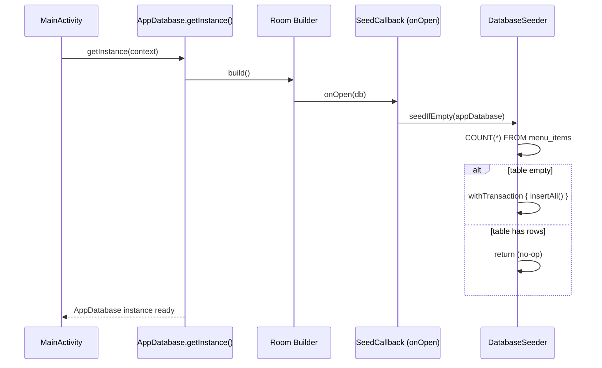

# Design Document: Database Seeding

## Overview

The Database Seeder is a self-contained component that populates the Room database with a default "Tacos" menu — including categories, products, and customization options — on first launch or after a destructive migration wipes the database. It integrates into the existing `AppDatabase` singleton via a `RoomDatabase.Callback`, ensuring seed data is available before any repository or ViewModel queries the database.

Key design goals:
- **Zero-touch setup**: POS operators see a fully usable menu on first boot.
- **Atomicity**: Partial seed failures leave the database empty, never half-populated.
- **Idempotency**: Subsequent app launches skip seeding with zero writes.
- **Determinism**: Re-seeding after a wipe produces identical UUIDs so that cached references remain valid.

## Architecture



The seeder hooks into the existing `RoomDatabase.Callback` mechanism. The current `foreignKeyCallback` already uses `onOpen`; the design introduces a new `SeedCallback` that is added **before** the foreign-key callback in the builder chain. Room invokes callbacks in registration order, so the seed runs first and the `PRAGMA foreign_keys = ON` remains active for all subsequent operations.

**Alternative considered**: Using `onCreate` instead of `onOpen`. Rejected because `fallbackToDestructiveMigration` drops and recreates tables without triggering `onCreate` on subsequent opens — only `onOpen` fires reliably after destructive migration.

## Components and Interfaces

### DatabaseSeeder

```kotlin
package com.example.puntodeventa.data.local

/**
 * Populates the database with default seed data when the menu_items table is empty.
 * All operations run on Dispatchers.IO within a single Room transaction.
 */
class DatabaseSeeder {

    /**
     * Checks if the database is empty and seeds it atomically if so.
     * Must be called from a coroutine context (suspend function).
     *
     * @param database The AppDatabase instance to seed.
     * @throws Exception Propagates any database error without partial inserts.
     */
    suspend fun seedIfEmpty(database: AppDatabase)
}
```

### SeedCallback

```kotlin
package com.example.puntodeventa.data.local

import androidx.room.RoomDatabase
import androidx.sqlite.db.SupportSQLiteDatabase
import kotlinx.coroutines.CoroutineScope
import kotlinx.coroutines.Dispatchers
import kotlinx.coroutines.launch

/**
 * RoomDatabase.Callback that triggers the DatabaseSeeder on every database open.
 * Uses a CoroutineScope tied to the application process lifetime.
 */
class SeedCallback(
    private val seeder: DatabaseSeeder,
    private val databaseProvider: () -> AppDatabase
) : RoomDatabase.Callback() {

    override fun onOpen(db: SupportSQLiteDatabase) {
        super.onOpen(db)
        CoroutineScope(Dispatchers.IO).launch {
            seeder.seedIfEmpty(databaseProvider())
        }
    }
}
```

**Design Decision — `onOpen` with blocking wait**: The `SeedCallback` must ensure seeding completes **before** the database is used by the app. Two options:

1. **`runBlocking` inside `onOpen`** — Blocks the Room internal thread pool thread until seeding finishes. Simple, guarantees ordering, but blocks a thread.
2. **Coroutine launch + suspend gate** — The `getInstance` method awaits a `CompletableDeferred` that the seeder completes. Non-blocking but adds complexity.

**Chosen approach**: Option 1 (`runBlocking(Dispatchers.IO)`) because:
- The callback fires once per cold start on a Room internal thread (never the main thread).
- Blocking a single background thread for ~10ms (inserting ~50 rows) is acceptable.
- Matches the project's manual-DI, keep-it-simple style.

### SeedData (private object)

A private `object` inside `DatabaseSeeder` that holds all entity instances as `val` properties, built at class-load time with deterministic UUIDs.

### Updated AppDatabase.getInstance()

```kotlin
fun getInstance(context: Context): AppDatabase {
    val existing = INSTANCE
    if (existing != null) return existing
    return synchronized(this) {
        val current = INSTANCE
        if (current != null) {
            current
        } else {
            val seeder = DatabaseSeeder()
            val db = Room.databaseBuilder(
                context.applicationContext,
                AppDatabase::class.java,
                "punto_de_venta_db"
            )
                .fallbackToDestructiveMigration(dropAllTables = true)
                .addCallback(SeedCallback(seeder) { INSTANCE!! })
                .addCallback(foreignKeyCallback)
                .build()
            INSTANCE = db
            db
        }
    }
}
```

## Data Models

### Deterministic UUID Generation

All seed entity IDs are generated using `UUID.nameUUIDFromBytes()` (UUID v5-like, MD5-based) with a fixed namespace string concatenated with the entity's natural key:

```kotlin
private fun deterministicId(namespace: String, name: String): String =
    UUID.nameUUIDFromBytes("$namespace:$name".toByteArray(Charsets.UTF_8)).toString()
```

| Entity Type | Namespace | Name Input | Example |
|---|---|---|---|
| MenuItemEntity | `"menu"` | `"Tacos"` | `deterministicId("menu", "Tacos")` |
| CategoryEntity | `"category"` | `"Tacos"` | `deterministicId("category", "Tacos")` |
| ProductEntity | `"product"` | `"Taco de Bistec"` | `deterministicId("product", "Taco de Bistec")` |
| CustomizationGroupEntity | `"group"` | `"Taco de Bistec:Remover"` | `deterministicId("group", "Taco de Bistec:Remover")` |
| CustomizationOptionEntity | `"option"` | `"Taco de Bistec:Remover:Sin cilantro"` | `deterministicId("option", "Taco de Bistec:Remover:Sin cilantro")` |

This guarantees:
- Same ID on every seed for the same entity.
- No collisions across entity types (different namespace prefix).
- Standard 36-character UUID format output.

### Complete Seed Dataset

#### Menu Item (1 row)
| name | emoji |
|---|---|
| Tacos | 🌮 |

#### Categories (4 rows)
| name | associatedMenuId |
|---|---|
| Tacos | → menu "Tacos" |
| Tortas | → menu "Tacos" |
| Tacos Dorados | → menu "Tacos" |
| Refrescos | → menu "Tacos" |

#### Products (12 rows)

**Category "Tacos" (4)**:
| name | basePrice | emoji | isActive |
|---|---|---|---|
| Taco de Bistec | 16.0 | 🌮 | true |
| Taco de Chorizo | 16.0 | 🌮 | true |
| Taco de Tripa | 16.0 | 🌮 | true |
| Taco de Costilla | 18.0 | 🌮 | true |

**Category "Tortas" (4)**:
| name | basePrice | emoji | isActive |
|---|---|---|---|
| Torta de Bistec | 40.0 | 🍔 | true |
| Torta de Chorizo | 40.0 | 🍔 | true |
| Torta de Tripa | 50.0 | 🍔 | true |
| Torta de Costilla | 50.0 | 🍔 | true |

**Category "Tacos Dorados" (2)**:
| name | basePrice | emoji | isActive |
|---|---|---|---|
| Taco Individual | 10.0 | 🌮 | true |
| Orden de 5 | 50.0 | 🌮 | true |

**Category "Refrescos" (2)**:
| name | basePrice | emoji | isActive |
|---|---|---|---|
| Refresco Pequeño | 18.0 | 🥤 | true |
| Refresco Grande | 23.0 | 🥤 | true |

#### Customization Groups (10 rows)

| productId → | groupName | selectionType |
|---|---|---|
| Taco de Bistec | Remover | multiple_checkboxes |
| Taco de Chorizo | Remover | multiple_checkboxes |
| Taco de Tripa | Remover | multiple_checkboxes |
| Taco de Costilla | Remover | multiple_checkboxes |
| Torta de Bistec | Remover | multiple_checkboxes |
| Torta de Chorizo | Remover | multiple_checkboxes |
| Torta de Tripa | Remover | multiple_checkboxes |
| Torta de Costilla | Remover | multiple_checkboxes |
| Taco Individual | Remover | multiple_checkboxes |
| Orden de 5 | Remover | multiple_checkboxes |

#### Customization Options (40 rows)

**Per Tacos group (3 options × 4 groups = 12)**:
- Sin cilantro (0.0)
- Sin cebolla (0.0)
- Tortilla sin grasa (0.0)

**Per Tortas group (5 options × 4 groups = 20)**:
- Cilantro (0.0)
- Cebolla (0.0)
- Crema (0.0)
- Lechuga (0.0)
- Jitomate (0.0)

**Per Tacos Dorados group (4 options × 2 groups = 8)**:
- Lechuga (0.0)
- Queso (0.0)
- Jitomate (0.0)
- Crema (0.0)

**Refrescos**: 0 groups, 0 options.

**Totals**: 1 menu + 4 categories + 12 products + 10 groups + 40 options = **67 rows**.

### Insertion Order (within transaction)

```
1. MenuItemEntity (1 row)
2. CategoryEntity (4 rows)
3. ProductEntity (12 rows)
4. CustomizationGroupEntity (10 rows)
5. CustomizationOptionEntity (40 rows)
```

This order satisfies all foreign key constraints since each child's parent is already persisted.

## Correctness Properties

*A property is a characteristic or behavior that should hold true across all valid executions of a system — essentially, a formal statement about what the system should do. Properties serve as the bridge between human-readable specifications and machine-verifiable correctness guarantees.*

### Property 1: Idempotency

*For any* database state where at least one row exists in the `menu_items` table, executing the seeder any number of additional times SHALL leave the row count and content of all five seeded tables (`menu_items`, `categories`, `products`, `customization_groups`, `customization_options`) unchanged.

**Validates: Requirements 1.2, 2.5, 14.1, 14.2**

### Property 2: Atomicity (all-or-nothing)

*For any* successful seed operation on an empty database, all five seeded tables SHALL have at least one row; conversely, if the database has zero rows in `menu_items` after a seed attempt, then all other seeded tables SHALL also have zero rows.

**Validates: Requirements 2.1, 2.4**

### Property 3: Rollback on failure

*For any* point of failure injected during the seed transaction (before commit), all five seeded tables SHALL contain zero rows after the error propagates — no partial data persists.

**Validates: Requirements 2.2**

### Property 4: Deterministic ID generation

*For any* number of independent seed executions on a freshly-created (empty) database, the set of all generated entity IDs SHALL be identical across executions.

**Validates: Requirements 3.2, 4.6, 5.7, 6.7, 7.5, 8.5**

### Property 5: UUID format invariant

*For any* entity inserted by the seeder, its primary key (`id`) field SHALL be a non-empty string of exactly 36 characters matching the pattern `[0-9a-f]{8}-[0-9a-f]{4}-[0-9a-f]{4}-[0-9a-f]{4}-[0-9a-f]{12}`.

**Validates: Requirements 13.7**

## Error Handling

| Scenario | Behavior |
|---|---|
| `menu_items` count query fails | Exception propagates to `onOpen` caller; database instance is still returned but seed did not run. App may show empty state. |
| Insert fails mid-transaction (e.g., disk full) | Room's `withTransaction` rolls back all inserts. Tables remain empty. Next `onOpen` will retry. |
| `PRAGMA foreign_keys = ON` violation | Cannot happen within the seed because insertion order guarantees parent-before-child. If code is modified incorrectly, SQLite raises `FOREIGN KEY constraint failed` and transaction rolls back. |
| Coroutine cancellation during seed | `withTransaction` is cancellation-aware — partial work is rolled back. |
| Database destroyed by `fallbackToDestructiveMigration` | Tables are recreated empty. Next `onOpen` triggers a fresh seed. |

No custom exception types are needed. The seeder uses standard Kotlin exception propagation. Logging via `android.util.Log.e` captures failures for debugging without crashing the app in release builds.

## Testing Strategy

### Unit Tests (Example-based)

These verify the exact seed data content specified in requirements 3–12:

1. **Seed data content tests** — After seeding an in-memory Room database, verify:
   - Exactly 1 menu item with name "Tacos", emoji "🌮"
   - Exactly 4 categories with correct names and FK references
   - Exactly 12 products with correct names, prices, emojis, isActive=true
   - Exactly 10 customization groups with correct groupName and selectionType
   - Exactly 40 customization options with correct names and prices
   - Zero customization groups/options for Refrescos products

2. **Error propagation test** — Verify that a corrupted database throws on the count query.

3. **FK ordering test** — Verify successful seed with `PRAGMA foreign_keys = ON` (integration).

4. **Coroutine dispatcher test** — Verify seed does not execute on Main thread.

### Property-Based Tests

Using **Kotest** property testing (`io.kotest:kotest-property`) with minimum 100 iterations per property:

| Property | Test Approach |
|---|---|
| P1: Idempotency | Generate random pre-existing menu items, run seeder, verify state unchanged. |
| P2: Atomicity | Seed empty DB, verify all tables populated; seed with injected failure, verify all empty. |
| P3: Rollback | Inject failure at random insertion step, verify all tables empty. |
| P4: Deterministic IDs | Seed N fresh in-memory databases, collect all ID sets, verify all sets equal. |
| P5: UUID format | Collect all IDs from a seeded database, verify regex match for all. |

**Configuration**:
- Library: `io.kotest:kotest-property-jvm` (already compatible with project's JVM test target)
- Iterations: 100 minimum per property
- Tag format: `Feature: 11_database_seeding, Property {N}: {title}`

### Test Environment

- Use `Room.inMemoryDatabaseBuilder()` for fast, isolated tests
- Enable `allowMainThreadQueries()` in test builds only
- Use `runTest` from `kotlinx.coroutines.test` for coroutine control
