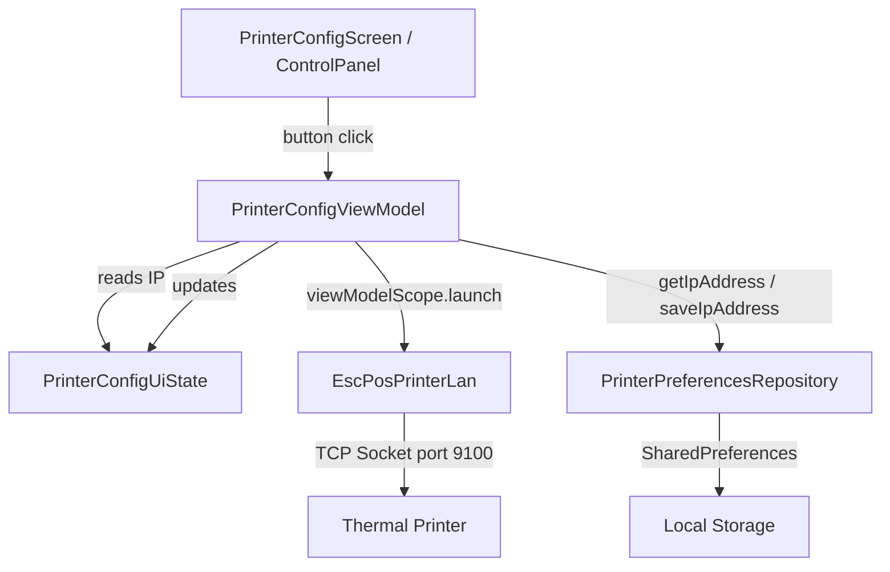

# Design Document: Real LAN Printer Connection (ESC/POS)

## Overview

This design upgrades the existing placeholder printer connection in the POS app to a fully functional LAN thermal printer integration using raw ESC/POS protocol over TCP sockets. The changes touch four existing files (AndroidManifest.xml, PrinterPreferencesRepository, EscPosPrinterLan, PrinterConfigViewModel) and modify no new classes — all functionality fits within the current MVVM architecture.

Key design decisions:
- **InetSocketAddress with explicit connect timeout** replaces the blocking `Socket(host, port)` constructor to give fast failure feedback (5s instead of system default ~2 minutes).
- **CP850 encoding** is the standard code page for ESC/POS printers supporting Western European / Spanish characters.
- **Dedicated `testConnection()` method** keeps test-print logic separate from the existing `printTicket()` method, following single-responsibility.
- **Coroutine-based ViewModel** uses `viewModelScope.launch` + `Dispatchers.IO` to keep the UI responsive.

## Architecture



**Flow:**
1. User taps "Probar impresora"
2. ControlPanel calls `viewModel.testPrinter()`
3. ViewModel sets `connectionStatus = Testing`, launches IO coroutine
4. Coroutine calls `EscPosPrinterLan.testConnection(ip)`
5. EscPosPrinterLan opens socket with 5s connect timeout, sends ESC/POS test sequence
6. On success → ViewModel updates state to Connected + TestResult(success=true)
7. On failure → ViewModel updates state to Error + errorMessage

## Components and Interfaces

### 1. AndroidManifest.xml

Add `<uses-permission android:name="android.permission.INTERNET" />` before the `<application>` tag. No runtime permission handling needed — INTERNET is a normal permission granted at install time.

### 2. PrinterPreferencesRepository (Modified)

```kotlin
fun getIpAddress(): String =
    prefs.getString(KEY_IP_ADDRESS, DEFAULT_IP) ?: DEFAULT_IP

companion object {
    private const val DEFAULT_IP = "192.168.1.248"
    // ... existing constants
}
```

**Decision:** The default IP is a compile-time constant. Users who have already saved a different IP are unaffected because `getString` returns the stored value. Only fresh installs or cleared data see the default.

### 3. EscPosPrinterLan (Modified)

```kotlin
object EscPosPrinterLan {
    private const val PORT = 9100
    private const val CONNECT_TIMEOUT_MS = 5_000
    private const val OVERALL_TIMEOUT_MS = 10_000L
    private val CHARSET = Charset.forName("Cp850")

    private val ESC_INIT = byteArrayOf(0x1B, 0x40)
    private val ESC_CUT  = byteArrayOf(0x1D, 0x56, 0x00)

    suspend fun printTicket(ipAddress: String, ticketText: String) {
        withTimeout(OVERALL_TIMEOUT_MS) {
            withContext(Dispatchers.IO) {
                val socket = Socket()
                try {
                    socket.connect(InetSocketAddress(ipAddress, PORT), CONNECT_TIMEOUT_MS)
                    socket.soTimeout = CONNECT_TIMEOUT_MS
                    val out = socket.getOutputStream()
                    out.write(ESC_INIT)
                    out.write(ticketText.toByteArray(CHARSET))
                    out.write("\n\n\n".toByteArray(CHARSET))
                    out.write(ESC_CUT)
                    out.flush()
                } finally {
                    runCatching { socket.close() }
                }
            }
        }
    }

    suspend fun testConnection(ipAddress: String) {
        withTimeout(OVERALL_TIMEOUT_MS) {
            withContext(Dispatchers.IO) {
                val socket = Socket()
                try {
                    socket.connect(InetSocketAddress(ipAddress, PORT), CONNECT_TIMEOUT_MS)
                    socket.soTimeout = CONNECT_TIMEOUT_MS
                    val out = socket.getOutputStream()
                    out.write(ESC_INIT)
                    out.write("Prueba de Conexion Exitosa".toByteArray(CHARSET))
                    out.write("\n\n\n".toByteArray(CHARSET))
                    out.write(ESC_CUT)
                    out.flush()
                } finally {
                    runCatching { socket.close() }
                }
            }
        }
    }
}
```

**Design decisions:**
- `testConnection()` is a separate method rather than reusing `printTicket()` with a fixed string, so the test sequence can evolve independently (e.g., add alignment commands, printer self-test).
- `Socket()` no-arg constructor + `socket.connect(addr, timeout)` pattern provides explicit timeout control.
- `runCatching { socket.close() }` replaces try/catch for cleanup conciseness.

### 4. PrinterConfigViewModel (Modified)

```kotlin
class PrinterConfigViewModel(
    private val prefsRepository: PrinterPreferencesRepository
) : ViewModel() {

    fun testPrinter() {
        val ip = _uiState.value.ipAddress
        _uiState.value = _uiState.value.copy(
            connectionStatus = ConnectionStatus.Testing,
            isLoading = true,
            errorMessage = null
        )

        viewModelScope.launch {
            try {
                EscPosPrinterLan.testConnection(ip)
                _uiState.value = _uiState.value.copy(
                    connectionStatus = ConnectionStatus.Connected,
                    isLoading = false,
                    lastTestResult = TestResult(
                        success = true,
                        timestamp = System.currentTimeMillis(),
                        message = "Conexión exitosa"
                    ),
                    errorMessage = null
                )
            } catch (e: SocketTimeoutException) {
                _uiState.value = _uiState.value.copy(
                    connectionStatus = ConnectionStatus.Error,
                    isLoading = false,
                    errorMessage = "La impresora no respondió en el tiempo límite (5s)"
                )
            } catch (e: Exception) {
                _uiState.value = _uiState.value.copy(
                    connectionStatus = ConnectionStatus.Error,
                    isLoading = false,
                    errorMessage = "No se pudo conectar a la impresora en $ip: ${e.localizedMessage}"
                )
            }
        }
    }
}
```

**Decision:** The ViewModel catches `SocketTimeoutException` specifically (for timeout messages) and a general `Exception` fallback (for ConnectException, IOException, UnknownHostException, etc.). This gives the user meaningful feedback without over-engineering error taxonomy.

## Data Models

No new data models are introduced. The existing models are sufficient:

| Model | Changes |
|-------|---------|
| `PrinterConfigUiState` | No changes — already has `connectionStatus`, `lastTestResult`, `errorMessage`, `isLoading` |
| `ConnectionStatus` | No changes — already has `Connected`, `Disconnected`, `Testing`, `Error` |
| `TestResult` | No changes — already has `success`, `timestamp`, `message` |

The `PrinterPreferencesRepository` only changes its default value constant — no structural change.

## Correctness Properties

*A property is a characteristic or behavior that should hold true across all valid executions of a system — essentially, a formal statement about what the system should do. Properties serve as the bridge between human-readable specifications and machine-verifiable correctness guarantees.*

### Property 1: Default IP Round-Trip

*For any* fresh PrinterPreferencesRepository (no saved IP), calling `getIpAddress()` SHALL return "192.168.1.248"; and *for any* valid IP string saved via `saveIpAddress(ip)`, a subsequent `getIpAddress()` SHALL return that same IP string unchanged.

**Validates: Requirements 2.1, 2.2**

### Property 2: Test Print State Transition Consistency

*For any* invocation of `testPrinter()`, the connectionStatus SHALL transition from its current value to Testing before the network call, and then to either Connected (on success) or Error (on failure) — never remaining in Testing after the operation completes.

**Validates: Requirements 6.3, 6.7, 6.8**

### Property 3: Error State Implies Error Message

*For any* state where `connectionStatus == Error`, the `errorMessage` field SHALL be non-null and non-empty. Conversely, *for any* state where `connectionStatus == Connected`, the `errorMessage` field SHALL be null.

**Validates: Requirements 7.1, 7.2, 7.4**

### Property 4: CP850 Encoding Round-Trip for Spanish Characters

*For any* string containing characters in the CP850 character set (including ñ, á, é, í, ó, ú, ¡, ¿), encoding with `Charset.forName("Cp850")` and decoding back with the same charset SHALL produce the original string.

**Validates: Requirements 4.1, 4.2**

### Property 5: Socket Timeout Configuration

*For any* call to `testConnection()` or `printTicket()`, the socket connect timeout SHALL be set to exactly 5000ms, and the overall coroutine timeout SHALL be set to exactly 10000ms.

**Validates: Requirements 3.2, 3.3**

## Error Handling

| Error Type | Source | ViewModel Behavior |
|-----------|--------|-------------------|
| `SocketTimeoutException` | Connect timeout (5s) exceeded | Set `errorMessage` = "La impresora no respondió en el tiempo límite (5s)", `connectionStatus` = Error |
| `ConnectException` | Printer IP unreachable / refused | Set `errorMessage` = "No se pudo conectar a la impresora en {ip}: {detail}", `connectionStatus` = Error |
| `UnknownHostException` | Invalid IP format | Set `errorMessage` = "Dirección IP inválida: {ip}", `connectionStatus` = Error |
| `IOException` | Network disruption during write | Set `errorMessage` = "Error de comunicación con la impresora: {detail}", `connectionStatus` = Error |
| `TimeoutCancellationException` | Overall 10s timeout | Caught as general Exception, same handling as ConnectException |

**Design decision:** All error states are terminal for that test attempt — the user can simply tap "Probar impresora" again. No automatic retry is implemented for the test function (unlike the checkout print flow which has retry logic).

## Testing Strategy

### Unit Tests (Example-based)

- **PrinterPreferencesRepository**: Verify default IP is "192.168.1.248" when no value saved; verify saved value is returned.
- **PrinterConfigViewModel.testPrinter()**: Use a mock/fake EscPosPrinterLan to verify state transitions (Testing → Connected on success, Testing → Error on failure).
- **EscPosPrinterLan encoding**: Verify "Prueba de Conexion Exitosa" encodes correctly in CP850.

### Property-Based Tests

- **Property 1**: Generate random IP strings, save them, verify round-trip.
- **Property 2**: Simulate success/failure outcomes, verify state machine transitions.
- **Property 3**: After any operation, verify error/success state consistency.
- **Property 4**: Generate strings from CP850 character set, verify encode/decode identity.

### Integration Tests

- **Manual**: Connect to a real thermal printer on the LAN and verify test page prints with correct characters.
- **Automated (optional)**: Mock socket server that accepts connections on port 9100 and verifies the byte sequence sent matches ESC/POS protocol.

### Property Test Configuration

- Library: Kotest Property (already in project dependencies)
- Minimum iterations: 100 per property
- Tag format: **Feature: lan-printer-connection, Property {N}: {title}**
