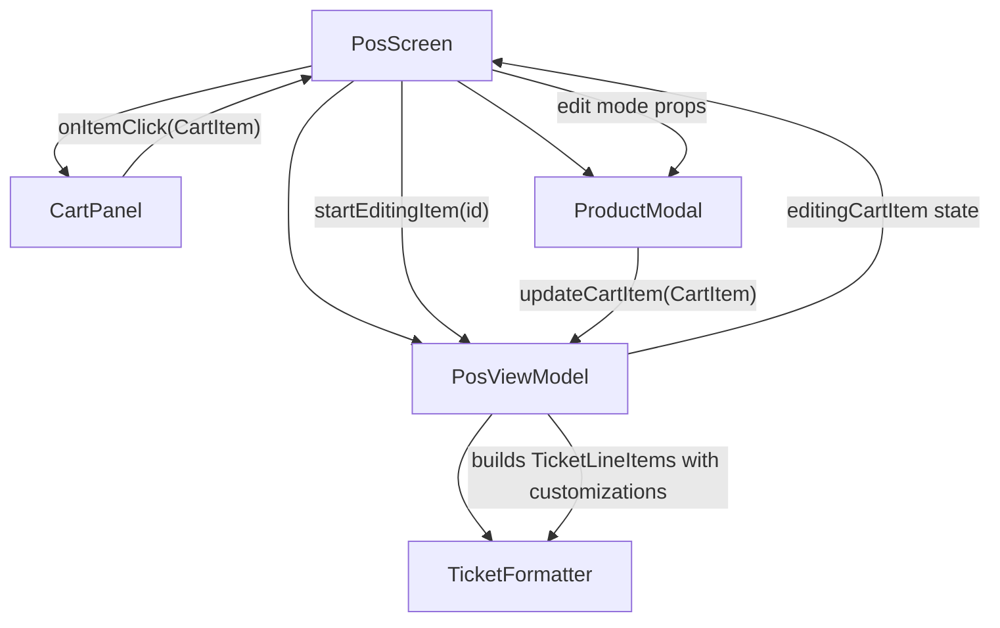

# Design Document: Cart Edit and Ticket Options

## Overview

This feature adds two capabilities to the POS system:

1. **Ticket Customization Printing** — Selected customizations (e.g., "Sin cebolla", "Extra queso") are printed on both client and internal tickets below each item, so customers can verify their order and kitchen staff can prepare it correctly.

2. **Cart Item In-Place Editing** — Cashiers can tap a cart row to reopen the ProductModal in "edit mode," pre-filled with the item's current state. On confirm, the existing cart entry is replaced (same `id`, same position) instead of creating a duplicate.

Both changes are additive to existing behavior. The TicketFormatter remains a pure utility (no side effects), and the cart editing flow reuses ProductModal with conditional logic for the edit path.

## Architecture

The changes touch four layers of the existing POS module:



**Key architectural decisions:**

1. **TicketLineItem gains a `customizations` field** — This keeps the formatter's API self-contained. The ViewModel maps CartItem customization names into this field before calling format functions.

2. **Edit state lives in PosViewModel** — `_editingCartItem: MutableStateFlow<CartItem?>` tracks which item is being edited. This is exposed to PosScreen, which conditionally passes `editingCartItem` to ProductModal.

3. **ProductModal is reused for both add and edit** — A new optional `editingCartItem: CartItem?` parameter controls initial state and button text. No second modal is needed.

4. **CartPanel receives an `onItemClick` callback** — CartItemRow becomes clickable (alongside swipe-to-delete). The click invokes the callback with the full CartItem.

## Components and Interfaces

### TicketLineItem (modified)

```kotlin
data class TicketLineItem(
    val quantity: Int,
    val productName: String,
    val lineTotal: Double,
    val customizations: List<String> = emptyList()  // NEW — option display names
)
```

### TicketFormatter (modified behavior)

Both `formatClientTicket` and `formatInternalTicket` gain customization printing logic after each item line:

```kotlin
// Inside the item loop:
for (item in items) {
    // ... existing item line ...
    for (customization in item.customizations) {
        sb.appendLine("      - $customization")
    }
}
```

The pattern `"      - {optionName}"` uses exactly 6 leading spaces + dash + space + name. No width truncation is applied to customization lines (they are informational).

### CartPanel (modified signature)

```kotlin
@Composable
fun CartPanel(
    cartItems: List<CartItem>,
    cartTotal: Double,
    onRemoveItem: (String) -> Unit,
    onItemClick: (CartItem) -> Unit,  // NEW
    onCompleteOrder: () -> Unit,
    isCartEmpty: Boolean = false,
    modifier: Modifier = Modifier
)
```

CartItemRow gains a `clickable` modifier with a semantic content description for accessibility:

```kotlin
@Composable
private fun CartItemRow(
    cartItem: CartItem,
    onRemove: () -> Unit,
    onClick: () -> Unit  // NEW
)
```

The `clickable` modifier is applied to the Row inside the SwipeToDismissBox content. The SwipeToDismissBox remains the outer wrapper, so swipe and tap do not interfere with each other.

### PosViewModel (new state and functions)

```kotlin
// New state
private val _editingCartItem = MutableStateFlow<CartItem?>(null)
val editingCartItem: StateFlow<CartItem?> = _editingCartItem

// New functions
fun startEditingItem(cartItemId: String) {
    val item = _cartItems.value.find { it.id == cartItemId }
    if (item != null) {
        _editingCartItem.value = item
        // triggers modal open in PosScreen
    }
    // else: no-op, item not found
}

fun updateCartItem(cartItem: CartItem) {
    val currentItems = _cartItems.value
    val index = currentItems.indexOfFirst { it.id == cartItem.id }
    if (index >= 0) {
        _cartItems.value = currentItems.toMutableList().apply {
            set(index, cartItem)
        }
    }
    _editingCartItem.value = null
}
```

### ProductModal (modified signature)

```kotlin
@Composable
fun ProductModal(
    product: Product,
    customizationGroups: List<CustomizationGroupEntity>,
    customizationOptions: Map<String, List<CustomizationOptionEntity>>,
    onAddToCart: (CartItem) -> Unit,
    onDismiss: () -> Unit,
    editingCartItem: CartItem? = null  // NEW — null = add mode, non-null = edit mode
)
```

**Edit mode behavior:**
- `quantity` initialized to `editingCartItem.quantity`
- `extraNotes` initialized to `editingCartItem.extraNotes`
- `checkboxSelections` pre-populated from `editingCartItem.selectedCustomizations` by `optionId`
- `radioSelections` pre-populated from `editingCartItem.selectedCustomizations` by `optionId`
- Confirm button text: `"Actualizar"` instead of `"Agregar"`
- On confirm: preserves `editingCartItem.id` instead of generating a new UUID

### PosScreen (orchestration changes)

PosScreen observes `viewModel.editingCartItem` and, when non-null, opens ProductModal in edit mode with the corresponding product loaded. On dismiss or update, it resets editing state.

## Data Models

### TicketLineItem

| Field            | Type           | Description                              | Default      |
|------------------|----------------|------------------------------------------|--------------|
| `quantity`       | `Int`          | Number of units                          | —            |
| `productName`    | `String`       | Product display name                     | —            |
| `lineTotal`      | `Double`       | Price total for the line (client only)   | —            |
| `customizations` | `List<String>` | Display names of selected customizations | `emptyList()`|

### PosUiState (additions)

| Field              | Type        | Description                                      |
|--------------------|-------------|--------------------------------------------------|
| `editingCartItem`  | `CartItem?` | Currently-edited cart item, null when not editing |

No database schema changes are required. All modifications are in-memory UI state and formatting logic.

## Correctness Properties

*A property is a characteristic or behavior that should hold true across all valid executions of a system — essentially, a formal statement about what the system should do. Properties serve as the bridge between human-readable specifications and machine-verifiable correctness guarantees.*

### Property 1: Customization lines follow the format pattern

*For any* TicketLineItem with one or more customizations, and for both `formatClientTicket` and `formatInternalTicket`, each customization line in the output SHALL match the pattern `"      - {optionName}"` (6 spaces, dash, space, name).

**Validates: Requirements 2.2, 3.2**

### Property 2: Empty customizations produce no customization lines

*For any* TicketLineItem with an empty `customizations` list, and for both `formatClientTicket` and `formatInternalTicket`, the formatted output SHALL contain no lines matching the customization line pattern `"      - "` for that item.

**Validates: Requirements 2.3, 3.3**

### Property 3: Customization order preservation in formatted output

*For any* TicketLineItem with multiple customizations, and for both `formatClientTicket` and `formatInternalTicket`, the customization lines in the output SHALL appear in the same relative order as the names in the `customizations` list.

**Validates: Requirements 2.4, 3.4, 1.3**

### Property 4: startEditingItem correctly resolves to cart item or null

*For any* cart state and any string ID, calling `startEditingItem(id)` SHALL set `editingCartItem` to the matching CartItem if the ID exists in the cart, or leave it as null if the ID does not exist.

**Validates: Requirements 5.2, 5.3**

### Property 5: updateCartItem replaces in-place preserving list order

*For any* non-empty cart and any valid update to an existing item, calling `updateCartItem` SHALL replace the item at its original index while all other items remain at their original positions unchanged.

**Validates: Requirements 6.1, 6.2**

### Property 6: Cart total equals sum of item prices after update

*For any* cart state, after calling `updateCartItem` with a modified item, the `cartTotal` SHALL equal the sum of `totalPrice` for all items in the updated cart.

**Validates: Requirements 6.3**

### Property 7: updateCartItem is a no-op for non-existent IDs

*For any* cart state and a CartItem whose `id` does not match any item in the cart, calling `updateCartItem` SHALL leave the cart list completely unchanged.

**Validates: Requirements 6.4**

### Property 8: CartItem-to-TicketLineItem mapping preserves customization names and order

*For any* CartItem with any number of selected customizations, the constructed TicketLineItem's `customizations` field SHALL contain exactly the `optionName` values from `selectedCustomizations`, in the same order.

**Validates: Requirements 8.1, 8.3**

### Property 9: Edit mode preserves CartItem identity

*For any* CartItem being edited, when the user confirms changes in edit mode, the output CartItem SHALL have the same `id` as the original item.

**Validates: Requirements 7.5**

## Error Handling

| Scenario | Behavior |
|----------|----------|
| `startEditingItem` called with non-existent ID | No-op; `editingCartItem` stays null, modal does not open |
| `updateCartItem` called with non-existent ID | No-op; cart remains unchanged |
| Product data unavailable when opening edit modal | If customization groups/options fail to load, modal opens with empty customization section (existing error snackbar pattern applies) |
| User dismisses edit modal without confirming | `editingCartItem` resets to null, cart unchanged |
| Concurrent cart modification during edit | Since the app is single-user and single-threaded (main dispatcher), this is not a concern |

## Testing Strategy

### Unit Tests (example-based)

- TicketLineItem construction with default empty customizations (Req 1.2)
- CartPanel `onItemClick` callback invocation (Req 4.1, 4.2)
- Accessibility label presence on CartItemRow (Req 4.4)
- ProductModal edit mode: pre-fill quantity, customizations, notes, button text (Req 7.1–7.4)
- PosViewModel initial `editingCartItem` is null (Req 5.1)
- Reset of `editingCartItem` after update/dismiss (Req 5.4)

### Property-Based Tests

**Library:** [Kotest Property Testing](https://kotest.io/docs/proptest/property-based-testing.html) with `kotest-property` artifact.

**Configuration:** Minimum 100 iterations per property test.

Each property test references its design property with a tag comment:
```
// Feature: 14_cart_edit_and_ticket_options, Property {N}: {title}
```

Properties to implement:
1. Customization format pattern (Properties 1, 2, 3 — formatter tests with generated TicketLineItems)
2. startEditingItem resolution (Property 4 — generated cart + random IDs)
3. updateCartItem in-place replacement (Property 5 — generated cart + modified items)
4. Cart total sum invariant (Property 6 — generated cart + updates)
5. updateCartItem no-op (Property 7 — generated cart + mismatched IDs)
6. CartItem-to-TicketLineItem mapping (Property 8 — generated CartItems)
7. Edit mode id preservation (Property 9 — generated CartItems through modal logic)

### Integration / UI Tests

- CartItemRow: swipe-to-delete and tap-to-edit coexist without interference (Req 4.3)
- Full edit flow: tap cart item → modal opens pre-filled → modify → "Actualizar" → cart updated
- Full ticket print flow: cart with customizations → confirmPayment → tickets contain customization lines

