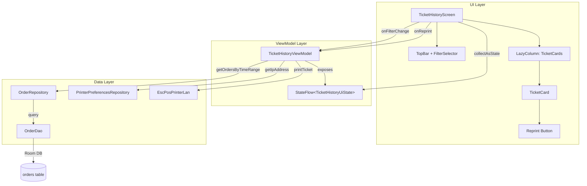
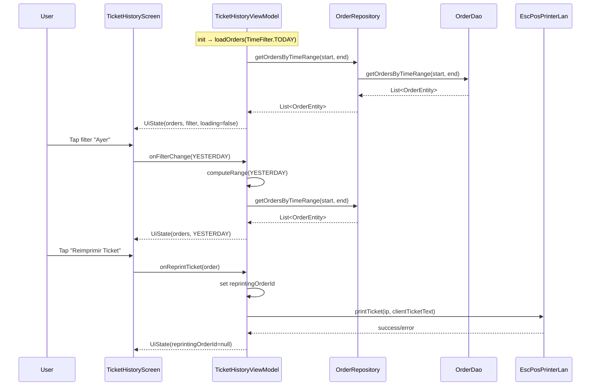

# Design Document: Ticket History Screen

## Overview

La pantalla "Historial de Tickets" reemplaza el placeholder actual de `TicketsScreen` y provee al cajero una vista completa de los tickets generados, filtrados por periodo de tiempo (Hoy, Ayer, Este mes, Todo). Cada ticket se muestra como una tarjeta estilo recibo térmico con texto monoespaciado, y permite reimprimir directamente a la impresora térmica LAN.

El diseño sigue los patrones establecidos del proyecto:
- **ViewModel + StateFlow** (mismo patrón que `StatsViewModel`)
- **Reutilización de `TimeFilter`** y `StatsViewModel.computeRange()` para cálculo de rangos
- **Room DAO** para la capa de datos
- **`EscPosPrinterLan`** para reimpresión TCP
- **`PrinterPreferencesRepository`** para obtener la IP de la impresora

## Architecture



### Data Flow



### UI Layout Structure

```
┌─────────────────────────────────────────────────────┐
│  Historial de Tickets          [Hoy|Ayer|Mes|Todo]  │  ← TopBar
├─────────────────────────────────────────────────────┤
│                                                     │
│  ┌───────────────────────────────────────────────┐  │
│  │  ┌─────────────────────────────────────────┐  │  │
│  │  │  ================================       │  │  │
│  │  │  TICKET #abc123                         │  │  │
│  │  │  Fecha: 2024-01-15 14:30               │  │  │
│  │  │  --------------------------------       │  │  │
│  │  │  1x Café Americano         $45.00      │  │  │
│  │  │  2x Pan dulce              $30.00      │  │  │
│  │  │  ================================       │  │  │
│  │  │  TOTAL:                    $75.00      │  │  │
│  │  │  ================================       │  │  │
│  │  │                                         │  │  │
│  │  │  [ Reimprimir Ticket ]                  │  │  │  ← OutlinedButton
│  │  └─────────────────────────────────────────┘  │  │
│  │                                               │  │  ← LazyColumn
│  │  ┌─────────────────────────────────────────┐  │  │
│  │  │  (next ticket card...)                  │  │  │
│  │  └─────────────────────────────────────────┘  │  │
│  └───────────────────────────────────────────────┘  │
│                                                     │
└─────────────────────────────────────────────────────┘
```

## Components and Interfaces

### 1. OrderDao (Extension)

New query method added to the existing `OrderDao`:

```kotlin
@Query("""
    SELECT * FROM orders 
    WHERE status = 'COMPLETED' 
      AND timestamp >= :start 
      AND timestamp <= :end 
    ORDER BY timestamp DESC
""")
suspend fun getOrdersByTimeRange(start: Long, end: Long): List<OrderEntity>
```

**Rationale:** The existing `getRecentOrders` has `LIMIT 20`, which is suitable for the stats dashboard but not for a full history view. The new query returns all matching orders without a limit.

### 2. OrderRepository (Extension)

New method delegating to the DAO:

```kotlin
suspend fun getOrdersByTimeRange(start: Long, end: Long): List<OrderEntity> =
    orderDao.getOrdersByTimeRange(start, end)
```

### 3. TicketHistoryUiState

```kotlin
data class TicketHistoryUiState(
    val orders: List<OrderEntity> = emptyList(),
    val selectedFilter: TimeFilter = TimeFilter.TODAY,
    val isLoading: Boolean = false,
    val errorMessage: String? = null,
    val reprintingOrderId: String? = null
)
```

- `reprintingOrderId`: Tracks which order is currently being reprinted, enabling per-card loading state.

### 4. TicketHistoryViewModel

```kotlin
class TicketHistoryViewModel(
    private val orderRepository: OrderRepository,
    private val printerPreferencesRepository: PrinterPreferencesRepository
) : ViewModel() {

    private val _uiState = MutableStateFlow(TicketHistoryUiState())
    val uiState: StateFlow<TicketHistoryUiState> = _uiState.asStateFlow()

    private var queryJob: Job? = null

    init { loadOrders(TimeFilter.TODAY) }

    fun onFilterChange(filter: TimeFilter)
    fun onReprintTicket(order: OrderEntity)

    private fun loadOrders(filter: TimeFilter)

    class Factory(
        private val orderRepository: OrderRepository,
        private val printerPreferencesRepository: PrinterPreferencesRepository
    ) : ViewModelProvider.Factory
}
```

**Key behaviors:**
- `onFilterChange`: Cancels any in-flight query, computes new range via `StatsViewModel.computeRange(filter)`, and reloads.
- `onReprintTicket`: Sets `reprintingOrderId`, calls `EscPosPrinterLan.printTicket(ip, ticketText)`, then clears the reprinting state.
- Error handling: Catches exceptions (except `CancellationException`) and sets `errorMessage`.

### 5. TicketHistoryScreen (Composable)

```kotlin
@Composable
fun TicketHistoryScreen(
    uiState: TicketHistoryUiState,
    onFilterChange: (TimeFilter) -> Unit,
    onReprintTicket: (OrderEntity) -> Unit,
    modifier: Modifier = Modifier
)
```

**Sub-composables:**
- `TicketHistoryTopBar(selectedFilter, onFilterChange)` — Title + filter pills
- `TicketCard(order, isReprinting, onReprint)` — Individual receipt-style card

### 6. MainActivity Integration

The `NavDestination.Tickets` case in `MainActivity` is updated to:

```kotlin
NavDestination.Tickets -> {
    val ticketHistoryViewModel: TicketHistoryViewModel = viewModel(
        factory = TicketHistoryViewModel.Factory(orderRepo, printerPrefsRepo)
    )
    val ticketHistoryUiState by ticketHistoryViewModel.uiState.collectAsStateWithLifecycle()
    TicketHistoryScreen(
        uiState = ticketHistoryUiState,
        onFilterChange = ticketHistoryViewModel::onFilterChange,
        onReprintTicket = ticketHistoryViewModel::onReprintTicket
    )
}
```

## Data Models

### Existing (no changes)

| Entity | Table | Key Fields |
|--------|-------|------------|
| `OrderEntity` | `orders` | id, timestamp, totalAmount, status, customerName, clientTicketText, internalTicketText |

### New UI State

| Field | Type | Description |
|-------|------|-------------|
| `orders` | `List<OrderEntity>` | Orders matching current filter |
| `selectedFilter` | `TimeFilter` | Currently active time filter |
| `isLoading` | `Boolean` | Whether a query is in progress |
| `errorMessage` | `String?` | Error message if query failed |
| `reprintingOrderId` | `String?` | ID of order currently being reprinted |

### Reused Components

| Component | Package | Usage |
|-----------|---------|-------|
| `TimeFilter` | `com.example.puntodeventa.ui.stats` | Enum for filter options |
| `StatsViewModel.computeRange()` | `com.example.puntodeventa.ui.stats` | Time range calculation |
| `EscPosPrinterLan.printTicket()` | `com.example.puntodeventa.data.printer` | TCP thermal printing |
| `PrinterPreferencesRepository.getIpAddress()` | `com.example.puntodeventa.data.repository` | Stored printer IP |

## Correctness Properties

*A property is a characteristic or behavior that should hold true across all valid executions of a system—essentially, a formal statement about what the system should do. Properties serve as the bridge between human-readable specifications and machine-verifiable correctness guarantees.*

### Property 1: DAO time range query returns only COMPLETED orders within bounds, sorted descending

*For any* set of OrderEntity records in the database and *for any* valid time range [start, end], the `getOrdersByTimeRange(start, end)` query SHALL return only those orders whose status is 'COMPLETED' AND whose timestamp is within [start, end] inclusive, AND the returned list SHALL be sorted by timestamp in descending order.

**Validates: Requirements 1.1, 1.2, 5.4**

### Property 2: Filter change triggers correct time range reload

*For any* TimeFilter value, when `onFilterChange(filter)` is called on the ViewModel, the ViewModel SHALL recompute the time range using `computeRange(filter)` and emit a new UiState containing only orders whose timestamps fall within that computed range.

**Validates: Requirements 2.2**

### Property 3: Error state propagation without crash

*For any* exception thrown by the OrderRepository during a query (excluding CancellationException), the ViewModel SHALL emit a UiState with `isLoading = false` and `errorMessage` set to the exception's message, without throwing an unhandled exception.

**Validates: Requirements 2.4**

### Property 4: Ticket card content rendering correctness

*For any* OrderEntity, if `clientTicketText` is non-null and non-blank, the TicketCard SHALL display that text verbatim; if `clientTicketText` is null or blank, the TicketCard SHALL display a placeholder message instead.

**Validates: Requirements 6.2, 6.5**

### Property 5: Reprint loading state prevents duplicate operations

*For any* reprint operation initiated on an order, the ViewModel SHALL set `reprintingOrderId` to that order's ID before invoking the print function, and SHALL clear it to null after the operation completes (success or failure), ensuring only one reprint can be active per order at a time.

**Validates: Requirements 7.4**

## Error Handling

| Scenario | Handling Strategy |
|----------|-------------------|
| Database query fails | ViewModel catches exception, sets `errorMessage` in UiState, UI displays error message |
| Printer unreachable (timeout) | `onReprintTicket` catches exception, clears `reprintingOrderId`, shows Snackbar/Toast with error |
| Printer IP not configured (empty) | Log the reprint action, don't attempt TCP connection |
| `clientTicketText` is null/empty | TicketCard shows placeholder "Sin texto de ticket disponible" |
| Coroutine cancelled (filter change during load) | `CancellationException` re-thrown (standard coroutine behavior), previous job cancelled gracefully |
| Empty order list for filter | UI shows centered empty-state message "No hay tickets para este periodo" |

## Testing Strategy

### Property-Based Tests (Kotest + Kotest-Property)

The project already uses Kotest for property-based testing. Each correctness property maps to a property-based test with minimum 100 iterations.

| Property | Test Approach | Layer |
|----------|---------------|-------|
| Property 1: DAO range query | Generate random OrderEntity lists with varied timestamps/statuses, insert into in-memory Room DB, query with random ranges, verify results | Instrumented (androidTest) |
| Property 2: Filter change reload | Mock OrderRepository, generate random TimeFilter values, call onFilterChange, verify computeRange is called and state updates | Unit (test) |
| Property 3: Error propagation | Mock OrderRepository to throw random exceptions, verify ViewModel emits error state | Unit (test) |
| Property 4: Card content rendering | Generate random OrderEntity with null/blank/non-blank clientTicketText, render TicketCard, verify content | Compose UI test |
| Property 5: Reprint loading state | Mock printer operations with random delays, invoke reprint, verify reprintingOrderId lifecycle | Unit (test) |

### Unit Tests (Example-Based)

| Test | Scenario |
|------|----------|
| ViewModel init state | Verify initial filter is TODAY, isLoading transitions correctly |
| Empty IP fallback | Verify reprint with empty IP logs action without TCP call |
| Filter UI rendering | Verify all 4 filter labels are displayed |
| Title rendering | Verify "Historial de Tickets" is displayed |
| Navigation wiring | Verify NavDestination.Tickets renders TicketHistoryScreen |

### Integration Tests

| Test | Scenario |
|------|----------|
| Full flow | Insert orders → create ViewModel → change filters → verify correct orders appear |
| Reprint integration | Mock EscPosPrinterLan → trigger reprint → verify printTicket called with correct args |

### Test Configuration

- Property tests: minimum 100 iterations per property
- Tag format: `Feature: 15_ticket_history, Property {number}: {property_text}`
- Framework: Kotest FunSpec + kotest-property for generators
- Instrumented tests: Room in-memory database for DAO property tests
