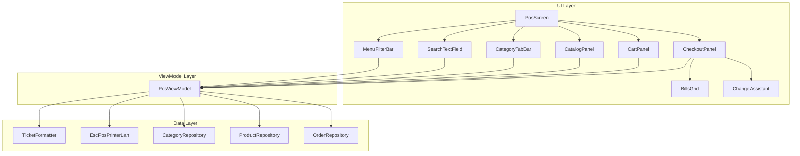
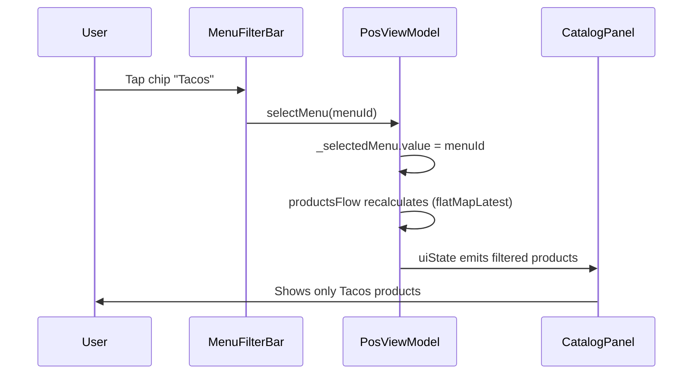

# Design Document: Sprint de Correcciones UX (16_sprint_correcciones)

## Overview

Este sprint implementa mejoras UX en tres áreas de la aplicación POS:

1. **Navegación y Filtros** — Barra de menús con chips filtrantes y barra de búsqueda por nombre de producto
2. **Divisor de Orden** — Separador visual en carrito con impresión de línea de guiones en ticket y fuente doble altura para filas de producto en ticket interno
3. **Rediseño del CheckoutPanel** — Layout completo estilo "Calculadora/Asistente" con tema claro, grilla de billetes, pago exacto, y asistente de cambio

La arquitectura se mantiene en el patrón MVVM existente con `PosViewModel` como único punto de gestión de estado, composables Jetpack Compose para UI, `TicketFormatter` como utilidad pura para formato de tickets, y `EscPosPrinterLan` para comunicación ESC/POS vía TCP.

## Architecture



### Flujo de datos para filtros



## Components and Interfaces

### 1. MenuFilterBar (New Composable)

**Ubicación:** `ui/pos/MenuFilterBar.kt`

```kotlin
@Composable
fun MenuFilterBar(
    menuItems: List<MenuItem>,
    selectedMenuId: String?,
    onMenuSelected: (String?) -> Unit,
    modifier: Modifier = Modifier
)
```

- Fila horizontal scrollable de chips (`LazyRow` o `Row` con `horizontalScroll`)
- Cada chip muestra `emoji + name` del `MenuItem`
- Chip seleccionado: fondo `NavRailIconSelected` con texto blanco
- Chip no seleccionado: fondo `CardBackground` con texto `CardText`
- Tap en chip seleccionado → `onMenuSelected(null)` (deselect)
- Tap en chip no seleccionado → `onMenuSelected(menuItem.id)`

### 2. SearchTextField (New Composable)

**Ubicación:** `ui/pos/SearchTextField.kt`

```kotlin
@Composable
fun SearchTextField(
    query: String,
    onQueryChange: (String) -> Unit,
    onClear: () -> Unit,
    modifier: Modifier = Modifier
)
```

- `OutlinedTextField` con icono de lupa como `leadingIcon`
- Trailing icon `X` visible cuando `query.isNotEmpty()`
- `maxLength = 100` caracteres
- Debounce de 300ms en el ViewModel (no en el composable)

### 3. CartItem (Modified Data Class)

**Ubicación:** `ui/pos/CartItem.kt`

```kotlin
data class CartItem(
    val id: String,
    val productId: String,
    val productName: String,
    val emoji: String,
    val basePrice: Double,
    val quantity: Int,
    val selectedCustomizations: List<SelectedCustomization>,
    val extraNotes: String,
    val totalPrice: Double,
    val isDivider: Boolean = false  // NEW FIELD
)
```

### 4. TicketLineItem (Modified Data Class)

**Ubicación:** `ui/pos/TicketFormatter.kt`

```kotlin
data class TicketLineItem(
    val quantity: Int,
    val productName: String,
    val lineTotal: Double,
    val customizations: List<String> = emptyList(),
    val extraNotes: String = "",
    val isDivider: Boolean = false  // NEW FIELD
)
```

### 5. PosViewModel (Modified)

Nuevos campos de estado:

```kotlin
private val _selectedMenu = MutableStateFlow<String?>(null)
private val _searchQuery = MutableStateFlow("")
private val _isSearchVisible = MutableStateFlow(false)
```

Nuevas funciones públicas:

```kotlin
fun selectMenu(menuId: String?)
fun toggleSearch()
fun updateSearchQuery(query: String)
fun clearSearch()
fun addDivider()
fun addCustomAmount(amount: String)
fun clearCashReceived()
```

Modificaciones a funciones existentes:
- `cartTotalFlow` → filtra `isDivider == false`
- `isCompletarOrdenEnabled()` → filtra `isDivider == false` para sum
- `confirmPayment()` → excluye dividers de `OrderItemEntity`, preserva `isDivider` en `TicketLineItem`
- `productsFlow` → incorpora filtro por `_selectedMenu` y `_searchQuery`

### 6. TicketFormatter (Modified)

Cambios en `formatClientTicket` y `formatInternalTicket`:

```kotlin
// Dentro del loop de items:
if (item.isDivider) {
    sb.appendLine("-".repeat(48))
} else {
    // formato normal de producto
}

// Article count excluye dividers:
val totalCount = items.filter { !it.isDivider }.sumOf { it.quantity }
```

### 7. EscPosPrinterLan (Modified)

Nuevo método `printDoubleTicketWithDoubleHeight`:

```kotlin
suspend fun printDoubleTicketWithDoubleHeight(
    ipAddress: String,
    clientTicketText: String,
    internalTicketText: String,
    internalItemStartLine: Int,  // línea donde empiezan los items
    internalItemEndLine: Int     // línea donde terminan los items
)
```

Alternativamente, approach más limpio — el `EscPosPrinterLan` recibe el ticket pre-segmentado:

```kotlin
suspend fun printInternalTicketWithDoubleHeight(
    ipAddress: String,
    headerText: String,      // antes de items (incluye columnas header + separator)
    itemsText: String,       // filas de producto (se imprime en double height)
    footerText: String       // "Total: N Artículos" + footer
)
```

**Decisión de diseño:** Se adopta el enfoque de segmentar el texto del ticket interno en 3 partes (header, items, footer) para que `EscPosPrinterLan` envíe los comandos ESC/POS de cambio de tamaño en los puntos correctos sin parsear el texto.

### 8. CheckoutPanel (Redesigned Composable)

**Ubicación:** `ui/pos/CheckoutPanel.kt` (rewrite completo)

```kotlin
@Composable
fun CheckoutPanel(
    checkoutState: CheckoutState,
    cartTotal: Double,
    isCompletarEnabled: Boolean,
    onCustomerNameChange: (String) -> Unit,
    onPaymentStatusSelected: (PaymentStatus) -> Unit,
    onDenominationPressed: (Int) -> Unit,
    onClearCashReceived: () -> Unit,
    onAddCustomAmount: (String) -> Unit,
    onCompletarOrden: () -> Unit,
    onCancelar: () -> Unit,
    modifier: Modifier = Modifier
)
```

Sub-composables internos:
- `PaymentStatusPills` — 3 botones pill con fully rounded corners
- `TotalDisplay` — label "Total a cobrar" + monto bold 32.sp
- `BillsGrid` — grilla de denominaciones con badges
- `ExactPaymentInput` — campo "Pago impar/exacto" + botón "Agregar" + "Limpiar"
- `ChangeAssistant` — panel 3 columnas + alert box

### 9. CheckoutState (Modified)

```kotlin
data class CheckoutState(
    val customerName: String = "",
    val paymentStatus: PaymentStatus = PaymentStatus.PAGADO,
    val denominationCounts: Map<Int, Int> = emptyMap(),
    val cashReceived: Double = 0.0,
    val customAmounts: List<Double> = emptyList(),  // NEW: para tracking
    val printAttempts: Int = 0,
    val isPrinting: Boolean = false
)
```

## Data Models

### CartItem con isDivider

| Campo | Tipo | Valor normal | Valor divider |
|-------|------|-------------|---------------|
| id | String | UUID | UUID |
| productId | String | product ID | "" |
| productName | String | nombre producto | "--- DIVISOR ---" |
| emoji | String | emoji | "" |
| basePrice | Double | ≥ 0.0 | 0.00 |
| quantity | Int | 1..99 | 1 |
| selectedCustomizations | List | customizations | emptyList() |
| extraNotes | String | notas | "" |
| totalPrice | Double | calculado | 0.00 |
| isDivider | Boolean | false | true |

### TicketLineItem con isDivider

| Campo | Tipo | Valor normal | Valor divider |
|-------|------|-------------|---------------|
| quantity | Int | ≥ 1 | 0 |
| productName | String | nombre | "--- DIVISOR ---" |
| lineTotal | Double | ≥ 0.0 | 0.00 |
| customizations | List | opciones | emptyList() |
| extraNotes | String | notas | "" |
| isDivider | Boolean | false | true |

### Denominaciones del Bills_Grid

| Tipo | Valores | Color fondo |
|------|---------|-------------|
| Billetes | $1000, $500, $200, $100, $50, $20 | CardBackground |
| Monedas | $10, $5, $2, $1 | Lighter green (new token) |

### InternalTicketSegments (New)

```kotlin
data class InternalTicketSegments(
    val header: String,    // Desde "LOS TACOS" hasta el separator después de columnas
    val items: String,     // Filas de producto (con customizations y notas)
    val footer: String     // "Total: N Artículos" + footer lines
)
```

### Nuevos Color Tokens

```kotlin
// Checkout Panel - Light Theme
val CheckoutBackground     = Color(0xFFFFFFFF)  // Panel background
val CheckoutSectionBg      = Color(0xFFF5F5F5)  // Section backgrounds
val CheckoutChangePanel    = Color(0xFFEEEEEE)  // Change assistant panel
val CheckoutAlertBg        = Color(0xFFFFF3E0)  // Soft yellow/orange alert
val CoinButtonBg           = Color(0xFFA5D6A7)  // Lighter green for coins
```

## Correctness Properties

*A property is a characteristic or behavior that should hold true across all valid executions of a system — essentially, a formal statement about what the system should do. Properties serve as the bridge between human-readable specifications and machine-verifiable correctness guarantees.*

### Property 1: Menu filter shows only matching products

*For any* set of products, categories, and menus, when a menu is selected, all products displayed in the CatalogPanel SHALL have a category whose `associatedMenuId` matches the selected `MenuItem.id`, and no product with a non-matching `associatedMenuId` SHALL appear.

**Validates: Requirements 1.2**

### Property 2: Menu filter toggle restores unfiltered state

*For any* menu selection, selecting a menu chip and then pressing it again (deselecting) SHALL result in the product list being identical to the state before the menu was first selected (given no other state changes).

**Validates: Requirements 1.4**

### Property 3: Menu and Category intersection filter

*For any* combination of an active menu filter and a selected category, the displayed products SHALL be exactly those products whose category has `associatedMenuId` matching the selected menu AND whose `categoryId` matches the selected category.

**Validates: Requirements 1.5**

### Property 4: Search filter by name (case-insensitive)

*For any* non-empty search query string and any set of products, the filtered results SHALL contain only products whose `name` contains the query as a case-insensitive substring, and every product whose name contains the query SHALL be included.

**Validates: Requirements 2.2**

### Property 5: Search clear restores state respecting active filters

*For any* state with an active search query and optional menu/category filters, clearing the search query SHALL restore the product list to exactly what the active menu and category filters alone would produce.

**Validates: Requirements 2.3**

### Property 6: Cart total excludes divider items

*For any* list of CartItems containing a mix of regular items and divider items, the computed cart total SHALL equal the sum of `totalPrice` of only those items where `isDivider == false`.

**Validates: Requirements 3.3, 12.5**

### Property 7: Divider addition produces correct fixed values

*For any* existing cart state, adding a divider SHALL append exactly one CartItem with `isDivider = true`, `productName = "--- DIVISOR ---"`, `productId = ""`, `emoji = ""`, `basePrice = 0.00`, `totalPrice = 0.00`, `quantity = 1`, `selectedCustomizations = emptyList()`, and `extraNotes = ""`.

**Validates: Requirements 3.1, 12.2**

### Property 8: Order persistence excludes divider items

*For any* cart containing divider items, when `completeOrder`/`confirmPayment` is called, the list of `OrderItemEntity` persisted to the database SHALL NOT contain any entry corresponding to a CartItem where `isDivider == true`.

**Validates: Requirements 3.4**

### Property 9: TicketFormatter renders dividers as 48-dash lines and excludes from totals

*For any* list of TicketLineItems containing items with `isDivider = true`, the formatted ticket output SHALL contain a line of exactly 48 dash characters (`-`) at the position of each divider item, SHALL NOT include quantity/name/price/customizations/notes for that item, and SHALL exclude divider items from article count and financial total calculations.

**Validates: Requirements 4.1, 4.2, 4.3, 12.6**

### Property 10: Divider position preserved in ticket output

*For any* ordered list of TicketLineItems (regular and divider), the relative order of all items in the formatted output SHALL match the relative order of the input list.

**Validates: Requirements 4.4**

### Property 11: Ticket line width is exactly 48 characters

*For any* product item with any valid `productName` (1-30 chars) and any valid `quantity` (1-99) and any valid `lineTotal`, the formatted line SHALL be exactly 48 characters wide (CANT 5 + DESCRIPCION 30 + IMPORTE 13).

**Validates: Requirements 5.3**

### Property 12: Denomination tap updates count and cashReceived consistently

*For any* sequence of denomination button taps, the `denominationCounts[value]` SHALL equal the number of times that denomination was tapped, and `cashReceived` SHALL equal the sum of all `(denomination_value × tap_count)` across all denominations.

**Validates: Requirements 8.3, 8.6**

### Property 13: Valid custom amount adds to cashReceived

*For any* valid positive numeric string input, pressing "Agregar" SHALL increase `cashReceived` by exactly that parsed amount (rounded to 2 decimal places).

**Validates: Requirements 9.2**

### Property 14: Invalid custom amount is ignored

*For any* input string that is empty, non-numeric, zero, or negative, pressing "Agregar" SHALL leave `cashReceived` unchanged.

**Validates: Requirements 9.3**

### Property 15: Limpiar resets all cash state to zero

*For any* CheckoutState with non-zero `denominationCounts` or `cashReceived`, pressing "Limpiar" SHALL result in `denominationCounts` being empty and `cashReceived` being `0.0`.

**Validates: Requirements 9.4**

### Property 16: Change assistant calculation

*For any* pair of non-negative values `(cartTotal, cashReceived)`:
- If `cashReceived >= cartTotal`: change = `(cashReceived - cartTotal)` rounded HALF_UP to 2 decimal places
- If `cashReceived == cartTotal`: display text is "Pago exacto"
- If `cashReceived > cartTotal`: display text is "Dar $XX.XX de cambio exacto"
- If `cashReceived < cartTotal`: change displays "$0.00" and text is "Falta $XX.XX" where XX.XX = `(cartTotal - cashReceived)` rounded HALF_UP to 2dp

**Validates: Requirements 10.2, 10.3, 10.4, 10.5**

### Property 17: Completar Orden button enablement logic

*For any* CheckoutState:
- If `customerName.trim().isEmpty()` → button is disabled (regardless of other state)
- If `paymentStatus == PAGADO` AND `cashReceived < cartTotal` → button is disabled
- If `paymentStatus ∈ {NO_PAGO, PAGA_DESPUES}` AND `customerName.trim().isNotEmpty()` → button is enabled (regardless of cashReceived)
- If `paymentStatus == PAGADO` AND `cashReceived >= cartTotal` AND `customerName.trim().isNotEmpty()` → button is enabled

**Validates: Requirements 11.2, 11.3, 11.4**

### Property 18: CartItem-to-TicketLineItem preserves isDivider

*For any* list of CartItems, the converted TicketLineItem list SHALL have `isDivider` values matching the source CartItems at the same indices.

**Validates: Requirements 12.4**

## Error Handling

| Escenario | Manejo |
|-----------|--------|
| MenuItem list vacío | MenuFilterBar no se renderiza (Row vacía) |
| Search query > 100 chars | Input truncado a 100 chars en el composable |
| Denominación excede $999,999.99 | `addDenomination` ignora el tap (guard existente) |
| Custom amount parse failure | `toDoubleOrNull()` retorna null → no-op |
| Printer connection failure | Retry logic existente (max 3 intentos) con snackbar de error |
| Empty cart with dividers only | Botón "Completar Orden" evalúa cart no-divider como vacío → disabled o mostrará total $0.00 |
| Category no pertenece a menu seleccionado | Auto-reset de `_selectedCategory` a null |
| Products flow emite lista vacía | Grid muestra área vacía sin indicador de error |

## Testing Strategy

### Property-Based Testing

**Librería:** [Kotest Property Testing](https://kotest.io/docs/proptest/property-based-testing.html) — `io.kotest:kotest-property`

**Configuración:** Mínimo 100 iteraciones por property test.

**Tag format:** `Feature: 16_sprint_correcciones, Property {N}: {title}`

Cada property del documento de Correctness Properties se implementará como un único test de property-based testing con generadores aleatorios para:
- Listas de `CartItem` con mezcla de regulares y dividers
- Listas de `TicketLineItem` con dividers intercalados
- Secuencias de taps de denominación
- Strings de búsqueda (incluyendo Unicode, whitespace, caracteres especiales)
- Valores de `cashReceived` y `cartTotal` (Double no-negativo)
- Combinaciones de `PaymentStatus` + `customerName` + `cashReceived`

### Unit Tests (Example-Based)

- UI rendering: Compose UI tests para verificar layout, colores, y visibilidad de componentes
- Default states: CheckoutState defaults, CartItem isDivider default
- ESC/POS commands: Verificar byte sequences correctos para Double Height on/off
- Edge cases: Cart vacío con dividers, search sin resultados, pago exacto

### Integration Tests

- ESC/POS Double Height: Verificar que `printInternalTicketWithDoubleHeight` envía los bytes correctos en el orden correcto (header normal → ESC!0x10 → items → ESC!0x00 → footer)
- Flujo completo: Menu filter → category → search → agregar al carrito → checkout → print
- Room persistence: Verificar que dividers no se persisten como OrderItemEntity

### Test File Locations

```
app/src/test/java/com/example/puntodeventa/
├── ui/pos/
│   ├── TicketFormatterDividerPropertyTest.kt   (Props 9, 10, 11)
│   ├── CartTotalPropertyTest.kt                (Props 6, 7, 8)
│   ├── FilterLogicPropertyTest.kt             (Props 1, 2, 3, 4, 5)
│   ├── CheckoutLogicPropertyTest.kt           (Props 12-17)
│   └── CartItemConversionPropertyTest.kt      (Prop 18)
```
