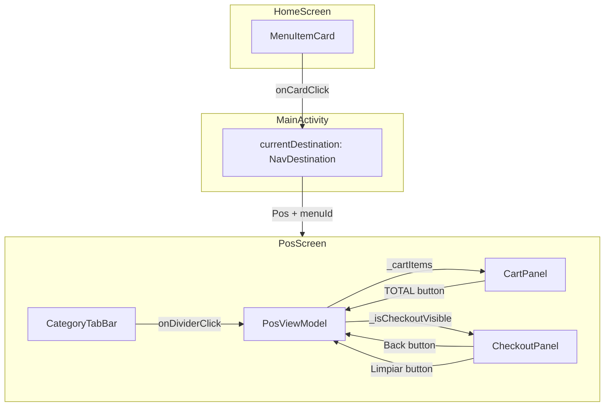
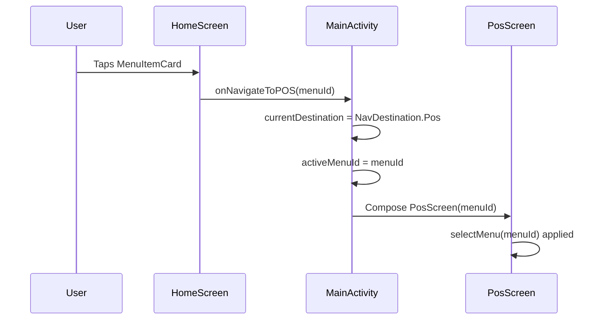

# Design Document: UX Polish Sprint

## Overview

This design covers six UX/UI polish improvements for the PuntoDeVenta Android application. The changes span navigation enhancements, cart logic improvements, checkout panel cleanup, and visual affordances — all targeting faster, less error-prone cashier workflows.

The architecture follows the existing pattern: `ViewModel` holds business logic and state, Composables observe `StateFlow` via `collectAsStateWithLifecycle()`, and navigation is managed by a hoisted `currentDestination` state in `MainActivity`.

### Key Design Decisions

1. **Navigation via callback hoisting** — Rather than introducing a Jetpack Navigation library, we continue the project's existing approach of hoisting `currentDestination` as mutable state in `MainActivity` and passing a navigation callback down to `HomeScreen`.
2. **Smart toggle as pure state function** — The scissors logic is expressed as a deterministic state transformation on `_cartItems`, keeping it testable without UI dependencies.
3. **Selective reset for Limpiar** — The `clearCashReceived()` function targets only cash-related fields in `CheckoutState`, preserving customer identity and workflow state.
4. **Back button outside scroll container** — Placing the back `IconButton` before the `verticalScroll` column guarantees it never scrolls out of view.

## Architecture



### Navigation Flow (Requirement 1)



## Components and Interfaces

### Modified Components

| Component | File | Changes |
|-----------|------|---------|
| `HomeScreen` | `ui/home/HomeScreen.kt` | Accept `onNavigateToPOS: (String) -> Unit` callback; wire `MenuItemCard` click to it |
| `MenuItemCard` | `ui/home/MenuItemCard.kt` | Accept `onClick: () -> Unit`; wrap Card in `clickable` with ripple |
| `MainActivity` | `MainActivity.kt` | Pass `onNavigateToPOS` lambda that sets `currentDestination = NavDestination.Pos` and updates `activeMenuId` |
| `PosViewModel` | `ui/pos/PosViewModel.kt` | New `toggleDivider()` function (smart scissors); modify `clearCashReceived()` to preserve non-cash fields |
| `CheckoutPanel` | `ui/pos/CheckoutPanel.kt` | Remove `onAddCustomAmount` param; add back arrow `IconButton` before scroll; standalone Limpiar button; glow modifier on Completar button |
| `CartPanel` | `ui/pos/CartPanel.kt` | Add `isCompletarEnabled` param; apply glow modifier on TOTAL button |
| `CategoryTabBar` | `ui/pos/CategoryTabBar.kt` | Wire `onDividerClick` to new `toggleDivider()` instead of `addDivider()` |

### Deleted Components

| Component | File | Reason |
|-----------|------|--------|
| `ExactPaymentInput` | `ui/pos/ExactPaymentInput.kt` | Dead code; functionality unused after denomination grid was added |

### New Utility

| Component | File | Purpose |
|-----------|------|---------|
| `GlowModifier` | `ui/pos/PosHelpers.kt` (extension) | `Modifier.glowWhenEnabled(enabled: Boolean)` applying alpha + elevation based on state |

## Data Models

### Existing (no changes needed)

```kotlin
// CheckoutState.kt — unchanged structure
data class CheckoutState(
    val customerName: String = "",
    val paymentStatus: PaymentStatus = PaymentStatus.PAGADO,
    val denominationCounts: Map<Int, Int> = emptyMap(),
    val cashReceived: Double = 0.0,
    val customAmounts: List<Double> = emptyList(),
    val printAttempts: Int = 0,
    val isPrinting: Boolean = false
)
```

### Modified Function Signatures

```kotlin
// PosViewModel — new function
fun toggleDivider() {
    val items = _cartItems.value
    // Case 1: Editing a divider → remove it
    val editing = _editingCartItem.value
    if (editing != null && editing.isDivider) {
        _cartItems.value = items.filter { it.id != editing.id }
        _editingCartItem.value = null
        return
    }
    // Case 2: Empty cart → no-op
    if (items.isEmpty()) return
    // Case 3: Last item is divider → remove it (toggle off)
    if (items.last().isDivider) {
        _cartItems.value = items.dropLast(1)
        return
    }
    // Case 4: Last item is NOT divider → append divider
    _cartItems.value = items + CartItem(
        id = UUID.randomUUID().toString(),
        productId = "",
        productName = "--- DIVISOR ---",
        emoji = "",
        basePrice = 0.00,
        quantity = 1,
        selectedCustomizations = emptyList(),
        extraNotes = "",
        totalPrice = 0.00,
        isDivider = true
    )
}

// PosViewModel — modified clearCashReceived (selective reset)
fun clearCashReceived() {
    _checkoutState.value = _checkoutState.value.copy(
        denominationCounts = emptyMap(),
        customAmounts = emptyList(),
        cashReceived = 0.0
        // customerName, paymentStatus, printAttempts, isPrinting NOT touched
    )
}

// CheckoutPanel — updated signature (onAddCustomAmount removed, onBack added)
@Composable
fun CheckoutPanel(
    checkoutState: CheckoutState,
    cartTotal: Double,
    isCompletarEnabled: Boolean,
    onCustomerNameChange: (String) -> Unit,
    onPaymentStatusSelected: (PaymentStatus) -> Unit,
    onDenominationPressed: (Int) -> Unit,
    onClearCashReceived: () -> Unit,
    onCompletarOrden: () -> Unit,
    onCancelar: () -> Unit,
    onBack: () -> Unit,             // NEW
    modifier: Modifier = Modifier
)
```

### Glow Modifier Extension

```kotlin
// In PosHelpers.kt
fun Modifier.glowWhenEnabled(enabled: Boolean): Modifier = this
    .alpha(if (enabled) 1f else 0.38f)
    .then(
        if (enabled) Modifier.shadow(elevation = 6.dp, shape = RoundedCornerShape(50))
        else Modifier
    )
```

## Correctness Properties

*A property is a characteristic or behavior that should hold true across all valid executions of a system — essentially, a formal statement about what the system should do. Properties serve as the bridge between human-readable specifications and machine-verifiable correctness guarantees.*

### Property 1: Scissors toggle appends or removes last divider

*For any* non-empty cart where the last item is not a divider, calling `toggleDivider()` SHALL produce a cart whose last item is a divider and whose length is original length + 1. Conversely, *for any* non-empty cart where the last item IS a divider, calling `toggleDivider()` SHALL produce a cart whose length is original length − 1 and whose new last item (if any) is not a divider.

**Validates: Requirements 2.1, 2.2**

### Property 2: No consecutive dividers invariant

*For any* cart state, after calling `toggleDivider()`, the resulting cart SHALL never contain two consecutive items where `isDivider == true`.

**Validates: Requirements 2.5**

### Property 3: Scissors preserves non-divider items

*For any* cart state where `toggleDivider()` removes a divider (last item was divider, or editing a divider), the ordered subsequence of non-divider items in the resulting cart SHALL be identical to the ordered subsequence of non-divider items in the original cart.

**Validates: Requirements 2.6**

### Property 4: Scissors removes editing divider at any position

*For any* cart containing at least one divider, if that divider is set as the editing item, calling `toggleDivider()` SHALL remove exactly that divider (by id) from the cart, regardless of its position index.

**Validates: Requirements 2.4**

### Property 5: ClearCashReceived resets all cash-related fields

*For any* `CheckoutState` with arbitrary `cashReceived`, `denominationCounts`, and `customAmounts` values, calling `clearCashReceived()` SHALL produce a state where `cashReceived == 0.0`, `denominationCounts` is empty, and `customAmounts` is empty.

**Validates: Requirements 4.1, 4.2, 4.3**

### Property 6: ClearCashReceived preserves non-cash fields

*For any* `CheckoutState` with arbitrary `customerName`, `paymentStatus`, `printAttempts`, and `isPrinting` values, calling `clearCashReceived()` SHALL produce a state where all four of those fields are identical to their values before the call.

**Validates: Requirements 4.4, 4.5**

## Error Handling

| Scenario | Handling |
|----------|----------|
| `onNavigateToPOS` called with empty/invalid menuId | POS loads with empty product list (existing behavior — categories filter returns nothing) |
| Scissors pressed on empty cart | No-op — function returns immediately |
| Scissors pressed with no editing item and cart has only dividers | Removes last divider (toggle behavior applies normally) |
| Back button pressed while print is in progress | `hideCheckout()` respects `isPrinting` — checkout panel can be re-shown; print coroutine continues unaffected |
| `glowWhenEnabled` with rapidly toggling state | Compose recomposition handles this; no animation (instant snap) to avoid jitter on fast state changes |

## Testing Strategy

### Unit Tests (Example-Based)

| Test | Requirement |
|------|-------------|
| Tapping MenuItemCard navigates to POS with correct menuId | 1.1, 1.2 |
| Empty Home Screen shows only AddMenuCard | 1.4 |
| Re-tapping same menu card is idempotent | 1.5 |
| Scissors on empty cart is no-op | 2.3 |
| ExactPaymentInput not rendered in CheckoutPanel | 3.1 |
| Limpiar button positioned between BillsGrid and ChangeAssistant | 3.3 |
| Back button visible without scrolling | 5.1, 5.5 |
| Back button hides checkout and preserves cart | 5.2, 5.3, 5.4 |
| Enabled button has alpha 1.0 and elevation ≥ 6dp | 6.1, 6.3 |
| Disabled button has alpha 0.38 and elevation 0dp | 6.2, 6.4 |
| Glow uses Color.kt values (no hardcoded literals) | 6.5 |
| State change triggers visual update without interaction | 6.6 |

### Property-Based Tests

Property-based testing is applicable here because Requirements 2 and 4 involve pure state transformations on in-memory data structures (`List<CartItem>` and `CheckoutState`) where behavior varies meaningfully with input and universal invariants should hold.

**Library:** [Kotest Property Testing](https://kotest.io/docs/proptest/property-based-testing.html) (`io.kotest:kotest-property`)

**Configuration:**
- Minimum 100 iterations per property
- Each test tagged with: `Feature: 17_ux_polish_sprint, Property {N}: {title}`

| Property Test | Validates |
|---------------|-----------|
| Property 1: Scissors toggle appends or removes | Req 2.1, 2.2 |
| Property 2: No consecutive dividers invariant | Req 2.5 |
| Property 3: Scissors preserves non-divider items | Req 2.6 |
| Property 4: Scissors removes editing divider at any position | Req 2.4 |
| Property 5: ClearCashReceived resets cash fields | Req 4.1, 4.2, 4.3 |
| Property 6: ClearCashReceived preserves non-cash fields | Req 4.4, 4.5 |

### Generators Needed

```kotlin
// CartItem generator (non-divider)
fun Arb.Companion.cartItem(): Arb<CartItem> = arbitrary {
    CartItem(
        id = Arb.uuid().bind().toString(),
        productId = Arb.string(1..10).bind(),
        productName = Arb.string(1..30).bind(),
        emoji = "🍕",
        basePrice = Arb.double(0.01..999.0).bind(),
        quantity = Arb.int(1..20).bind(),
        selectedCustomizations = emptyList(),
        extraNotes = "",
        totalPrice = Arb.double(0.01..9999.0).bind(),
        isDivider = false
    )
}

// Divider item generator
fun Arb.Companion.dividerItem(): Arb<CartItem> = arbitrary {
    CartItem(
        id = Arb.uuid().bind().toString(),
        productId = "",
        productName = "--- DIVISOR ---",
        emoji = "",
        basePrice = 0.0,
        quantity = 1,
        selectedCustomizations = emptyList(),
        extraNotes = "",
        totalPrice = 0.0,
        isDivider = true
    )
}

// Cart generator (mixed items, no consecutive dividers as precondition)
fun Arb.Companion.validCart(minSize: Int = 1): Arb<List<CartItem>>

// CheckoutState generator
fun Arb.Companion.checkoutState(): Arb<CheckoutState> = arbitrary {
    CheckoutState(
        customerName = Arb.string(0..40).bind(),
        paymentStatus = Arb.enum<PaymentStatus>().bind(),
        denominationCounts = Arb.map(Arb.int(1..1000), Arb.int(1..10), maxSize = 5).bind(),
        cashReceived = Arb.double(0.0..999999.0).bind(),
        customAmounts = Arb.list(Arb.double(0.01..9999.0), 0..5).bind(),
        printAttempts = Arb.int(0..3).bind(),
        isPrinting = Arb.boolean().bind()
    )
}
```
