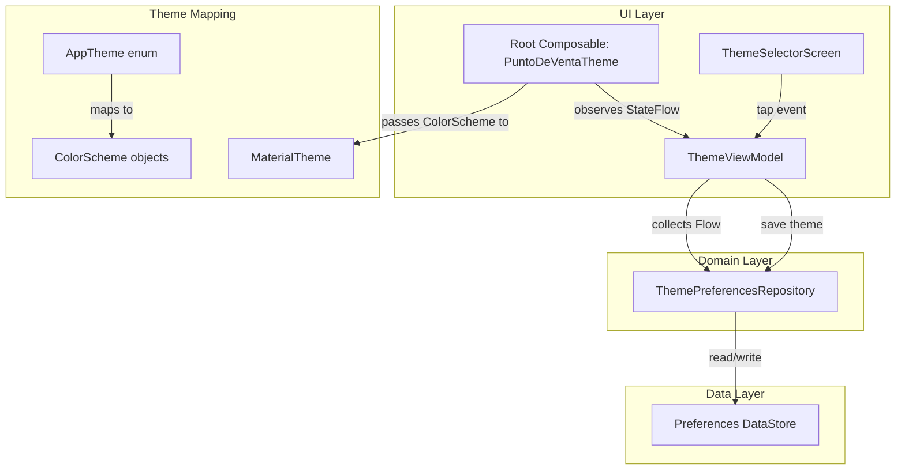
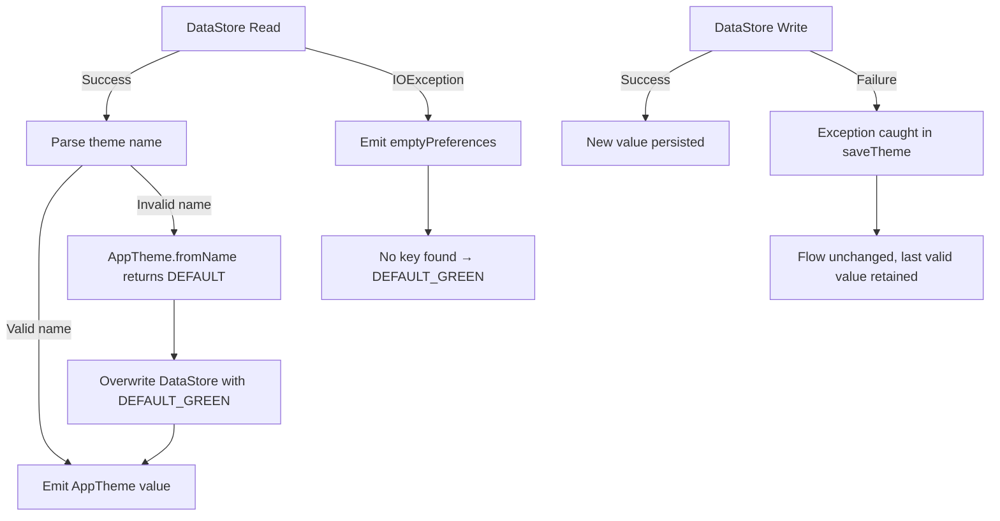

# Design Document: Dynamic Theme Engine

## Overview

El Dynamic Theme Engine es un módulo que permite al usuario personalizar la apariencia visual de la aplicación POS seleccionando entre **9 temas predefinidos** (4 originales + 5 añadidos en la expansión de temas). La arquitectura sigue el patrón MVVM + UDF existente en el proyecto, añadiendo una capa de persistencia basada en Preferences DataStore y un flujo reactivo que propaga los cambios de tema a toda la UI sin reiniciar la app.

> **Expansión de temas:** el catálogo se amplió de 4 a 9 temas para dar más opciones de personalización premium. Los 5 nuevos temas (`MIDNIGHT_SLATE`, `CHARCOAL_AMBER`, `ROSE_QUARTZ`, `EMERALD_TEAL`, `ROYAL_PLUM`) están especificados con sus hex completos en la sección [Data Models](#data-models). La selección combinada cubre modos claro y oscuro (6 claros + 3 oscuros), y cada par de color texto/fondo cumple contraste WCAG 2.1 ≥ 4.5:1.

El diseño prioriza:
- **Compatibilidad hacia atrás**: El tema DEFAULT_GREEN reproduce exactamente los colores actuales de `AppColorScheme`.
- **Reactividad**: Cambios de tema se reflejan en la UI en el mismo frame de recomposición.
- **Resiliencia**: Cualquier fallo en la persistencia o valores corruptos resultan en un fallback seguro a DEFAULT_GREEN.
- **Extensibilidad**: Agregar nuevos temas en el futuro requiere solo añadir un valor al enum y su `ColorScheme` correspondiente.

## Architecture



### Flow de datos

1. El usuario toca una tarjeta de tema en `ThemeSelectorScreen`.
2. `ThemeViewModel` recibe el evento y llama a `ThemePreferencesRepository.saveTheme(appTheme)`.
3. El repositorio persiste el valor en DataStore y emite el nuevo valor a través de su `Flow<AppTheme>`.
4. `ThemeViewModel` expone el valor actualizado como `StateFlow<AppTheme>`.
5. El `Root Composable` (`PuntoDeVentaTheme`) observa el `StateFlow`, mapea `AppTheme` a su `ColorScheme`, y recompone toda la UI.

### Decisiones clave

| Decisión | Justificación |
|---|---|
| Preferences DataStore sobre SharedPreferences | API de coroutines, type-safe, migración simple, recomendado por Google |
| `StateFlow` sobre `LiveData` | Consistencia con la arquitectura existente del proyecto (UDF con StateFlow) |
| Enum sellado con `when` exhaustivo | El compilador fuerza manejar todos los casos al agregar/eliminar temas |
| ColorScheme como función pura de AppTheme | Sin estado mutable en el mapping; fácil de testear |
| ViewModel compartido a nivel Activity | El tema es global; compartirlo evita inconsistencias entre pantallas |

## Components and Interfaces

### 1. AppTheme Enum

```kotlin
// ui/theme/AppTheme.kt
enum class AppTheme {
    DEFAULT_GREEN,
    DARK_NEON,
    OCEAN_BLUE,
    SUNSET_ORANGE,
    // Expansión de temas
    MIDNIGHT_SLATE,
    CHARCOAL_AMBER,
    ROSE_QUARTZ,
    EMERALD_TEAL,
    ROYAL_PLUM;

    companion object {
        val DEFAULT = DEFAULT_GREEN

        fun fromName(name: String): AppTheme =
            entries.find { it.name == name } ?: DEFAULT
    }
}
```

### 2. ThemePreferencesRepository

```kotlin
// data/repository/ThemePreferencesRepository.kt
class ThemePreferencesRepository(private val dataStore: DataStore<Preferences>) {

    private val THEME_KEY = stringPreferencesKey("selected_theme")

    val themeFlow: Flow<AppTheme> = dataStore.data
        .catch { emit(emptyPreferences()) }
        .map { prefs ->
            val name = prefs[THEME_KEY]
            if (name != null) AppTheme.fromName(name) else AppTheme.DEFAULT
        }

    suspend fun saveTheme(theme: AppTheme) {
        dataStore.edit { prefs ->
            prefs[THEME_KEY] = theme.name
        }
    }
}
```

### 3. ThemeViewModel

```kotlin
// ui/theme/ThemeViewModel.kt
class ThemeViewModel(
    private val repository: ThemePreferencesRepository
) : ViewModel() {

    val currentTheme: StateFlow<AppTheme> = repository.themeFlow
        .stateIn(
            scope = viewModelScope,
            started = SharingStarted.Eagerly,
            initialValue = AppTheme.DEFAULT
        )

    fun selectTheme(theme: AppTheme) {
        viewModelScope.launch {
            repository.saveTheme(theme)
        }
    }

    class Factory(private val repository: ThemePreferencesRepository) :
        ViewModelProvider.Factory { ... }
}
```

### 4. PuntoDeVentaTheme (Modified Root Composable)

```kotlin
// ui/theme/Theme.kt
@Composable
fun PuntoDeVentaTheme(
    appTheme: AppTheme = AppTheme.DEFAULT,
    content: @Composable () -> Unit
) {
    val colorScheme = appTheme.toColorScheme()
    MaterialTheme(
        colorScheme = colorScheme,
        typography  = Typography,
        content     = content
    )
}
```

### 5. ThemeSelectorScreen

```kotlin
// ui/theme/ThemeSelectorScreen.kt
@Composable
fun ThemeSelectorScreen(
    currentTheme: AppTheme,
    onThemeSelected: (AppTheme) -> Unit
)
```

### 6. ThemeCard

```kotlin
// ui/theme/ThemeCard.kt
@Composable
fun ThemeCard(
    theme: AppTheme,
    isSelected: Boolean,
    onClick: () -> Unit
)
```

### Interface Contracts

| Component | Input | Output |
|---|---|---|
| `ThemePreferencesRepository.themeFlow` | — | `Flow<AppTheme>` (emits on change) |
| `ThemePreferencesRepository.saveTheme` | `AppTheme` | `Unit` (suspending, persists to DataStore) |
| `ThemeViewModel.currentTheme` | — | `StateFlow<AppTheme>` |
| `ThemeViewModel.selectTheme` | `AppTheme` | Side effect: saves + updates flow |
| `AppTheme.toColorScheme()` | — | `ColorScheme` (pure function) |
| `AppTheme.displayName` | — | `String` (Spanish name) |
| `AppTheme.previewColors` | — | `Triple<Color, Color, Color>` (primary, bg, accent) |

## Data Models

### AppTheme Enum

| Value | displayName | isDark | Primary | Background | Accent |
|---|---|---|---|---|---|
| `DEFAULT_GREEN` | "Verde por Defecto" | false | #4A8C1C | #6BBF3E | #4CAF50 |
| `DARK_NEON` | "Neón Oscuro" | true | #39FF14 | #121212 | #00FFFF |
| `OCEAN_BLUE` | "Océano Azul" | false | #1565C0 | #FFFFFF | #42A5F5 |
| `SUNSET_ORANGE` | "Atardecer Naranja" | false | #E65100 | #FFFBF5 | #FFC107 |
| `MIDNIGHT_SLATE` | "Pizarra Medianoche" | true | #8AB4FF | #0E1116 | #7FE0D4 |
| `CHARCOAL_AMBER` | "Carbón Ámbar" | true | #FFCA6B | #14120E | #C7D98F |
| `ROSE_QUARTZ` | "Cuarzo Rosa" | false | #B0235A | #FFF8F9 | #8A5A2B |
| `EMERALD_TEAL` | "Esmeralda" | false | #00695C | #F5FBF9 | #4A6572 |
| `ROYAL_PLUM` | "Ciruela Real" | false | #6A1B9A | #FDF8FF | #9C4368 |

#### Notas de diseño de los 5 temas nuevos (expansión)

Los cinco temas se diseñaron para un POS con estética moderna, premium y profesional. Cada `ColorScheme` es autoconsistente (no depende de un toggle de modo del sistema): dos son oscuros y tres son claros, de modo que el catálogo completo ofrece al usuario tanto modo claro como oscuro.

| Tema | Modo | Concepto de diseño |
|---|---|---|
| `MIDNIGHT_SLATE` | Oscuro | Lienzo pizarra azulada con primary índigo suave y acento teal. Sobrio y tecnológico. |
| `CHARCOAL_AMBER` | Oscuro | Carbón cálido con primary ámbar de lujo y acento salvia. Acogedor para uso nocturno. |
| `ROSE_QUARTZ` | Claro | Blush suave con primary rosa boutique y acento bronce. Elegante y cálido. |
| `EMERALD_TEAL` | Claro | Menta fría con primary esmeralda profundo y acento azul pizarra. Limpio y profesional. |
| `ROYAL_PLUM` | Claro | Lila aireado con primary ciruela regia y acento rosa. Rico y distintivo. |

Todos los pares texto/fondo (`onPrimary/primary`, `onSecondary/secondary`, `onPrimaryContainer/primaryContainer`, `onSecondaryContainer/secondaryContainer`, `onTertiary/tertiary`, `onTertiaryContainer/tertiaryContainer`, `onBackground/background`, `onSurface/surface`, `onSurfaceVariant/surfaceVariant`, `onError/error`) fueron verificados con ratio de contraste WCAG 2.1 ≥ 4.5:1.

### DataStore Schema

| Key | Type | Default | Description |
|---|---|---|---|
| `"selected_theme"` | `String` | `"DEFAULT_GREEN"` | Enum name stored as string |

### ColorScheme Mapping (complete roles per theme)

#### DEFAULT_GREEN (lightColorScheme)
```
primary = #4A8C1C, onPrimary = #FFFFFF
primaryContainer = #2D5A1B, onPrimaryContainer = #FFFFFF
secondary = #4CAF50, onSecondary = #FFFFFF
background = #6BBF3E, onBackground = #FFFFFF
surface = #FFFFFF, onSurface = #1A1A1A
error = #E53935, onError = #FFFFFF
```

#### DARK_NEON (darkColorScheme)
```
primary = #39FF14, onPrimary = #003300
primaryContainer = #004D00, onPrimaryContainer = #39FF14
secondary = #00FFFF, onSecondary = #003333
background = #121212, onBackground = #E0E0E0
surface = #1E1E1E, onSurface = #E0E0E0
error = #E53935, onError = #FFFFFF
```

#### OCEAN_BLUE (lightColorScheme)
```
primary = #1565C0, onPrimary = #FFFFFF
primaryContainer = #BBDEFB, onPrimaryContainer = #0D47A1
secondary = #42A5F5, onSecondary = #FFFFFF
background = #FFFFFF, onBackground = #1A1A1A
surface = #FFFFFF, onSurface = #1A1A1A
error = #E53935, onError = #FFFFFF
```

#### SUNSET_ORANGE (lightColorScheme)
```
primary = #E65100, onPrimary = #FFFFFF
primaryContainer = #FFF3E0, onPrimaryContainer = #BF360C
secondary = #FFC107, onSecondary = #3E2723
background = #FFFBF5, onBackground = #1A1A1A
surface = #FFFFFF, onSurface = #1A1A1A
error = #B71C1C, onError = #FFFFFF
```

#### MIDNIGHT_SLATE (darkColorScheme) — expansión
```
primary = #8AB4FF, onPrimary = #06264D
primaryContainer = #26385C, onPrimaryContainer = #D6E3FF
secondary = #7FE0D4, onSecondary = #00352E
secondaryContainer = #14453F, onSecondaryContainer = #A6F0E6
tertiary = #FFB59D, onTertiary = #5A1B0A
tertiaryContainer = #5A2A1C, onTertiaryContainer = #FFDBCF
background = #0E1116, onBackground = #E4E7EC
surface = #171B22, onSurface = #E4E7EC
surfaceVariant = #2A2F38, onSurfaceVariant = #C3C8D1
outline = #3A4049
error = #FF6B6B, onError = #3D0000
```

#### CHARCOAL_AMBER (darkColorScheme) — expansión
```
primary = #FFCA6B, onPrimary = #3A2A00
primaryContainer = #5C4300, onPrimaryContainer = #FFE4A8
secondary = #F2C1A0, onSecondary = #422A12
secondaryContainer = #5A3D28, onSecondaryContainer = #FFDCC4
tertiary = #C7D98F, onTertiary = #2C3400
tertiaryContainer = #404A16, onTertiaryContainer = #E3F3A9
background = #14120E, onBackground = #EDE6DC
surface = #1E1B16, onSurface = #EDE6DC
surfaceVariant = #342F27, onSurfaceVariant = #D2C8B8
outline = #4E483D
error = #FF6B6B, onError = #3D0000
```

#### ROSE_QUARTZ (lightColorScheme) — expansión
```
primary = #B0235A, onPrimary = #FFFFFF
primaryContainer = #FFD9E2, onPrimaryContainer = #3E0019
secondary = #8C4A5E, onSecondary = #FFFFFF
secondaryContainer = #FFD9E2, onSecondaryContainer = #3A0A1B
tertiary = #8A5A2B, onTertiary = #FFFFFF
tertiaryContainer = #FFDDB8, onTertiaryContainer = #2E1500
background = #FFF8F9, onBackground = #201A1B
surface = #FFFFFF, onSurface = #201A1B
surfaceVariant = #F3E0E4, onSurfaceVariant = #524345
outline = #D8C2C6
error = #B71C1C, onError = #FFFFFF
```

#### EMERALD_TEAL (lightColorScheme) — expansión
```
primary = #00695C, onPrimary = #FFFFFF
primaryContainer = #B2DFDB, onPrimaryContainer = #00201C
secondary = #00796B, onSecondary = #FFFFFF
secondaryContainer = #A7F0E4, onSecondaryContainer = #00201B
tertiary = #4A6572, onTertiary = #FFFFFF
tertiaryContainer = #CDE7F0, onTertiaryContainer = #051F27
background = #F5FBF9, onBackground = #191C1B
surface = #FFFFFF, onSurface = #191C1B
surfaceVariant = #DBE5E1, onSurfaceVariant = #3F4946
outline = #6F7976
error = #BA1A1A, onError = #FFFFFF
```

#### ROYAL_PLUM (lightColorScheme) — expansión
```
primary = #6A1B9A, onPrimary = #FFFFFF
primaryContainer = #EEDCF7, onPrimaryContainer = #2C0A45
secondary = #7B4B9E, onSecondary = #FFFFFF
secondaryContainer = #EEDCF7, onSecondaryContainer = #2A0F3D
tertiary = #9C4368, onTertiary = #FFFFFF
tertiaryContainer = #FFD9E4, onTertiaryContainer = #3E0022
background = #FDF8FF, onBackground = #1D1A20
surface = #FFFFFF, onSurface = #1D1A20
surfaceVariant = #E9E0EC, onSurfaceVariant = #4A454E
outline = #7C7580
error = #BA1A1A, onError = #FFFFFF
```


## Correctness Properties

*A property is a characteristic or behavior that should hold true across all valid executions of a system — essentially, a formal statement about what the system should do. Properties serve as the bridge between human-readable specifications and machine-verifiable correctness guarantees.*

### Property 1: Theme persistence round-trip

*For any* sequence of valid `AppTheme` values saved to `ThemePreferencesRepository`, the `themeFlow` SHALL emit each value in the same order they were saved, and collecting after the last save SHALL yield the last saved value.

**Validates: Requirements 2.1, 2.4**

### Property 2: Invalid theme name falls back to DEFAULT_GREEN

*For any* arbitrary string stored in DataStore that does NOT match any `AppTheme.name` value, the `ThemePreferencesRepository.themeFlow` SHALL emit `AppTheme.DEFAULT_GREEN`.

**Validates: Requirements 2.5**

### Property 3: WCAG contrast compliance across all themes

*For any* `AppTheme` value, every text/background color pairing (onPrimary/primary, onSecondary/secondary, onBackground/background, onSurface/surface, onError/error, onPrimaryContainer/primaryContainer) in the resulting `ColorScheme` SHALL have a WCAG 2.1 contrast ratio of at least 4.5:1.

**Validates: Requirements 5.3, 6.2, 7.2**

### Property 4: Theme metadata completeness

*For any* `AppTheme` value, `displayName` SHALL return a non-empty string, and `previewColors` SHALL return exactly 3 non-null `Color` values (primary, background, accent).

**Validates: Requirements 9.1, 9.2**

### Property 5: ColorScheme mapping is total and pure

*For any* `AppTheme` value, calling `toColorScheme()` SHALL return a valid non-null `ColorScheme` without throwing exceptions, and calling it multiple times with the same input SHALL always produce an identical `ColorScheme`.

**Validates: Requirements 4.3, 1.1**

## Error Handling

| Scenario | Componente | Estrategia |
|---|---|---|
| DataStore read falla (IOException) | `ThemePreferencesRepository` | `catch { emit(emptyPreferences()) }` → se evalúa como DEFAULT_GREEN |
| Valor almacenado no reconocido | `ThemePreferencesRepository` | `AppTheme.fromName()` retorna `DEFAULT` y se sobreescribe el valor inválido |
| DataStore write falla | `ThemePreferencesRepository` | El `edit` block lanza excepción; el `catch` en `saveTheme` la absorbe; el Flow conserva el último valor válido |
| Repository emite error al ViewModel | `ThemeViewModel` | `catch { emit(AppTheme.DEFAULT) }` en el flow antes de `stateIn` |
| ColorScheme no disponible | `PuntoDeVentaTheme` | Imposible por diseño — `when` exhaustivo sobre enum; fallback es el `when` branch de DEFAULT_GREEN |

### Diagrama de manejo de errores



## Testing Strategy

### Enfoque dual

El testing combina dos estrategias complementarias:

1. **Property-based tests** (Kotest Property): Verifican propiedades universales con 100+ iteraciones por propiedad.
2. **Unit tests** (JUnit5 + Kotest): Verifican ejemplos específicos, edge cases, y escenarios de error.

### Property-based testing configuration

- **Library**: Kotest Property (ya disponible en el proyecto como `testImplementation(libs.kotest.property)`)
- **Minimum iterations**: 100 por propiedad
- **Tag format**: `Feature: 18_theme_engine, Property {N}: {description}`

### Implementación de propiedades

| Property | Generator Strategy |
|---|---|
| P1: Round-trip | `Arb.list(Arb.enum<AppTheme>(), 1..10)` — genera secuencias aleatorias de temas |
| P2: Invalid fallback | `Arb.string()` filtered to exclude valid AppTheme names |
| P3: Contrast compliance | `Arb.enum<AppTheme>()` — itera sobre todos los temas y sus pares de colores |
| P4: Metadata completeness | `Arb.enum<AppTheme>()` — verifica displayName y previewColors para cada tema |
| P5: Mapping purity | `Arb.enum<AppTheme>()` — invoca toColorScheme() múltiples veces y compara igualdad |

### Unit tests (ejemplos específicos)

| Test | Validates |
|---|---|
| `AppTheme enum has exactly 9 entries` | Req 1.1 |
| `Empty DataStore emits DEFAULT_GREEN` | Req 1.2, 2.3 |
| `DEFAULT_GREEN ColorScheme matches legacy AppColorScheme` | Req 4.1, 4.2 |
| `DARK_NEON uses darkColorScheme and correct hex values` | Req 5.1, 5.2, 5.4 |
| `OCEAN_BLUE uses lightColorScheme with correct primary` | Req 6.1, 6.3 |
| `SUNSET_ORANGE uses lightColorScheme with correct colors` | Req 7.1, 7.3 |
| `DataStore write failure preserves last valid value` | Req 2.6 |
| `ViewModel falls back to DEFAULT_GREEN on repo error` | Req 3.4 |
| `ViewModel initial value is DEFAULT_GREEN` | Req 3.3 |

### Integration / UI tests (Compose)

| Test | Validates |
|---|---|
| `ThemeSelectorScreen shows 4 cards in 2-column grid` | Req 8.1 |
| `Title "Apariencia" displayed above grid` | Req 8.2 |
| `Active theme card shows border + check icon` | Req 9.3, 9.4 |
| `Tapping card triggers ViewModel.selectTheme` | Req 10.1, 10.2 |
| `Theme change reflects in MaterialTheme.colorScheme` | Req 3.1, 3.2, 10.3 |

### Test dependencies (already available)

```toml
kotest-property        = io.kotest:kotest-property-jvm:5.9.1
kotest-runner-junit5   = io.kotest:kotest-runner-junit5-jvm:5.9.1
kotlinx-coroutines-test = org.jetbrains.kotlinx:kotlinx-coroutines-test:1.10.2
mockk                  = io.mockk:mockk:1.13.14
turbine                = app.cash.turbine:turbine:1.2.0
```

### WCAG Contrast Ratio Utility

Para la propiedad P3, se necesita una función utilitaria que calcule el contrast ratio según WCAG 2.1:

```kotlin
fun contrastRatio(foreground: Color, background: Color): Double {
    val lum1 = relativeLuminance(foreground)
    val lum2 = relativeLuminance(background)
    val lighter = maxOf(lum1, lum2)
    val darker = minOf(lum1, lum2)
    return (lighter + 0.05) / (darker + 0.05)
}

fun relativeLuminance(color: Color): Double {
    fun linearize(c: Float): Double {
        return if (c <= 0.03928) (c / 12.92).toDouble()
        else ((c + 0.055) / 1.055).pow(2.4)
    }
    return 0.2126 * linearize(color.red) +
           0.7152 * linearize(color.green) +
           0.0722 * linearize(color.blue)
}
```
