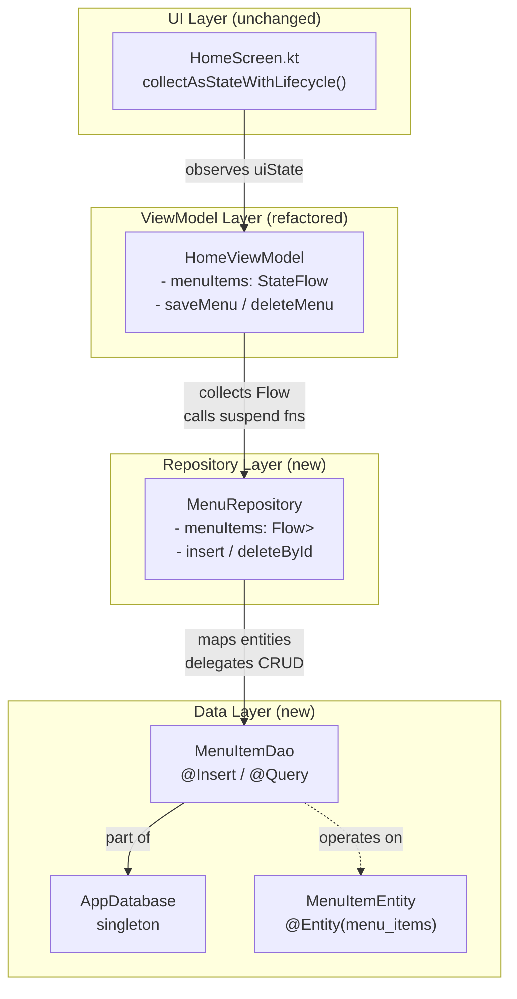

# Design — local-data-persistence

## Feature: Room Database Persistence for Menu Items

**Version:** 1.0  
**Status:** Draft  
**Spec type:** Feature (Requirements-First)

---

## Overview

This feature replaces the in-memory `List<MenuItem>` in `HomeViewModel` with a Room
SQLite database so that menu items survive app restarts. The change is additive and
surgical: the UI layer (`HomeScreen`, `AddMenuDialog`, composables) is untouched
structurally. The only observable difference from the user's perspective is that items
created in a previous session reappear when the app relaunches.

The introduction follows Android's recommended Clean Architecture layering:

```
UI (Compose) → ViewModel → Repository → DAO → Room / SQLite
```

Each layer depends only on the layer immediately below it. The UI continues to observe
`StateFlow<HomeUiState>` via `collectAsStateWithLifecycle()`, which remains the single
channel of truth between the ViewModel and the screen.

---

## Architecture

### Layer diagram



### Data flow (read path)

```
SQLite table
  └─► MenuItemDao.getAllMenuItems() : Flow<List<MenuItemEntity>>
        └─► MenuRepository.menuItems : Flow<List<MenuItem>>   (maps entity → domain)
              └─► HomeViewModel.menuItems : StateFlow<List<MenuItem>>  (stateIn)
                    └─► HomeUiState.menuItems
                          └─► HomeScreen (LazyVerticalGrid)
```

Every write to the `menu_items` table automatically propagates up through Room's
reactive Flow to the UI — no manual refresh or polling needed.

### Data flow (write path)

```
User action (save / delete)
  └─► HomeViewModel.saveMenu() / deleteMenu()
        └─► viewModelScope.launch { repository.insert() / repository.deleteById() }
              └─► MenuItemDao.insert() / deleteById()   (suspend, Room executes on IO dispatcher)
                    └─► SQLite write → triggers Flow emission → read path above
```

---

## Components and Interfaces

### 1. `MenuItemEntity` — `data/local/MenuItemEntity.kt`

```kotlin
package com.example.puntodeventa.data.local

import androidx.room.Entity
import androidx.room.PrimaryKey

@Entity(tableName = "menu_items")
data class MenuItemEntity(
    @PrimaryKey val id: String,
    val emoji: String,
    val name: String
)
```

- Mirrors the domain `MenuItem` field-for-field.
- `id` is a UUID string generated once at creation time and never mutated.
- No `@ColumnInfo` annotations needed — default column names match field names.

---

### 2. `MenuItemDao` — `data/local/MenuItemDao.kt`

```kotlin
package com.example.puntodeventa.data.local

import androidx.room.*
import kotlinx.coroutines.flow.Flow

@Dao
interface MenuItemDao {

    @Insert(onConflict = OnConflictStrategy.REPLACE)
    suspend fun insert(item: MenuItemEntity)

    @Query("SELECT * FROM menu_items")
    fun getAllMenuItems(): Flow<List<MenuItemEntity>>

    @Query("DELETE FROM menu_items WHERE id = :id")
    suspend fun deleteById(id: String)
}
```

- `insert` uses `REPLACE` strategy — covers both create and edit (upsert semantics).
- `getAllMenuItems` returns a `Flow`; Room emits a fresh list on every table change.
- `deleteById` with a non-existent `id` is a no-op (Room/SQLite silently skips).
- No raw SQL in business logic — all SQL is confined to this interface.

---

### 3. `AppDatabase` — `data/local/AppDatabase.kt`

```kotlin
package com.example.puntodeventa.data.local

import android.content.Context
import androidx.room.Database
import androidx.room.Room
import androidx.room.RoomDatabase

@Database(
    entities = [MenuItemEntity::class],
    version = 1,
    exportSchema = false
)
abstract class AppDatabase : RoomDatabase() {

    abstract fun menuItemDao(): MenuItemDao

    companion object {
        @Volatile
        private var INSTANCE: AppDatabase? = null

        fun getInstance(context: Context): AppDatabase =
            INSTANCE ?: synchronized(this) {
                INSTANCE ?: Room.databaseBuilder(
                    context.applicationContext,
                    AppDatabase::class.java,
                    "punto_de_venta_db"
                )
                    .fallbackToDestructiveMigration()
                    .build()
                    .also { INSTANCE = it }
            }
    }
}
```

- `@Volatile` ensures the `INSTANCE` write is immediately visible across threads.
- Double-checked locking inside `synchronized` prevents duplicate instantiation under
  concurrent access.
- `fallbackToDestructiveMigration()` is appropriate for v1 development; schema changes
  in future releases should use `addMigrations(MIGRATION_1_2, ...)` instead.
- `exportSchema = false` suppresses the Gradle schema-export warning during initial
  development. In a CI/CD pipeline this should later be set to `true` with a
  `schemaDirectory` configured.

---

### 4. `MenuRepository` — `data/repository/MenuRepository.kt`

```kotlin
package com.example.puntodeventa.data.repository

import com.example.puntodeventa.data.local.MenuItemDao
import com.example.puntodeventa.data.local.MenuItemEntity
import com.example.puntodeventa.data.model.MenuItem
import kotlinx.coroutines.flow.Flow
import kotlinx.coroutines.flow.map

class MenuRepository(private val dao: MenuItemDao) {

    val menuItems: Flow<List<MenuItem>> =
        dao.getAllMenuItems().map { entities ->
            entities.map { it.toDomain() }
        }

    suspend fun insert(item: MenuItem) {
        dao.insert(item.toEntity())
    }

    suspend fun deleteById(id: String) {
        dao.deleteById(id)
    }

    // ── Mapping helpers ───────────────────────────────────────────────────────

    private fun MenuItemEntity.toDomain(): MenuItem =
        MenuItem(id = id, emoji = emoji, name = name)

    private fun MenuItem.toEntity(): MenuItemEntity =
        MenuItemEntity(id = id, emoji = emoji, name = name)
}
```

- The repository owns all mapping logic between the `data/local` and `data/model`
  layers. Neither the ViewModel nor the DAO depends on the other's type.
- `menuItems` is a cold `Flow` — it does not emit until collected.

---

### 5. `HomeViewModel` (refactored) — `ui/home/HomeViewModel.kt`

```kotlin
package com.example.puntodeventa.ui.home

import androidx.lifecycle.ViewModel
import androidx.lifecycle.ViewModelProvider
import androidx.lifecycle.viewModelScope
import com.example.puntodeventa.data.model.MenuItem
import com.example.puntodeventa.data.repository.MenuRepository
import kotlinx.coroutines.flow.*
import kotlinx.coroutines.launch
import java.util.UUID

data class HomeUiState(
    val menuItems: List<MenuItem> = emptyList(),
    val isDialogOpen: Boolean = false,
    val editingItem: MenuItem? = null
)

class HomeViewModel(private val repository: MenuRepository) : ViewModel() {

    // ── Dialog UI state (transient, in-memory) ────────────────────────────────
    private val _dialogState = MutableStateFlow(
        DialogState(isOpen = false, editingItem = null)
    )

    // ── Combine persisted items + transient dialog state ──────────────────────
    val uiState: StateFlow<HomeUiState> =
        combine(
            repository.menuItems,
            _dialogState
        ) { items, dialog ->
            HomeUiState(
                menuItems    = items,
                isDialogOpen = dialog.isOpen,
                editingItem  = dialog.editingItem
            )
        }.stateIn(
            scope          = viewModelScope,
            started        = SharingStarted.WhileSubscribed(5_000),
            initialValue   = HomeUiState()
        )

    fun openDialog() {
        _dialogState.update { it.copy(isOpen = true, editingItem = null) }
    }

    fun openEditDialog(item: MenuItem) {
        _dialogState.update { it.copy(isOpen = true, editingItem = item) }
    }

    fun dismissDialog() {
        _dialogState.update { it.copy(isOpen = false, editingItem = null) }
    }

    fun saveMenu(emoji: String, name: String) {
        val trimmedName = name.trim()
        if (trimmedName.isBlank() || emoji.isBlank()) return

        val editingItem = _dialogState.value.editingItem
        val item = MenuItem(
            id    = editingItem?.id ?: UUID.randomUUID().toString(),
            emoji = emoji,
            name  = trimmedName
        )
        viewModelScope.launch { repository.insert(item) }
        _dialogState.update { it.copy(isOpen = false, editingItem = null) }
    }

    fun deleteMenu(id: String) {
        viewModelScope.launch { repository.deleteById(id) }
    }

    // ── Factory ───────────────────────────────────────────────────────────────

    class Factory(private val repository: MenuRepository) : ViewModelProvider.Factory {
        @Suppress("UNCHECKED_CAST")
        override fun <T : ViewModel> create(modelClass: Class<T>): T =
            HomeViewModel(repository) as T
    }

    // ── Internal helper ───────────────────────────────────────────────────────

    private data class DialogState(val isOpen: Boolean, val editingItem: MenuItem?)
}
```

**Key design decisions:**

- Dialog state (`isDialogOpen`, `editingItem`) remains in-memory — it is transient UI
  state that must not persist across restarts.
- `repository.menuItems` (backed by Room Flow) and `_dialogState` are `combine`d into a
  single `HomeUiState` using `stateIn(WhileSubscribed(5_000))`.
- `WhileSubscribed(5_000)` tears down the upstream Flow 5 seconds after the last
  subscriber leaves (e.g., app goes to background), saving resources while surviving
  config changes.
- The `uiState` shape is **identical** to the original: `HomeScreen` and every composable
  downstream continue to work with zero structural changes.

---

### 6. `HomeScreen` — no structural changes

`HomeScreen` already uses:
```kotlin
val uiState by viewModel.uiState.collectAsStateWithLifecycle()
```

The only change is injecting a `ViewModelProvider.Factory` at the call site in
`MainActivity` (or wherever `HomeScreen` is composed) so `viewModel(factory = ...)` is
used instead of the zero-arg `viewModel()`. The composable signature stays the same.

---

### 7. Gradle configuration

#### `gradle/libs.versions.toml` — additions

```toml
[versions]
# ... existing entries ...
room = "2.7.1"
ksp  = "2.2.10-2.0.2"

[libraries]
# ... existing entries ...
androidx-room-runtime  = { group = "androidx.room", name = "room-runtime",  version.ref = "room" }
androidx-room-ktx      = { group = "androidx.room", name = "room-ktx",      version.ref = "room" }
androidx-room-compiler = { group = "androidx.room", name = "room-compiler",  version.ref = "room" }

[plugins]
# ... existing entries ...
ksp = { id = "com.google.devtools.ksp", version.ref = "ksp" }
```

#### `app/build.gradle.kts` — additions

```kotlin
plugins {
    alias(libs.plugins.android.application)
    alias(libs.plugins.kotlin.compose)
    alias(libs.plugins.ksp)          // ← add
}

// ... android block unchanged ...

dependencies {
    // ... existing dependencies ...

    // Room
    implementation(libs.androidx.room.runtime)
    implementation(libs.androidx.room.ktx)
    ksp(libs.androidx.room.compiler)
}
```

**Version rationale:**
- Room `2.7.1` is the latest stable release compatible with Kotlin `2.2.10`.
- KSP `2.2.10-2.0.2` — the first segment must match the Kotlin version exactly
  (`2.2.10`); the second segment (`2.0.2`) is the KSP release for that Kotlin version.

---

## Data Models

### Domain model (unchanged)

```kotlin
// com.example.puntodeventa.data.model.MenuItem
data class MenuItem(
    val id: String,     // UUID — immutable after creation
    val emoji: String,
    val name: String
)
```

### Persistence model (new)

```kotlin
// com.example.puntodeventa.data.local.MenuItemEntity
@Entity(tableName = "menu_items")
data class MenuItemEntity(
    @PrimaryKey val id: String,
    val emoji: String,
    val name: String
)
```

### Mapping invariant

For any `MenuItem m`:
```
MenuItemEntity(m.id, m.emoji, m.name).toDomain() == m
```

And for any `MenuItemEntity e`:
```
e.toDomain().toEntity() == e
```

The mapping is a lossless bijection — no data is added, removed, or transformed.

### Schema

| Column | Type | Constraints |
|--------|------|-------------|
| `id`   | TEXT | PRIMARY KEY |
| `emoji`| TEXT | NOT NULL    |
| `name` | TEXT | NOT NULL    |

Table name: `menu_items`  
Database version: `1`  
Database file: `punto_de_venta_db`

---

## Correctness Properties

*A property is a characteristic or behavior that should hold true across all valid
executions of a system — essentially, a formal statement about what the system should
do. Properties serve as the bridge between human-readable specifications and
machine-verifiable correctness guarantees.*

---

### Property 1: Entity field preservation

*For any* triple of strings `(id, emoji, name)`, constructing a `MenuItemEntity` with
those values and immediately reading back its fields SHALL yield the same `id`, `emoji`,
and `name` without modification.

**Validates: Requirements 1.5**

---

### Property 2: Upsert replaces existing row

*For any* `MenuItemEntity` inserted into the DAO, inserting a second entity with the
same `id` but different `emoji` or `name` SHALL result in exactly one row in the table
whose `emoji` and `name` match the second insert, and the first values SHALL no longer
be present.

**Validates: Requirements 2.5**

---

### Property 3: AppDatabase singleton invariant

*For any* number of sequential or concurrent calls to `AppDatabase.getInstance()`,
all calls SHALL return the same instance (referential equality), guaranteeing one
shared SQLite connection for the lifetime of the app process.

**Validates: Requirements 3.3, 3.4, 3.5**

---

### Property 4: Repository entity-to-domain mapping round-trip

*For any* list of `MenuItemEntity` objects emitted by the DAO, the corresponding
`List<MenuItem>` emitted by `MenuRepository.menuItems` SHALL contain one `MenuItem` per
entity where `menuItem.id == entity.id`, `menuItem.emoji == entity.emoji`, and
`menuItem.name == entity.name`.

**Validates: Requirements 4.2, 4.6**

---

### Property 5: Repository domain-to-entity mapping round-trip

*For any* `MenuItem` passed to `MenuRepository.insert`, the `MenuItemEntity` forwarded
to `MenuItemDao.insert` SHALL have `entity.id == item.id`, `entity.emoji == item.emoji`,
and `entity.name == item.name`.

**Validates: Requirements 4.3, 4.5**

---

### Property 6: ViewModel mirrors repository items

*For any* list of `MenuItem` objects emitted by `MenuRepository.menuItems`, the
`HomeViewModel.uiState.value.menuItems` SHALL eventually contain the same list (same
items, same order) after the `StateFlow` has been collected.

**Validates: Requirements 5.2**

---

### Property 7: saveMenu correctness — new item

*For any* non-blank `emoji` and non-blank `name`, calling `saveMenu(emoji, name)` in
create mode (no `editingItem`) SHALL call `MenuRepository.insert` exactly once with a
`MenuItem` whose `emoji` equals the given emoji, whose `name` equals the trimmed name,
and whose `id` is a non-empty UUID string that was not previously present in the list.

**Validates: Requirements 5.3**

---

### Property 8: saveMenu correctness — edit mode preserves id

*For any* existing `MenuItem` set as `editingItem` and *for any* non-blank replacement
`emoji` and `name`, calling `saveMenu(emoji, name)` in edit mode SHALL call
`MenuRepository.insert` with a `MenuItem` whose `id` equals `editingItem.id`, ensuring
the primary key is preserved across edits.

**Validates: Requirements 5.4**

---

### Property 9: deleteMenu delegation

*For any* id string `id`, calling `HomeViewModel.deleteMenu(id)` SHALL result in
exactly one call to `MenuRepository.deleteById(id)` with the same `id` value.

**Validates: Requirements 5.5, 4.4**

---

### Property 10: Blank-input validation gate

*For any* string `s` composed entirely of whitespace (including the empty string),
calling `saveMenu(s, "valid")` or `saveMenu("🌮", s)` SHALL perform no call to
`MenuRepository.insert` and SHALL leave the item list unchanged.

**Validates: Requirements 5.6**

---

## Error Handling

| Scenario | Handling |
|----------|----------|
| `insert` called with duplicate `id` | `OnConflictStrategy.REPLACE` — silent upsert, no crash |
| `deleteById` with non-existent `id` | Room/SQLite no-op — completes silently |
| `saveMenu` with blank `name` or `emoji` | Early return in ViewModel — no DB call |
| Database corruption on upgrade (v1) | `fallbackToDestructiveMigration()` — table dropped and recreated; data loss is accepted in v1 development |
| `AppDatabase.getInstance()` concurrent access | `@Volatile` + `synchronized` double-checked locking prevents race condition |
| Room operations called on main thread | Room enforces off-main-thread execution by default; all DAO calls are `suspend` funs called from `viewModelScope` (Dispatchers.Main.immediate) — Room internally dispatches to its IO executor |

---

## Testing Strategy

### Approach

This feature uses a **dual testing approach**:

- **Unit tests** — pure Kotlin, no Android framework: test mapping functions,
  ViewModel logic with a `FakeMenuRepository`, and validation rules.
- **Property-based tests** — use [Kotest Property Testing](https://kotest.io/docs/proptest/property-based-testing.html)
  (JVM-compatible, no instrumented runner required) with a minimum of **100 iterations**
  per property to exercise randomized inputs and surface edge cases.
- **Instrumented tests** (androidTest) — use Room's in-memory database builder
  (`Room.inMemoryDatabaseBuilder`) for DAO and integration tests; no real file I/O.

### Test structure

```
app/src/test/java/com/example/puntodeventa/
├── data/
│   ├── local/
│   │   └── MenuItemEntityTest.kt        ← Property 1 (entity field preservation)
│   └── repository/
│       └── MenuRepositoryTest.kt        ← Properties 4, 5 (mapping round-trips)
└── ui/home/
    └── HomeViewModelTest.kt             ← Properties 6–10 (ViewModel logic)

app/src/androidTest/java/com/example/puntodeventa/
└── data/local/
    └── MenuItemDaoTest.kt               ← Property 2 (upsert), DAO integration
```

### Property-based test configuration

Property-based tests are written using **Kotest** (`io.kotest:kotest-property`).
Each test runs a minimum of **100 iterations**.

Tag format for traceability:
```
// Feature: local-data-persistence, Property N: <property text>
```

#### Example — Property 5 (domain→entity mapping)

```kotlin
// Feature: local-data-persistence, Property 5: repository domain-to-entity mapping round-trip
@Test
fun `insert forwards correct entity to dao`() = runTest {
    checkAll(100, Arb.string(), Arb.string(), Arb.string()) { id, emoji, name ->
        val capturedEntity = mutableListOf<MenuItemEntity>()
        val fakeDao = FakeMenuItemDao(onInsert = { capturedEntity.add(it) })
        val repo = MenuRepository(fakeDao)
        val item = MenuItem(id = id, emoji = emoji, name = name)

        repo.insert(item)

        val entity = capturedEntity.single()
        entity.id    shouldBe id
        entity.emoji shouldBe emoji
        entity.name  shouldBe name
    }
}
```

#### Example — Property 10 (blank validation gate)

```kotlin
// Feature: local-data-persistence, Property 10: blank-input validation gate
@Test
fun `saveMenu with blank inputs performs no repository call`() = runTest {
    val fakeRepo = FakeMenuRepository()
    val vm = HomeViewModel(fakeRepo)

    // Blank name
    checkAll(100, Arb.string().filter { it.isBlank() }, Arb.string(1..20)) { blank, emoji ->
        vm.saveMenu(emoji, blank)
        fakeRepo.insertCallCount shouldBe 0
    }

    // Blank emoji
    checkAll(100, Arb.string(1..20), Arb.string().filter { it.isBlank() }) { name, blank ->
        vm.saveMenu(blank, name)
        fakeRepo.insertCallCount shouldBe 0
    }
}
```

### Unit tests (example-based)

| Test class | Cases |
|------------|-------|
| `HomeViewModelTest` | openDialog sets `isDialogOpen = true`; dismissDialog resets state; saveMenu in edit mode closes dialog; deleteMenu calls repo |
| `MenuRepositoryTest` | insert with valid item calls DAO once; deleteById forwards id |
| `MenuItemDaoTest` (instrumented) | insert + query returns item; delete removes item; upsert replaces row; delete of missing id is no-op; Flow emits after insert |

### What is NOT property-tested

- **Gradle build configuration** (Req 7) — verified by successful project sync and build.
- **`@Entity` / `@Dao` / `@Database` annotations** — verified by Room KSP code
  generation succeeding at compile time.
- **`AppDatabase` singleton** (Property 3) — tested with a focused unit test due to
  static state management; property testing adds minimal value here.
- **UI rendering** (Req 6) — `HomeScreen` structural correctness is verified via
  example-based Compose UI tests (AddMenuCard-always-last invariant).
- **Migration strategy** (Req 8) — verified manually when schema version is bumped.
