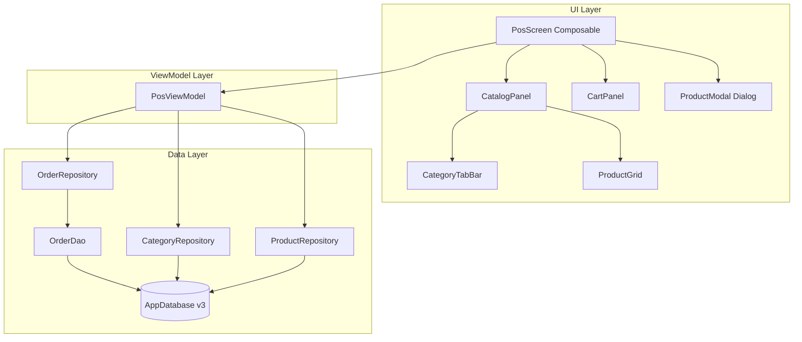
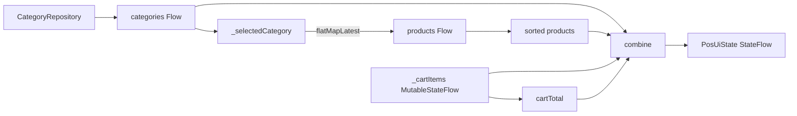

# Design Document: POS Main Screen

## Overview

This design describes the implementation of the main Point of Sale (POS) screen for the PuntoDeVenta application. The screen provides a two-panel layout where the left panel (70% width) shows a category-filtered product catalog and the right panel (30% width) displays the current in-memory cart. Tapping a product opens a modal for configuring quantity, customizations, and comments before adding the item to the cart. Pressing the total button persists the entire cart as an order to the local Room database within a single transaction.

The feature follows the existing MVVM + UDF architecture, introducing a new `PosViewModel` that manages in-memory cart state, category/product loading from existing repositories, and order persistence via new Room entities and a dedicated DAO.

## Architecture



The POS screen integrates into the existing `MainActivity` as a new `NavDestination.Pos` route. It reuses the existing `CategoryRepository` and `ProductRepository` for reading catalog data, and introduces a new `OrderRepository` + `OrderDao` for persisting completed orders.

## Components and Interfaces

### New Files

| File | Purpose |
|------|---------|
| `data/local/OrderEntity.kt` | Room entity for completed orders |
| `data/local/OrderItemEntity.kt` | Room entity for order line items |
| `data/local/OrderItemCustomizationEntity.kt` | Room entity for order item customizations |
| `data/local/OrderDao.kt` | DAO with insert operations and transaction support |
| `data/repository/OrderRepository.kt` | Repository wrapping OrderDao with transaction logic |
| `ui/pos/PosScreen.kt` | Main POS composable with two-panel layout |
| `ui/pos/CatalogPanel.kt` | Left panel: category tabs + product grid |
| `ui/pos/CartPanel.kt` | Right panel: cart items list + total button |
| `ui/pos/CategoryTabBar.kt` | Scrollable category tab row |
| `ui/pos/ProductGrid.kt` | LazyVerticalGrid of product cards |
| `ui/pos/ProductModal.kt` | Dialog for quantity, customizations, comments |
| `ui/pos/PosViewModel.kt` | ViewModel managing POS state |
| `ui/pos/CartItem.kt` | In-memory data class for cart entries |

### Modified Files

| File | Change |
|------|--------|
| `data/local/AppDatabase.kt` | Bump version to 3, add new entities and DAO accessor |
| `ui/navigation/NavDestination.kt` | Add `Pos` destination |
| `MainActivity.kt` | Wire `NavDestination.Pos` to `PosScreen` |

### Key Interfaces

```kotlin
// ── In-memory cart model ──────────────────────────────────────────────
data class CartItem(
    val id: String,                          // UUID, unique per line item
    val productId: String,
    val productName: String,
    val emoji: String,
    val basePrice: Double,
    val quantity: Int,                        // 1..99
    val selectedCustomizations: List<SelectedCustomization>,
    val extraNotes: String,                   // 0..280 chars
    val totalPrice: Double                    // calculated: (basePrice + Σ extraPrices) × quantity
)

data class SelectedCustomization(
    val optionId: String,
    val optionName: String,
    val extraPrice: Double
)

// ── PosViewModel public contract ─────────────────────────────────────
class PosViewModel(
    private val categoryRepository: CategoryRepository,
    private val productRepository: ProductRepository,
    private val orderRepository: OrderRepository,
    private val menuId: String
) : ViewModel() {

    val uiState: StateFlow<PosUiState>

    fun selectCategory(category: Category?)   // null = "TODO" (all)
    fun addToCart(cartItem: CartItem)
    fun removeFromCart(cartItemId: String)
    fun completeOrder()                        // persist & clear
}

data class PosUiState(
    val categories: List<Category> = emptyList(),
    val selectedCategory: Category? = null,   // null = "TODO" tab
    val products: List<Product> = emptyList(),
    val cartItems: List<CartItem> = emptyList(),
    val cartTotal: Double = 0.0,
    val isLoading: Boolean = true,
    val error: String? = null,
    val isModalOpen: Boolean = false,
    val selectedProduct: Product? = null
)

// ── OrderRepository ──────────────────────────────────────────────────
class OrderRepository(
    private val orderDao: OrderDao,
    private val database: AppDatabase
) {
    suspend fun persistOrder(
        order: OrderEntity,
        items: List<OrderItemEntity>,
        customizations: List<OrderItemCustomizationEntity>
    )  // uses database.withTransaction internally
}

// ── OrderDao ─────────────────────────────────────────────────────────
@Dao
interface OrderDao {
    @Insert suspend fun insertOrder(order: OrderEntity)
    @Insert suspend fun insertOrderItems(items: List<OrderItemEntity>)
    @Insert suspend fun insertOrderItemCustomizations(customizations: List<OrderItemCustomizationEntity>)
}
```

### PosViewModel Reactive Pipeline



The ViewModel follows the same `combine` + `stateIn` pattern used in `ConfigurationViewModel`:
1. Categories loaded via `categoryRepository.getCategoriesByMenu(menuId)` shared replay.
2. `_selectedCategory` drives a `flatMapLatest` to fetch active products.
3. Products sorted case-insensitively by name.
4. Cart items held in a `MutableStateFlow<List<CartItem>>`.
5. Cart total derived as `cartItems.sumOf { it.totalPrice }`.
6. All streams combined into a single `PosUiState`.

## Data Models

### Room Entities (New — Database Version 3)

```kotlin
@Entity(tableName = "orders")
data class OrderEntity(
    @PrimaryKey val id: String,               // UUID
    val timestamp: Long,                      // epoch millis
    val totalAmount: Double,                  // 0.00..999,999,999.99
    val status: String                        // "COMPLETED" | "CANCELLED" | "REFUNDED"
)

@Entity(
    tableName = "order_items",
    foreignKeys = [ForeignKey(
        entity = OrderEntity::class,
        parentColumns = ["id"],
        childColumns = ["orderId"],
        onDelete = ForeignKey.CASCADE
    )],
    indices = [Index("orderId")]
)
data class OrderItemEntity(
    @PrimaryKey val id: String,               // UUID
    val orderId: String,                      // FK → orders.id
    val productId: String,
    val productName: String,                  // max 120 chars
    val quantity: Int,                        // min 1
    val basePrice: Double,                    // 0.00..999,999.99
    val totalPrice: Double,                   // 0.00..999,999,999.99
    val extraNotes: String?                   // nullable, max 500 chars
)

@Entity(
    tableName = "order_item_customizations",
    foreignKeys = [ForeignKey(
        entity = OrderItemEntity::class,
        parentColumns = ["id"],
        childColumns = ["orderItemId"],
        onDelete = ForeignKey.CASCADE
    )],
    indices = [Index("orderItemId")]
)
data class OrderItemCustomizationEntity(
    @PrimaryKey val id: String,               // UUID
    val orderItemId: String,                  // FK → order_items.id
    val optionName: String,                   // max 120 chars
    val extraPrice: Double                    // min 0.00
)
```

### Cart Item Price Calculation

```
totalPrice = round((basePrice + Σ(customization.extraPrice)) × quantity, 2)
```

Where rounding uses `BigDecimal.setScale(2, RoundingMode.HALF_UP)` to avoid floating-point drift.

### Cart Total Calculation

```
cartTotal = Σ(cartItem.totalPrice) for all cartItems
```

## Correctness Properties

*A property is a characteristic or behavior that should hold true across all valid executions of a system — essentially, a formal statement about what the system should do. Properties serve as the bridge between human-readable specifications and machine-verifiable correctness guarantees.*

### Property 1: Category Tab Ordering

*For any* list of categories returned by the repository, the tab order SHALL always be the "TODO" tab first, followed by the remaining categories sorted alphabetically by name (case-insensitive).

**Validates: Requirements 3.2, 3.1**

### Property 2: Product Filtering and Sorting by Category

*For any* set of products and any selected category (including the "TODO" all-products case), the resulting product list SHALL contain only products where `isActive == true` and (if a specific category is selected) `categoryId` matches the selected category, sorted by name ascending (case-insensitive).

**Validates: Requirements 3.4, 3.5, 4.2, 4.3, 10.4**

### Property 3: Cart Item Price Calculation

*For any* base price ≥ 0, any list of customization extra prices ≥ 0, and any quantity in [1, 99], the cart item total price SHALL equal `round((basePrice + sum(extraPrices)) × quantity, 2)`.

**Validates: Requirements 5.2, 9.2**

### Property 4: Cart Total is Sum of Row Prices

*For any* list of cart items, the displayed cart total SHALL equal the sum of all individual cart item `totalPrice` values, with no rounding loss beyond the per-item rounding.

**Validates: Requirements 5.3, 10.5**

### Property 5: Cart Item Removal Preserves Other Items

*For any* cart containing N items (N ≥ 1), removing a specific item by its id SHALL result in a cart of N-1 items where all other items remain unchanged in value and order.

**Validates: Requirements 5.6**

### Property 6: Cart Maintains Insertion Order

*For any* sequence of cart item additions, the cart list SHALL maintain items in the exact order they were added, with the most recently added item at the end.

**Validates: Requirements 5.7**

### Property 7: Order Persistence Maps Cart to Entities

*For any* non-empty cart, when `completeOrder()` is called, the persisted `OrderEntity.totalAmount` SHALL equal the cart total, each cart item SHALL map to an `OrderItemEntity` with matching `productName`, `quantity`, `basePrice`, and `totalPrice`, and each selected customization SHALL map to an `OrderItemCustomizationEntity` with matching `optionName` and `extraPrice`.

**Validates: Requirements 6.1, 6.2, 6.3**

### Property 8: Successful Persistence Clears Cart

*For any* non-empty cart, after a successful call to `completeOrder()`, the cart SHALL be empty and the cart total SHALL be 0.00.

**Validates: Requirements 6.5**

### Property 9: Non-Completion Operations Preserve Cart State

*For any* cart state, if the order persistence fails (database error) or the user cancels the product modal, the cart contents SHALL remain identical to their state before the operation was attempted.

**Validates: Requirements 6.6, 9.4, 10.6**

### Property 10: Quantity Clamped Within [1, 99]

*For any* current quantity value in [1, 99], incrementing SHALL produce `min(quantity + 1, 99)` and decrementing SHALL produce `max(quantity - 1, 1)`.

**Validates: Requirements 8.2, 8.3, 8.4, 8.5**

### Property 11: Adding a Product Creates a New Line Item

*For any* product configuration (product, quantity, customizations, notes), pressing "Agregar" SHALL always append a new `CartItem` with a unique id to the cart list, regardless of whether an identical product configuration already exists in the cart.

**Validates: Requirements 9.1**

## Error Handling

| Scenario | Behavior |
|----------|----------|
| CategoryRepository emits error | PosViewModel sets `error` state with message; cart preserved; products list unchanged |
| ProductRepository emits error | PosViewModel sets `error` state; cart preserved; category tabs still functional |
| Order persistence transaction fails | Cart items remain unchanged; error message displayed (e.g., Snackbar); user can retry |
| Empty cart + total button press | No-op; no persistence attempted; no error |
| Invalid quantity (< 1 or > 99) | Modal shows inline error; modal stays open; cart unchanged |
| Extra notes exceeds 280 chars | Input field prevents further typing (max length enforced) |

Error messages should be surfaced through a `Snackbar` or inline text, then cleared via `clearError()` similar to the existing `ConfigurationViewModel` pattern.

## Testing Strategy

### Unit Tests (ViewModel Logic)

- **PosViewModel initialization**: verify empty cart, categories loaded, first category auto-selected
- **Category selection**: verify product list updates on category change
- **addToCart**: verify item appears in cart with correct price calculation
- **removeFromCart**: verify item removed and total updated
- **completeOrder success**: verify cart cleared, repository called with correct entities
- **completeOrder failure**: verify cart preserved, error state set
- **Empty cart completeOrder**: verify no-op

### Property-Based Tests (Kotest Property)

The project already uses `kotest-property` for PBT. Each correctness property above maps to a property-based test:

- **Library**: `io.kotest.property` (already in `build.gradle.kts`)
- **Runner**: JUnit 5 via `kotest-runner-junit5` (already configured)
- **Minimum iterations**: 100 per property
- **Tag format**: `// Feature: pos-main-screen, Property N: <title>`

Property tests will target the pure logic functions:
- `calculateItemTotal(basePrice, extraPrices, quantity): Double`
- `calculateCartTotal(items: List<CartItem>): Double`
- `sortAndFilterProducts(products, selectedCategoryId): List<Product>`
- `buildTabOrder(categories: List<Category>): List<TabItem>`
- `clampQuantity(current: Int, delta: Int): Int`
- Cart mutation functions (add, remove) on plain lists

These functions will be extracted as `internal` pure functions testable without Android framework dependencies.

### Integration Tests (Instrumented)

- Room cascade deletion for Order → OrderItem → OrderItemCustomization
- Full transaction atomicity test (insert all entities in one transaction)
- `OrderDao` insert and query round-trip

### Compose UI Tests

- Two-panel layout renders with correct proportions
- Category tab bar scrolls and selects
- Product grid shows filtered products
- Product modal opens/closes correctly
- Cart panel displays items and total
- Total button triggers persistence flow
