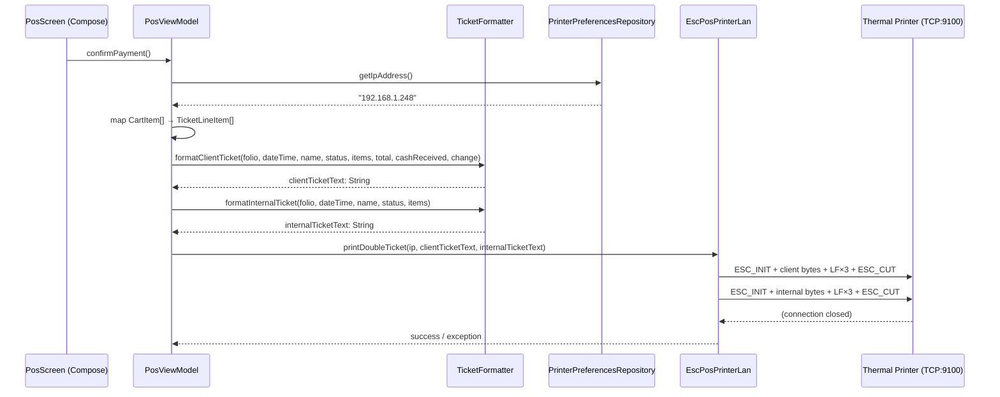

# Design Document: Printer Audit and Ticket Format

## Overview

Este diseño cubre dos entregables complementarios:

1. **Documento de arquitectura de impresión** (`printer_architecture.md`) — un artefacto de documentación puro que describe el flujo completo desde "Confirmar Pago" hasta los bytes TCP enviados a la impresora térmica.
2. **Correcciones al formato de ticket** — cambios en `TicketFormatter` y `PosViewModel` para incluir información de pago en efectivo/cambio y `extraNotes` por producto.

Ambos entregables operan sobre la capa de presentación y la utilidad de formateo; no se modifica la capa de datos ni la impresora.

## Architecture

### Componentes involucrados



### Decisiones de diseño

| Decisión | Justificación |
|----------|---------------|
| Agregar `cashReceived` y `change` como parámetros opcionales con valor default `0.0` a `formatClientTicket` | Mantiene retrocompatibilidad con llamadas existentes |
| Agregar `extraNotes: String = ""` a `TicketLineItem` | Retrocompatible — default vacío |
| La lógica financiera (BigDecimal HALF_UP) permanece en `TicketFormatter` | Mantiene la pureza del objeto — sin side effects, fácil de testear |
| `printer_architecture.md` se crea como archivo Markdown en la raíz del proyecto | Accesible directamente desde el IDE sin navegar a código |

## Components and Interfaces

### TicketLineItem (modificado)

```kotlin
data class TicketLineItem(
    val quantity: Int,
    val productName: String,
    val lineTotal: Double,
    val customizations: List<String> = emptyList(),
    val extraNotes: String = ""  // NEW: notas adicionales del cajero
)
```

### TicketFormatter.formatClientTicket (firma actualizada)

```kotlin
fun formatClientTicket(
    ticketId: String,
    dateTime: String,
    customerName: String,
    paymentStatus: String,
    items: List<TicketLineItem>,
    totalAmount: Double,
    cashReceived: Double = 0.0,   // NEW: efectivo recibido
    change: Double = 0.0          // NEW: cambio calculado
): String
```

### TicketFormatter — nuevas funciones internas

```kotlin
// Renderiza "      * Nota: {text}" con wrapping a 34/35 chars
private fun formatExtraNotes(notes: String): String

// Renderiza la sección financiera (subtotal, IVA, total, pago, cambio)
private fun formatFinancialSection(
    totalAmount: Double,
    cashReceived: Double,
    change: Double
): String
```

### PosViewModel.confirmPayment() — cambios

El mapping de `CartItem` → `TicketLineItem` ahora incluye `extraNotes`:

```kotlin
val ticketLineItems = cartItems.map { item ->
    TicketLineItem(
        quantity = item.quantity,
        productName = item.productName,
        lineTotal = item.totalPrice,
        customizations = item.selectedCustomizations.map { it.optionName },
        extraNotes = item.extraNotes  // NEW
    )
}
```

La llamada a `formatClientTicket` ahora pasa la info de pago:

```kotlin
val change = if (checkoutState.paymentStatus == PaymentStatus.PAGADO && checkoutState.cashReceived > 0) {
    BigDecimal(checkoutState.cashReceived)
        .subtract(BigDecimal(totalAmount))
        .setScale(2, RoundingMode.HALF_UP)
        .coerceAtLeast(BigDecimal.ZERO)
        .toDouble()
} else 0.0

val clientTicketText = TicketFormatter.formatClientTicket(
    ticketId = folio,
    dateTime = dateTime,
    customerName = checkoutState.customerName,
    paymentStatus = checkoutState.paymentStatus.displayText,
    items = ticketLineItems,
    totalAmount = totalAmount,
    cashReceived = if (checkoutState.paymentStatus == PaymentStatus.PAGADO) checkoutState.cashReceived else 0.0,
    change = change
)
```

## Data Models

### Ticket Output Format — Client Ticket

```
         LOS TACOS
Ticket: 001
01/01/2025 12:00:00
Nombre: Juan
Pagado
------------------------------------------------
CANT DESCRIPCION                   IMPORTE
1    Taco al Pastor                      $45.00
      - Sin cebolla
      * Nota: Extra salsa verde por favor
2    Agua de Horchata                    $60.00
------------------------------------------------
Subtotal (antes de IVA):                  $90.52
IVA (16%):                                $14.48
Total:                                   $105.00
Pago (Efectivo MXN):                     $200.00
Cambio:                                   $95.00
------------------------------------------------
       Gracias por su compra
        Conserve su ticket
```

### Ticket Output Format — Internal Ticket

```
         LOS TACOS
Ticket: 001
01/01/2025 12:00:00
Nombre: Juan
Pagado
------------------------------------------------
CANT DESCRIPCION                   IMPORTE
------------------------------------------------
1    Taco al Pastor
      - Sin cebolla
      * Nota: Extra salsa verde por favor
2    Agua de Horchata
Total: 3 Artículos
       Gracias por su compra
        Conserve su ticket
```

### ExtraNotes Wrapping Rules

| Concepto | Valor |
|----------|-------|
| Prefijo primera línea | `"      * Nota: "` (14 chars) |
| Chars disponibles primera línea | 34 (48 - 14) |
| Indentación continuación | 13 espacios |
| Chars disponibles por continuación | 35 (48 - 13) |
| Máximo líneas de continuación | 8 |

### Financial Line Layout (48 chars)

```
|<-- label (left-aligned) -->          <-- amount (right-aligned) -->|
Subtotal (antes de IVA):                  $90.52
IVA (16%):                                $14.48
Total:                                   $105.00
Pago (Efectivo MXN):                     $200.00
Cambio:                                   $95.00
```

Cada línea se forma como: `label + spaces + amount` donde `label.length + spaces + amount.length == 48`.

## Correctness Properties

*A property is a characteristic or behavior that should hold true across all valid executions of a system — essentially, a formal statement about what the system should do. Properties serve as the bridge between human-readable specifications and machine-verifiable correctness guarantees.*

### Property 1: CartItem to TicketLineItem mapping preserves all fields

*For any* list of CartItems (size 1–100), mapping to TicketLineItems SHALL produce a list of the same size where each TicketLineItem preserves: quantity == CartItem.quantity, productName == CartItem.productName, lineTotal == CartItem.totalPrice, customizations == CartItem.selectedCustomizations.map { it.optionName } in the same order, and extraNotes == CartItem.extraNotes.

**Validates: Requirements 6.1, 6.6, 3.2**

### Property 2: Subtotal + IVA = Total arithmetic invariant

*For any* positive Double `totalAmount`, `calculateSubtotal(totalAmount) + calculateIva(totalAmount)` SHALL equal `totalAmount` rounded to 2 decimal places using BigDecimal HALF_UP.

**Validates: Requirements 4.9**

### Property 3: Payment section rendered when cash payment present

*For any* valid ticket inputs where `cashReceived > 0` and paymentStatus is "Pagado", the output of `formatClientTicket` SHALL contain a line matching `"Pago (Efectivo MXN):"` with the formatted cashReceived amount, and a line matching `"Cambio:"` with the change amount equal to `max(0, cashReceived - totalAmount)` formatted to 2 decimal places.

**Validates: Requirements 2.3, 2.4, 4.6, 4.7**

### Property 4: Payment section omitted when cash payment absent

*For any* valid ticket inputs where `cashReceived == 0.0` OR paymentStatus is not "Pagado", the output of `formatClientTicket` SHALL NOT contain the strings `"Pago (Efectivo MXN):"` or `"Cambio:"`.

**Validates: Requirements 2.5, 4.8**

### Property 5: Financial section lines are exactly 48 characters and in correct order

*For any* valid ticket inputs, the financial lines (Subtotal, IVA, Total, and optionally Pago/Cambio) in the output of `formatClientTicket` SHALL each be exactly 48 characters wide, and SHALL appear in the order: Subtotal → IVA → Total → Pago → Cambio (last two only when cashReceived > 0).

**Validates: Requirements 4.1, 4.2**

### Property 6: ExtraNotes rendering with correct prefix and wrapping

*For any* TicketLineItem with a non-empty `extraNotes` (after trimming), the formatted output SHALL contain a line starting with `"      * Nota: "` followed by at most 34 characters of note content. If the note exceeds 34 characters, continuation lines SHALL be indented with 13 spaces and contain at most 35 characters each, with a maximum of 8 continuation lines.

**Validates: Requirements 3.3, 3.5, 5.2, 5.3, 5.4**

### Property 7: Empty extraNotes produces no note line

*For any* TicketLineItem with an empty `extraNotes` (length == 0 or only whitespace), the formatted output SHALL NOT contain `"* Nota:"`.

**Validates: Requirements 3.4, 5.5**

### Property 8: Customizations rendered with dash prefix before notes

*For any* TicketLineItem with a non-empty customizations list, each customization SHALL appear on its own line prefixed with `"      - "` with optionName truncated to 40 characters. When the item also has a non-empty extraNotes, all customization lines SHALL appear before the `"* Nota:"` line in the output.

**Validates: Requirements 5.1, 5.2, 6.4**

### Property 9: Every product name appears in formatted output

*For any* list of TicketLineItems passed to `formatClientTicket`, every item's `productName` (truncated to 30 characters) SHALL appear in the returned string.

**Validates: Requirements 6.2**

### Property 10: ExtraNotes appears consistently on both ticket types

*For any* TicketLineItem with non-empty `extraNotes`, both `formatClientTicket` and `formatInternalTicket` SHALL contain the extraNotes content rendered with the `"* Nota:"` prefix format.

**Validates: Requirements 3.6, 5.6**

## Error Handling

| Escenario | Manejo |
|-----------|--------|
| `cashReceived` < `totalAmount` con PAGADO | Mostrar cambio como `$0.00` (coerce a cero) |
| `extraNotes` vacío o solo whitespace | No renderizar línea de nota |
| `extraNotes` excede 8 líneas de continuación | Truncar al máximo de 8 continuaciones (total ~314 chars visibles) |
| `optionName` excede 40 chars | Truncar con `.take(40)` |
| `productName` excede 30 chars | Truncar con `.take(30)` |
| `cashReceived` == 0.0 con PAGADO | Omitir sección de pago (se interpreta como "sin registro de efectivo") |
| `totalAmount` == 0.0 | Subtotal y IVA serán $0.00 — aritméticamente correcto |

## Testing Strategy

### Property-Based Testing (Kotest Property)

El proyecto ya incluye `kotest-property` como dependencia tanto en `testImplementation` como en `androidTestImplementation`. Cada propiedad del diseño se implementará con **un solo test de Kotest `forAll`** configurado a mínimo 100 iteraciones.

**Framework:** Kotest Property (`io.kotest.property.forAll`)
**Runner:** Kotest JUnit5 Runner (ya configurado con `useJUnitPlatform()`)
**Ubicación:** `app/src/test/java/com/example/puntodeventa/ui/pos/`

**Tag por test:**
```kotlin
// Feature: printer-audit-and-ticket-format, Property 2: Subtotal + IVA = Total
```

### Generators necesarios

| Generator | Descripción |
|-----------|-------------|
| `Arb.cartItem()` | CartItem con valores aleatorios válidos (quantity 1–99, prices > 0, extraNotes 0–280 chars, 0–5 customizations) |
| `Arb.ticketLineItem()` | TicketLineItem derivado de cartItem generator |
| `Arb.positiveMoney()` | Double positivo en rango razonable ($0.01–$999,999.99) |
| `Arb.extraNotesString()` | String de 0–300 chars con caracteres latinos válidos para Cp850 |
| `Arb.paymentScenario()` | Tupla (cashReceived, totalAmount, paymentStatus) con combinaciones válidas |

### Unit Tests (ejemplo/edge cases)

- Verificar labels exactos ("Subtotal (antes de IVA):", "IVA (16%):", "Total:", etc.)
- `cashReceived` < `totalAmount` con PAGADO → cambio muestra "$0.00"
- Ticket con 0 customizations y 0 extraNotes → formato limpio sin líneas extra
- `extraNotes` con exactamente 34 chars → no debe hacer wrap
- `extraNotes` con 35 chars → exactamente 1 línea de continuación
- Producto con nombre de exactamente 30 chars → no se trunca
- Producto con nombre de 31 chars → se trunca a 30

### Archivos de test esperados

| Archivo | Contenido |
|---------|-----------|
| `TicketFormatterPropertyTest.kt` | Properties 2–10 |
| `CartToTicketMappingPropertyTest.kt` | Property 1 |
| `TicketFormatterUnitTest.kt` | Example/edge-case tests |
