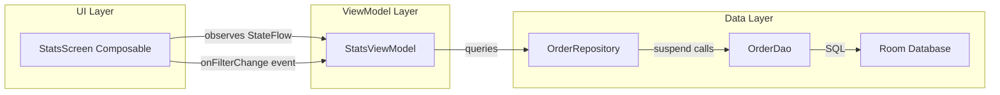

# Design Document: Statistics Dashboard

## Overview

The Statistics Dashboard replaces the current placeholder `StatsScreen` with a fully functional, data-driven sales metrics screen. It reads from the existing Room database (`orders` and `order_items` tables) to compute and display revenue, order counts, average ticket size, customer counts, top-selling products, and recent orders — all filterable by five time periods (Hoy, Ayer, Este mes, Todo, and a custom date range).

The feature follows the project's established MVVM + UDF architecture: a `StatsViewModel` owns a single `StateFlow<StatsUiState>`, the composable `StatsScreen` observes it via `collectAsStateWithLifecycle()`, and user actions (time filter changes) flow back as events to the ViewModel.

### Enterprise upgrade (v2)

The v1 dashboard was a static summary with a "Gráfico en construcción" placeholder. v2 turns it into an analytics surface with four additions:

1. **Interactive sales trend chart** — a Canvas-rendered bar/line chart whose bucket granularity (hour / day / month) is derived from the selected `TimeFilter`, with tap-to-inspect selection.
2. **Period-over-period comparison** — every metric card shows the percentage change against the previous equivalent window, resolved with a second `PeriodSummary` query.
3. **Payment method breakdown** — a donut chart plus legend over a new `orders.paymentMethod` column, captured at checkout.
4. **CSV export** — the whole dashboard is serialized to RFC 4180 CSV and written through the Storage Access Framework.

**No new external dependencies.** The charts are drawn with `androidx.compose.foundation.Canvas` + `DrawScope` + `rememberTextMeasurer` instead of pulling in Vico or YCharts. Rationale: the project keeps its dependency surface small (version catalog only, no chart library today), the two chart types needed here are simple geometry, and a custom implementation lets every color come from `MaterialTheme.colorScheme` so the 9 themes propagate without adapter code. The rest of the feature leverages existing Room, Coroutines, DataStore-free Compose infrastructure and the SAF pattern already used by `ConfigurationScreen` for JSON catalog export.

### Schema impact

`orders` gains a non-null `paymentMethod` column, moving `AppDatabase` from version 4 to 5. Unlike every previous bump in this project, this one ships an **explicit `Migration(4, 5)`** (`ALTER TABLE orders ADD COLUMN paymentMethod TEXT NOT NULL DEFAULT 'EFECTIVO'`) so existing order history survives the upgrade. `fallbackToDestructiveMigration` stays as the last-resort path for older/unknown schemas.

## Architecture



### Data Flow

1. `StatsScreen` renders UI from `StatsUiState` and emits `onFilterChange(TimeFilter)` events.
2. `StatsViewModel` receives the filter change, cancels any in-flight queries, computes start/end timestamps, and dispatches parallel queries through `OrderRepository`.
3. `OrderRepository` delegates to `OrderDao` suspend functions, which execute Room SQL queries.
4. Results flow back to the ViewModel, which assembles a new `StatsUiState` and emits it to the `StateFlow`.
5. `StatsScreen` recomposes with the updated state.

### Dependency Graph

`StatsScreen` → `StatsViewModel` → `OrderRepository` → `OrderDao` → Room Database

The ViewModel is created via a `ViewModelProvider.Factory` (following the pattern used in `PosViewModel`) that receives the `OrderRepository` from `AppDatabase.getInstance(context)`.

## Components and Interfaces

### 1. TimeFilter Enum

```kotlin
// ui/stats/TimeFilter.kt
enum class TimeFilter(val label: String) {
    TODAY("Hoy"),
    YESTERDAY("Ayer"),
    THIS_MONTH("Este mes"),
    ALL("Todo"),
    CUSTOM("Personalizado")   // rendered as "📅 Rango", opens DateRangePickerDialog
}
```

### 1b. PaymentMethod Enum

```kotlin
// data/model/PaymentMethod.kt
enum class PaymentMethod(val storageValue: String, val displayName: String) {
    CASH("EFECTIVO", "Efectivo"),
    CARD("TARJETA", "Tarjeta"),
    TRANSFER("TRANSFERENCIA", "Transferencia");

    companion object {
        /** Unknown/legacy values fall back to CASH so revenue is never dropped. */
        fun fromStorage(value: String?): PaymentMethod =
            entries.firstOrNull { it.storageValue == value } ?: CASH
    }
}
```

`storageValue` is the persisted token (stable, uppercase, ASCII) and `displayName` is the UI/report label. The two are kept separate so renaming a label never invalidates stored rows.

### 2. ProductSaleSummary Data Class

```kotlin
// data/model/ProductSaleSummary.kt
data class ProductSaleSummary(
    val productName: String,
    val totalQuantity: Int,
    val totalRevenue: Double
)
```

No `@Entity` annotation — used purely as a Room query-result projection.

### 3. StatsUiState

```kotlin
// ui/stats/StatsUiState.kt
data class StatsUiState(
    val selectedFilter: TimeFilter = TimeFilter.TODAY,
    // ── Resolved range ──
    val rangeStartMillis: Long = 0L,
    val rangeEndMillis: Long = 0L,
    // ── Current period ──
    val totalRevenue: Double = 0.0,
    val orderCount: Int = 0,
    val averageTicket: Double = 0.0,
    val customerCount: Int = 0,
    // ── Previous equivalent period (null when the filter has no baseline: ALL) ──
    val hasComparison: Boolean = false,
    val previousRevenue: Double = 0.0,
    val previousOrderCount: Int = 0,
    val previousAverageTicket: Double = 0.0,
    val previousCustomerCount: Int = 0,
    // ── Sales trend ──
    val trendSeries: List<SalesTrendPoint> = emptyList(),
    val trendGranularity: TrendGranularity = TrendGranularity.HOURLY,
    val chartMode: ChartMode = ChartMode.BAR,
    // ── Payment breakdown (raw rows resolved to PaymentSlice by the ViewModel) ──
    val paymentBreakdown: List<PaymentSlice> = emptyList(),
    // ── Lists ──
    val topProducts: List<ProductSaleSummary> = emptyList(),
    val recentOrders: List<OrderEntity> = emptyList(),
    // ── Flags / transient ──
    val isLoading: Boolean = false,
    val isExporting: Boolean = false,
    val errorMessage: String? = null,
    val userMessage: String? = null,
    val customStartMillis: Long? = null,
    val customEndMillis: Long? = null,
    val showDateRangePicker: Boolean = false
) {
    val revenueDelta: MetricDelta get() = MetricDelta.of(totalRevenue, previousRevenue, hasComparison)
    val orderCountDelta: MetricDelta get() = MetricDelta.of(orderCount, previousOrderCount, hasComparison)
    val averageTicketDelta: MetricDelta get() = MetricDelta.of(averageTicket, previousAverageTicket, hasComparison)
    val customerCountDelta: MetricDelta get() = MetricDelta.of(customerCount, previousCustomerCount, hasComparison)
}
```

The four `MetricDelta` values are **derived**, not stored, so the state cannot hold a delta that disagrees with its own metrics.

### 4. OrderDao Extensions (query methods)

Stats reads are exposed as **Room `Flow` queries** (per the project's data-layer rule: reactive reads, `suspend` writes). Room re-emits automatically when `orders` / `order_items` change, which satisfies the "dashboard updates while visible" requirement without a manual refresh path.

```kotlin
// Existing v1 queries (unchanged)
fun getRecentOrdersFlow(start: Long, end: Long): Flow<List<OrderEntity>>      // LIMIT 20, timestamp DESC
fun getTotalRevenueFlow(start: Long, end: Long): Flow<Double>                 // COALESCE(SUM(totalAmount), 0.0)
fun getOrderCountFlow(start: Long, end: Long): Flow<Int>
fun getCustomerCountFlow(start: Long, end: Long): Flow<Int>                   // COUNT(DISTINCT customerName)
fun getTopProductsFlow(start: Long, end: Long): Flow<List<ProductSaleSummary>> // LIMIT 50, totalQuantity DESC

// ── v2 additions ─────────────────────────────────────────────────────────────

/** One row summary of a window. Used twice: current period and previous period. */
@Query("""
    SELECT COALESCE(SUM(totalAmount), 0.0) AS totalRevenue,
           COUNT(*)                        AS orderCount,
           COUNT(DISTINCT customerName)    AS customerCount
    FROM orders
    WHERE timestamp >= :start AND timestamp <= :end
""")
fun getPeriodSummaryFlow(start: Long, end: Long): Flow<PeriodSummary>

/** Revenue split by tender type. Stable ordering: revenue DESC, then method ASC. */
@Query("""
    SELECT paymentMethod            AS paymentMethod,
           COALESCE(SUM(totalAmount), 0.0) AS totalRevenue,
           COUNT(*)                 AS orderCount
    FROM orders
    WHERE timestamp >= :start AND timestamp <= :end
    GROUP BY paymentMethod
    ORDER BY totalRevenue DESC, paymentMethod ASC
""")
fun getPaymentMethodBreakdownFlow(start: Long, end: Long): Flow<List<PaymentMethodRevenue>>

/** Raw (timestamp, amount) points; bucketing happens in pure Kotlin. */
@Query("""
    SELECT timestamp AS timestamp, totalAmount AS amount
    FROM orders
    WHERE timestamp >= :start AND timestamp <= :end
    ORDER BY timestamp ASC
""")
fun getOrderTotalsFlow(start: Long, end: Long): Flow<List<OrderTotalPoint>>
```

**Why bucket outside SQL.** SQLite's `strftime` works on seconds and needs timezone-offset arithmetic to produce local hours/days/months; getting DST and month-length right in SQL is fragile and untestable on the JVM. Returning `(timestamp, amount)` pairs and folding them in `SalesTrendCalculator` keeps the logic pure, `java.time`-correct, and coverable by JVM property tests. The result set is bounded by the selected range, and each row is 16 bytes.

### 5. OrderRepository Extensions

```kotlin
// Added to existing OrderRepository.kt — thin delegation, no logic
fun getPeriodSummaryFlow(start: Long, end: Long): Flow<PeriodSummary>
fun getPaymentMethodBreakdownFlow(start: Long, end: Long): Flow<List<PaymentMethodRevenue>>
fun getOrderTotalsFlow(start: Long, end: Long): Flow<List<OrderTotalPoint>>
```

### 6. StatsViewModel

The ViewModel is a **flow pipeline**, not an imperative loader: the selection inputs (`filter`, `customRange`, `chartMode`, picker visibility) are `MutableStateFlow`s, and `flatMapLatest` swaps the whole set of Room flows whenever the selection changes. `flatMapLatest` gives the cancellation semantics the requirements ask for (a superseded period's collectors are torn down) without a manual `Job` handle.

```kotlin
// ui/stats/StatsViewModel.kt
class StatsViewModel(private val orderRepository: OrderRepository) : ViewModel() {

    private val _selectedFilter = MutableStateFlow(TimeFilter.TODAY)
    private val _customRange = MutableStateFlow<Pair<Long, Long>?>(null)
    private val _showDateRangePicker = MutableStateFlow(false)
    private val _chartMode = MutableStateFlow(ChartMode.BAR)
    private val _transient = MutableStateFlow(TransientState())  // isExporting + userMessage

    val uiState: StateFlow<StatsUiState> =
        combine(_selectedFilter, _customRange, _showDateRangePicker, _chartMode, _transient, ::Selection)
            .flatMapLatest { selection ->
                val (start, end) = resolveRange(selection)
                val previous = computePreviousRange(selection.filter, start, end)   // null for ALL

                val current = combine(
                    orderRepository.getPeriodSummaryFlow(start, end),
                    orderRepository.getTopProductsFlow(start, end),
                    orderRepository.getRecentOrdersFlow(start, end),
                    orderRepository.getPaymentMethodBreakdownFlow(start, end),
                    orderRepository.getOrderTotalsFlow(start, end),
                    ::CurrentPeriodData
                )
                val previousSummary = previous
                    ?.let { (ps, pe) -> orderRepository.getPeriodSummaryFlow(ps, pe) }
                    ?: flowOf(PeriodSummary.EMPTY)

                combine(current, previousSummary) { data, prev -> buildState(selection, start, end, data, prev) }
            }
            .catch { t -> emit(uiState.value.copy(isLoading = false, errorMessage = t.message)) }
            .stateIn(viewModelScope, SharingStarted.WhileSubscribed(5_000), StatsUiState())

    fun onFilterChange(filter: TimeFilter)                  // CUSTOM opens the picker instead
    fun onDateRangeSelected(startMillis: Long, endMillis: Long)
    fun onDateRangePickerDismissed()
    fun onChartModeChange(mode: ChartMode)
    fun onExportUriReceived(uri: Uri, contentResolver: ContentResolver)
    fun clearUserMessage()

    companion object {
        fun computeRange(filter: TimeFilter, now: Long = System.currentTimeMillis()): Pair<Long, Long>
        fun computePreviousRange(filter: TimeFilter, start: Long, end: Long): Pair<Long, Long>?
        fun exportFileName(now: Long = System.currentTimeMillis()): String
    }
}
```

`.catch { }` is what turns a Room failure into `errorMessage` while keeping the last good state — with a flow pipeline there is no `try/catch` around a `suspend` call to hang the error handling on.

### 7. StatsScreen Composable (UI Composition)

```
StatsScreen                                    (stateless: uiState + onXxx lambdas)
├── StatsTopBar
│   ├── Column(title "Estadísticas" + subtitle)
│   ├── TimeFilterSelector (5 segments, CUSTOM → "📅 Rango")
│   └── IconButton(Icons.Default.FileDownload, "Exportar Reporte")   → SAF CreateDocument
├── MetricCardsRow
│   ├── MetricCard("INGRESOS",        revenue,   delta)
│   ├── MetricCard("ÓRDENES",         count,     delta)
│   ├── MetricCard("TICKET PROMEDIO", avg,       delta)
│   └── MetricCard("CLIENTES",        customers, delta)
│       └── MetricDeltaChip (arrow + "+5.0%" / "-2.3%" / "0.0%" / "Nuevo")
├── Row (weight 1.6f / 1f)
│   ├── SalesTrendSection          (card: title + ChartModeToggle + SalesTrendChart)
│   └── PaymentBreakdownSection    (card: title + PaymentMethodDonut + legend)
├── Row (weight-based split)
│   ├── TopProductsList (left column)
│   └── RecentOrdersList (right column)
└── DateRangePickerDialog (conditional)
```

Files: `StatsScreen.kt` keeps the screen scaffolding; the two charts live in their own files (`SalesTrendChart.kt`, `PaymentMethodDonut.kt`) per the project's "one reusable composable per file" rule.

### 8. Formatting Utilities

```kotlin
// ui/stats/StatsFormatters.kt
object StatsFormatters {
    fun formatCurrency(amount: Double): String {
        // "$" prefix, comma thousands, 2 decimal places
        // e.g., "$1,234.56"
    }

    fun formatCount(count: Int): String {
        // Locale-aware thousands separator
        // e.g., "1,234"
    }

    fun formatOrderTime(timestamp: Long): String {
        // "HH:mm" in device local timezone
    }

    // ── v2 additions ──
    fun formatCompactCurrency(amount: Double): String   // "$0", "$950", "$1.2k", "$3.4M" — chart axis labels
    fun formatPercent(value: Double): String            // "+5.0%", "-2.3%", "0.0%" — one decimal, explicit sign
    fun formatShare(value: Double): String              // "42.5%" — donut legend, no sign
    fun formatRangeLabel(startMillis: Long, endMillis: Long): String  // "01/07/2026 – 30/07/2026"
}
```

### 9. Sales Trend Aggregation (`SalesTrendCalculator`)

Pure Kotlin object, no Android and no I/O, so it is JVM-testable.

```kotlin
// ui/stats/SalesTrendCalculator.kt
enum class TrendGranularity { HOURLY, DAILY, MONTHLY }

data class SalesTrendPoint(
    val bucketStartMillis: Long,   // inclusive start of the bucket, device TZ
    val label: String,             // short axis label: "14", "07", "jul 26"
    val fullLabel: String,         // tooltip label: "14:00 – 14:59", "07/07/2026", "julio 2026"
    val revenue: Double
)

object SalesTrendCalculator {
    fun granularityFor(filter: TimeFilter, start: Long, end: Long): TrendGranularity
    fun buildSeries(
        granularity: TrendGranularity,
        start: Long,
        end: Long,
        points: List<OrderTotalPoint>,
        zone: ZoneId = ZoneId.systemDefault()
    ): List<SalesTrendPoint>
}
```

Granularity selection:

| Filter | Granularity | Buckets emitted |
|---|---|---|
| TODAY, YESTERDAY | HOURLY | one per hour from the start hour through the end hour (24 for a full day) |
| THIS_MONTH | DAILY | one per calendar day from the 1st through the end day |
| ALL | MONTHLY | one per calendar month between the first and last bucket of the range |
| CUSTOM, span ≤ 2 days | HOURLY | as above |
| CUSTOM, span ≤ 62 days | DAILY | as above |
| CUSTOM, span > 62 days | MONTHLY | as above |

`buildSeries` emits **every** bucket in the range, including empty ones with `revenue = 0.0`, so gaps are visible as flat segments instead of being silently compressed. Buckets are truncated with `java.time` (`truncatedTo(HOURS)`, `atStartOfDay`, `withDayOfMonth(1)`), which keeps DST and month lengths correct. The series is always ordered by `bucketStartMillis` ascending. A degenerate range (`end < start`) yields an empty list.

Bucket count is bounded: hourly ranges are only chosen for spans ≤ 2 days (≤ 48 buckets), daily for spans ≤ 62 days, monthly otherwise — so the chart never receives an unbounded series even for `ALL` on a multi-year database.

### 10. Metric Comparison (`MetricDelta`)

```kotlin
// ui/stats/MetricDelta.kt
enum class TrendDirection { UP, DOWN, FLAT, NO_BASELINE }

data class MetricDelta(
    val direction: TrendDirection,
    val percent: Double?,       // null only when direction == NO_BASELINE
    val available: Boolean      // false when the filter has no comparison period (ALL)
) {
    companion object {
        fun of(current: Number, previous: Number, hasComparison: Boolean): MetricDelta
        val UNAVAILABLE = MetricDelta(TrendDirection.FLAT, null, available = false)
    }
}
```

Decision table:

| Condition | direction | percent | UI |
|---|---|---|---|
| `!hasComparison` (filter ALL) | FLAT | null | indicator hidden |
| `previous < ε && current < ε` | FLAT | 0.0 | neutral "0.0%" |
| `previous < ε && current >= ε` | NO_BASELINE | null | "Nuevo", positive color |
| `previous >= ε && current > previous` | UP | `(c-p)/p*100` | ▲ green, "+x.x%" |
| `previous >= ε && current < previous` | DOWN | `(c-p)/p*100` | ▼ red, "-x.x%" |
| `previous >= ε && current == previous` | FLAT | 0.0 | neutral "0.0%" |

`ε = MetricDelta.BASELINE_EPSILON = 0.005` (half a cent). Every compared metric is money or a whole
count, so a smaller baseline is economically zero; dividing by it would yield an astronomic — or, for
a subnormal double, infinite — percentage rather than information. A ratio that still overflows, or a
non-finite input, degrades to `NO_BASELINE` instead of propagating `Infinity`/`NaN` into the UI.

Previous-range resolution (`computePreviousRange`):

| Filter | Previous window |
|---|---|
| TODAY | `[start - 1 day, end - 1 day]` — same clock window yesterday |
| YESTERDAY | `[start - 1 day, end - 1 day]` — the full day before yesterday |
| THIS_MONTH | starts at midnight of the 1st of the previous month, same duration as the current window, **clamped** so it ends before the current month (30 elapsed days of March against a 28-day February would otherwise reach into March) |
| CUSTOM | `[start - span, start - 1ms]` where `span = end - start` |
| ALL | `null` — there is no earlier data by definition |

Directions use `java.time` day arithmetic (`minusDays(1)` on the local date), not a fixed 86,400,000 ms subtraction, so a DST boundary does not shift the comparison window by an hour.

### 11. Chart Rendering

Both charts are `Canvas` composables. Colors come exclusively from `MaterialTheme.colorScheme`; text is drawn with `rememberTextMeasurer()` + `DrawScope.drawText`.

**`SalesTrendChart(series, granularity, mode, selectedIndex, onBucketSelected)`**

- Plot area: total height 220dp, with a reserved 28dp bottom gutter for X labels and a 56dp left gutter for Y labels.
- Y scale: `0 .. maxRevenue`, with 4 horizontal grid lines drawn in `outline.copy(alpha = 0.25f)`; labels at `0`, `max/2` and `max` using `formatCompactCurrency`.
- BAR mode: one rounded-top rect per bucket, width = `slot * 0.62`, filled with `primary`; the selected bucket uses `tertiary`.
- LINE mode: a polyline through bucket centers in `primary` (2dp stroke) over a vertical-gradient fill from `primary.copy(alpha = 0.28f)` to transparent, plus a 3dp dot per vertex; the selected vertex is drawn at 5dp in `tertiary`.
- X labels: every bucket label when `slotWidth >= 22dp`, otherwise every *n*-th label where `n = ceil(22dp / slotWidth)`, always including the first and last bucket.
- Interaction: `pointerInput { detectTapGestures { offset -> ... } }` maps the tap X to `index = ((x - leftGutter) / slotWidth)`. Taps outside the plot area, or on the already-selected index, emit `null` (clear selection). The selected bucket's `fullLabel` and formatted revenue are rendered above the plot, so the tooltip never overlaps the bars.
- Empty guard: when `series.isEmpty()` or `maxRevenue == 0.0`, the composable renders the centered text "Sin ventas en este periodo" and no plot.

**`PaymentMethodDonut(slices, totalRevenue)`**

- 160dp square canvas; `drawArc` per slice with `style = Stroke(width = 26dp, cap = Butt)`, starting at -90° and sweeping `share * 360°` clockwise, separated by a 2° gap when there is more than one slice.
- Slice colors are assigned by position from a themed palette: `primary`, `tertiary`, `secondary`, then `outline` — so a theme swap recolors the donut and the legend consistently (the legend reads the same palette by index).
- Center: total revenue in `formatCurrency` plus the caption "Total".
- Legend rows: color dot, `PaymentMethod.displayName`, revenue, and share via `formatShare`.
- Empty guard: `totalRevenue <= 0.0` renders "Sin ventas en este periodo".

### 12. CSV Report (`StatsCsvBuilder`)

Pure Kotlin object; takes the already-loaded `StatsUiState` and returns a `String`. No Android types, so it is JVM-testable.

```kotlin
// ui/stats/StatsCsvBuilder.kt
object StatsCsvBuilder {
    const val BOM = "\uFEFF"
    fun build(state: StatsUiState, generatedAtMillis: Long): String
    fun escape(field: String): String   // RFC 4180 quoting
}
```

Document layout:

```
Reporte de ventas
Periodo,Hoy
Rango,01/07/2026 00:00 – 30/07/2026 23:59
Generado,30/07/2026 18:42

RESUMEN
Metrica,Actual,Periodo anterior,Cambio %
Ingresos,1234.56,1100.00,12.2
Ordenes,42,38,10.5
Ticket promedio,29.39,28.95,1.5
Clientes,31,30,3.3

VENTAS POR METODO DE PAGO
Metodo,Ingresos,Ordenes,Participacion %
Efectivo,900.00,30,72.9
Tarjeta,334.56,12,27.1

TENDENCIA DE VENTAS
Granularidad,Periodo,Ingresos
Hora,14:00 – 14:59,320.00
...

PRODUCTOS MAS VENDIDOS
Producto,Cantidad,Ingresos
Taco de asada,64,1280.00
...
```

Rules:
- Written with a UTF-8 BOM so Excel renders accented text; section headers are ASCII-only ("METODO", "PARTICIPACION") to stay legible even in tools that ignore the BOM.
- Numeric cells are raw decimals (`%.2f` for money, `%.1f` for percentages, integers for counts) with `Locale.US` so the decimal separator is always `.` — never `formatCurrency`, whose `$` and thousands commas would break parsing.
- A missing comparison (filter ALL) or a `NO_BASELINE` delta writes an empty cell rather than `null` or `Infinity`.
- Every field goes through `escape`, which wraps in double quotes and doubles inner quotes when the value contains `,`, `"`, `\r` or `\n` — product names with commas are the realistic trigger.

Write path (mirrors `ConfigurationViewModel.onExportUriReceived`):

```
StatsScreen
  rememberLauncherForActivityResult(ActivityResultContracts.CreateDocument("text/csv"))
  → launch(StatsViewModel.exportFileName())        // "reporte_ventas_20260730_184200.csv"
  → uri != null → viewModel.onExportUriReceived(uri, context.contentResolver)
       → withContext(Dispatchers.IO) { contentResolver.openOutputStream(uri)!!.use { write(bytes) } }
       → userMessage = "Reporte exportado correctamente" | "Error al exportar: …"
```

No `FileProvider`, no storage permission: SAF hands back a writable Uri, which is why this path is preferred over `getExternalFilesDir`.

## Data Models

### Existing Entities (unchanged)

| Entity | Table | Key Fields |
|--------|-------|------------|
| `OrderEntity` | `orders` | id, timestamp, totalAmount, status, customerName, **paymentMethod (v2, NOT NULL DEFAULT 'EFECTIVO')** |
| `OrderItemEntity` | `order_items` | id, orderId (FK), productName, quantity, totalPrice |

### New Data Classes

| Class | Purpose | Fields |
|-------|---------|--------|
| `ProductSaleSummary` | Room query projection | productName: String, totalQuantity: Int, totalRevenue: Double |
| `PeriodSummary` | Room query projection (current + previous window) | totalRevenue: Double, orderCount: Int, customerCount: Int |
| `PaymentMethodRevenue` | Room query projection | paymentMethod: String, totalRevenue: Double, orderCount: Int |
| `OrderTotalPoint` | Room query projection feeding the trend chart | timestamp: Long, amount: Double |
| `PaymentMethod` | Tender type enum | storageValue: String, displayName: String |
| `SalesTrendPoint` | One Trend_Bucket | bucketStartMillis: Long, label: String, fullLabel: String, revenue: Double |
| `TrendGranularity` | Bucket unit enum | HOURLY, DAILY, MONTHLY |
| `ChartMode` | Chart rendering enum | BAR, LINE |
| `MetricDelta` | Period-over-period result | direction: TrendDirection, percent: Double?, available: Boolean |

### UI State

| Class | Purpose | Fields |
|-------|---------|--------|
| `StatsUiState` | ViewModel→UI state holder | selectedFilter, totalRevenue, orderCount, averageTicket, customerCount, topProducts, recentOrders, isLoading, errorMessage |
| `TimeFilter` | Enum of 4 filter options | TODAY, YESTERDAY, THIS_MONTH, ALL (each with `label: String`) |

### Timestamp Computation Logic

| Filter | Start | End |
|--------|-------|-----|
| TODAY | Midnight today (device TZ) | Current moment |
| YESTERDAY | Midnight yesterday (device TZ) | 23:59:59.999 yesterday (device TZ) |
| THIS_MONTH | Midnight 1st of current month (device TZ) | Current moment |
| ALL | 0 (epoch start) | Current moment |
| CUSTOM | Picked start date at 00:00:00.000 (device TZ) | Picked end date at 23:59:59.999 (device TZ) |


## Correctness Properties

*A property is a characteristic or behavior that should hold true across all valid executions of a system — essentially, a formal statement about what the system should do. Properties serve as the bridge between human-readable specifications and machine-verifiable correctness guarantees.*

### Property 1: Time range computation correctness

*For any* `TimeFilter` value and *for any* clock instant representing "now", `computeRange(filter)` SHALL produce a pair `(start, end)` where `start <= end`, `start >= 0`, and:
- TODAY → start equals midnight of the current day in device TZ, end equals now
- YESTERDAY → start equals midnight of the previous day, end equals 23:59:59.999 of the previous day
- THIS_MONTH → start equals midnight of the 1st of the current month, end equals now
- ALL → start equals 0, end equals now

**Validates: Requirements 3.4, 3.5, 3.6, 3.7**

### Property 2: Order filtering by status and timestamp range

*For any* set of orders in the database and *for any* timestamp range [start, end], all orders returned by `getRecentOrders(start, end)` SHALL have `status == "COMPLETED"` AND `timestamp` in [start, end].

**Validates: Requirements 2.1**

### Property 3: Revenue aggregation correctness

*For any* set of orders in the database and *for any* timestamp range [start, end], `getTotalRevenue(start, end)` SHALL equal the sum of `totalAmount` for all orders with `status == "COMPLETED"` and `timestamp` in [start, end], or 0.0 if no such orders exist.

**Validates: Requirements 2.2**

### Property 4: Order count aggregation correctness

*For any* set of orders in the database and *for any* timestamp range [start, end], `getOrderCount(start, end)` SHALL equal the number of orders with `status == "COMPLETED"` and `timestamp` in [start, end].

**Validates: Requirements 2.3**

### Property 5: Distinct customer count with case sensitivity

*For any* set of orders in the database and *for any* timestamp range [start, end], `getCustomerCount(start, end)` SHALL equal the number of distinct non-null `customerName` values (case-sensitive) from orders with `status == "COMPLETED"` and `timestamp` in [start, end].

**Validates: Requirements 2.4, 7.3**

### Property 6: Top products aggregation and ordering

*For any* set of orders with items in the database and *for any* timestamp range [start, end], `getTopProducts(start, end)` SHALL return a list of at most 50 `ProductSaleSummary` entries where: each entry's `totalQuantity` equals the sum of `quantity` for that `productName` across all COMPLETED orders in range, each entry's `totalRevenue` equals the sum of `totalPrice` for that `productName`, and the list is ordered by `totalQuantity` descending.

**Validates: Requirements 2.5**

### Property 7: Recent orders ordering and limit

*For any* set of orders in the database and *for any* timestamp range [start, end], `getRecentOrders(start, end)` SHALL return at most 20 orders, and for any two consecutive orders in the result list, the first order's `timestamp` SHALL be greater than or equal to the second order's `timestamp`.

**Validates: Requirements 2.6**

### Property 8: Currency formatting

*For any* non-negative `Double` value, `formatCurrency(value)` SHALL produce a string that: starts with "$", uses comma as thousand grouping separator, contains exactly two decimal digits after the period, and parsing the numeric portion back yields a value equal to the input rounded to two decimal places.

**Validates: Requirements 4.2, 6.2**

### Property 9: Integer count formatting

*For any* non-negative `Int` value, `formatCount(value)` SHALL produce a string that: contains no decimal point, uses locale-aware thousand separators, and parsing the numeric portion back yields the original integer.

**Validates: Requirements 5.1**

### Property 10: Average ticket computation

*For any* `totalRevenue >= 0` and `orderCount > 0`, the average ticket SHALL equal `totalRevenue / orderCount` rounded half-up to two decimal places. When `orderCount == 0`, the average ticket SHALL be `0.0`.

**Validates: Requirements 6.1, 6.3**

### Property 11: Product sale row formatting

*For any* `ProductSaleSummary` with `totalQuantity >= 0` and `totalRevenue >= 0.0`, the formatted quantity string SHALL equal `"${totalQuantity} vendidos"` and the formatted revenue SHALL follow the currency format pattern (Property 8).

**Validates: Requirements 9.3**

### Property 12: Order row customer name display

*For any* `OrderEntity`, when `customerName` is null or blank (empty/whitespace-only), the displayed customer name SHALL be `"Cliente anónimo"`. When `customerName` is non-null and non-blank, the displayed value SHALL equal the original `customerName`.

**Validates: Requirements 10.3**

### Property 13: Trend granularity selection

*For any* `TimeFilter` and *for any* range `[start, end]` with `start <= end`, `granularityFor(filter, start, end)` SHALL return HOURLY for TODAY and YESTERDAY, DAILY for THIS_MONTH, MONTHLY for ALL, and for CUSTOM SHALL return HOURLY when the span is at most 2 days, DAILY when it is at most 62 days, and MONTHLY otherwise.

**Validates: Requirements 8.4**

### Property 14: Trend series conservation and ordering

*For any* granularity, *for any* range `[start, end]` with `start <= end`, and *for any* list of `OrderTotalPoint` whose timestamps all fall inside the range, `buildSeries` SHALL return a list that is strictly ascending by `bucketStartMillis`, contains no gaps between the first and last bucket for that granularity, and whose summed `revenue` equals the sum of the input amounts (within floating-point tolerance). Points outside `[start, end]` SHALL NOT contribute to any bucket.

**Validates: Requirements 8.3, 8.5**

### Property 15: Trend series bucket assignment

*For any* `OrderTotalPoint` inside the range, the bucket that receives its amount SHALL be the unique bucket whose `bucketStartMillis` is the greatest value not greater than the point's timestamp — i.e. the point's local hour, local day, or local month depending on granularity.

**Validates: Requirements 8.3, 8.4**

### Property 16: Metric delta correctness

*For any* pair of non-negative numbers `(current, previous)` with `hasComparison == true`, `MetricDelta.of` SHALL satisfy: `previous >= ε` ⇒ `percent == (current - previous) / previous * 100` and the direction matches `compare(current, previous)`; `previous < ε && current >= ε` ⇒ `direction == NO_BASELINE` and `percent == null`; `previous < ε && current < ε` ⇒ `direction == FLAT` and `percent == 0.0`. The result SHALL never be `NaN` or infinite. *For any* pair with `hasComparison == false`, `available` SHALL be `false`.

**Validates: Requirements 13.4, 13.5, 13.6, 13.7, 13.8, 13.9**

### Property 17: Previous range shape

*For any* `TimeFilter` other than ALL and *for any* range `[start, end]` produced by `computeRange`, `computePreviousRange` SHALL return a non-null `[pStart, pEnd]` where `pStart <= pEnd` and `pEnd < start` (the windows never overlap). The duration SHALL be preserved exactly for CUSTOM, and within one hour for TODAY and YESTERDAY (local-date arithmetic across a DST boundary shifts the duration by the offset change). THIS_MONTH is exempt from duration equality because its window is clamped to avoid overlap. For ALL it SHALL return `null`.

**Validates: Requirements 13.1, 13.2**

### Property 18: Payment breakdown totality

*For any* set of orders in a range, the sum of `totalRevenue` over the rows returned by `getPaymentMethodBreakdownFlow` SHALL equal `getTotalRevenueFlow` for the same range, the sum of `orderCount` SHALL equal `getOrderCountFlow`, and every returned `paymentMethod` SHALL map through `PaymentMethod.fromStorage` without loss of revenue. The rows SHALL be ordered by `totalRevenue` descending with `paymentMethod` ascending as the tie-breaker.

**Validates: Requirements 2.9, 14.5, 14.6, 14.9**

### Property 19: CSV escaping round-trip

*For any* string field, `StatsCsvBuilder.escape` SHALL produce a value that, when parsed as an RFC 4180 field, yields the original string: fields containing `,`, `"`, `\r` or `\n` SHALL be wrapped in double quotes with inner quotes doubled, and fields without those characters SHALL be returned unchanged.

**Validates: Requirements 15.6**

### Property 20: CSV numeric locale independence

*For any* `StatsUiState`, every numeric cell written by `StatsCsvBuilder.build` SHALL match the regular expression `-?\d+(\.\d+)?`, SHALL contain no currency symbol, no thousands separator and no comma, and SHALL be parseable by `String.toDouble()` regardless of the default locale.

**Validates: Requirements 15.7**

## Error Handling

| Scenario | Handling | User Impact |
|----------|----------|-------------|
| Database query throws exception | `StatsViewModel` catches the exception, retains previous `StatsUiState` values, sets `errorMessage` with the failure reason | User sees stale data with error indication; can retry by re-selecting filter |
| Division by zero (avg ticket when 0 orders) | Guarded in ViewModel: `if (count > 0) revenue / count else 0.0` | Displays "$0.00" gracefully |
| No data for selected period | Empty lists and zero values flow through normally | UI shows "$0.00", "0", empty state messages ("Sin datos para este periodo", "Sin órdenes para este periodo") |
| Null customerName in orders | DAO excludes nulls from DISTINCT count; UI displays "Cliente anónimo" | Consistent fallback label |
| Job cancellation on rapid filter changes | `queryJob?.cancel()` before launching new query; `CancellationException` is re-thrown (not caught) | No stale results overwrite newer query; smooth UX |
| Very large datasets (many orders) | Queries use LIMIT 20 (recent orders) and LIMIT 50 (top products); aggregations are performed in SQL | Bounded memory usage; fast response |
| Room flow throws (corrupt row, schema mismatch) | `.catch { }` on the pipeline emits the last state plus `errorMessage`; the pipeline is re-established on the next selection change | Stale data with error text; recoverable by re-selecting a filter |
| Trend series empty or all-zero | `SalesTrendChart` short-circuits to the "Sin ventas en este periodo" message before any scaling math | No division by `maxRevenue == 0` |
| Tap outside the plot / on the selected bucket | Tap handler emits `null` selection | Tooltip clears; never an out-of-bounds index |
| Filter with no baseline (ALL) | `computePreviousRange` returns `null`; `MetricDelta.UNAVAILABLE` | Comparison indicators hidden instead of showing a meaningless % |
| Previous period revenue is 0 | `MetricDelta` maps to `NO_BASELINE` | "Nuevo" chip instead of a division by zero |
| Unknown `paymentMethod` token in a legacy row | `PaymentMethod.fromStorage` falls back to `CASH` | Revenue still counted; donut shares still total 100 % |
| SAF picker cancelled | Launcher callback receives `null` Uri and returns early | No message, no write |
| `openOutputStream` returns null or throws | Caught in the ViewModel; `userMessage = "Error al exportar: …"`, `isExporting = false` | Toast with the reason; export can be retried |
| Export tapped twice | `isExporting` disables the action while a write is in flight | No concurrent writes to the same document |
| Schema upgrade on a device with existing orders | Explicit `Migration(4, 5)` adds the column with a default | Order history preserved; existing rows classified as Efectivo |

## Testing Strategy

### Property-Based Tests (Kotest Property)

The project already includes `kotest-property` as a test dependency. Each correctness property maps to one property-based test with a minimum of 100 iterations.

**Library:** Kotest Property (`io.kotest.property`)  
**Runner:** Kotest JUnit5 runner (already configured with `useJUnitPlatform()`)  
**Minimum iterations:** 100 per property

| Property | Test Location | What It Generates |
|----------|---------------|-------------------|
| P1: Time range computation | `test/.../stats/TimeRangePropertyTest.kt` | Random `Long` instants as "now", all 4 filters |
| P2–P7: DAO queries | `androidTest/.../stats/StatsQueryPropertyTest.kt` | Random sets of `OrderEntity` + `OrderItemEntity` with varying timestamps, statuses, customerNames |
| P8: Currency formatting | `test/.../stats/FormattersPropertyTest.kt` | Random non-negative Doubles |
| P9: Count formatting | `test/.../stats/FormattersPropertyTest.kt` | Random non-negative Ints |
| P10: Average ticket | `test/.../stats/AverageTicketPropertyTest.kt` | Random (revenue, count) pairs |
| P11: Product row formatting | `test/.../stats/FormattersPropertyTest.kt` | Random ProductSaleSummary instances |
| P12: Customer name display | `test/.../stats/FormattersPropertyTest.kt` | Random OrderEntity with null/blank/valid customerName |
| P13: Granularity selection | `test/.../stats/SalesTrendCalculatorPropertyTest.kt` | All filters × random spans from 1 hour to 5 years |
| P14: Series conservation | `test/.../stats/SalesTrendCalculatorPropertyTest.kt` | Random `OrderTotalPoint` lists inside and outside the range |
| P15: Bucket assignment | `test/.../stats/SalesTrendCalculatorPropertyTest.kt` | Random single points at hour/day/month boundaries |
| P16: Metric delta | `test/.../stats/MetricDeltaPropertyTest.kt` | Random non-negative (current, previous) pairs incl. zeros |
| P17: Previous range shape | `test/.../stats/PreviousRangePropertyTest.kt` | All filters × random "now" instants |
| P18: Payment breakdown totality | `androidTest/.../data/local/StatsQueryPropertyTest.kt` | Random orders with random payment methods |
| P19: CSV escaping | `test/.../stats/StatsCsvBuilderPropertyTest.kt` | Random strings incl. commas, quotes, newlines |
| P20: CSV numeric locale | `test/.../stats/StatsCsvBuilderPropertyTest.kt` | Random `StatsUiState` fixtures |

Each property test MUST include a tag comment referencing the design property:
```kotlin
// Feature: statistics-dashboard, Property 8: Currency formatting
```

### Unit Tests (Example-Based)

| Test | What It Verifies |
|------|-----------------|
| StatsViewModel initial state | Default filter is TODAY, all values are zero/empty |
| StatsViewModel filter change triggers re-query | Calling `onFilterChange` dispatches new queries |
| StatsViewModel error handling | When repository throws, previous state is retained + errorMessage set |
| StatsViewModel cancellation | Rapid filter changes cancel previous job |
| formatCurrency edge cases | "$0.00", "$999.99", "$1,000,000.00" |
| formatCount edge cases | "0", "1,234" |
| formatOrderTime | Verifies "HH:mm" format for specific timestamps |

### Instrumented / Integration Tests

| Test | What It Verifies |
|------|-----------------|
| DAO query integration | Actual Room queries against in-memory database with seeded data |
| ProductSaleSummary mapping | Room correctly maps query columns to data class fields |
| Compose UI rendering | StatsScreen renders all sections with provided StatsUiState |
| Empty state messages | "Sin datos para este periodo" and "Sin órdenes para este periodo" appear when lists are empty |

### Test Organization

```
app/src/test/java/com/example/puntodeventa/ui/stats/
├── TimeRangePropertyTest.kt               (Property 1)
├── FormattersPropertyTest.kt              (Properties 8, 9, 11, 12)
├── AverageTicketPropertyTest.kt           (Property 10)
├── SalesTrendCalculatorPropertyTest.kt    (Properties 13, 14, 15)
├── MetricDeltaPropertyTest.kt             (Property 16)
├── PreviousRangePropertyTest.kt           (Property 17)
├── StatsCsvBuilderPropertyTest.kt         (Properties 19, 20)
└── StatsViewModelTest.kt                  (unit tests)

app/src/androidTest/java/com/example/puntodeventa/
├── data/local/StatsQueryPropertyTest.kt   (Properties 2–7, 18)
└── ui/stats/StatsScreenTest.kt            (Compose UI tests)
```

### v2 example-based coverage

| Test | What It Verifies |
|------|-----------------|
| `formatCompactCurrency` edge cases | "$0", "$999", "$1.0k", "$1.2k", "$1.0M" |
| `formatPercent` sign handling | "+5.0%", "-2.3%", "0.0%" |
| Trend series for a known day | 24 hourly buckets, revenue landing in the expected hour |
| Trend series across a month boundary | Daily buckets cover exactly the days in range |
| `MetricDelta` decision table | One case per row of the table in section 10 |
| CSV document shape | All four section headers present, row counts match the state |
| CSV with a comma in a product name | Field is quoted, column count per row stays constant |
