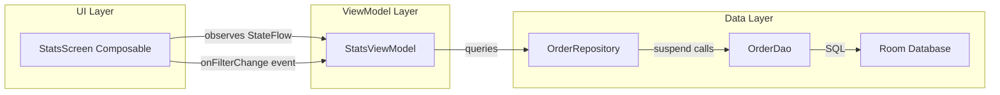

# Design Document: Statistics Dashboard

## Overview

The Statistics Dashboard replaces the current placeholder `StatsScreen` with a fully functional, data-driven sales metrics screen. It reads from the existing Room database (`orders` and `order_items` tables) to compute and display revenue, order counts, average ticket size, customer counts, top-selling products, and recent orders — all filterable by four time periods (Hoy, Ayer, Este mes, Todo).

The feature follows the project's established MVVM + UDF architecture: a `StatsViewModel` owns a single `StateFlow<StatsUiState>`, the composable `StatsScreen` observes it via `collectAsStateWithLifecycle()`, and user actions (time filter changes) flow back as events to the ViewModel.

No new external dependencies are required. The feature leverages existing Room, Coroutines, and Jetpack Compose infrastructure.

## Architecture



### Data Flow

1. `StatsScreen` renders UI from `StatsUiState` and emits `onFilterChange(TimeFilter)` events.
2. `StatsViewModel` receives the filter change, cancels any in-flight queries, computes start/end timestamps, and dispatches parallel queries through `OrderRepository`.
3. `OrderRepository` delegates to `OrderDao` suspend functions, which execute Room SQL queries.
4. Results flow back to the ViewModel, which assembles a new `StatsUiState` and emits it to the `StateFlow`.
5. `StatsScreen` recomposes with the updated state.

### Dependency Graph

`StatsScreen` → `StatsViewModel` → `OrderRepository` → `OrderDao` → Room Database

The ViewModel is created via a `ViewModelProvider.Factory` (following the pattern used in `PosViewModel`) that receives the `OrderRepository` from `AppDatabase.getInstance(context)`.

## Components and Interfaces

### 1. TimeFilter Enum

```kotlin
// ui/stats/TimeFilter.kt
enum class TimeFilter(val label: String) {
    TODAY("Hoy"),
    YESTERDAY("Ayer"),
    THIS_MONTH("Este mes"),
    ALL("Todo")
}
```

### 2. ProductSaleSummary Data Class

```kotlin
// data/model/ProductSaleSummary.kt
data class ProductSaleSummary(
    val productName: String,
    val totalQuantity: Int,
    val totalRevenue: Double
)
```

No `@Entity` annotation — used purely as a Room query-result projection.

### 3. StatsUiState

```kotlin
// ui/stats/StatsUiState.kt
data class StatsUiState(
    val selectedFilter: TimeFilter = TimeFilter.TODAY,
    val totalRevenue: Double = 0.0,
    val orderCount: Int = 0,
    val averageTicket: Double = 0.0,
    val customerCount: Int = 0,
    val topProducts: List<ProductSaleSummary> = emptyList(),
    val recentOrders: List<OrderEntity> = emptyList(),
    val isLoading: Boolean = false,
    val errorMessage: String? = null
)
```

### 4. OrderDao Extensions (new query methods)

```kotlin
// Added to existing OrderDao.kt
@Query("SELECT * FROM orders WHERE status = 'COMPLETED' AND timestamp >= :start AND timestamp <= :end ORDER BY timestamp DESC LIMIT 20")
suspend fun getRecentOrders(start: Long, end: Long): List<OrderEntity>

@Query("SELECT COALESCE(SUM(totalAmount), 0.0) FROM orders WHERE status = 'COMPLETED' AND timestamp >= :start AND timestamp <= :end")
suspend fun getTotalRevenue(start: Long, end: Long): Double

@Query("SELECT COUNT(*) FROM orders WHERE status = 'COMPLETED' AND timestamp >= :start AND timestamp <= :end")
suspend fun getOrderCount(start: Long, end: Long): Int

@Query("SELECT COUNT(DISTINCT customerName) FROM orders WHERE status = 'COMPLETED' AND timestamp >= :start AND timestamp <= :end AND customerName IS NOT NULL")
suspend fun getCustomerCount(start: Long, end: Long): Int

@Query("""
    SELECT oi.productName AS productName,
           SUM(oi.quantity) AS totalQuantity,
           SUM(oi.totalPrice) AS totalRevenue
    FROM order_items oi
    INNER JOIN orders o ON oi.orderId = o.id
    WHERE o.status = 'COMPLETED' AND o.timestamp >= :start AND o.timestamp <= :end
    GROUP BY oi.productName
    ORDER BY totalQuantity DESC
    LIMIT 50
""")
suspend fun getTopProducts(start: Long, end: Long): List<ProductSaleSummary>
```

### 5. OrderRepository Extensions

```kotlin
// Added to existing OrderRepository.kt
suspend fun getRecentOrders(start: Long, end: Long): List<OrderEntity> =
    orderDao.getRecentOrders(start, end)

suspend fun getTotalRevenue(start: Long, end: Long): Double =
    orderDao.getTotalRevenue(start, end)

suspend fun getOrderCount(start: Long, end: Long): Int =
    orderDao.getOrderCount(start, end)

suspend fun getCustomerCount(start: Long, end: Long): Int =
    orderDao.getCustomerCount(start, end)

suspend fun getTopProducts(start: Long, end: Long): List<ProductSaleSummary> =
    orderDao.getTopProducts(start, end)
```

### 6. StatsViewModel

```kotlin
// ui/stats/StatsViewModel.kt
class StatsViewModel(
    private val orderRepository: OrderRepository
) : ViewModel() {

    private val _uiState = MutableStateFlow(StatsUiState())
    val uiState: StateFlow<StatsUiState> = _uiState.asStateFlow()

    private var queryJob: Job? = null

    init {
        loadStats(TimeFilter.TODAY)
    }

    fun onFilterChange(filter: TimeFilter) {
        _uiState.update { it.copy(selectedFilter = filter) }
        loadStats(filter)
    }

    private fun loadStats(filter: TimeFilter) {
        queryJob?.cancel()
        queryJob = viewModelScope.launch {
            _uiState.update { it.copy(isLoading = true, errorMessage = null) }
            try {
                val (start, end) = computeRange(filter)
                // Parallel queries via coroutineScope
                coroutineScope {
                    val revenue = async { orderRepository.getTotalRevenue(start, end) }
                    val count = async { orderRepository.getOrderCount(start, end) }
                    val customers = async { orderRepository.getCustomerCount(start, end) }
                    val products = async { orderRepository.getTopProducts(start, end) }
                    val orders = async { orderRepository.getRecentOrders(start, end) }

                    val revenueVal = revenue.await()
                    val countVal = count.await()

                    _uiState.update {
                        it.copy(
                            totalRevenue = revenueVal,
                            orderCount = countVal,
                            averageTicket = if (countVal > 0) revenueVal / countVal else 0.0,
                            customerCount = customers.await(),
                            topProducts = products.await(),
                            recentOrders = orders.await(),
                            isLoading = false
                        )
                    }
                }
            } catch (e: CancellationException) {
                throw e
            } catch (e: Exception) {
                _uiState.update { it.copy(isLoading = false, errorMessage = e.message) }
            }
        }
    }

    companion object {
        fun computeRange(filter: TimeFilter): Pair<Long, Long> { /* ... */ }
    }
}
```

### 7. StatsScreen Composable (UI Composition)

```
StatsScreen
├── TopBar (title + subtitle + TimeFilterSelector)
├── MetricCardsRow
│   ├── MetricCard("INGRESOS", formattedRevenue)
│   ├── MetricCard("ÓRDENES", formattedCount)
│   ├── MetricCard("TICKET PROMEDIO", formattedAvg)
│   └── MetricCard("CLIENTES", formattedCustomers)
├── SalesTrendPlaceholder
└── Row (weight-based split)
    ├── TopProductsList (left column)
    └── RecentOrdersList (right column)
```

### 8. Formatting Utilities

```kotlin
// ui/stats/StatsFormatters.kt
object StatsFormatters {
    fun formatCurrency(amount: Double): String {
        // "$" prefix, comma thousands, 2 decimal places
        // e.g., "$1,234.56"
    }

    fun formatCount(count: Int): String {
        // Locale-aware thousands separator
        // e.g., "1,234"
    }

    fun formatOrderTime(timestamp: Long): String {
        // "HH:mm" in device local timezone
    }
}
```

## Data Models

### Existing Entities (unchanged)

| Entity | Table | Key Fields |
|--------|-------|------------|
| `OrderEntity` | `orders` | id, timestamp, totalAmount, status, customerName |
| `OrderItemEntity` | `order_items` | id, orderId (FK), productName, quantity, totalPrice |

### New Data Class

| Class | Purpose | Fields |
|-------|---------|--------|
| `ProductSaleSummary` | Room query projection | productName: String, totalQuantity: Int, totalRevenue: Double |

### UI State

| Class | Purpose | Fields |
|-------|---------|--------|
| `StatsUiState` | ViewModel→UI state holder | selectedFilter, totalRevenue, orderCount, averageTicket, customerCount, topProducts, recentOrders, isLoading, errorMessage |
| `TimeFilter` | Enum of 4 filter options | TODAY, YESTERDAY, THIS_MONTH, ALL (each with `label: String`) |

### Timestamp Computation Logic

| Filter | Start | End |
|--------|-------|-----|
| TODAY | Midnight today (device TZ) | Current moment |
| YESTERDAY | Midnight yesterday (device TZ) | 23:59:59.999 yesterday (device TZ) |
| THIS_MONTH | Midnight 1st of current month (device TZ) | Current moment |
| ALL | 0 (epoch start) | Current moment |


## Correctness Properties

*A property is a characteristic or behavior that should hold true across all valid executions of a system — essentially, a formal statement about what the system should do. Properties serve as the bridge between human-readable specifications and machine-verifiable correctness guarantees.*

### Property 1: Time range computation correctness

*For any* `TimeFilter` value and *for any* clock instant representing "now", `computeRange(filter)` SHALL produce a pair `(start, end)` where `start <= end`, `start >= 0`, and:
- TODAY → start equals midnight of the current day in device TZ, end equals now
- YESTERDAY → start equals midnight of the previous day, end equals 23:59:59.999 of the previous day
- THIS_MONTH → start equals midnight of the 1st of the current month, end equals now
- ALL → start equals 0, end equals now

**Validates: Requirements 3.4, 3.5, 3.6, 3.7**

### Property 2: Order filtering by status and timestamp range

*For any* set of orders in the database and *for any* timestamp range [start, end], all orders returned by `getRecentOrders(start, end)` SHALL have `status == "COMPLETED"` AND `timestamp` in [start, end].

**Validates: Requirements 2.1**

### Property 3: Revenue aggregation correctness

*For any* set of orders in the database and *for any* timestamp range [start, end], `getTotalRevenue(start, end)` SHALL equal the sum of `totalAmount` for all orders with `status == "COMPLETED"` and `timestamp` in [start, end], or 0.0 if no such orders exist.

**Validates: Requirements 2.2**

### Property 4: Order count aggregation correctness

*For any* set of orders in the database and *for any* timestamp range [start, end], `getOrderCount(start, end)` SHALL equal the number of orders with `status == "COMPLETED"` and `timestamp` in [start, end].

**Validates: Requirements 2.3**

### Property 5: Distinct customer count with case sensitivity

*For any* set of orders in the database and *for any* timestamp range [start, end], `getCustomerCount(start, end)` SHALL equal the number of distinct non-null `customerName` values (case-sensitive) from orders with `status == "COMPLETED"` and `timestamp` in [start, end].

**Validates: Requirements 2.4, 7.3**

### Property 6: Top products aggregation and ordering

*For any* set of orders with items in the database and *for any* timestamp range [start, end], `getTopProducts(start, end)` SHALL return a list of at most 50 `ProductSaleSummary` entries where: each entry's `totalQuantity` equals the sum of `quantity` for that `productName` across all COMPLETED orders in range, each entry's `totalRevenue` equals the sum of `totalPrice` for that `productName`, and the list is ordered by `totalQuantity` descending.

**Validates: Requirements 2.5**

### Property 7: Recent orders ordering and limit

*For any* set of orders in the database and *for any* timestamp range [start, end], `getRecentOrders(start, end)` SHALL return at most 20 orders, and for any two consecutive orders in the result list, the first order's `timestamp` SHALL be greater than or equal to the second order's `timestamp`.

**Validates: Requirements 2.6**

### Property 8: Currency formatting

*For any* non-negative `Double` value, `formatCurrency(value)` SHALL produce a string that: starts with "$", uses comma as thousand grouping separator, contains exactly two decimal digits after the period, and parsing the numeric portion back yields a value equal to the input rounded to two decimal places.

**Validates: Requirements 4.2, 6.2**

### Property 9: Integer count formatting

*For any* non-negative `Int` value, `formatCount(value)` SHALL produce a string that: contains no decimal point, uses locale-aware thousand separators, and parsing the numeric portion back yields the original integer.

**Validates: Requirements 5.1**

### Property 10: Average ticket computation

*For any* `totalRevenue >= 0` and `orderCount > 0`, the average ticket SHALL equal `totalRevenue / orderCount` rounded half-up to two decimal places. When `orderCount == 0`, the average ticket SHALL be `0.0`.

**Validates: Requirements 6.1, 6.3**

### Property 11: Product sale row formatting

*For any* `ProductSaleSummary` with `totalQuantity >= 0` and `totalRevenue >= 0.0`, the formatted quantity string SHALL equal `"${totalQuantity} vendidos"` and the formatted revenue SHALL follow the currency format pattern (Property 8).

**Validates: Requirements 9.3**

### Property 12: Order row customer name display

*For any* `OrderEntity`, when `customerName` is null or blank (empty/whitespace-only), the displayed customer name SHALL be `"Cliente anónimo"`. When `customerName` is non-null and non-blank, the displayed value SHALL equal the original `customerName`.

**Validates: Requirements 10.3**

## Error Handling

| Scenario | Handling | User Impact |
|----------|----------|-------------|
| Database query throws exception | `StatsViewModel` catches the exception, retains previous `StatsUiState` values, sets `errorMessage` with the failure reason | User sees stale data with error indication; can retry by re-selecting filter |
| Division by zero (avg ticket when 0 orders) | Guarded in ViewModel: `if (count > 0) revenue / count else 0.0` | Displays "$0.00" gracefully |
| No data for selected period | Empty lists and zero values flow through normally | UI shows "$0.00", "0", empty state messages ("Sin datos para este periodo", "Sin órdenes para este periodo") |
| Null customerName in orders | DAO excludes nulls from DISTINCT count; UI displays "Cliente anónimo" | Consistent fallback label |
| Job cancellation on rapid filter changes | `queryJob?.cancel()` before launching new query; `CancellationException` is re-thrown (not caught) | No stale results overwrite newer query; smooth UX |
| Very large datasets (many orders) | Queries use LIMIT 20 (recent orders) and LIMIT 50 (top products); aggregations are performed in SQL | Bounded memory usage; fast response |

## Testing Strategy

### Property-Based Tests (Kotest Property)

The project already includes `kotest-property` as a test dependency. Each correctness property maps to one property-based test with a minimum of 100 iterations.

**Library:** Kotest Property (`io.kotest.property`)  
**Runner:** Kotest JUnit5 runner (already configured with `useJUnitPlatform()`)  
**Minimum iterations:** 100 per property

| Property | Test Location | What It Generates |
|----------|---------------|-------------------|
| P1: Time range computation | `test/.../stats/TimeRangePropertyTest.kt` | Random `Long` instants as "now", all 4 filters |
| P2–P7: DAO queries | `androidTest/.../stats/StatsQueryPropertyTest.kt` | Random sets of `OrderEntity` + `OrderItemEntity` with varying timestamps, statuses, customerNames |
| P8: Currency formatting | `test/.../stats/FormattersPropertyTest.kt` | Random non-negative Doubles |
| P9: Count formatting | `test/.../stats/FormattersPropertyTest.kt` | Random non-negative Ints |
| P10: Average ticket | `test/.../stats/AverageTicketPropertyTest.kt` | Random (revenue, count) pairs |
| P11: Product row formatting | `test/.../stats/FormattersPropertyTest.kt` | Random ProductSaleSummary instances |
| P12: Customer name display | `test/.../stats/FormattersPropertyTest.kt` | Random OrderEntity with null/blank/valid customerName |

Each property test MUST include a tag comment referencing the design property:
```kotlin
// Feature: statistics-dashboard, Property 8: Currency formatting
```

### Unit Tests (Example-Based)

| Test | What It Verifies |
|------|-----------------|
| StatsViewModel initial state | Default filter is TODAY, all values are zero/empty |
| StatsViewModel filter change triggers re-query | Calling `onFilterChange` dispatches new queries |
| StatsViewModel error handling | When repository throws, previous state is retained + errorMessage set |
| StatsViewModel cancellation | Rapid filter changes cancel previous job |
| formatCurrency edge cases | "$0.00", "$999.99", "$1,000,000.00" |
| formatCount edge cases | "0", "1,234" |
| formatOrderTime | Verifies "HH:mm" format for specific timestamps |

### Instrumented / Integration Tests

| Test | What It Verifies |
|------|-----------------|
| DAO query integration | Actual Room queries against in-memory database with seeded data |
| ProductSaleSummary mapping | Room correctly maps query columns to data class fields |
| Compose UI rendering | StatsScreen renders all sections with provided StatsUiState |
| Empty state messages | "Sin datos para este periodo" and "Sin órdenes para este periodo" appear when lists are empty |

### Test Organization

```
app/src/test/java/com/example/puntodeventa/ui/stats/
├── TimeRangePropertyTest.kt        (Property 1)
├── FormattersPropertyTest.kt       (Properties 8, 9, 11, 12)
├── AverageTicketPropertyTest.kt    (Property 10)
└── StatsViewModelTest.kt           (unit tests)

app/src/androidTest/java/com/example/puntodeventa/
├── data/local/StatsQueryPropertyTest.kt  (Properties 2–7)
└── ui/stats/StatsScreenTest.kt           (Compose UI tests)
```
